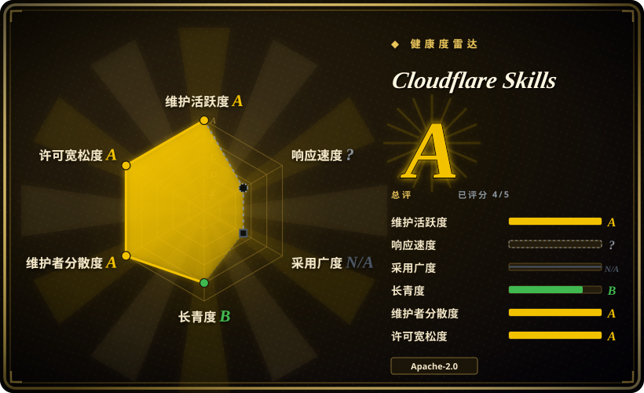
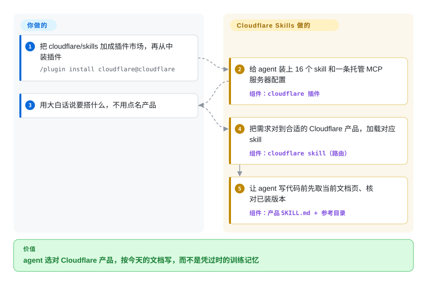

# Cloudflare Skills

让编码 agent 在 Cloudflare 上搭东西，它凭去年的记忆写：Cloudflare 现在让新站点走 Workers，它还给你建 Pages 项目；手敲一个早就和配置对不上的 `Env` 类型；用一个已经改掉的命令行参数。这是 Cloudflare 自己出的 16 个说明文件夹：告诉 agent 这件事该用哪个 Cloudflare 产品，并且要它动手前先读今天的文档，另外附一行配置连到 Cloudflare 托管的 API 服务器。

## 何时使用

你是开发者，你的编码 agent（Claude Code、Codex、Cursor、VS Code Copilot、OpenCode、Pi）正在写或审一个跑在 Cloudflare 上的东西：一个 Worker API、一个 Durable Object 聊天室、一个 Next.js 站点、一张要加 Turnstile 的注册表单、一次 Zero Trust 上线。agent 交回来的代码能编译，过后才出事。它写 `const { waitUntil } = ctx`，方法脱离了原对象，后台任务被丢掉。它声明 `class Room implements DurableObject`，而平台要的是 `extends`，于是 `this.ctx` 根本不存在。该按房间做协调的活它拿 KV 去存，Cloudflare 现在对新项目的建议是 Workers，它却搭了个 Pages 项目。

想要厂商自己给的纠正，就用这个仓库。装一次，agent 得到一个路由 skill（`cloudflare`），把大约 95 种大白话需求（“存上传文件”“跑一个会重试、能续跑的任务”）对到合适的产品，再加上 Workers、Wrangler、Durable Objects、Agents SDK、Sandbox、Email、Turnstile、Cloudflare One 和网页性能这些产品 skill。在“选哪个产品”这一步，它比 Context7 这类通用的“取最新文档”工具强，因为文档索引里没有哪一页会告诉 agent 这里用 Queues 不对、该用 Workflows。它也比只接 Cloudflare 的 API 服务器强，因为那个服务器让 agent 能动你的账号，却不管该搭成什么样。并且本索引收录的厂商包里只有它覆盖 Cloudflare：[Agent Toolkit for AWS](agent-toolkit-for-aws.zh.md) 和 [Vercel Agent Skills](../engineering/vercel-agent-skills.zh.md) 各自只路由到自家平台。

## 怎么用起来

一个 *skill* 就是一个装着 `SKILL.md` 的文件夹：开头一段简短描述，agent 拿它和你的请求比对，对上了才去读后面的说明，所以没用到的 skill 几乎不占上下文。*插件*是可安装的外壳，里面装着全部 16 个 skill 和一条 MCP 配置（MCP 是 agent 调用外部工具的协议），指向 `https://mcp.cloudflare.com/mcp`，这台服务器由 Cloudflare 运行。大多数 skill 是有意写薄的。仓库的贡献规则是“帮 agent 找到对的文档，而不是再维护一份副本”，所以 skill 主要说明*该取哪一页*文档、该指出哪些错误，页面由 agent 在干活时现取。例外是带实货的两个：`cloudflare` 这个 skill 自带 54 个产品参考目录（273 个文件）供离线查阅，`turnstile-spin` 自带四个 shell 脚本，用你的令牌经 Cloudflare API 创建 Turnstile 组件。这个包做的事：选产品、指向当前页面、列出反模式。留给你的事：Cloudflare 账号、API 令牌或 OAuth 授权以及它的权限范围、审查 agent 部署的东西。可以把它想成五金店的店员：把你领到对的货架，递给你今年的安装说明，房子还是得你自己盖。

<!-- flow-steps:begin (generated from flows/cloudflare-skills.json by tools/flow_card.py — do not edit) -->

流程文字版

1. **你**：把 cloudflare/skills 加成插件市场，再从中装插件 — `/plugin install cloudflare@cloudflare`
2. **Cloudflare Skills**：给 agent 装上 16 个 skill 和一条托管 MCP 服务器配置 — 组件：`cloudflare 插件`
3. **你**：用大白话说要搭什么，不用点名产品
4. **Cloudflare Skills**：把需求对到合适的 Cloudflare 产品，加载对应 skill — 组件：`cloudflare skill（路由）`
5. **Cloudflare Skills**：让 agent 写代码前先取当前文档页、核对已装版本 — 组件：`产品 SKILL.md + 参考目录`

**价值**：agent 选对 Cloudflare 产品，按今天的文档写，而不是凭过时的训练记忆

<!-- flow-steps:end -->

## 何时不用

- **项目不在 Cloudflare 上，或者你要一个中立的平台建议。** 路由 skill 的原文写着要“主动提出能解决问题的 Cloudflare 产品，即使用户没有点名”，它的描述泛泛地匹配应用、API、存储、网络和安全。在多个无关项目共用的 harness 里，它会把 Cloudflare 的建议带进那些项目。在 AWS 上用 [Agent Toolkit for AWS](agent-toolkit-for-aws.zh.md)；部署在 Vercel 的 React 应用用 [Vercel Agent Skills](../engineering/vercel-agent-skills.zh.md)；要做不偏向某家云的架构讨论，用 [Superpowers](../../agent-dev-methodology/coding-agent-harnesses/superpowers.zh.md) 这类方法包，并且按项目启用本插件，不要全局启用。
- **你需要锁定版本、可复现。** 仓库没有 git tag，也没有 GitHub release，安装跟着 `main` 走。插件清单的版本号靠手改，而且很少改：它在 `1.0.0` 一直停到 2026-09-21，其间捆绑的 MCP 配置从五个服务器变成一个，有用户测到自己加载的还是六个月前的缓存，里面是那五个旧服务器名（issue #196，2026-10-08 仍未关闭）。现在版本号是 `1.0.1`，此后又合入了新 skill，版本号没有再动。要确切知道 agent 读到的是什么，就按某个 commit 克隆，把 `skills/` 拷进你的 harness，不走 marketplace；或者只收编你需要的那几个 skill。
- **agent 必须离线工作，或出站流量受严格限制。** 大多数 skill 只是指针：让 agent 动手前先去取 `developers.cloudflare.com` 的页面，插件里的 MCP 配置也是 Cloudflare 托管的端点。没有外网时，agent 手里只剩 `cloudflare` 自带的参考目录。这种环境下只装 skill 文件夹（`npx skills add https://github.com/cloudflare/skills`，不带 MCP 配置），把需要的文档镜像下来，并且别指望那些薄 skill 能帮上多少。
- **你只是要跨很多厂商的最新库文档。** Context7（`upstash/context7`，未收录）用一个 MCP 服务器提供几千个库的当前文档。本包只管一家厂商，价值在路由和反模式清单，不在广度。
- **你只要 agent 操作账号，不要它被指导。** API 服务器是单独的仓库（`cloudflare/mcp`，未收录），可以只加一条 MCP 配置、配一个限定范围的 API 令牌。任务是“列出我的 DNS 记录”而不是“设计这个应用”时，单用它就够。
- **你要的是保证，不是指导。** skill 是 Markdown，agent 可以跳过；本包不带 hook，也不带评测，唯一的 CI 任务是 Semgrep 扫描，一个加打包校验的 PR（#146）未合并就关闭了。skill 的内容出过错：一份未关闭的用户报告（#217，2026-10-03）列出 Cloudflare One 两个 skill 里的三处事实错误，另一份（#212）说 Sandbox 1.0 预览版的文档链接全部跳到落地页。要设限就靠 API 令牌的权限范围，不要靠这个包。
- **你在用稳定的旧工具链，不想被推向预览版。** 有几个 skill 把人引向尚未正式发布的东西：`cf` CLI（skill 自己说它是 beta）、`@cloudflare/sandbox@next`（1.0 预览版，“推荐新项目使用”），以及 Next.js 用 vinext 而不用 OpenNext，其中还有一条指令让 agent 执行 `npx skills add cloudflare/vinext`，把另一个仓库的 skill 拉进你的 harness。团队已经统一用 Wrangler 加 OpenNext 的话，启用前先审这几个 skill，或者只装 `workers-best-practices` 和 `durable-objects`。

## 横向对比

| 替代品 | 是否收录 | 我们的评价 | 取舍 |
|---|---|---|---|
| [Agent Toolkit for AWS](agent-toolkit-for-aws.zh.md) | ✅ | 按负载跑在哪里选：Cloudflare 选本包，AWS 选 AWS 工具包，因为每家厂商的 skill 只路由到自家服务。如果硬性要求在审计里把 agent 的调用和人的调用分开，只有 AWS 工具包写明了做法。 | AWS：约 114 个 skill、一个签名代理、IAM 条件键和一个拦密钥的 hook，不收外部 PR。Cloudflare：16 个更薄、把细节交给在线文档的 skill，没有 hook，接受外部 PR，一条用 OAuth 的远程 MCP 配置。 |
| [Vercel Agent Skills](../engineering/vercel-agent-skills.zh.md) | ✅ | React／Next.js 应用部署到 Vercel 时选 Vercel 的包；同一个应用要上 Workers 时选本包，因为 Vercel 的规则默认 Vercel 的运行时，而本包的 Next.js skill 会把你引向 Workers 上的 vinext。 | Vercel：40 多条写全了的 React 性能规则，可离线使用，有按 sha 打的快照。Cloudflare：平台覆盖面广（存储、队列、Zero Trust、邮件），框架层面的 React 建议很少，也没有快照。 |
| Cloudflare API MCP 服务器（`cloudflare/mcp`） | 未收录 | 活是操作一个现成的账号（读配置、改一条 DNS 记录）时，只加这个 MCP 服务器；agent 还得选产品、写 Worker 代码时再加本包，因为服务器只执行调用，不告诉 agent 好的设计长什么样。 | 本次标签批次未添加。只用 MCP：两个工具覆盖整套 API，约占 1k token 上下文（Cloudflare 自己的数字），不往提示里加任何指导。本包：同一条服务器配置，外加 16 个按请求触发的 skill。 |
| Context7（`upstash/context7`） | 未收录 | 问题只是 API 知识过时、技术栈又跨很多库时选 Context7；技术栈是 Cloudflare 时选本包，因为取文档的工具没法告诉 agent 新项目里 Workers 已经取代 Pages，也没法告诉它该用哪个存储产品。 | 本次标签批次未添加。Context7：一个服务器、几千个库，没有选产品的逻辑。本包：一家厂商、带立场的路由、供审查用的反模式表，以及厂商推荐自家产品的利益。 |

## 健康度与可持续性

- **响应度**：skill-pack 类型不评分（`type_na`）。
- **维护——活跃。** 2026-10-08 经 GitHub API 核实：`main` 最近一次推送在 2026-10-01，建仓以来约 259 次提交，仍有新 skill 进来（Basin 和 K2 两个 skill 于 2026-10-01 合并）。未关闭的 issue 17 个，未关闭的 PR 15 个。分诊有滞后：issue #86（`validate.sh` 的一个 bug）仍开着，但当前脚本里已经没有报告里的那一行；还有几条垃圾 issue 没关。
- **治理与背书——单一厂商，多个产品组供稿，四位负责人。** 归属 `cloudflare` 组织。过去 12 个月有 36 人提交，最多的一人占这个窗口的 18%（评分器，2026-10-08），这和各产品组自己供稿的情形相符；CODEOWNERS 把所有路径都指给同样四位审阅者。路线图由 Cloudflare 决定。接受外部 PR，但占比小：最近关闭的 100 个 PR 里合并了 67 个，其中 60 个来自协作者或成员，7 个来自其他人。Cloudflare 自己的文档安装页指向这个仓库，所以它是官方认可的渠道，不是副业项目。
- **年龄与 Lindy——年轻。** 建于 2025-12-10（约 10 个月），按年龄拿不到 Lindy 加分。形态已经改过一轮：到 2026 年年中，维护者把 skill 从抄来的文档削成指向文档的指针，2026-09-02 捆绑的 MCP 配置从五个服务器变成一个。内容会继续跟着平台变。[推断]
- **采用（雷达 N/A）。** 评分器找不到可度量的包仓库安装渠道（`no_install_channel`）。看得见的信号：约 3.0k star、304 个 fork（2026-10-08），分发渠道有 Claude Code 和 Codex 的自有 marketplace 条目、Cursor Marketplace、VS Code 的从源码装插件流程，以及 `npx skills`。雷达总评**在 5 个适用轴中的 4 个上得 A**（长寿度因年龄得 B）。
- **风险信号。** Apache-2.0，没有改过许可证。没有 tag，能锁定的只有 commit。插件里真正干活的那一半是 Cloudflare 的托管服务，它的行为可以不经本仓库的提交而改变。路由 skill 就是为了推荐 Cloudflare 产品而写的，这是厂商利益，不是缺陷。

## 存疑（未验证）

- [未验证] 各项计数（16 个 `SKILL.md`、`skills/cloudflare/references/` 下 54 个参考目录共 273 个文件、路由表约 95 行、4 个 shell 脚本）是 2026-10-08 在 commit `41e0d198` 上的目录快照；`main` 上会变。
- [未验证] 连接时走 OAuth、CI 里用 bearer 令牌、`search()`／`execute()` 两个工具的设计，以及“约 1,000 token”这个数字，都出自 Cloudflare 讲自家 MCP 服务器的文档页（2026-10-08 读取）；没有连到真实账号去试，服务器代码在 `cloudflare/mcp`，不在本仓库。
- [未验证] 缓存过期的现象（issue #196：2026 年 3 月的缓存到 9 月还在加载）是一位用户的测量，另一位评论者有同样说法；这里没有复现，而且它取决于各个 harness 怎样决定刷新插件。issue #202 报告了同样的症状。仓库这一侧的事实已核对：`.mcp.json` 在 commit `57301e49`（2026-02）列了五个服务器，现在是一个；版本号在 commit `c529468c`（2026-09-21）从 `1.0.0` 改到 `1.0.1`；把它改到 `1.0.2` 的 PR（#221）还开着。
- [未验证] issue #217（`cloudflare-one` 和 `cloudflare-one-migrations` 里的三处事实错误）和 issue #212（Sandbox 预览版链接跳转）是用户报告，截至 2026-10-08 没有维护者回复；这里没有拿报告引用的那几行去对照 Cloudflare 文档。
- [未验证] 写这一页时没有在 agent 会话里实际跑任何 skill。skill 会在对的请求上触发、agent 会真的去取链接的文档而不是跳过，这些是这个包的设计主张，不是观察到的结果。
- [未验证] `turnstile-spin` 的脚本读过（`validate.sh`、`persist-skill.sh`），没有执行；`persist-skill.sh` 在运行时从 GitHub 克隆本仓库，所以它拷下来的是当时 `main` 上的内容。
- [未验证] “从 Cursor Marketplace 安装”出自 README；没有打开 Cursor 上的条目核对。
- [推断] “削成指向文档的指针”综合了 PR #70（“Refactor Skills”，写明了这个意图，但未合并就关闭，并说明会拆成更小的改动）、CONTRIBUTING 里优先给文档链接而不是副本的规则，以及 issue #196 里前后文件大小的对比；后续的各个改动没有逐一追踪。
- [推断] “全局启用的插件会把 Cloudflare 的建议带进无关项目”这一判断，读自 `cloudflare` skill 的描述和它“主动提出”的指令；实际触发有多频繁没有测量。
