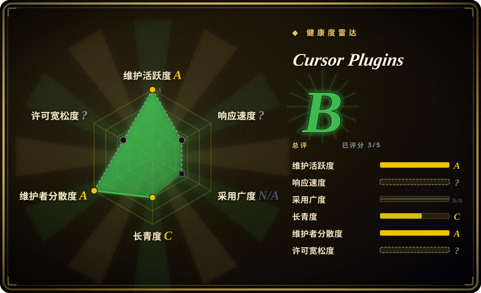
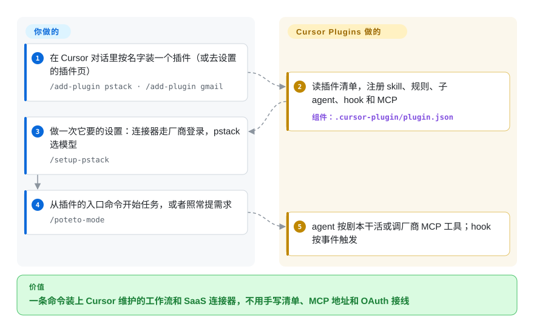

# Cursor Plugins

Cursor 里的 agent 写得快但糙；想让它读 Gmail、开 GitHub issue、查 Salesforce，又得自己去找每家的 MCP 地址、配 OAuth。这是 Cursor 官方的插件市场仓库：一条 `/add-plugin <名字>` 装上一整包 skill、规则、子 agent、hook 和 MCP 配置，其中分量最重的是 Cursor 工程师写的严谨工程工作流 pstack。

## 何时使用

你天天在 Cursor 里干活，有两件事一直让你烦。一是 agent 交出来的东西能编译就算完：修一个 20 行的 bug 给你 400 行 diff，用 `if (!x) return` 把崩溃压下去就说修好了，说“完成”时拿不出任何跑过的证据。二是每次想让它读邮件、查 Salesforce 记录、操作浏览器，都得把某个 MCP server 的 URL 贴进 `mcp.json`，再自己接 OAuth。你想要厂商自己给的答案，一条命令装好，而不是从博客里抄。

这个仓库就是那个答案。第一方插件有 16 个：**pstack** 是 Lauren Tan（poteto）的 44 个 skill 的工作流包，入口 `/poteto-mode` 带 23 个剧本（修 bug、性能、做功能、睡前“把整串 PR 合掉”），还有多模型评审面板；`advisor`、`continual-learning`、`ralph-loop` 补上收尾 hook，`thermos` 补上评审子 agent，`orchestrate` 把任务分发给 Cursor 云端 agent；`create-plugin` 帮你写自己的插件。另外 80 个是 `third_party/*` 下的薄连接器，连到厂商托管的 MCP server：Google Workspace、GitHub、Salesforce、HubSpot、Brex、Mercury 等。如果你打定主意留在 Cursor，想用它的原生能力（`.mdc` 规则、能按角色指定模型的 `Task` 子 agent、`/loop` 命令、Cursor 的 hook 事件、云端 agent），就选它而不是 Superpowers 这类跨 harness 的包；如果你宁可用 Cursor 维护的连接器配置，也不想自己手接 MCP，同样选它。

## 怎么用起来

这个仓库是 Cursor 客户端读取的数据，本身不作为服务运行。根目录的 `.cursor-plugin/marketplace.json` 列出 96 个插件，每个插件是一个带 `.cursor-plugin/plugin.json` 清单的目录（CI 脚本按 `schemas/plugin.schema.json` 校验）。清单指向这些东西：`skills/`（agent 在相关时加载的 SKILL.md 指令）、`rules/`（`.mdc` 规则，常驻或按范围生效）、`agents/`（子 agent 定义）、`hooks/hooks.json`（Cursor 在 `stop`、`afterFileEdit` 这类事件上执行的 shell 或 `bun` 脚本）和 `mcp.json`（工具服务器）。你执行 `/add-plugin <名字>`，注册由 Cursor 完成。连接器插件通常只有一个 `mcp.json`，指向厂商托管的地址，像电话簿里的一条号码，告诉 Cursor 该拨给谁；接电话的 server、登录流程都归厂商，你的数据也流向厂商。pstack 正好相反，几乎全是提示词文本：一个路由 skill 负责挑剧本、把剧本步骤抄进待办清单，外加一批原则 skill 和少量 `bun` 脚本（PR 盯梢器、编排状态存储）；`/setup-pstack` 会写 `~/.cursor/rules/pstack-models.mdc`，决定每个角色用哪个模型。留给你的是：信任哪些插件，为 pstack 拉起的前沿模型评审面板付费，以及检查 agent 实际做了什么。

<!-- flow-steps:begin (generated from flows/cursor-plugins.json by tools/flow_card.py — do not edit) -->

流程文字版

1. **你**：在 Cursor 对话里按名字装一个插件（或去设置的插件页） — `/add-plugin pstack · /add-plugin gmail`
2. **Cursor Plugins**：读插件清单，注册 skill、规则、子 agent、hook 和 MCP — 组件：`.cursor-plugin/plugin.json`
3. **你**：做一次它要的设置：连接器走厂商登录，pstack 选模型 — `/setup-pstack`
4. **你**：从插件的入口命令开始任务，或者照常提需求 — `/poteto-mode`
5. **Cursor Plugins**：agent 按剧本干活或调厂商 MCP 工具；hook 按事件触发

**价值**：一条命令装上 Cursor 维护的工作流和 SaaS 连接器，不用手写清单、MCP 地址和 OAuth 接线

<!-- flow-steps:end -->

## 何时不用

- **你不用 Cursor。** 清单是 `.cursor-plugin/` 格式；hook 用的是 Cursor 的事件名（`afterAgentResponse`、`subagentStop`、带 `loop_limit` 的 `stop`）；pstack 默认你有 Cursor 的 `Task` 子 agent（带模型 slug）、`.mdc` 规则和 `/loop`。换到别的 harness 会悄悄失效：issue #237（未关闭）显示 `poteto-mode` 的 `name: Poteto Mode` 在 Kiro 上根本注册不上，#446 在问到底支不支持 Grok Build。用 Claude Code 的话选 [Claude Plugins（官方）](claude-plugins-official.zh.md)；想要一个自带多宿主安装方式的方法论包，选 [Superpowers](../../agent-dev-methodology/coding-agent-harnesses/superpowers.zh.md) 或 [gstack](../personal-collections/engineering-workflows/gstack.zh.md)。
- **你想自托管或审计连接器。** 96 个插件里 80 个在 `third_party/` 下，基本就是一个指向厂商托管地址的 `mcp.json`（比如 `gmailmcp.googleapis.com/mcp/v1`、`api.githubcopilot.com/mcp/`），加一份 README 和一个 logo。仓库里的代码只是配置；server、鉴权和数据处理都在厂商那边。要自己跑或检查 server，就直接装厂商的开源 MCP server，比如 [Playwright MCP](../../web-automation/playwright-family/playwright-mcp.zh.md)，这里的 `playwright` 插件也不过是用 `npx @playwright/mcp@latest` 把它拉起来。
- **你的模型预算很紧。** pstack 默认用最贵的档：`claude-opus-5-5-max`、`gpt-5.6-sol-max`、`grok-4.7-xhigh-fast`；`arena`、`architect`、`interrogate` 按面板里每一项各起一个子 agent，默认就是三个模型。issue #335（未关闭）报告旧的默认 slug 在当前 Cursor 里根本起不来。付不起面板的话，用 `/setup-pstack` 选 `small` 预算或 `inherit-parent`，或者换成单模型也能跑的 [Superpowers](../../agent-dev-methodology/coding-agent-harnesses/superpowers.zh.md)。
- **你的 worktree 里有在乎的未跟踪文件。** issue #449（未关闭，2026-09-28）：pstack 的 `worktree-cleanup` 剧本把未跟踪和被忽略的文件当成可丢弃的，会退到 `git worktree remove --force`，再退到 `rm -rf`。如果 `.env`、运行产物、证据目录放在 agent 的 worktree 里，别用这个剧本，清理交给你自己的流程。
- **你要锁版本、可复现。** 仓库没有 release 也没有 tag（GitHub API，2026-09-30），装的永远是 `main`，各插件的 `version` 字段只是声明。pstack 在 0.15.3 换了默认模型，之前写下的规则会一直钉着旧模型。要稳定就把插件目录拷进 `~/.cursor/plugins/local/`，自己决定什么时候升级。
- **你指望上游修你的 bug 或收你的插件。** 截至 2026-09-30，issue 开着 51 个、关掉的只有 7 个；100 个开着的 PR 里 83 个来自外部贡献者（author association 为 `NONE`），合并的 PR 几乎全是协作者提的。把它当厂商策展的目录，而不是社区项目：修问题就 fork 插件，自己的插件放在 `~/.cursor/plugins/local/`（`create-plugin` 默认生成到这里）本地装，别指望这里的 PR 会被合并。
- **你不希望这个市场同时服务别的产品。** 清单 schema 里除了 `cursor` 还有一个 `grokbot` 客户端；三个连接器（`finance`、`x-money`、`shopify-store`）标了 `cursor: never`，只在 Grok Bot 里能装，而 xAI 自己的市场原样收录了 pstack。目录的走向已经不只服务一个客户端。今天这对 Cursor 用户没有坏处，但“Cursor 官方插件”已经不等于“只为 Cursor 做的插件”。

## 横向对比

| 替代品 | 是否收录 | 我们的评价 | 取舍 |
|---|---|---|---|
| [Claude Plugins（官方）](claude-plugins-official.zh.md) | ✅ | agent 是 Claude Code 就选 Anthropic 的市场；在 Cursor 上选本仓库，因为两边都只能被自家的插件加载器读。 | 形态相同（厂商策展、按名安装的 skill/agent/MCP 配置目录），加载器不同。Anthropic 那边开发工作流类插件更多（LSP、评审、插件编写），并把内部和外部投稿分开；Cursor 条目更多（96 个），但 80 个是 SaaS 连接器，工作流的分量压在一个旗舰包 pstack 上。 |
| [Superpowers](../../agent-dev-methodology/coding-agent-harnesses/superpowers.zh.md) | ✅ | 想要一个能在 Claude Code、Codex、Cursor 等十几个宿主之间通用的方法论包，选 Superpowers；常驻 Cursor、想要按角色分模型的评审面板、云端 agent 分发和 `/loop` 通宵跑，选这里的 pstack。 | Superpowers 胜在可移植、单模型就能跑（更省钱）；pstack 对 Cursor 原生机制和多模型评审挖得更深，代价是前沿模型开销和绑定 Cursor。 |
| [gstack](../personal-collections/engineering-workflows/gstack.zh.md) | ✅ | 想要一位知名工程师的个人工作流、并自带十个 agent 的宿主适配，选 gstack；想要 Cursor 工程师通过 Cursor 官方市场发的那套，选 pstack。 | 两者都是把一个人的强主张风格打包成 skill。gstack 自带多宿主安装脚本；pstack 走 Cursor 的安装器，还多一个 `/automate-me`，能从你的对话记录起草你自己的 `-mode` skill。 |
| [Agent Plugins for AWS](aws-agent-plugins.zh.md) | ✅ | 工作是 AWS 形状的（serverless、成本估算、IaC），就加装 AWS 的插件，它们也能装进 Cursor；通用工作流和 SaaS 连接器用本仓库。 | 两者互补大于竞争。AWS 那套深耕一朵云、跨 harness，而且 AWS 现在已把生产用户引向它的继任工具包；Cursor 这套胜在广度，没有云上深度。 |
| [Playwright MCP](../../web-automation/playwright-family/playwright-mcp.zh.md) | ✅ | 要能锁版本、能配参数、能在 CI 里无头跑的浏览器控制，直接装 Playwright MCP；这里的 `playwright` 插件只适合在 Cursor 里一键装上。 | 插件只是两行 `mcp.json`，跑 `npx @playwright/mcp@latest`：永远追最新版，server 的参数一个也没暴露。自己接 server 只多改一处配置，换来锁版本和可调参数。 |

## 健康度与可持续性

- **维护（2026-09-30）**：非常活跃。最近一次 push 在 2026-09-30，最新 100 个 commit 全部在 2026 年 9 月；新连接器按周上线（Greenhouse、PostHog、Trello、beehiiv，2026-09-25/29）。没有 release 和 tag，每个插件在 `plugin.json` 里各自写 `version`（pstack 为 0.15.5）。
- **治理与巴士因子**：归 `cursor` 组织（Anysphere）所有，路线图由厂商决定。合并的 PR 绝大多数来自协作者；外部 PR 越积越多（100 个开着的 PR 里 83 个 author association 为 `NONE`），历史上关掉的 issue 只有 7 个，开着的有 51 个。pstack 实际上是一个人的作品：它路径下 90 个 commit 里 87 个是 `poteto` 写的，另外 3 个来自 `cursoragent` 机器人。最近的连接器工作也集中在一位员工身上（`minupalaniappan`，占最新 100 个 commit 中的 57 个）。
- **年龄与 Lindy**：创建于 2026-01-23，约 8 个月，**没有 Lindy 履历**。能替代年龄的是厂商：这个仓库是 Cursor 产品内插件市场的源头，Cursor 保留这个功能多久，它就活多久。[推断]
- **采用度**：约 9.0k star、849 fork（GitHub API，2026-09-30）。xAI 的 `plugin-marketplace` 收录了 pstack；社区移植版（比如 issue #446 提到的面向 Grok Build 的 `tommy-ca/pstack`）说明内容已流出 Cursor，但移植版会落后于上游。
- **风险标记**：根目录没有 `LICENSE` 文件，所以 GitHub 显示无许可证；根 README 写的是 MIT，96 个插件各自的 `LICENSE` 文件全是 MIT（2026-09-30 逐个核对）。连接器会把你的数据发到厂商托管的 server。pstack 的破坏性 worktree 清理（#449）和起不来的默认模型 slug（#335）都还没关。

## 存疑（未验证）

- [推断] “这个仓库是 Cursor 产品内插件市场读取的源头”是从这些线索推出来的：README 里写的“`description` (from marketplace)”、`marketplace.json` 的 owner 是 `plugins@cursor.com`、插件 README 写着“打开 Cursor 设置的插件页……搜索 Gmail”。没有读到 Cursor 说明同步路径的文档，合并到市场上线之间隔多久也不清楚（issue #364 报告过已列出的插件在市场里搜不到）。
- [未验证] 插件数量（`marketplace.json` 里 96 个，第一方 16 个，`third_party/` 80 个）以及 pstack 的 44 个 skill、23 个剧本，都是 2026-09-30 的快照，这个目录每周都在加插件。
- [未验证] 各角色的默认模型和三模型面板取自 2026-09-30 的 `pstack/skills/setup-pstack/SKILL.md`；一次 `/interrogate` 或 `/arena` 实际花多少 token 没有实测，而且默认值会随 pstack 版本变。
- [未验证] issue #237、#335、#449 在 2026-09-30 读取时都未关闭，也都没有维护者回复；修复可能落地了但 issue 没关。
- [未验证] hook 的事件名和行为（带 `loop_limit` 的 `stop`、`afterFileEdit`、`subagentStop`）读自各 `hooks.json`，没有在 Cursor 客户端里实跑，也没测它们和其他 harness 的 hook 体系怎么对应。
- [推断] Grok Bot 客户端（`minClientVersions` 里的 `grokbot`、三个 `cursor: never` 的连接器）说明这个目录与 xAI 的产品共用；这层商业关系对仓库未来意味着什么，没有核实。
