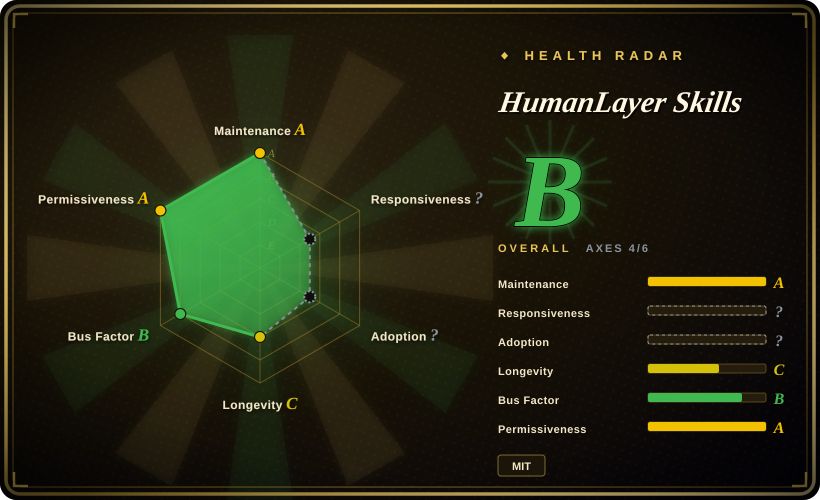
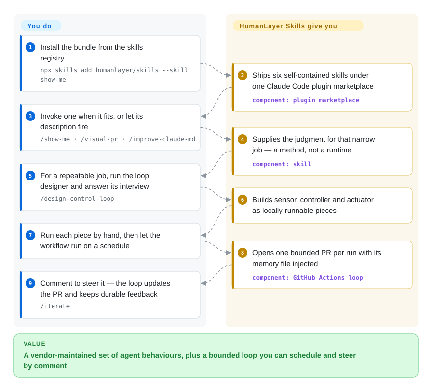

# HumanLayer Skills

HumanLayer's official six-skill bundle: visual explanation, PR outlining, CLAUDE.md rewriting, React prop narrowing, and two skills that turn a repeatable agent job into a scheduled, human-steered CI loop.

## When to use

You run coding agents against a real repository, and you keep re-authoring the same small disciplines by hand. Nobody can tell what changed from the diff alone, so you ask the agent to draw it. PR descriptions come out as a file-by-file changelog instead of an explanation. Your CLAUDE.md has grown past the point where the agent attends to all of it. One React component's props have quietly widened until half of them exist only for Storybook. And the thing you actually want — a repeatable job that runs on a schedule, opens one reviewable PR, and gets better each time you correct it — you rebuild from scratch whenever you want it. HumanLayer's bundle is a vendor's opinionated answer to exactly that set: `show-me`, `visual-pr`, `improve-claude-md`, `narrow-react-prop-types`, `build-iterated-agentic-loop`, and `design-control-loop`, distributed as one Claude Code plugin marketplace and installed with `npx skills add humanlayer/skills --skill <name>`.

Reach for it when you want those specific behaviours *plus* working machinery for the loop, not a methodology and not a catalogue. The deciding tradeoff against the closest substitutes: [Anthropic Skills](anthropic-skills.md) is the platform's own bundle and takes no position on how your agent behaves while changing code; [Claude Plugins (Official)](claude-plugins-official.md) is a directory you browse rather than a committed editorial line; [Superpowers](../../agent-dev-methodology/coding-agent-harnesses/superpowers.md) prescribes a whole lifecycle (brainstorm → plan → TDD → verify) instead of teaching you to instrument one job. What is distinctive here is that the two loop skills ship the *machinery* — a GitHub Actions workflow template, an agent-memory file, a phase-by-phase interview, and an `/iterate` comment channel — so you adopt a running loop you can tune, rather than a philosophy you must follow.

## How it works

The repo is a plugin marketplace, not a tool. One `.claude-plugin/marketplace.json` lists six plugins, and each plugin is a folder holding a `SKILL.md` plus a `references/` directory with the long material: PR-description templates, a GitHub Actions workflow skeleton, the headless invocations for four different agent CLIs, and a small helper script that builds the `/iterate` prompt. You add the marketplace, install whichever skills you want, and from then on each one activates the way any skill does — its `description` matches what you asked for, or you type its slash command. What it hands over is the *method*, never a runtime: `show-me` gives you a rule for picking the smallest diagram that answers the question, and you supply the codebase it reads; `design-control-loop` reads your repo, interviews you about set point, sensor, controller and actuator, and writes those pieces as scripts you can run by hand, with the CI workflow as a thin wrapper. You keep two steering channels afterwards: a short agent-memory file injected into every scheduled run, and `/iterate` comments on a PR the loop opened.

<!-- flow-steps:begin (generated from flows/humanlayer-skills.json by tools/flow_card.py — do not edit) -->

Text version of the flow

1. **You**: Install the bundle from the skills registry — `npx skills add humanlayer/skills --skill show-me`
2. **HumanLayer Skills**: Ships six self-contained skills under one Claude Code plugin marketplace — component: `plugin marketplace`
3. **You**: Invoke one when it fits, or let its description fire — `/show-me · /visual-pr · /improve-claude-md`
4. **HumanLayer Skills**: Supplies the judgment for that narrow job — a method, not a runtime — component: `skill`
5. **You**: For a repeatable job, run the loop designer and answer its interview — `/design-control-loop`
6. **HumanLayer Skills**: Builds sensor, controller and actuator as locally runnable pieces
7. **You**: Run each piece by hand, then let the workflow run on a schedule
8. **HumanLayer Skills**: Opens one bounded PR per run with its memory file injected — component: `GitHub Actions loop`
9. **You**: Comment to steer it — the loop updates the PR and keeps durable feedback — `/iterate`

**Value**: A vendor-maintained set of agent behaviours, plus a bounded loop you can schedule and steer by comment

<!-- flow-steps:end -->

## When NOT to use

- **Your harness is not Claude Code** (or the `skills` CLI it installs through). The plugins ship Claude-format manifests (`marketplace.json`, `plugin.json`) and per-skill slash commands, so on a harness with no skill loader the markdown sits inert. Use [Superpowers](../../agent-dev-methodology/coding-agent-harnesses/superpowers.md), which ships per-harness manifests for Codex / Cursor / Kimi / OpenCode / Pi — or paste the `SKILL.md` text in by hand.
- **You want one enforced lifecycle, not six point skills.** This bundle has no brainstorm-plan-TDD spine; it fixes six specific annoyances. If what you want is a whole SDLC methodology the agent walks every task, pick [Superpowers](../../agent-dev-methodology/coding-agent-harnesses/superpowers.md) and layer nothing on top.
- **You want the platform's own or the first-party catalogue.** Prefer [Anthropic Skills](anthropic-skills.md) for document / design / MCP authoring against Anthropic's own conventions, or [Claude Plugins (Official)](claude-plugins-official.md) to browse and `/plugin install` vetted first-party plugins, instead of adopting one vendor's six opinions.
- **You need canonical guidance for one framework.** Take [Remotion Agent Skills](remotion-skills.md), whose content is version-locked to the framework's own release, rather than a cross-domain process bundle — vendor-general opinion carries no authority about a specific API surface.
- **Your repository cannot give an unattended agent write access and PR rights.** The two loop skills generate workflows that need `contents: write` / `pull-requests: write`, an API key for the chosen agent CLI, and runner templates that use broad permission modes (`--permission-mode bypassPermissions`, `--sandbox danger-full-access`, `--dangerously-skip-permissions`). If you cannot isolate the runner, take only the in-session four (`show-me`, `visual-pr`, `improve-claude-md`, `narrow-react-prop-types`) and skip the loop skills entirely.
- **You need a version to pin.** The repo publishes no tags and no GitHub releases, and all six plugins carry hand-set `1.0.x` strings in the manifest, so "what version am I on" resolves to the default branch rather than to an immutable artifact. Fork it or vendor the skill text if you need a frozen revision. [推断]

## Comparison

| Alternative | In index | Our verdict | Tradeoff |
|---|---|---|---|
| [Claude Plugins (Official)](claude-plugins-official.md) | ✅ | Pick Claude Plugins (Official) when you want the native directory to discover and `/plugin install` vetted plugins; pick HumanLayer Skills when you have already decided you want these six behaviours plus loop templates, because a catalogue helps you choose while a bundle commits to one editorial line. | Official: breadth, first-party vetting, native install; HumanLayer: six narrow skills with CI and memory scaffolding. |
| [Anthropic Skills](anthropic-skills.md) | ✅ | Pick Anthropic Skills when the task is document, design, or MCP/skill authoring against the platform's conventions; pick HumanLayer Skills when the task is how the agent behaves while changing your code, because the platform bundle is domain-general and addresses no dev loop. | Anthropic: platform-canonical, domain-general, process-neutral; HumanLayer: dev-process opinion plus runnable loop machinery. |
| [Superpowers](../../agent-dev-methodology/coding-agent-harnesses/superpowers.md) | ✅ | Pick Superpowers when you want one harness-portable SDLC spine the agent follows on every task (brainstorm → plan → TDD → verify); pick HumanLayer Skills when you want narrower process skills plus templates for instrumenting one repeatable job as a bounded, memory-steered loop, because Superpowers prescribes a lifecycle rather than teaching you to build and tune a controller. | Superpowers: whole-lifecycle methodology, prompt-enforced, multi-harness; HumanLayer: point skills plus loop machinery you run and tune. |
| [Remotion Agent Skills](remotion-skills.md) | ✅ | Pick Remotion Agent Skills when the repeated failure is the agent getting one framework's API wrong; pick HumanLayer Skills when the repeated failure is your own process, because framework-canonical content beats vendor-general opinion only inside that framework. | Remotion: single domain, version-locked to the framework release; HumanLayer: cross-domain process, versioned by hand. |
| [MiniMax Skills](minimax-skills.md) | ✅ | Pick MiniMax Skills when you want vendor-native generators for frontend / shader work, office documents and media; pick HumanLayer Skills when the subject is dev-process discipline and scheduled CI loops, because the two overlap in distribution mechanics (a plugin marketplace) but not in what they teach. | MiniMax: generative and authoring breadth; HumanLayer: process discipline and loop scaffolding. |

## Health & viability

- **Responsiveness:** cannot be scored — `type_na`.
- **Maintenance (radar A):** active — created 2026-03, last pushed 2026-09-17, last commit 5 days before scoring. 16 commits in total and activity in 6 of the trailing 13 weeks read as curated releases rather than continuous development.
- **Governance (radar B):** Organization-owned (`humanlayer`), 3 active maintainers in the trailing 12 months with a top-contributor share of 0.58 (the vendor's co-founder account). It is a vendor's distribution repo, not a community project: the roadmap is the vendor's and the skill set is one team's editorial line.
- **Age & Lindy (radar C):** 188 days old (~6 months) — unproven by age against this index's Lindy prior. Mitigation: it is the distribution arm of a vendor with a commercial agent product, so the content follows the vendor's incentive to keep it current; the repo itself has no track record. [推断]
- **Adoption & ecosystem (radar ?):** structurally unscorable — a skill pack ships no package to count (`no_package_structural`). The visible signal is 4,420 stars / 139 forks / 11 watchers on 2026-09-22, spread through `npx skills add` and one Claude Code marketplace manifest.
- **Risk flags (radar A):** MIT, no relicense history, no installable artifact and therefore no supply-chain or CVE surface beyond the two TypeScript helper scripts it ships. The real exposures are editorial drift (a vendor's opinions move when the product does) and the loop templates' broad default permission modes, which the repo itself marks trusted-runner-only. Skills are prompt text, so their effect is advisory regardless. Overall radar: **B (4/6 axes scored)**.

## Caveats (unverified)

- [未验证] `improve-claude-md` rests on a quoted system reminder ("this context may or may not be relevant to your tasks…") and on the claim that `<important if>` blocks cut through it. Neither the reminder wording nor any adherence measurement is reproduced in the repo — treat the technique as an unmeasured hypothesis someone asserted, not an established result.
- [未验证] Star / fork / watcher counts and the commit counts are point-in-time GitHub figures read on 2026-09-22; they move.
- [推断] No tags and no GitHub releases exist, so consumers track the default branch; the `1.0.x` versions live in hand-edited `plugin.json` / `marketplace.json` and nothing enforces them.
- [未验证] The six skill descriptions here come from the README and the `SKILL.md` files; their behaviour in a live harness was not executed during this review.
- [推断] All content is prompt / markdown skill text the agent loads, so enforcement is advisory — an agent can skip a step a skill calls mandatory.
- [推断] The loop workflow templates need `contents: write` and `pull-requests: write` and default to broad permission modes; whether that is acceptable depends on runner isolation, which this page did not test.
