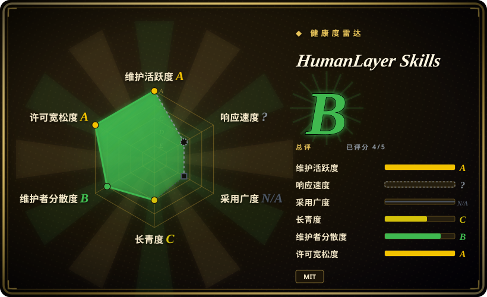
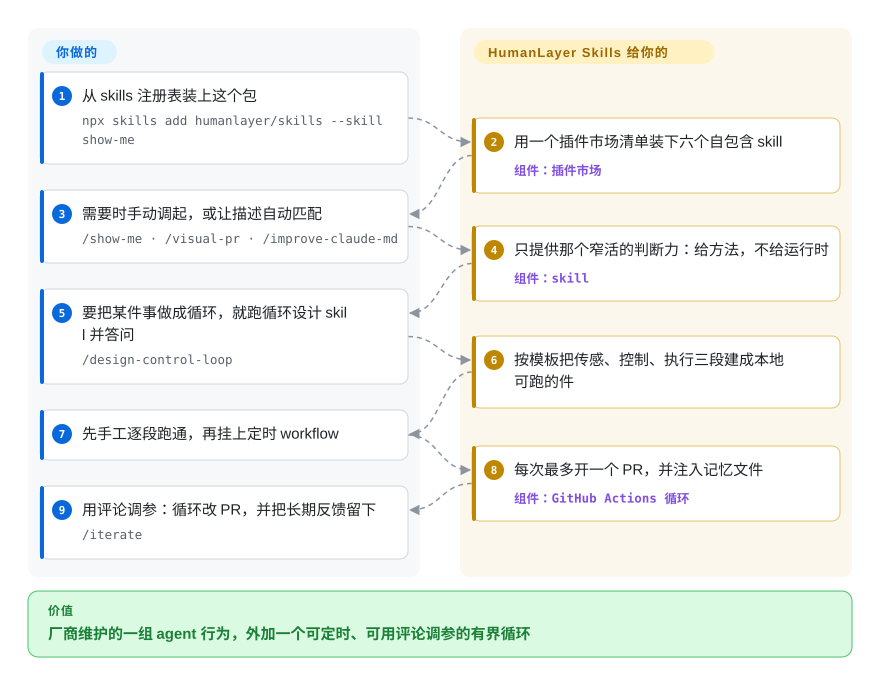

# HumanLayer Skills

HumanLayer 官方的六个 skill：把一个改动画清楚、把 PR 说明写出结构、重写 CLAUDE.md、收紧 React props，外加两个把「重复性 agent 任务」做成定时、可人工调参的 CI 循环。

## 何时使用

你在真实仓库上跑编码 agent，而且一直在手工重复同几件小事：光看 diff 说不清到底改了什么，于是你让 agent 画出来；PR 说明写成逐文件清单而不是解释；CLAUDE.md 已经长到 agent 不再逐条搭理；某个 React 组件的 props 悄悄放宽，一半只服务于 Storybook；而你真正想要的那个东西——一个定时跑、每次只开一个可评审 PR、被你纠正后还能变好的重复性任务——每次都得从零搭。这个包就是厂商对这套问题的成套回答：`show-me`、`visual-pr`、`improve-claude-md`、`narrow-react-prop-types`、`build-iterated-agentic-loop`、`design-control-loop`，以一个 Claude Code 插件市场的形式分发，用 `npx skills add humanlayer/skills --skill <name>` 安装。

当你要的正是这几个行为、外加循环可用的现成机制，而不是一套方法论、也不是一个目录时，选它。与最近替代品的取舍在这里： [Anthropic Skills](anthropic-skills.zh.md) 是平台自家的包，对你的 agent 改代码时的行为不表态；[Claude Plugins (Official)](claude-plugins-official.zh.md) 是让你浏览的目录，不是一条有立场的编辑路线；[Superpowers](../../agent-dev-methodology/coding-agent-harnesses/superpowers.zh.md) 规定的是一整条生命周期（brainstorm → plan → TDD → verify），而不是教你把某一件重复劳动做成循环。本页的差异点在于那两个循环 skill 附带的是**机制**——GitHub Actions workflow 模板、agent memory 文件、分阶段访谈、`/iterate` 评论通道——所以你拿到的是一个能调参的运行中循环，而不是一套要你信奉的哲学。

## 怎么用起来

这个仓库是插件市场而不是工具。一份 `.claude-plugin/marketplace.json` 列出六个插件，每个插件是一个目录，里面一份 `SKILL.md` 加一个 `references/`：PR 说明模板、GitHub Actions workflow 骨架、四种 agent CLI 的无头调用方式，还有一个拼 `/iterate` 提示词的小脚本。你添加市场、按需装 skill，之后每个 skill 就按常规方式生效——描述匹配上你说的需求，或者你敲它的斜杠命令。它交给你的是**方法**，从不含运行时：`show-me` 给你一条「挑出能说明问题的最小图示」的规则，代码库由你提供；`design-control-loop` 先读你的仓库，就 set point、sensor、controller、actuator 访谈你，再把这几段写成你能手工运行的脚本，CI workflow 只是薄薄一层包装。之后你有两条调参通道：每次定时运行都会注入的简短 memory 文件，以及循环开出的 PR 上的 `/iterate` 评论。

<!-- flow-steps:begin (generated from flows/humanlayer-skills.json by tools/flow_card.py — do not edit) -->

流程文字版

1. **你**：从 skills 注册表装上这个包 — `npx skills add humanlayer/skills --skill show-me`
2. **HumanLayer Skills**：用一个插件市场清单装下六个自包含 skill — 组件：`插件市场`
3. **你**：需要时手动调起，或让描述自动匹配 — `/show-me · /visual-pr · /improve-claude-md`
4. **HumanLayer Skills**：只提供那个窄活的判断力：给方法，不给运行时 — 组件：`skill`
5. **你**：要把某件事做成循环，就跑循环设计 skill 并答问 — `/design-control-loop`
6. **HumanLayer Skills**：按模板把传感、控制、执行三段建成本地可跑的件
7. **你**：先手工逐段跑通，再挂上定时 workflow
8. **HumanLayer Skills**：每次最多开一个 PR，并注入记忆文件 — 组件：`GitHub Actions 循环`
9. **你**：用评论调参：循环改 PR，并把长期反馈留下 — `/iterate`

**价值**：厂商维护的一组 agent 行为，外加一个可定时、可用评论调参的有界循环

<!-- flow-steps:end -->

## 何时不用

- **你的 harness 不是 Claude Code**（也不是它借以安装的 `skills` CLI）。这些插件带的是 Claude 格式的 manifest（`marketplace.json`、`plugin.json`）和各 skill 的斜杠命令，在没有 skill 加载器的 harness 上这份 markdown 不会被激活。改用 [Superpowers](../../agent-dev-methodology/coding-agent-harnesses/superpowers.zh.md)，它按 harness 分别提供 Codex、Cursor、Kimi、OpenCode、Pi 的 manifest；或者手工把 `SKILL.md` 文本贴进去。
- **你要的是一条被强制执行的生命周期，而不是六个点状 skill。** 这个包没有 brainstorm-plan-TDD 主干，它只是修掉六个具体烦人处。若你要的是 agent 每个任务都走一遍的完整 SDLC 方法论，选 [Superpowers](../../agent-dev-methodology/coding-agent-harnesses/superpowers.zh.md)，并且不要再往上叠别的。
- **你要的是平台自家或第一方的目录。** 文档、设计、MCP 编写这类活按 Anthropic 自家约定做，选 [Anthropic Skills](anthropic-skills.zh.md)；想浏览并通过 `/plugin install` 装经过筛选的第一方插件，选 [Claude Plugins (Official)](claude-plugins-official.zh.md)；不要为了这些去接受某个厂商的六条主张。
- **你需要某个框架的权威指导。** 选 [Remotion Agent Skills](remotion-skills.zh.md)，它的内容与框架自家版本同步锁定；跨域的过程包对具体 API 表面没有权威性。
- **你的仓库无法给无人值守的 agent 写权限和开 PR 的权限。** 那两个循环 skill 生成的 workflow 需要 `contents: write`、`pull-requests: write`、所选 agent CLI 的 API key，其 runner 模板还默认使用宽松权限模式（`--permission-mode bypassPermissions`、`--sandbox danger-full-access`、`--dangerously-skip-permissions`）。做不到隔离 runner 时，只取那四个会话内 skill（`show-me`、`visual-pr`、`improve-claude-md`、`narrow-react-prop-types`），循环那两个直接跳过。
- **你需要能锁定的版本。** 仓库没有 tag、没有 GitHub release，六个插件的 `1.0.x` 是手写在 manifest 里的字符串，所以「我在哪个版本」实际由默认分支回答，而不是某个不可变产物。要冻结版本就 fork，或把 skill 文本 vendor 进来。[推断]

## 横向对比

| 替代品 | 是否收录 | 我们的评价 | 取舍 |
|---|---|---|---|
| [Claude Plugins (Official)](claude-plugins-official.zh.md) | ✅ | 想用原生目录去发现并 `/plugin install` 经过筛选的插件，就选 Claude Plugins (Official)；已经确定要这六个行为加循环模板，就选 HumanLayer Skills，因为目录帮你挑，而一个包是有自己编辑立场的。 | 官方：广度、第一方筛选、原生安装；HumanLayer：六个窄 skill 加 CI 与 memory 的搭架。 |
| [Anthropic Skills](anthropic-skills.zh.md) | ✅ | 任务是文档、设计或 MCP／skill 编写且要贴平台约定，就选 Anthropic Skills；任务是 agent 改你代码时的行为，就选 HumanLayer Skills，因为平台那个包是跨域的，不涉及你的开发循环。 | Anthropic：平台权威、跨域、对流程不表态；HumanLayer：对开发流程有主张，并附可运行的循环机制。 |
| [Superpowers](../../agent-dev-methodology/coding-agent-harnesses/superpowers.zh.md) | ✅ | 想要一条跨 harness 可移植、每个任务都走的 SDLC 主干（brainstorm → plan → TDD → verify），就选 Superpowers；想要更窄的过程 skill 加「把某件重复劳动做成有界、受 memory 引导的循环」的模板，就选 HumanLayer Skills，因为 Superpowers 规定的是生命周期，不教你怎么造和调一个控制器。 | Superpowers：整条生命周期方法论、靠提示词约束、多 harness；HumanLayer：点状 skill 加你自己运行和调参的循环机制。 |
| [Remotion Agent Skills](remotion-skills.zh.md) | ✅ | 反复出问题的是 agent 搞错某个框架的 API，就选 Remotion Agent Skills；反复出问题的是你自己的流程，就选 HumanLayer Skills，因为框架权威内容只在该框架内有优势。 | Remotion：单域、与框架版本同步锁定；HumanLayer：跨域过程，版本靠手工维护。 |
| [MiniMax Skills](minimax-skills.zh.md) | ✅ | 想要厂商原生的前端／shader、办公文档与媒体生成能力，就选 MiniMax Skills；主题是开发流程纪律和定时 CI 循环，就选 HumanLayer Skills，因为两者只在分发机制上重叠，教的不是一回事。 | MiniMax：生成与创作面的广度；HumanLayer：过程纪律与循环搭架。 |

## 健康度与可持续性

- **响应度：** 无法评分——`type_na`。
- **维护（雷达 A）：** 活跃——创建于 2026-03，最后推送 2026-09-17，最后提交距评分 5 天。总计 16 个 commit、近 13 周里有 6 周有活动，这更像一份份精选发布，而不是持续开发中的产品。
- **治理（雷达 B）：** 归 Organization（`humanlayer`）所有，近 12 个月 3 位活跃维护者，头号贡献者占比 0.58（厂商联创账号）。这是厂商的分发仓库而非社区项目：路线图归厂商，skill 集合是一个团队的编辑主张。
- **年龄与 Lindy（雷达 C）：** 188 天（约 6 个月）——按本索引的 Lindy 先验属于未经证明。缓解因素在于它是一家有商业 agent 产品的厂商的分发臂，内容随厂商维持其时效的动因而更新；仓库本身没有历史记录可依。[推断]
- **采用与生态（雷达 ?）：** 结构上无法评分——skill 包不发包，没有可计数的对象（`no_package_structural`）。可见信号是 2026-09-22 的 4,420 stars／139 forks／11 watchers，经由 `npx skills add` 和一份 Claude Code 市场清单扩散。
- **风险标记（雷达 A）：** MIT，无 relicense 历史，无安装产物，因此除它自带的那两个 TypeScript 辅助脚本外没有供应链或 CVE 面。真正的暴露是编辑漂移（厂商的产品方向一变，主张就跟着变）以及循环模板默认的宽松权限模式——仓库自己也标注为仅限可信 runner。skill 是提示词文本，所以其效力是劝告性的。整体雷达：**B（6 个轴中评到 4 个）**。

## 存疑（未验证）

- [未验证] `improve-claude-md` 建立在一段被引用的系统提示（「this context may or may not be relevant to your tasks…」）以及「`<important if>` 块能穿透它」这一主张之上。无论那段提示原文还是任何遵从度测量，仓库里都没有复现——把它当成一个没人测过的假设，而不是既有结论。
- [未验证] stars／forks／watchers 与 commit 数是 2026-09-22 读取的 GitHub 时点数字，会变动。
- [推断] 仓库没有 tag、没有 GitHub release，所以使用者跟着默认分支走；`1.0.x` 版本是手写在 `plugin.json`／`marketplace.json` 里的，没有任何机制约束。
- [未验证] 本页六个 skill 的描述来自 README 与各 `SKILL.md`；它们在真实 harness 上的表现本次未实际执行。
- [推断] 全部内容都是 agent 加载的提示词／markdown skill 文本，因此效力是劝告性的——skill 里写「必须」的步骤，agent 仍可能跳过。
- [推断] 循环 workflow 模板需要 `contents: write` 与 `pull-requests: write`，且默认使用宽松权限模式；这样是否可接受完全取决于 runner 隔离程度，本页未做测试。
