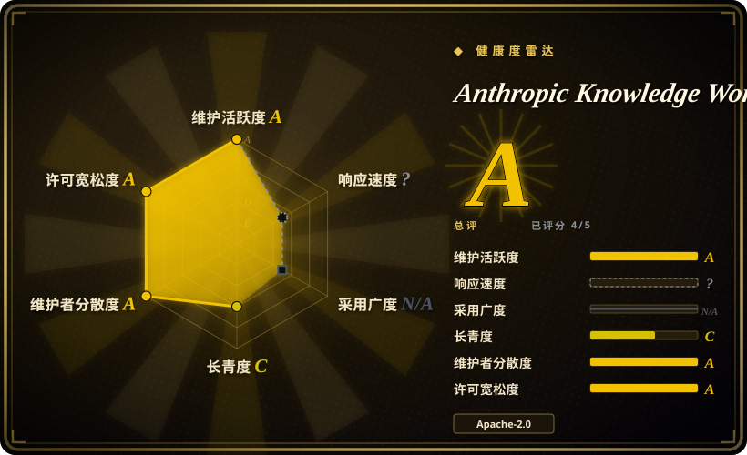
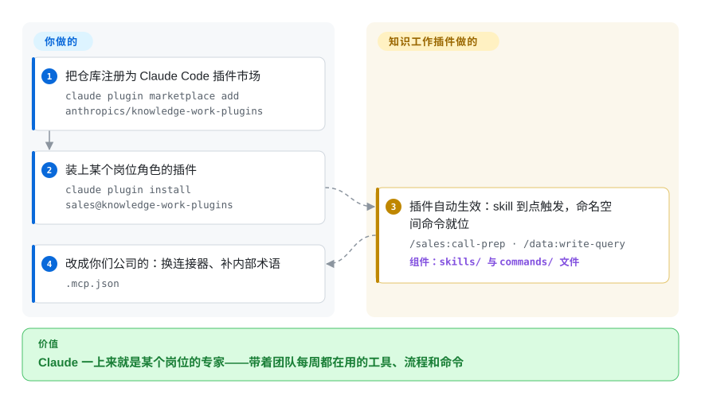

# Anthropic Knowledge Work Plugins

每一次会话你都在向 Claude 重新解释团队是怎么干活的——销售电话前怎么准备、对账怎么跑、spec 落在哪个系统。这个仓库提供 11 个第一方的**岗位插件**（效率、销售、客服、产品管理、市场、法务、财务、数据、企业搜索、生物研究、插件编写），每个打包了一个岗位所需的 skill、MCP 连接器和 slash 命令，为 Claude Cowork 构建，也兼容 Claude Code。

## 何时使用

你是一名知识工作者，或者你在为一支知识工作团队配置工具，你的一天是文档、幻灯片、简报、工单整理、调研摘要和进度沟通，而不是写代码。你反复在向 Claude 解释同一类办公流程（“把这些笔记变成一页纸”“起草本周更新”“帮我准备这个电话”），你想要面向这类任务的官方、厂商维护的构件，而不是手搓 prompt 或一个来路不明的社区合集。每个插件都打包了该岗位的领域 skill、slash 命令（`/sales:call-prep`、`/finance:reconciliation`），以及预接好该角色日常工具的 MCP 连接器——Slack、Notion、HubSpot、Linear、Jira、Snowflake、Databricks、微软 365 等——于是 Claude 从 Anthropic 自己总结的岗位流程起步，而不是临场即兴。

当你想要的正是 Anthropic 第一方面里**知识工作**这一片、且看里有“改造成自己公司的”这套路径时，就选它：README 把出厂插件定位为通用起点，并明确让你改文件——在 `.mcp.json` 里换连接器、把公司术语和流程写进 skill 文件，或者用自带的 `cowork-plugin-management` 插件生成组织专属插件。整栈都是 markdown 和 JSON（“没有代码、没有基础设施、没有构建步骤”），一位非工程背景的组长也改得动。

## 怎么用起来

每个插件就是一个纯文件目录：`.claude-plugin/plugin.json` manifest、`.mcp.json`（把该岗位的外部工具接到 MCP server）、`commands/`（你显式触发的 slash 命令）、`skills/`（任务命中时 Claude 自动取用的领域指令）。你把仓库注册为市场、装上某个岗位的插件（在 Cowork 里则直接从 claude.com/plugins 安装）；之后激活是无感的——相关 skill 自行触发，带命名空间的命令出现在会话里。仓库**不**替你做的事是了解你的公司：连接器指向 Anthropic 的通用选型，流程是教科书版本，你们的数据与术语要你自己改 markdown 补进去——这层按公司定制是明确的第二步，不是出厂自带的魔法。

<!-- flow-steps:begin (generated from flows/knowledge-work-plugins.json by tools/flow_card.py — do not edit) -->

流程文字版

1. **你**：把仓库注册为 Claude Code 插件市场 — `claude plugin marketplace add anthropics/knowledge-work-plugins`
2. **你**：装上某个岗位角色的插件 — `claude plugin install sales@knowledge-work-plugins`
3. **Anthropic Knowledge Work Plugins**：插件自动生效：skill 到点触发，命名空间命令就位 — `/sales:call-prep · /data:write-query` — 组件：`skills/ 与 commands/ 文件`
4. **你**：改成你们公司的：换连接器、补内部术语 — `.mcp.json`

**价值**：Claude 一上来就是某个岗位的专家——带着团队每周都在用的工具、流程和命令

<!-- flow-steps:end -->

## 何时不用

- **你不在 Cowork 或 Claude Code 上。** README 给出的安装路径只有“从 claude.com/plugins 安装”（Cowork）和 `claude plugin marketplace add …`（Claude Code）；OpenCode、Codex、Cursor 或自建 harness 没有文档化的 loader，离开 Claude 系你只能逐个搬运 `skills/`、`commands/` 文件——丢掉「安装」这个核心价值。
- **你的工作是写代码，而非知识工作。** 这 11 个插件面向办公/沟通/调研/数据岗位。要 language-server 集成、code-review/commit/PR 工作流或 MCP 脚手架，该去偏写代码的第一方市场——[Claude Plugins（官方）](claude-plugins-official.zh.md)。
- **你们的工具栈不在某个连接器清单里。** 每个插件硬编码了特定 SaaS（销售 → HubSpot/Close/Clay/ZoomInfo；财务 → Snowflake/Databricks/BigQuery）。如果你的公司跑在没人覆盖的工具上，价值就缩水成几份 markdown 流程文档，且第一天起就得自己改 `.mcp.json`。
- **你需要固定、稳定的行为。** 仓库没有打 tag 的 release，也没有任何 tag（GitHub releases/tags API，2026-09-28）；你装的是 `main` 上的当前状态，一次 pull 可能改变某个插件的行为。需要可复现就 vendor 到具体 commit。
- **你在押注一个不绑定 harness 的面。** 仓库定位已明确变成“Built for Claude Cowork”——路线图绑在厂商的一个产品赌注上；这里的耐久信号是 Anthropic 的背书，不是一份产品中立的成型契约。
- **你已有一套自己信任的精选 skill/命令体系。** 这些插件自带 description 与路由；叠加到已有方法论栈上容易重叠、重复触发。每个职责只保留一个事实源。

## 横向对比

| 替代品 | 是否收录 | 我们的评价 | 取舍 |
|---|---|---|---|
| [Anthropic Skills](anthropic-skills.zh.md) | ✅ | 要一份在 Claude Code/Claude.ai/API 都能当独立 `SKILL.md` 目录用的通用 skill 基线时，选 Anthropic Skills；要按岗位打包、MCP 连接器已接好的角色插件时，选本仓库。 | 独立 skills 仓库——面更广、跨 harness 可搬，但没有按岗位的连接器包，也没有开箱即用的命名空间 slash 命令。 |
| [Claude Plugins（官方）](claude-plugins-official.zh.md) | ✅ | 你的用户是开发者（LSP、code-review、PR 流程）时，选 Claude Plugins（官方）；用户是销售/法务/财务/数据岗、他们的工具是 SaaS 连接器而非 language server 时，选本仓库。 | Anthropic 的另一棵第一方市场，偏写代码；安装机制相同，覆盖的岗位职能不同。 |
| 第三方/社区知识工作合集 | 未收录 | 某个办公细分的广度比第一方 provenance 更重要时，选社区合集；想要厂商维护的流程文本和可以直接拿去求助的连接器配置时，选本仓库。 | 面更大、迭代更快，但没有厂商策展与来源担保，也没有人替各岗位跟进连接器变化。 |
| 自己写 skill/插件 | 不适用 | 团队流程本就有成文文档且高度特化时，自写更贴；想跳过搭骨架的活（manifest、连接器接线、命令命名空间）只改领域文本时，选本仓库起步。 | 贴合度最高、零外部依赖，但放弃厂商维护的岗位流程与预接连接器。 |

## 健康度与可持续性

- **维护（2026-09）** —— 活跃：2026-09-26 有 push，未归档，open issue 约 107（GitHub API）。无 tag release 也无 tag；跟 `main`。
- **治理与 bus factor** —— 归 Anthropic 组织所有；评分器数到过去 12 个月 30 名活跃提交者、头部作者约占 38.5% 提交且较 6 月在稀释——扎实的厂商团队治理，但路线图仍由 Anthropic 定、也可能被 Anthropic 转向。[推断]
- **背书与寿命** —— 创建于 2026-01-23，截至 2026-09 约 8 个月：年轻、Lindy 未验证；厂商背书加上其押注的 Cowork 产品才是它年轻仍可信的原因——押的是 provenance，不是 track record。
- **采用与生态** —— 约 25.8k star（GitHub API，2026-09-28），较 6 月的约 22.1k 上涨；11 个插件覆盖 10 类岗位，并有文档化的定制/再生成路径（`cowork-plugin-management`）。[推断]
- **风险标记** —— 定位从泛“知识工作”明确移向 Cowork 优先（README：“Built for Claude Cowork, also compatible with Claude Code”，2026-09），面绑在厂商单一产品赌注上；清单仍在沉淀；连接器清单硬编码特定 SaaS 厂商。[推断]

## 存疑（未验证）

- [未验证] 这些插件在付费 Cowork 团队里的实际使用深度，只由 star 数与第一方推广推断；没有公开的采用数据。
- [未验证] 插件在 Claude Code 与 Cowork 两边行为是否一致（哪些特性是 Cowork 独有）未实测；README 列了两条安装路径，但等价性未核实。
- [推断] GitHub 的主语言“Python”反映的是仓库周边脚本而非插件运行时——插件本身按 README 是 markdown/JSON；未逐文件核实这一拆分。
- [推断] 行为存在于由 agent 加载的指令文本中，约束是建议性的——agent 可能偏离；它们描述流程，并不硬保证结果。
- [推断] 各插件的连接器清单读自 2026-09-28 的 README 表格，会漂移；精确的当前接线以各插件目录的 `.mcp.json` 为准。
