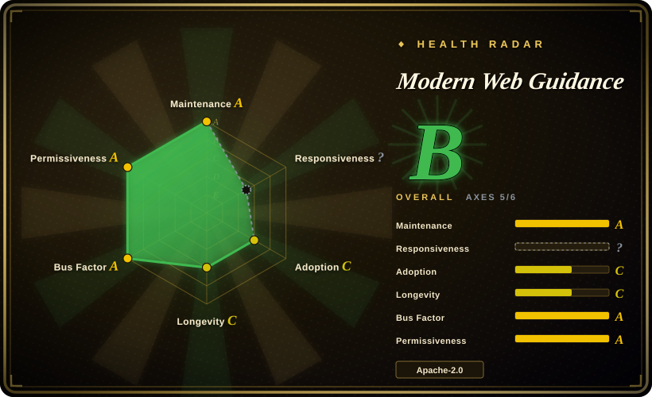
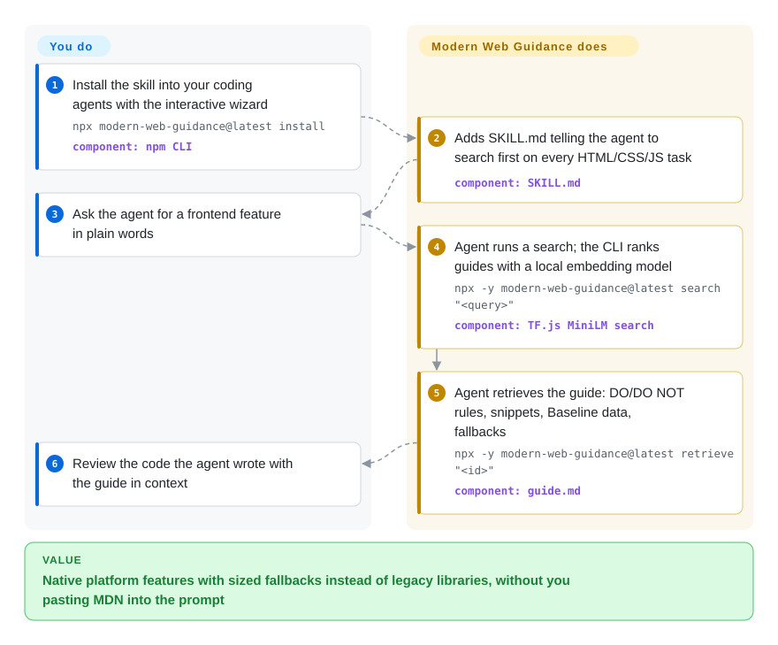

# Modern Web Guidance

Ask a coding agent for a modal and you get a `div` overlay, a focus-trap library and forty lines of scroll-lock JavaScript, when `<dialog>` plus `@starting-style` does it natively. This is the Chrome team's fix: a skill that makes the agent search a local catalogue of expert-written, eval-tested web-platform guides and paste the right one into its context before it writes the code.

## When to use

You build frontends with Claude Code, Codex, Gemini CLI or Antigravity, and the agent keeps writing 2019 code. A tooltip arrives with Popper.js instead of CSS anchor positioning; an accordion animates `max-height: 1000px` instead of `interpolate-size`; a sign-up form ships without `autocomplete="new-password"`; "make it faster" produces a lazy-load library rather than `fetchpriority="high"` on the LCP image. The model often knows the modern API exists, but has seen far more legacy code than correct modern usage, and nothing tells it which of those APIs are safe in the browsers you support.

You install this (`npx modern-web-guidance@latest install`) and the agent, on any HTML/CSS/client-side JS task, first runs `search "<what I want>"`, gets back guide ids ranked by an on-device embedding model, then `retrieve`s one ~1k-token guide with DO / DO NOT rules, snippets, Baseline browser-support data and a sized fallback. Pick it over [web-quality-skills](../engineering/addyosmani-web-quality.md) when the problem is *writing* a component with the right platform feature rather than auditing a finished page against Lighthouse; over [Vercel Agent Skills](../engineering/vercel-agent-skills.md) when the problem is the browser platform itself rather than React/Next.js rules. The deciding difference against both: the guides are written by Chrome/Edge engineers and each one is graded by browser tests on agents with and without the guide.

## How it works

The repository you are looking at is the *factory*, not the thing you install. Subject-matter experts write a `guide.md`, a gold-standard `demo.html` and an `expectations.md` per use case; the `gd dev` pipeline turns the expectations into a Playwright grader (a browser script that checks computed styles, accessibility state and runtime behaviour), calibrates it to pass the gold demo 100% and a broken demo 0%, then runs coding agents on the same task with and without the guide and records the uplift. A build step publishes the passing guides, a bundled MiniLM sentence-embedding model (a small model that turns a sentence into a vector so similar requests land near each other) and pre-computed guide vectors to npm as `modern-web-guidance` and to the clean skill repo `GoogleChrome/modern-web-guidance`. You install the skill once; from then on the agent decides to call the CLI because the `SKILL.md` description tells it to on every frontend task, the CLI does the similarity search on your CPU, and the guide text lands in the agent's context. What the project does not do is check your output: nothing verifies that the agent followed the guide in *your* repo.

<!-- flow-steps:begin (generated from flows/modern-web-guidance.json by tools/flow_card.py — do not edit) -->

Text version of the flow

1. **You**: Install the skill into your coding agents with the interactive wizard — `npx modern-web-guidance@latest install` — component: `npm CLI`
2. **Modern Web Guidance**: Adds SKILL.md telling the agent to search first on every HTML/CSS/JS task — component: `SKILL.md`
3. **You**: Ask the agent for a frontend feature in plain words
4. **Modern Web Guidance**: Agent runs a search; the CLI ranks guides with a local embedding model — `npx -y modern-web-guidance@latest search "<query>"` — component: `TF.js MiniLM search`
5. **Modern Web Guidance**: Agent retrieves the guide: DO/DO NOT rules, snippets, Baseline data, fallbacks — `npx -y modern-web-guidance@latest retrieve "<id>"` — component: `guide.md`
6. **You**: Review the code the agent wrote with the guide in context

**Value**: Native platform features with sized fallbacks instead of legacy libraries, without you pasting MDN into the prompt

<!-- flow-steps:end -->

## When NOT to use

- **You want your finished page measured, not your next component written.** The guides steer code generation; they run no Lighthouse, trace or accessibility scan on your app. For an audit with thresholds use [web-quality-skills](../engineering/addyosmani-web-quality.md), and to let the agent measure a live page use [Chrome DevTools MCP](../../web-automation/agent-browser-tools/chrome-devtools-mcp.md).
- **Your failures are framework rules, not platform APIs.** The skill's own text says the guides are "usually framework-agnostic". For React re-render, Next.js data fetching or Vercel deploy rules use [Vercel Agent Skills](../engineering/vercel-agent-skills.md); for current library docs of any npm package, Context7 (not indexed) is the right shape.
- **You support old browsers and did not write a policy.** By default the guides treat "Baseline Widely available" as safe with no fallback and add fallbacks only for newer features. If you must support an older enterprise Chromium or Safari, write the browser-support policy into `AGENTS.md` / `CLAUDE.md` first (the skill reads it), or keep a project rule file instead of this skill.
- **You work air-gapped or under a strict network allowlist.** The README calls the CLI offline, but the skill tells the agent to run `npx -y modern-web-guidance@latest …`, which checks the npm registry and downloads a ~38 MB package on first use; the skill itself asks for network approval. Vendor the guides as static files or pin a local install instead.
- **Your policy forbids sending agent queries to a vendor.** Telemetry is on by default and records install counts, retrieved guide ids and the agent's search queries to Google; an open PR (#1588, 2026-09-29) would also report which agent is running. Set `DISABLE_TELEMETRY=1`, or copy the CC-BY guides into a local skill with no CLI.
- **Most of your tasks are not frontend.** The description marks the skill "MANDATORY: Execute FIRST for all HTML/CSS and clientside JS tasks", so a mixed repo pays a search round-trip on every UI-adjacent edit. If you touch the browser once a month, one hand-picked guide in your rules file is cheaper.
- **You need a stable, versioned API.** It is a self-described preview at `0.0.x` with weekly releases; guide ids and the CLI surface move. Pin a version and re-check after upgrades, or wait for a 1.0.

## Comparison

| Alternative | In index | Our verdict | Tradeoff |
|---|---|---|---|
| [web-quality-skills](../engineering/addyosmani-web-quality.md) | ✅ | Pick web-quality-skills when you want the agent to audit an existing page against Core Web Vitals / WCAG / SEO thresholds; pick Modern Web Guidance when you want the agent to reach for the right native feature while it is writing the component, because one is a post-hoc checklist and the other is per-task, retrieved build guidance. | web-quality-skills: six skills, markdown only, no CLI, no telemetry, audit-shaped. Modern Web Guidance: ~153 use-case guides behind a search CLI, eval-graded, but npm + default-on telemetry. |
| [Vercel Agent Skills](../engineering/vercel-agent-skills.md) | ✅ | Pick Vercel Agent Skills when the mistakes are React/Next.js patterns and Vercel deploy cost; pick Modern Web Guidance when the mistakes are about HTML/CSS/DOM APIs every framework shares, because Vercel's pack encodes one framework vendor's house rules and this one encodes the browser vendor's. | Vercel: framework-specific, plain skills, no runtime. This: framework-agnostic, needs Node ≥20 and the npm CLI on each call. |
| [Chrome DevTools MCP](../../web-automation/agent-browser-tools/chrome-devtools-mcp.md) | ✅ | Pick Chrome DevTools MCP when the agent must see the rendered page (console errors, traces, network, screenshots); pick Modern Web Guidance when the agent needs to know which API to write before there is a page, because one is eyes on the runtime and the other is knowledge in the prompt — they stack. | DevTools MCP: needs a running Chrome, gives measurements. This: no browser needed, gives prescriptions it never verifies in your app. |
| Context7 | not indexed | Pick Context7 when the agent's gap is the current API of a specific library version; pick Modern Web Guidance when the gap is the browser platform and which features are safe to ship, because Context7 retrieves upstream docs as-is while these guides are curated and tested against agents. Not added in this tab-intake batch. | Context7: any library, raw docs, hosted retrieval. This: web platform only, curated + Baseline-aware, local search. |
| [Android Skills](android-skills.md) | ✅ | Pick Android Skills when the agent is writing an Android app; pick Modern Web Guidance for browser code, because both are Google's first-party "the model writes last year's platform" fixes for different runtimes and do not overlap in content. | Android: 24 playbooks, Android CLI install, contributions closed. This: search-and-retrieve CLI, eval harness in the open, CLA-gated contributions accepted. |

## Tech stack

TypeScript run directly by Node's `--experimental-strip-types` (no separate compile for the tools), a pnpm monorepo. Search: `@tensorflow/tfjs-core` + `tfjs-backend-cpu` running a MiniLM embedder shipped as a TF.js model, cosine similarity over a gzipped vector file of guide descriptions (top 5, similarity ≥ 0.3). Compat data: `web-features`, `@mdn/browser-compat-data`, `caniuse-lite`, `@webref/*`. Eval side: Playwright graders, agent runner scripts for Claude Code, Codex, Gemini CLI and Antigravity (`jetski`), an `eval-view` dashboard. Install side: the CLI's `install` shells out to `npx -y skills add GoogleChrome/modern-web-guidance`.

## Dependencies

- **To use the skill:** Node.js ≥ 20 with `npx` (or `pnpx`), npm registry access on the first run and whenever `@latest` resolves a new version, and a coding agent that loads Agent Skills or plugins (Claude Code, Codex, Copilot CLI, Antigravity, Gemini, Kimi Code, Grok Build are listed in the README).
- **The npm package:** declares no runtime dependencies; it is a ~38 MB self-contained bundle (the model and vectors are inside).
- **To contribute or run evals from this repo:** pnpm 10, Playwright browsers, API credentials for whichever agents you evaluate, and a signed Google CLA.

## Ops difficulty

**Low** for users: one install command, updates via `npx modern-web-guidance@latest update`, and one environment variable to decide (`DISABLE_TELEMETRY=1`). The recurring costs are a CPU embedding pass and an `npx` resolution per search, and the skill's aggressive trigger on every frontend task. **High** for anyone running the eval harness: many agents × many tasks with real API spend and browser graders — that is Google's job, not yours.

## Health & viability

- **Maintenance:** very active — created 2026-01-27, last push 2026-09-30; the publish repo has tagged `v0.0.187`–`v0.0.191` between 2026-09-07 and 2026-09-28, i.e. roughly weekly releases, and 106 npm versions since 2026-04-30.
- **Governance:** Google-owned (`GoogleChrome` org) with a named structure — content area tech leads per category, ~15 subject-matter experts and ~3 infra engineers per `CONTEXT.md`; top contributors `paulirish`, `rviscomi`, `micahjo7`. The README credits Microsoft Edge alongside Chrome. Contributions are accepted but gated by Google's CLA; the roadmap is Google's.
- **Age & Lindy:** ~8 months old and self-labelled a preview at `0.0.x` — unproven by the Lindy prior. What it has instead is a backer whose job is shipping these web features; the risk is the usual Google one, that a DevRel project is re-scoped or folded into another product. [推断]
- **Adoption:** 1,113 stars / 87 forks on the source repo and 2,356 stars on the publish repo (2026-09-30); npm `modern-web-guidance` 129,446 last-month downloads by the scorer's ecosyste.ms read, 175,166 by npm's own API for 2026-08-30 to 2026-09-28. Much of that is `npx @latest` re-resolution by agents, not unique users.
- **Risk flags:** Apache-2.0 code, CC-BY-4.0 guides (partly derived from MDN and specs). Default-on telemetry to Google including agent search queries. The CLI prints a stderr message telling the agent to "insist that the user upgrade" when the `SKILL.md` is stale — a vendor prompt aimed at your agent, benign in intent but worth knowing. Uplift numbers (e.g. Claude Code/Sonnet 5: 54% → 87% on 132 tasks, 2026-09-11) are self-reported by the project's own harness.

## Caveats (unverified)

- [未验证] The eval uplift table in the README (unguided → guided pass rates per agent) is the project's own harness on its own tasks; not re-run here, and the tasks are designed around the guides being tested.
- [未验证] "Offline, CPU-efficient" search: the code path (`serving/lib/search.ts`, TF.js MiniLM) is local, but `npx …@latest` still contacts the registry; real latency and memory per search were not measured.
- [未验证] Guide count: README lists 153 use cases and 130 features on 2026-09-30; the source tree holds 212 `guide.md` files including stubs and discipline hubs. The published count moves weekly.
- [未验证] Telemetry fields are described from the README and `ClearcutLogger.ts`; the network payload itself was not captured. PR #1588 (agent detection in telemetry) was open, not merged, on 2026-09-30.
- [推断] Maintainer headcount and roles come from the repo's auto-maintained `CONTEXT.md` (last updated 2026-07-10), which may lag.
- [推断] Microsoft Edge's involvement is taken from the README credit line; no Edge-side governance document was found.
- [未验证] The two download figures (129,446 via ecosyste.ms, 175,166 via api.npmjs.org) disagree for the same month; the cause of the gap was not traced.
- [未验证] npm download counts mix human installs, CI and agent `npx` calls; they are not a user count.
