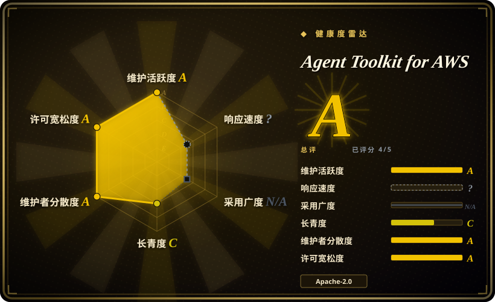
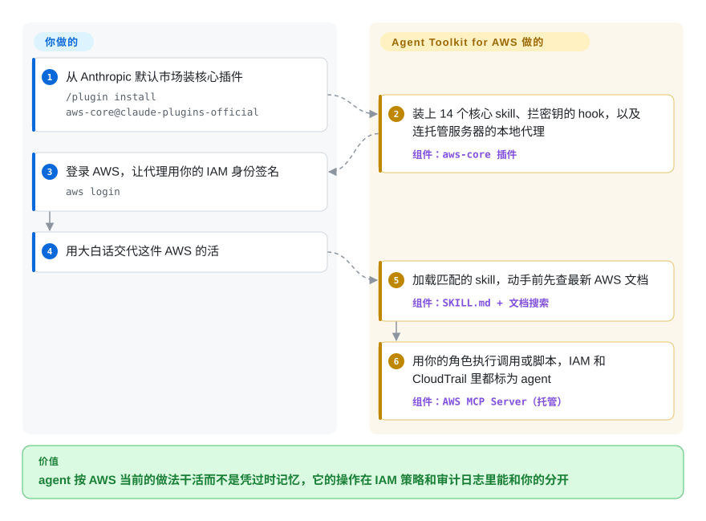

# Agent Toolkit for AWS

你要用的 AWS 服务比 agent 的训练数据新，于是它瞎编 CLI 参数、该用 Durable Functions 的地方硬写 Step Functions，而 CloudTrail 里它发起的调用和你自己的操作分不出来。这是 AWS 官方的安装包，把“瞎猜”和“分不清是谁干的”一起解决：约 114 份 AWS 写的任务剧本按需加载，再接上一个 AWS 托管的端点——它按最新文档回答，并用你的 IAM 角色执行 agent 的调用，每一笔都打上“这是 agent”的标记。

## 何时使用

你是开发者或平台工程师，你的 agent（Claude Code、Codex、Cursor、Kiro、fx）在真实的 AWS 账号里干活：一个 Lambda + API Gateway 服务、一套 CDK 栈、一次 Aurora 迁移、一轮成本审计。总有两件事出错。一是 agent 过时：让它做长时间运行的工作流，它直接手写 Step Functions 状态机，提都不提 Lambda Durable Functions；让它压 Lambda 成本，它根本不知道有 Lambda Managed Instances。二是安全团队在 CloudTrail 里分不清哪一次 `DeleteStack` 是你点的、哪一次是 agent 干的，所以除了沙箱账号，它哪儿都不让 agent 碰。

想让 AWS 官方同时回答这两个问题时，选这个仓库。`/plugin install aws-core@claude-plugins-official` 给 agent 装上 14 个核心 skill（服务选型路由、CDK／CloudFormation、serverless、容器、数据库、可观测、账单、SDK、Well-Architected 评审），外加一条指向 AWS 托管 MCP Server 的 MCP 配置。这个服务器会给每次调用加上 IAM 条件键 `aws:ViaAWSMCPService`／`aws:CalledViaAWSMCP`，你可以在同一个角色上写“agent 只许读”的策略。它胜过前身 [Agent Plugins for AWS](aws-agent-plugins.zh.md)（AWS 已称其被取代），也胜过自己拼 `awslabs/mcp` 的各个服务器：只有这条路径带来 agent 与人的 IAM 区分和 CloudTrail 归属，而且 AWS 声称这些 skill 做过端到端评测。

## 怎么用起来

仓库里放的是装到你机器上的部分；真正干活的 **AWS MCP Server** 是 AWS 托管的端点（`https://aws-mcp.us-east-1.api.aws/mcp`），代码不在本仓库。*skill* 是一个目录：一份 `SKILL.md`（先是一段描述，agent 拿它和你的请求比对，然后是编号步骤），加上需要时才读的 `references/`，所以只在任务用得上时才占上下文。*插件*把一组 skill 和一份 MCP 配置打包在一起；这份配置会启动 `mcp-proxy-for-aws-cli`——一个本地小代理，用你的 AWS 凭证给每个请求签名（SigV4，即 AWS 的请求签名方案），再转发给托管服务器。在 Claude Code 里，`aws-core` 还会装一个 hook（每次工具调用前先跑的脚本），拦下 `secretsmanager get-secret-value`，让密钥不进对话。工具包替你做的：把任务路由到对应 skill、查最新 AWS 文档、在 AWS 的沙箱里执行你的调用或 Python 脚本（`run_script`）。留给你的：给 agent 的 IAM 角色（请收窄权限，它能做什么，工具包就能做什么）、区域，以及任何改动上生产前的审查。打个比方：它是一本操作手册加一台门禁刷卡机——手册告诉 agent 活怎么干，刷卡机让它开过的每扇门在日志里都记成“agent”。

<!-- flow-steps:begin (generated from flows/agent-toolkit-for-aws.json by tools/flow_card.py — do not edit) -->

流程文字版

1. **你**：从 Anthropic 默认市场装核心插件 — `/plugin install aws-core@claude-plugins-official`
2. **Agent Toolkit for AWS**：装上 14 个核心 skill、拦密钥的 hook，以及连托管服务器的本地代理 — 组件：`aws-core 插件`
3. **你**：登录 AWS，让代理用你的 IAM 身份签名 — `aws login`
4. **你**：用大白话交代这件 AWS 的活
5. **Agent Toolkit for AWS**：加载匹配的 skill，动手前先查最新 AWS 文档 — 组件：`SKILL.md + 文档搜索`
6. **Agent Toolkit for AWS**：用你的角色执行调用或脚本，IAM 和 CloudTrail 里都标为 agent — 组件：`AWS MCP Server（托管）`

**价值**：agent 按 AWS 当前的做法干活而不是凭过时记忆，它的操作在 IAM 策略和审计日志里能和你的分开

<!-- flow-steps:end -->

## 何时不用

- **你的云不是 AWS，或者你要厂商中立的建议。** 每个 skill 都路由到 AWS 服务；`aws-startup-advisor` 插件自己的会话提示词就写着推荐的选择“通常是 AWS 服务”。Azure 用微软的 `microsoft/azure-skills`（未收录）；要写云可移植的 Terraform，用 HashiCorp 的 `hashicorp/agent-skills`（未收录）。核心 skill 的 IaC 只覆盖 CDK 和 CloudFormation，Terraform 核心 skill 还是一个未关闭的请求（issue #115）。
- **agent 的流量或源码不能发往 AWS 托管服务。** 文档搜索、运行时取 skill、`run_script` 和 API 执行全部经过托管端点；`mcp-proxy-for-aws` 默认采集遥测，除非带 `--disable-telemetry` 启动（`aws-core` 自带的配置没加）。在隔离网络或严格出网管控的环境里，只装 skill（`npx skills add aws/agent-toolkit-for-aws/skills`），删掉 MCP 配置，让 agent 用你自己的 AWS CLI；或者自托管 `awslabs/mcp`（未收录）里的开源服务器。
- **同一个 harness 里有很多和 AWS 无关的项目。** `aws-core` 会被“deploy”“function”“storage”“container”这类常见词触发，在非 AWS 仓库里也会（issue #310，截至 2026-10-01 未关闭），把 AWS 的上下文和护栏塞进无关工作。按项目启用，别全局装；或者只装你需要的专项 skill。
- **你要中立的创业建议。** `aws-startup-advisor` 会注入一段 SessionStart 提示词，在推荐下面最多追加一条带追踪参数的 AWS Activate 合作伙伴优惠链接（`?source=ide-startupAdvisor-claude`），这让它成了厂商的销售面。只用 `aws-core`；架构讨论用云中立的方法论，例如 [Superpowers](../../../agent-dev-methodology/coding-agent-harnesses/superpowers.zh.md)。
- **你要硬保证，不是指导。** skill 是 agent 可以跳过的 Markdown，而且它自己也会错：`aws-cloudformation` skill 曾让 agent 给 `describe-events` 传一个不存在的 `--change-set-id` 参数（issue #83，已修复）。真正强制的只有 Secrets Manager 那个 hook（仅 Claude Code，基于正则，5 秒超时即放行）和你挂上的 IAM。如果要求是“agent 绝不能写生产”，请用只读角色或代理的 `--read-only` 参数来保证，别指望这个包。
- **团队已经统一用 AWS Labs 的插件。** 如果你们在用 [Agent Plugins for AWS](aws-agent-plugins.zh.md)（`deploy-on-aws`、`aws-serverless` 等），再装 `aws-core` 就会有两套重叠的 AWS skill 路由。二选一；AWS 说本工具包是继任者。
- **你想往上游贡献 skill。** CONTRIBUTING 写着“目前不接受外部代码贡献”，只收 issue。自己的 AWS skill 放在自己的仓库里。

## 横向对比

| 替代品 | 是否收录 | 我们的评价 | 取舍 |
|---|---|---|---|
| [Agent Plugins for AWS](aws-agent-plugins.zh.md) | ✅ | 新的 AWS agent 工作选本工具包；只有团队已经依赖它九个领域插件之一（Amplify、SageMaker、Location）时才保留 AWS Labs 插件，因为 AWS 点名本仓库为继任者，且只有它带 agent 与人区分的 IAM 条件键。 | AWS Labs：按领域拆插件，要自己跑多个 MCP 服务器，接受贡献，只有一个 `1.0.0` tag。工具包：一个托管端点、约 114 个 skill、CloudTrail 归属，但不收外部 PR。 |
| AWS MCP 服务器（`awslabs/mcp`） | 未收录（本批次未添加） | 必须让每个 MCP 服务器都跑在自己机器或 VPC 里时选 `awslabs/mcp`；能接受带审计的托管端点时选本工具包，因为开源服务器只给数据源，不给整理好的 skill。 | 自托管、许多单一用途的服务器（约 9.7k star），由你组装和打补丁。工具包：零服务器要运维，但每次调用都经过 AWS 运营的服务。 |
| Azure Skills（`microsoft/azure-skills`） | 未收录（本批次未添加） | 负载在 Azure 上就选微软的包；只有 AWS 才选本包，因为每家厂商的 skill 都路由到自家服务，换个云就没用。 | 形态相同（一个插件里装 skill 和 MCP 配置），云不同。两者装在同一 harness 里，一句“deploy”会让两套路由同时触发。 |
| HashiCorp Agent Skills（`hashicorp/agent-skills`） | 未收录（本批次未添加） | IaC 用 Terraform 时，搭配或换成 HashiCorp 的 skill；本工具包的核心 IaC skill 教的是 CDK 和 CloudFormation，Terraform 团队从它这里得到的写法指导是错的。 | HashiCorp：Terraform／Vault 深度，云可移植。工具包：AWS 服务深度，除创业插件外 IaC 只有 CDK／CloudFormation。 |
| [Claude Plugins（官方）](../agent-vendors/claude-plugins-official.zh.md) | ✅ | 在 Anthropic 的官方市场里按名字装 `aws-core`、`aws-agents`、`aws-data-analytics` 或 `aws-agents-for-devsecops`；只有要装 `aws-startup-advisor`，或用 Codex／Cursor 时，才把本仓库加成 marketplace，因为这些路径从这里分发。 | 官方市场是目录；本仓库是其中四个 AWS 条目背后的源。内容相同，安装入口不同。 |

## 健康度与可持续性

- **响应度：** skill-pack 不评分（`type_na`）。
- **维护——非常活跃。** 2026-10-01 经 GitHub API 核实：最后推送 2026-10-01，近 13 周每周都有提交（每周 5～28 个），共 59 个 issue、其中 28 个已关闭，合并 PR 276 个。没有 git tag 也没有 GitHub release：插件只有清单里的版本号（`aws-core` 1.1.0），安装跟随 `main`。
- **治理与背书——单一厂商，团队所有。** 归 `aws` 组织；CODEOWNERS 是 `@aws/agent-toolkit-admins`，外加各插件对应的 AWS 服务团队（AgentCore、DevSecOps、创业团队）；贡献者 100 人以上，头号贡献者 34 次提交。路线图由 AWS 定，外部代码 PR 不收。
- **年龄与 Lindy——年轻，但定位为继任者。** 创建于 2026-04-23（约 5 个月），按年龄拿不到 Lindy 分。抵消因素：AWS 把它点名为 AWS Labs MCP 服务器和插件的继任者，配了 docs.aws.amazon.com 上的文档和一条 AWS CLI 命令（`aws configure agent-toolkit`）。不过 AWS 一年内已经搬过一次 agent 工具链（AWS Labs → 本仓库）。[推断]
- **采用（雷达 N/A）。** 评分器找不到可度量的包仓库安装渠道（`no_install_channel`）。可见信号：约 2.8k star／339 fork（2026-10-01），四个插件列在 Anthropic 默认自带的 `claude-plugins-official` 市场里，这是它最主要的触达渠道。整体雷达 **A（5 个适用轴评到 4 个）**，长寿轴因年龄为 C。
- **风险标记。** Apache-2.0，无改协议记录。干活的那一半是 AWS 托管服务，行为可能在服务端变化而本仓库没有任何提交。代理默认采集遥测。创业插件带追踪参数的合作伙伴优惠链接。按 AWS 文档本身免费，你为 agent 碰到的资源付费。

## 存疑（未验证）

- [未验证] skill 数量（`skills/` 下 114 个 `SKILL.md`：25 个核心 + 89 个专项；`aws-core` 内含 14 个核心 skill）是 2026-10-01 在 commit `ec0fa3de` 上的目录快照，集合会随 `main` 变化。
- [未验证] IAM 条件键 `aws:ViaAWSMCPService`／`aws:CalledViaAWSMCP`、CloudTrail 记录、“不额外收费”的定价，以及托管工具清单（`retrieve_skill`、`search_documentation`、`run_script` 等）均来自 2026-10-01 读到的 AWS 用户指南，没有在真实账号上实测。
- [未验证] `aws-core` 的 README 仍列出 `call_aws` 工具，而用户指南的工具清单（2026-10-01）里没有；线上服务器实际暴露哪个名字没有核对。
- [未验证] “代理默认采集遥测”来自 `aws/mcp-proxy-for-aws` 的 README（`--disable-telemetry` 默认为 False）；采集了什么没有检查。
- [未验证] issue #310（`aws-core` 被常见词误触发）是用户报告，2026-10-01 仍未关闭；没找到维护者的复现。
- [推断] 合作伙伴优惠行为读自 `plugins/aws-startup-advisor/com.anthropic.claude-code/hooks/offer-context.txt`；实际会话里优惠出现的频率没有观察。
- [推断] “AWS 已经搬过一次 agent 工具链”是把 README 的继任者表述和 AWS Labs 仓库的年龄合起来得出的；本工具包自身是否稳定属于前瞻判断。
- [未验证] `main` 上有一个标题为“[DO NOT MERGE] …”的提交（`711f583f`，2026-10-01）；它是否本应发布没有核实，而安装跟随 `main`。
