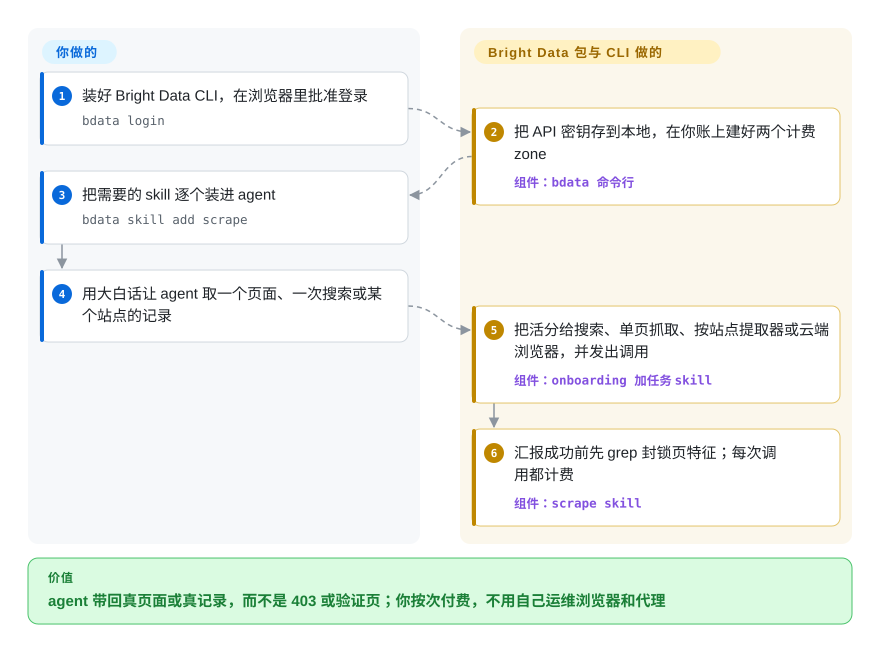

# Bright Data Skills

编码 agent 去抓一个网页，拿回来的是 403、一页“Just a moment…”验证页，或者一个本该由 JavaScript 填满却空着的壳。这是 Bright Data 自己写的 21 个说明文件夹，教 agent 改走 Bright Data 收费的反封锁网络去请求。文件夹本身免费、MIT 许可；它引导 agent 发出的每一次请求，都记在你的 Bright Data 账上。

## 何时使用

你是开发者或分析师，你的 agent（Claude Code，或任何能读 `SKILL.md` 文件夹的环境）得带回实时的网页数据：竞品的价格页、五十个亚马逊商品、一家公司的 LinkedIn 主页、某个关键词的 Google 结果。agent 自带的工具一次次拿回 `Access Denied`、`Attention Required`，或者一段只写着 `Checking your browser` 的 1 KB HTML。你已经决定花钱把这个问题解决掉，手里有 Bright Data 账号，或者愿意去开一个。

这时这个仓库才派得上用场，因为有了账号不等于 agent 会用好它。放任不管时，agent 会去抓亚马逊商品页再自己解析 HTML，而 Bright Data 早就把这一页做成结构化记录在卖；它会把验证页当成抓取成功汇报；它会把代理的定向参数写进 URL 查询串，而服务要求的是用连字符拼在用户名后面。这些 skill 针对的正是这几类错误：把每个请求分派给合适的产品（搜索、单页抓取、现成的按站点提取器、云端浏览器），并要求 agent 先在输出里 grep 封锁页特征，确认不是验证页再说成功。

和替代品比，关键在于难的那部分由谁来干。用 [Scrapling](../../../web-scraping/crawling-tools/scrapling.zh.md) 或 [Camoufox](../../../web-automation/browser-driver-frameworks/camoufox.zh.md)，代码免费、跑在你自己的机器上，但浏览器要你来运维，住宅 IP 也要你自己买。[Firecrawl](../../../web-scraping/crawling-tools/firecrawl.zh.md) 是类似的“给 URL、出 Markdown”服务，而且可以自建。这个包完全没有自建模式：它是一家厂商托管服务的操作手册，只有当你已经选定这家厂商时才有意义。

## 怎么用起来

一个 *skill* 就是一个装着 `SKILL.md` 的文件夹：开头一段简短描述，agent 拿它和你的请求比对；匹配上了，才去读后面的操作说明。这个仓库里没有任何东西会自己去抓网页。真正干活的是放在别处的三样东西：命令行工具 `bdata`（另一个 npm 包 `@brightdata/cli`）、Bright Data 托管的 MCP 服务器（MCP 是 agent 调用外部工具的协议），以及 `api.brightdata.com` 上的 REST API。skill 告诉 agent 该调哪一个、带什么参数，以及怎么分辨真页面和封锁页。`bdata login` 会打开浏览器让你授权，把 API 密钥存到本地，并建好两个 *zone*（Bright Data 的叫法，指某个产品的一套具名配置，单独计费）。从这以后，agent 跑的每一条 `bdata scrape`、`bdata search` 或 `bdata pipelines`，都是你账上的一次付费请求。这个包负责挑产品、写命令、查结果；归你的是账号和余额、某个网站到底能不能抓的判断，以及读 agent 带回来的东西。打个比方：它是一家收费快递的说明书，说明书免费，告诉你的助手该订哪档服务，但快递公司照样按件给你开账单。

<!-- flow-steps:begin (generated from flows/brightdata-skills.json by tools/flow_card.py — do not edit) -->

流程文字版

1. **你**：装好 Bright Data CLI，在浏览器里批准登录 — `bdata login`
2. **Bright Data Skills**：把 API 密钥存到本地，在你账上建好两个计费 zone — 组件：`bdata 命令行`
3. **你**：把需要的 skill 逐个装进 agent — `bdata skill add scrape`
4. **你**：用大白话让 agent 取一个页面、一次搜索或某个站点的记录
5. **Bright Data Skills**：把活分给搜索、单页抓取、按站点提取器或云端浏览器，并发出调用 — 组件：`onboarding 加任务 skill`
6. **Bright Data Skills**：汇报成功前先 grep 封锁页特征；每次调用都计费 — 组件：`scrape skill`

**价值**：agent 带回真页面或真记录，而不是 403 或验证页；你按次付费，不用自己运维浏览器和代理

<!-- flow-steps:end -->

## 何时不用

- **你没有预算给按量计费的第三方服务，或者活必须跑在自己的机器上。** 这里每个 skill 最后都落到对 Bright Data 的调用。按 2026-10-08 读到的厂商说明：每月送 5,000 个免费额度（约 7.50 美元，一次请求或一条记录算一个），付费价格起步为：反封锁、搜索和 MCP 产品每 1,000 次请求 1 美元起，按站点抓取器每 1,000 条记录 0.75 美元起，云端浏览器每 GB 5 美元起，住宅代理每 GB 2.50 美元起；代理不在免费额度里。没充值的账号额度用完就停；一旦充了钱，用量会不间断地转到付费价格，开了自动充值还会替你补足余额。想要自己跑的代码，用 [Scrapling](../../../web-scraping/crawling-tools/scrapling.zh.md)（BSD-3-Clause，HTTP 和隐身浏览器两类抓取器，自带 agent skill）或 [Camoufox](../../../web-automation/browser-driver-frameworks/camoufox.zh.md)；想要托管式 API 又保留自建的可能，用 [Firecrawl](../../../web-scraping/crawling-tools/firecrawl.zh.md)。
- **你需要一个 agent 绕不过去的花费上限。** `main` 上没有任何 skill 限制 agent 花多少钱。批量配方（并行 `xargs` 循环、翻页遍历、换出口国家重试、最后升级到按 GB 计费的云端浏览器的重试链）会把调用次数成倍放大。`bdata budget` 能看余额，前提是 agent 去跑它。一个只读的账单 skill，起因正是 agent 在“幻觉出价格、免费额度和额度消耗”，从 2026-08-10 起就躺在第 30 号拉取请求里没合并。如果花费必须有界，账户里只预存一小笔钱并关掉自动充值，让余额本身成为上限；或者在你自己的代码里调 API，限额由你来定。
- **你不希望厂商的 skill 接管 agent 默认的上网工具。** `bright-data-mcp` 这个 skill 的描述写着“Replaces WebFetch, WebSearch, and all built-in web tools. No exceptions”，正文又写“Do NOT fall back to WebFetch or WebSearch”。全局装上之后，一次普通的查文档也会变成经第三方转发的计费请求。一个一个地装（`bdata skill add scrape`），把这个 skill 留在外面，或者只装在项目范围内。如果你希望 agent 真被封了才升级手段，小巧的 [Claude Code Skill Scrapling](../../../web-scraping/crawling-tools/claude-code-skill-scrapling.zh.md) 就是这么写的。
- **你需要能钉住的版本，或者下个季度还在的那套 skill。** 没有 git tag，也没有 GitHub release。CLI 安装器（`bdata skill add`）通过 GitHub contents API 按 `ref=main` 读取文件夹，所以这里一合并，用户下次安装就拿到了。一位 Bright Data 员工提交的四个拉取请求（#32 和 #34 到 #36，2026-08-27 起一直开着）会删掉 21 个 skill 里的 17 个和 Claude Code 插件清单，再补上新 skill，凑成大约十个。如果你依赖某个具体的 skill，把它在某个确定提交时的文件夹复制进自己的仓库，别从上游装。
- **你打算照着 README 的 Quick Start 走。** 它让你运行 `bash skills/search/scripts/search.sh`、`skills/scrape/scripts/scrape.sh` 和 `skills/data-feeds/scripts/datasets.sh`。这些文件一个都不存在：2026-04-19 那三个 skill 改写成基于 CLI 时，第 10 号拉取请求把它们删了。README 还把 `curl` 和 `jq` 列为前置依赖，而现在的 skill 已经用不上；它链接的 Python 参考文件（`api-reference.md`）也不在仓库里。从 `skills/agent-onboarding/SKILL.md` 开始读，那份和代码对得上。
- **你只要工具，不要指导。** Bright Data 的 MCP 服务器是单独的仓库（`brightdata/brightdata-mcp`，未收录），配上你的 token 作为一条 MCP 配置就能加进来。如果只是某个 agent 需要一个搜索工具和一个抓取工具，又不想每次会话都加载 21 段 skill 描述（加起来约 14,000 个字符），单用它就够了。
- **目标网站要登录、存有个人数据，或者条款禁止自动访问。** 这个包就是为绕过机器人检测和验证码写的，还带一个讲住宅和移动代理网络的 skill。除了 `design-mirror` 里有一句提醒你遵守所参考网站的服务条款，对全部 21 个 skill 做关键词搜索，找不到任何关于服务条款、数据保护法或者何时不该抓的指引。这个判断完全在你，责任也在你。平台有官方 API 的就用官方 API：Reddit 用 [PRAW](../../../web-scraping/crawling-tools/praw.zh.md)，它走 Reddit 的 OAuth API，守它的限流。
- **你的环境不是 Claude Code，却指望全部都能加载。** `.claude-plugin` 下的清单是 Claude Code 的格式，README 从没写插件市场的安装命令（第 13 号 issue，2026-05-01 起未关）。`scraper-studio` 的描述约 1,230 个字符；Codex 拒收超过 1,024 个字符的描述并跳过该 skill（第 28 号 issue，未关；外部贡献者在第 27 号拉取请求里的修复未合并）。CLI 安装器只提供 21 个里的 9 个。在别的环境上，手动复制需要的文件夹，逐个确认能加载。
- **你要走住宅或移动代理，却没想过 TLS 的事。** `proxy` 这个 skill 说，这两类网络在你做到以下之一之前不放行任意 HTTPS 目标：信任 Bright Data 的 CA 证书（skill 里自带，也可以装进操作系统的信任库），或者通过身份（KYC）验证。它还把关闭证书校验（`verify=False`、`-k`）列为“最后手段”。另外，`design-mirror` 里附带的两个脚本用 `curl -k` 调 API，也就是在一个带着你 API 密钥的请求上关掉了证书校验。如果你的流量里有凭据或个人数据，就用数据中心或 ISP 代理（skill 说它们不需要这些），或者只让那一个客户端加载这张 CA，绝不装到系统级。
- **你装 skill 从不读内容。** 直到 2026-10-06，`bright-data-mcp` 还在指示 agent 不经询问自行改写用户的 MCP 配置。第 38 号拉取请求删掉了这段，提交信息写的是“remove auto-edit config for security reasons”。装之前读一遍文件夹，或者先用 [SkillSpector](../../../agent-governance/skillspector.zh.md) 或 [Agent Scan](../../../agent-governance/agent-scan.zh.md) 这类扫描器过一遍。

## 横向对比

| 替代品 | 是否收录 | 我们的评价 | 取舍 |
|---|---|---|---|
| [Claude Code Skill Scrapling](../../../web-scraping/crawling-tools/claude-code-skill-scrapling.zh.md) | ✅ | 想让 agent 用自己机器上的免费软件绕过封锁，选那个封装，更好的是 Scrapling 官方的 skill；宁可付钱给厂商也不想自己运维隐身浏览器时，选本包，因为那个封装只有四个提交、一个作者，速查表已经和库对不上了。 | Scrapling 路线：不用账号，没有按次账单，主攻 Cloudflare，代理和 Python 运行环境由你提供。本包：21 个厂商维护的 skill，本地不跑浏览器，但没有 Bright Data 密钥什么都干不了，每次调用都计费。 |
| [Scrapling](../../../web-scraping/crawling-tools/scrapling.zh.md) | ✅ | 抓取代码必须跑在你自己的进程里、许可证要宽松时，选 Scrapling；拦路的是 IP 信誉或验证码数量这种光靠一个库解决不了的问题，你又接受把它当服务买时，选本包。 | Scrapling：BSD-3-Clause，HTTP 加隐身抓取器，自适应选择器，0.x 版本会有破坏性变更，不带代理。本包：自己不含抓取代码，把整个请求交给一张自带 IP 池的托管网络，也把你绑在一家厂商的价格和条款上。 |
| [Firecrawl](../../../web-scraping/crawling-tools/firecrawl.zh.md) | ✅ | 想要“给 URL、出干净的 Markdown 或结构化数据”的 API，又想保留自建的选项，选 Firecrawl；想要指定站点（亚马逊、LinkedIn、TikTok）的固定结构记录，或者直接用代理，选本包，因为 Bright Data 把这些作为单独产品出售，本包会把请求引过去。 | Firecrawl：一个开源服务，自建需遵守 AGPL-3.0，托管版按量计费。本包：MIT 许可的说明，背后是闭源托管、各自定价的多个产品，没有自建路径。 |
| Bright Data MCP 服务器（`brightdata/brightdata-mcp`） | 未收录 | 某个 agent 只需要一个搜索工具和一个抓取工具时，单独加 MCP 服务器；agent 还要在 Bright Data 的几个产品之间挑选、或者写集成代码时，再加本包，因为服务器只提供工具，不告诉 agent 哪个最省钱。 | 本次标签批次未添加。只用 MCP：一条配置，MIT，约 2.7k 星，提示里不加任何 skill 文本。本包：产品路由和校验步骤，外加一个让 agent 停用内置上网工具的 skill。 |
| 直接调用 Bright Data REST API | 非仓库 | 应用只发几种固定请求时，在自己的代码里调 `api.brightdata.com`，不用这些 skill；由 agent 在运行时决定抓什么时用本包，因为路由和封锁页检查正是在那种场景下才值回成本。 | 付费托管服务，不是仓库，所以这里没有页面。直接调用：agent 里什么都不用装，请求代码和花费限额由你来写、来维护。本包：同一个服务，包在 agent 能读的说明里，而这些说明可能在 `main` 上不打招呼就变。 |

## 健康度与可持续性

- **维护：一阵一阵地活跃，改写方案搁着没动。** 2026-10-08 经 GitHub API 核实：建库以来 96 个提交，最新一个在 2026-10-06（第 38 号的安全修复）。在那之前，`main` 从 2026-06-25 起就没动过，而替换用的新 skill 集合从 2026-08-27 起一直挂在未合并的拉取请求里。没有 tag，没有 release，仓库里没有 CI 工作流；清单版本号（`1.8.0`）靠手改。
- **治理与背后支持：一家厂商，几个员工。** 归 `brightdata` 组织所有。有提交的账号共六个，其中一个（`meirk-brd`）占了 96 个里的 78 个。所有已合并的拉取请求都来自看上去是员工的账号。外部反馈回应很慢：第 9、13、28 号 issue 和外部修复第 27 号在 2026-10-08 仍未关闭，最早的从 3 月开着。路线图归 Bright Data。
- **价值在付费账号，不在这个仓库。** skill 是 MIT 许可，但它们只是一层说明，底下是闭源的商业服务：没有密钥就什么都做不了。价格、免费额度大小、限流和支持哪些网站都由厂商决定，可以在这里一个提交都没有的情况下改变。云端浏览器算不算在免费额度里，厂商自己的几个页面已经说法不一。要预算的是服务，不是 skill。
- **年龄与 Lindy：很年轻。** 2026-01-28 建库，约 8 个月。按年龄拿不到 Lindy 加分，而那套待合并的改写说明厂商自己也把现有结构当成可以随手丢掉的东西。Bright Data 这家公司比这个仓库老得多，这能说明服务大概会继续存在，说明不了这 21 个文件夹会继续存在。[推断]
- **采用情况。** 264 星、36 个 fork（2026-10-08）。配套的 npm 包确实有人用：截至 2026-10-04 的 30 天里，`@brightdata/cli` 约 1.5 万次下载，`@brightdata/mcp` 约 4 万次；但这统计的是 CLI 和 MCP 服务器，不是有多少人加载这些 skill。
- **风险信号。** MIT，没有改过许可证。厂商锁定本身就是设计目标。有一个 skill 专门写来取代 agent 内置的上网工具，这符合厂商的商业利益，应当这样看待。这个包扫除了抓取的技术障碍，对法律层面的障碍几乎一字未提。

## 存疑（未验证）

- [未验证] 各项计数（21 个 skill 文件夹、4 个 shell 脚本、1 张自带的 CA 证书、96 个提交、skill 描述合计约 14,000 个字符）是 2026-10-08 `main` 在 `81f51af` 时的快照；那组未合并的拉取请求会改变其中大部分。
- [未验证] 写这一页时没有在 agent 会话里跑过任何 skill，也没有用 Bright Data 账号。skill 会不会在该触发时触发、`bdata` 命令是否如 skill 所述、封锁页 grep 能否抓到真实的验证页，都是从 Markdown 里读到的设计意图，没有观察过。
- [未验证] 价格和免费额度条款是 2026-10-08 从 `docs.brightdata.com`（免费额度页面）和 `brightdata.com/llms.txt`（价格表，只有“起步价”）读到的厂商说法，随时可能变，你的账号实际费率没有核对。两处对云端浏览器说法不一：文档页说它计入免费额度、每 MB 5 个额度，而 `llms.txt` 和 `agent-onboarding` skill 说不计入。
- [未验证] “这里一合并，用户下次安装就拿到”来自阅读 `brightdata/cli` 的源码（`src/commands/skill-add.ts` 用 GitHub contents API 按 `ref=main` 拉取每个文件夹，注册表里列了九个 skill）。命令本身没有跑过。
- [未验证] 改写方案（删 17 个 skill、去掉插件清单、之后约十个 skill）取自第 31 到 36 号拉取请求的正文。#31 和 #33 已关闭；#32 和 #34 到 #36 在 2026-10-08 仍开着未合并。会不会合、何时合，不得而知。
- [未验证] “几乎没有法律层面的指引”是在 `skills/` 下不区分大小写搜索 `terms of service`、`terms of use`、`robots.txt`、`gdpr`、`ccpa`、`personal data`、`pii`、`legal`、`consent`、`copyright` 的结果。命中的只有 SEO 审计里讲 `robots.txt` 的文字、`design-mirror` 那句服务条款提醒、代理 skill 的 SSL 建议里提到的 `pii`，以及 KYC。搜索没想到的措辞仍可能存在。
- [未验证] Codex 的 1,024 字符上限和“启动时跳过该 skill”的表现来自第 28 号 issue，是用户报告。描述长度是这里量的（把 YAML 折行合并后约 1,230 个字符）；没有实际跑 Codex。
- [未验证] README 和 skill 描述里的营销数字（“40+”网站、“60+”MCP 工具、“100M+”住宅 IP 池、“replaces $15K+/yr enterprise CI tools at pennies per analysis”）是厂商的说法，没有核对。
- [推断] “看上去是员工”依据的是以 `-brd` / `-bd` 结尾的账号名和谁在合并；没有逐个确认组织成员身份。
- [推断] 全局装上的 `bright-data-mcp` 会把普通查询拉到付费服务上，这是从它的描述和正文推出来的；agent 实际上有多常听它的、而不用内置工具，没有测量。
- [推断] 信任 Bright Data 的 CA 之后，住宅／移动代理能看到解密后的 HTTPS 流量，这是按 TLS 拦截型 CA 的一般原理推断的；skill 只称之为“network access policy”，没说代理怎么处理这些流量。`design-mirror` 脚本里的 `curl -k` 是读脚本文本得到的，没有尝试过拦截。
