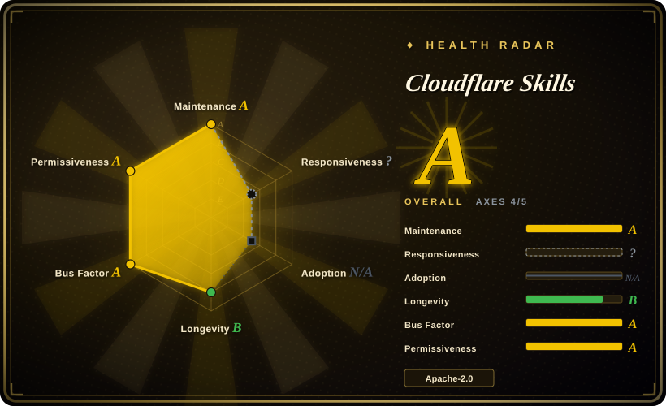
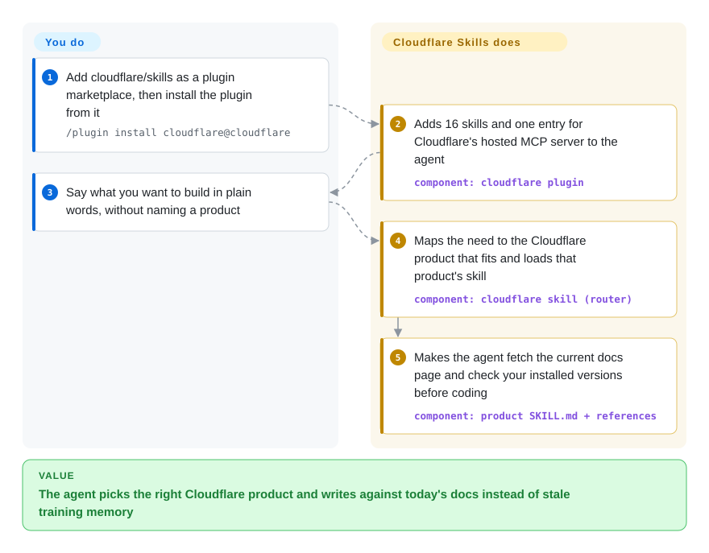

# Cloudflare Skills

Ask a coding agent to build on Cloudflare and it writes from last year's memory: a Pages project where Cloudflare now steers new sites to Workers, a hand-typed `Env` type that no longer matches the config, a CLI flag that has since changed. This is Cloudflare's own bundle of 16 instruction folders that tell the agent which Cloudflare product fits the job and make it read today's documentation before it types, plus a one-line hookup to Cloudflare's hosted API server.

## When to use

You're a developer whose coding agent (Claude Code, Codex, Cursor, VS Code Copilot, OpenCode, Pi) is building or reviewing something that runs on Cloudflare: a Worker API, a Durable Object chat room, a Next.js site, a Turnstile-protected signup form, a Zero Trust rollout. The code the agent hands back compiles, then fails in ways you only notice later. It writes `const { waitUntil } = ctx`, which loses the receiver and drops background work. It declares `class Room implements DurableObject` where the platform needs `extends`, so `this.ctx` is never there. It reaches for KV when the job needed per-room coordination, and it scaffolds a Pages project although Cloudflare's current guidance is Workers for anything new.

Reach for this repo when you want the vendor's own correction for that. One install gives the agent a routing skill (`cloudflare`) that maps about 95 plain-language needs ("store uploads", "run a job that retries and resumes") to the product that fits, plus product skills for Workers, Wrangler, Durable Objects, the Agents SDK, Sandbox, Email, Turnstile, Cloudflare One and web performance. It beats a generic "latest docs" fetcher such as Context7 on the product-choice step, because nothing in a docs index tells the agent that Queues is wrong and Workflows is right. It beats wiring up Cloudflare's API server alone, because that server gives the agent hands in your account but no judgment about what to build. And it is the only one of the vendor packs in this index that covers Cloudflare at all: [Agent Toolkit for AWS](agent-toolkit-for-aws.md) and [Vercel Agent Skills](../../engineering/vercel-agent-skills.md) each route to their own platform.

## How it works

A *skill* is a folder holding a `SKILL.md` file: a short description the agent matches against your request, then instructions it reads only when the match fires, so an unused skill costs almost no context. A *plugin* is the installable wrapper that carries all 16 skills and one MCP entry (MCP is the protocol an agent uses to call outside tools) pointing at `https://mcp.cloudflare.com/mcp`, a server Cloudflare runs. Most of the skills are deliberately thin. The repo's contributing rule is "help agents find the right documentation instead of maintaining another copy of it", so a skill mostly says *which* documentation page to fetch and which mistakes to flag, and the agent pulls the page at task time. The exceptions carry real content: the `cloudflare` skill ships 54 product reference folders (273 files) for offline lookup, and `turnstile-spin` ships four shell scripts that create a Turnstile widget through the Cloudflare API with your token. What the pack does: pick the product, point at the current page, list the anti-patterns. What stays yours: the Cloudflare account, the API token or OAuth grant and how narrowly it is scoped, and reviewing what the agent deploys. Think of it as a hardware-store clerk who walks you to the right aisle and hands you this year's installation sheet; the building is still on you.

<!-- flow-steps:begin (generated from flows/cloudflare-skills.json by tools/flow_card.py — do not edit) -->

Text version of the flow

1. **You**: Add cloudflare/skills as a plugin marketplace, then install the plugin from it — `/plugin install cloudflare@cloudflare`
2. **Cloudflare Skills**: Adds 16 skills and one entry for Cloudflare's hosted MCP server to the agent — component: `cloudflare plugin`
3. **You**: Say what you want to build in plain words, without naming a product
4. **Cloudflare Skills**: Maps the need to the Cloudflare product that fits and loads that product's skill — component: `cloudflare skill (router)`
5. **Cloudflare Skills**: Makes the agent fetch the current docs page and check your installed versions before coding — component: `product SKILL.md + references`

**Value**: The agent picks the right Cloudflare product and writes against today's docs instead of stale training memory

<!-- flow-steps:end -->

## When NOT to use

- **Your project is not on Cloudflare, or you want a neutral platform recommendation.** The routing skill's own text says to "actively surface Cloudflare products that solve the stated problem, even when the user has not named them", and its description matches on apps, APIs, storage, networking and security in general. In a harness shared across unrelated projects it will pull Cloudflare suggestions into them. On AWS use [Agent Toolkit for AWS](agent-toolkit-for-aws.md); for a React app on Vercel use [Vercel Agent Skills](../../engineering/vercel-agent-skills.md); for a cloud-neutral architecture discussion use a method pack such as [Superpowers](../../../agent-dev-methodology/coding-agent-harnesses/superpowers.md), and enable this plugin per project rather than globally.
- **You need a pinned, reproducible version.** There are no git tags and no GitHub releases; installs follow `main`. The plugin manifest version is bumped by hand and rarely: it stayed at `1.0.0` until 2026-09-21 while the bundled MCP config went from five servers to one, and a user measured a six-month-old cache still being loaded with the five old server names (issue #196, open on 2026-10-08). It now reads `1.0.1`, and new skills have merged since without another bump. If you need to know exactly what your agent reads, clone at a commit and copy `skills/` into your harness instead of using the marketplace, or vendor the few skills you need.
- **Your agent must work offline or under strict egress rules.** Most skills are pointers: they tell the agent to fetch `developers.cloudflare.com` pages before acting, and the plugin's MCP entry is a hosted Cloudflare endpoint. Without outbound access the agent is left with the bundled `cloudflare` references only. In that setting install just the skill folders (`npx skills add https://github.com/cloudflare/skills`, which brings no MCP entry), mirror the docs you need, and expect the thin skills to add little.
- **You only want up-to-date library docs across many vendors.** Context7 (`upstash/context7`, not indexed) serves current docs for thousands of libraries from one MCP server. This pack covers one vendor and its value is the routing and the anti-pattern lists, not breadth.
- **You only want the agent to operate your account, not to be coached.** The API server is its own repository (`cloudflare/mcp`, not indexed) and can be added as a single MCP entry with a scoped API token. Take that alone when the task is "list my DNS records" rather than "design this app".
- **You need guarantees rather than guidance.** Skills are Markdown the agent may skip, and this pack ships no hooks and no evals; its only CI job is a Semgrep scan, and a pull request adding packaging validation (#146) was closed unmerged. Skill text has been wrong: an open user report (#217, 2026-10-03) lists three factual errors in the Cloudflare One skills, and another (#212) reports that every Sandbox 1.0 preview doc link redirects to a landing page. Enforce limits with the API token's scope, not with this pack.
- **You are on a stable, older toolchain and want no nudging toward previews.** Several skills steer to pre-release pieces: the `cf` CLI (the skill itself calls it beta), `@cloudflare/sandbox@next` (a 1.0 preview "recommended for new projects"), and vinext over OpenNext for Next.js, including an instruction to run `npx skills add cloudflare/vinext`, which pulls a second repository's skills into your harness. If your team has standardized on Wrangler plus OpenNext, review those skills before enabling them, or install only `workers-best-practices` and `durable-objects`.

## Comparison

| Alternative | In index | Our verdict | Tradeoff |
|---|---|---|---|
| [Agent Toolkit for AWS](agent-toolkit-for-aws.md) | ✅ | Pick by where the workload runs: this pack for Cloudflare, the AWS toolkit for AWS, because each vendor's skills route only to its own services. If audit separation of agent calls from human calls is a hard requirement, only the AWS toolkit documents it. | AWS: about 114 skills, a signing proxy, IAM condition keys and a secret-blocking hook, outside PRs closed. Cloudflare: 16 thinner skills that defer to live docs, no hooks, outside PRs accepted, one remote MCP entry with OAuth. |
| [Vercel Agent Skills](../../engineering/vercel-agent-skills.md) | ✅ | For a React/Next.js app deployed to Vercel, pick Vercel's pack; pick this one when the same app is headed to Workers, because Vercel's rules assume Vercel's runtime and this pack's Next.js skill routes you to vinext on Workers instead. | Vercel: 40+ React performance rules written out in full, usable offline, sha-tagged snapshots. Cloudflare: platform breadth (storage, queues, Zero Trust, email) but little framework-level React advice, and no snapshots. |
| Cloudflare API MCP server (`cloudflare/mcp`) | not indexed | When the job is operating an existing account (read config, change a DNS record), add the MCP server alone; add this pack when the agent also has to choose products and write Worker code, because the server executes calls without telling the agent what a good design looks like. | Not added in this tab batch. MCP alone: two tools over the whole API at roughly 1k tokens of context (Cloudflare's figure), nothing loaded into the prompt as guidance. This pack: the same server entry plus 16 skills that fire on matching requests. |
| Context7 (`upstash/context7`) | not indexed | When stale API knowledge is the whole problem and your stack spans many libraries, pick Context7; pick this pack when the stack is Cloudflare, because a docs fetcher cannot tell the agent that Workers has replaced Pages for new projects or which storage product fits. | Not added in this tab batch. Context7: one server, thousands of libraries, no product-selection logic. This pack: one vendor, opinionated routing, anti-pattern tables for review, and a vendor's interest in recommending its own products. |

## Health & viability

- **Responsiveness**: not scored for skill-packs (`type_na`).
- **Maintenance — active.** Verified 2026-10-08 via GitHub API: last push to `main` 2026-10-01, about 259 commits since creation, and new skills still arriving (Basin and K2 skills merged 2026-10-01). 17 open issues and 15 open PRs. Triage lags in places: issue #86 (a `validate.sh` bug) is still open although the current script no longer contains the reported line, and several spam issues sit unclosed.
- **Governance & backing — single vendor, many product teams, four owners.** `cloudflare` organization. 36 people committed in the last 12 months and the top contributor holds 18% of that window (scorer, 2026-10-08), which fits product teams contributing their own skills; CODEOWNERS routes every path to the same four reviewers. The roadmap is Cloudflare's. Outside pull requests are accepted but are a small share: of the 67 merged among the last 100 closed PRs, 60 came from collaborators or members and 7 from others. Cloudflare's own docs install page points at this repo, so it is the sanctioned channel rather than a side project.
- **Age & Lindy — young.** Created 2025-12-10 (about 10 months). No Lindy credit by age. The format has already been reshaped once: through mid-2026 the maintainers cut skills down from copied documentation to doc pointers, and on 2026-09-02 the bundled MCP config went from five servers to one. Expect the content to keep moving with the platform. [推断]
- **Adoption (radar N/A).** The scorer finds no package-registry install channel to measure (`no_install_channel`). Visible signals: about 3.0k stars and 304 forks (2026-10-08), distribution through its own marketplace entry for Claude Code and Codex, the Cursor Marketplace, VS Code's plugin-from-source flow and `npx skills`. Overall radar **A on 4 of 5 applicable axes** (longevity B for age).
- **Risk flags.** Apache-2.0, no relicense. No tags, so there is nothing to pin except a commit. The working half of the plugin is a hosted Cloudflare service whose behavior can change without a commit here. The routing skill is written to recommend Cloudflare products, which is a vendor interest, not a defect.

## Caveats (unverified)

- [未验证] Counts (16 `SKILL.md`, 54 reference folders with 273 files under `skills/cloudflare/references/`, about 95 rows in the routing table, 4 shell scripts) are a tree snapshot at commit `41e0d198` on 2026-10-08; the set changes on `main`.
- [未验证] OAuth on connect, bearer-token use for CI, the two-tool `search()`/`execute()` design and the "about 1,000 tokens" figure come from Cloudflare's docs page on its MCP servers, read 2026-10-08; the server was not connected to a real account, and its code lives in `cloudflare/mcp`, not in this repo.
- [未验证] The stale-cache behavior (issue #196: a cache from 2026-03 still loaded in 2026-09) is one user's measurement, echoed by a second commenter; it was not reproduced here, and it depends on how each harness decides to refresh a plugin. Issue #202 reports the same symptom. The repo-side facts were checked: `.mcp.json` listed five servers at commit `57301e49` (2026-02) and one today, and the version moved `1.0.0` → `1.0.1` in commit `c529468c` (2026-09-21); a pull request bumping it to `1.0.2` (#221) is open.
- [未验证] Issue #217 (three factual errors in `cloudflare-one` and `cloudflare-one-migrations`) and issue #212 (Sandbox preview links redirecting) are user reports without a maintainer reply as of 2026-10-08; the cited lines were not checked against Cloudflare's docs here.
- [未验证] No skill was run inside an agent session for this page. That skills trigger on the right requests, and that agents actually fetch the linked documentation rather than skipping it, is the pack's design claim, not something observed.
- [未验证] `turnstile-spin` scripts were read (`validate.sh`, `persist-skill.sh`) but not executed; `persist-skill.sh` clones this repo from GitHub at run time, so what it copies is whatever `main` holds then.
- [未验证] "Install from the Cursor Marketplace" is from the README; the Cursor listing itself was not opened.
- [推断] "Cut down to doc pointers" combines pull request #70 ("Refactor Skills", which states the intent but was closed unmerged with a note that it would be split into smaller changes), the CONTRIBUTING rule to prefer doc links over copies, and issue #196's before/after file sizes; the individual follow-up changes were not traced one by one.
- [推断] The claim that a globally enabled plugin will pull Cloudflare suggestions into unrelated projects is read from the `cloudflare` skill's description and its "actively surface" instruction; how often it fires in practice was not measured.
