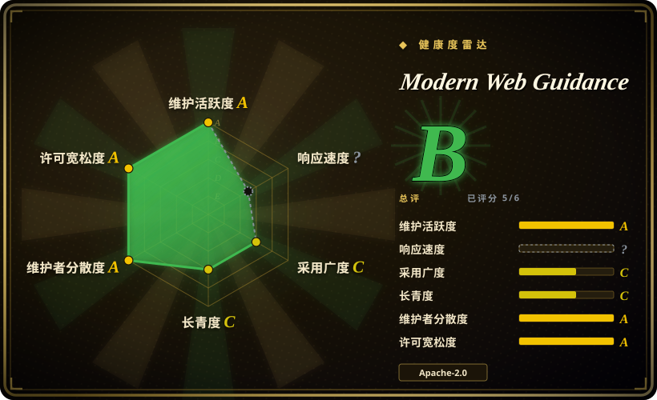
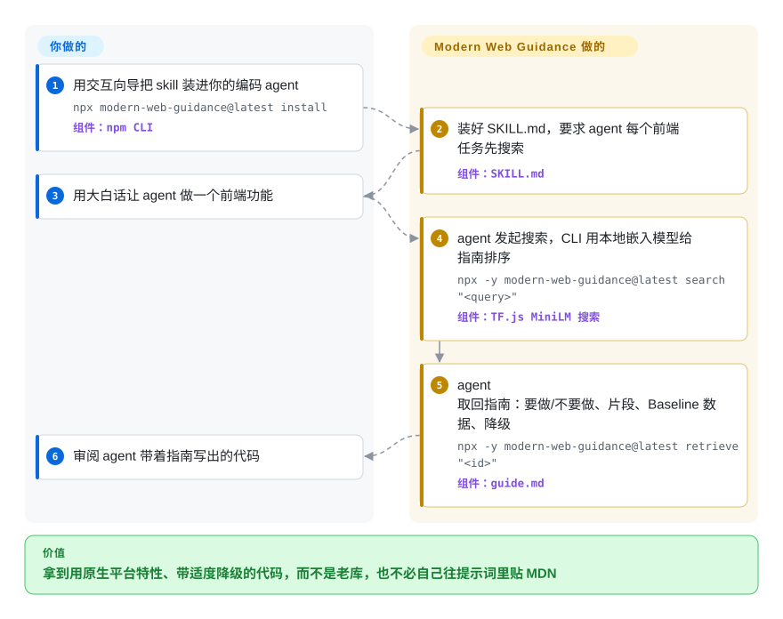

# Modern Web Guidance

让编码 agent 写个弹窗，它交回来一个 `div` 遮罩、一个焦点陷阱库，外加四十行锁滚动的 JavaScript——其实 `<dialog>` 配 `@starting-style` 原生就能做。这是 Chrome 团队给的解法：一个 skill，让 agent 动手写代码前，先在本地一套由专家撰写、经过评测的 Web 平台指南里搜一下，把对的那篇塞进上下文。

## 何时使用

你用 Claude Code、Codex、Gemini CLI 或 Antigravity 写前端，agent 却总在写 2019 年的代码。要个提示框，它引入 Popper.js，而不是用 CSS 锚点定位；要个折叠面板，它去动画 `max-height: 1000px`，而不是用 `interpolate-size`；注册表单漏掉 `autocomplete="new-password"`；一句“让页面快点”，换来一个懒加载库，而不是给首屏大图（LCP 图片）加上 `fetchpriority="high"`。模型往往知道新 API 存在，但它见过的旧写法远多于正确的新写法，也没人告诉它这些 API 在你要支持的浏览器里能不能直接用。

你装上它（`npx modern-web-guidance@latest install`）之后，agent 碰到任何 HTML/CSS/客户端 JS 任务，都会先跑 `search "<我要做什么>"`，拿到由本机嵌入模型排好序的指南 id，再 `retrieve` 一篇约 1k token 的指南：里面有“要做 / 不要做”规则、代码片段、Baseline 浏览器支持数据，以及控制了体量的降级方案。问题是“写组件时选对平台特性”而不是“对做好的页面按 Lighthouse 体检”时，选它而不是 [web-quality-skills](../../engineering/addyosmani-web-quality.zh.md)；问题出在浏览器平台本身、而不是 React/Next.js 的规则时，选它而不是 [Vercel Agent Skills](../../engineering/vercel-agent-skills.zh.md)。和这两者的决定性差别：指南由 Chrome/Edge 工程师撰写，每一篇都用浏览器测试分别给“带指南”和“不带指南”的 agent 打过分。

## 怎么用起来

你看到的这个仓库是“工厂”，不是你安装的那个东西。领域专家为每个用例写一份 `guide.md`、一份标杆实现 `demo.html` 和一份 `expectations.md`；`gd dev` 流水线把期望翻成 Playwright 评分脚本（一段在浏览器里检查计算样式、无障碍状态和运行行为的脚本），校准到对标杆实现 100% 通过、对故意写坏的版本 0% 通过，再让编码 agent 在同一任务上分别带指南和不带指南跑一遍，记下提升幅度。构建步骤把通过的指南、一个内置的 MiniLM 句向量模型（把一句话变成一串数字，意思相近的请求会落在相近位置）和预先算好的指南向量，发布到 npm 包 `modern-web-guidance` 和干净的 skill 仓库 `GoogleChrome/modern-web-guidance`。你只装一次 skill；之后 agent 之所以会去调用 CLI，是因为 `SKILL.md` 的描述要求它在每个前端任务上都这样做，CLI 在你的 CPU 上做相似度搜索，指南正文落进 agent 的上下文。它不做的事：没有任何环节检查 agent 在*你的*仓库里是否真的照指南写了。

<!-- flow-steps:begin (generated from flows/modern-web-guidance.json by tools/flow_card.py — do not edit) -->

流程文字版

1. **你**：用交互向导把 skill 装进你的编码 agent — `npx modern-web-guidance@latest install` — 组件：`npm CLI`
2. **Modern Web Guidance**：装好 SKILL.md，要求 agent 每个前端任务先搜索 — 组件：`SKILL.md`
3. **你**：用大白话让 agent 做一个前端功能
4. **Modern Web Guidance**：agent 发起搜索，CLI 用本地嵌入模型给指南排序 — `npx -y modern-web-guidance@latest search "<query>"` — 组件：`TF.js MiniLM 搜索`
5. **Modern Web Guidance**：agent 取回指南：要做/不要做、片段、Baseline 数据、降级 — `npx -y modern-web-guidance@latest retrieve "<id>"` — 组件：`guide.md`
6. **你**：审阅 agent 带着指南写出的代码

**价值**：拿到用原生平台特性、带适度降级的代码，而不是老库，也不必自己往提示词里贴 MDN

<!-- flow-steps:end -->

## 何时不用

- **你要给做好的页面测分，而不是让下一个组件写对。** 这些指南引导的是代码生成，不会对你的应用跑 Lighthouse、性能追踪或无障碍扫描。要按阈值体检用 [web-quality-skills](../../engineering/addyosmani-web-quality.zh.md)，要让 agent 实测线上页面用 [Chrome DevTools MCP](../../../web-automation/agent-browser-tools/chrome-devtools-mcp.zh.md)。
- **出错的是框架规则，不是平台 API。** skill 自己写明指南“通常与框架无关”。React 重渲染、Next.js 取数、Vercel 部署规则用 [Vercel Agent Skills](../../engineering/vercel-agent-skills.zh.md)；要任意 npm 库当前版本的文档，形态对的是 Context7（未收录）。
- **你要支持老浏览器，却没写支持策略。** 默认情况下，指南把“Baseline 广泛可用”视为可直接用、不加降级，只对更新的特性加降级。如果必须支持老版企业 Chromium 或 Safari，先把浏览器支持策略写进 `AGENTS.md` / `CLAUDE.md`（skill 会读），或者干脆只用项目规则文件、不装这个 skill。
- **你在离线环境或严格的网络白名单下工作。** README 说 CLI 可离线，但 skill 让 agent 跑的是 `npx -y modern-web-guidance@latest …`，这会访问 npm 源，并在首次使用时下载约 38 MB 的包；skill 自己也要求先申请联网权限。这种环境下把指南作为静态文件内置，或固定一个本地安装版本。
- **你的规定不允许把 agent 的查询发给厂商。** 遥测默认开启，会把安装次数、取回的指南 id 和 agent 的搜索词发给 Google；一个未合并的 PR（#1588，2026-09-29）还会上报当前运行的是哪个 agent。设 `DISABLE_TELEMETRY=1`，或把 CC-BY 协议的指南拷成本地 skill、不用 CLI。
- **你的任务大多不是前端。** 描述里写着“MANDATORY: Execute FIRST for all HTML/CSS and clientside JS tasks”，混合仓库里每次沾 UI 的改动都要多一轮搜索。一个月才碰一次浏览器，就把挑好的一篇指南放进规则文件，更省。
- **你需要稳定、有版本承诺的 API。** 它自称预览版，版本号 `0.0.x`，每周发版，指南 id 和 CLI 接口都会变。固定版本、升级后复查，或者等 1.0。

## 横向对比

| 替代品 | 是否收录 | 我们的评价 | 取舍 |
|---|---|---|---|
| [web-quality-skills](../../engineering/addyosmani-web-quality.zh.md) | ✅ | 想让 agent 按 Core Web Vitals / WCAG / SEO 阈值给现成页面体检，选 web-quality-skills；想让 agent 写组件时就用上对的原生特性，选 Modern Web Guidance，因为前者是事后清单，后者是按任务检索的构建指导。 | web-quality-skills：六个 skill，纯 markdown，无 CLI、无遥测，体检形态。本项目：约 153 篇用例指南藏在搜索 CLI 后面，经过评测打分，但依赖 npm 且遥测默认开启。 |
| [Vercel Agent Skills](../../engineering/vercel-agent-skills.zh.md) | ✅ | 错在 React/Next.js 写法和 Vercel 部署成本时，选 Vercel Agent Skills；错在各框架共用的 HTML/CSS/DOM API 时，选 Modern Web Guidance，因为 Vercel 那套是框架厂商的家规，这套是浏览器厂商的。 | Vercel：绑定框架，纯 skill，无运行时。本项目：与框架无关，但每次调用都要 Node 20 以上和 npm CLI。 |
| [Chrome DevTools MCP](../../../web-automation/agent-browser-tools/chrome-devtools-mcp.zh.md) | ✅ | agent 需要看到渲染后的页面（控制台报错、性能追踪、网络、截图）时，选 Chrome DevTools MCP；页面还没写出来、agent 需要知道该用哪个 API 时，选 Modern Web Guidance，因为一个是看运行时的眼睛，一个是写进提示词的知识——两者叠加使用。 | DevTools MCP：要一个跑着的 Chrome，给的是测量。本项目：不需要浏览器，给的是处方，但从不在你的应用里验证。 |
| Context7 | 未收录 | agent 缺的是某个库某个版本的最新 API 时，选 Context7；缺的是浏览器平台本身、以及哪些特性能放心上线时，选 Modern Web Guidance，因为 Context7 原样检索上游文档，这里的指南经过筛选并拿 agent 测过。本批次（标签页收录）未新增它的页面。 | Context7：任意库，原始文档，托管检索。本项目：只管 Web 平台，人工筛选并感知 Baseline，本地搜索。 |
| [Android Skills](android-skills.zh.md) | ✅ | agent 在写 Android 应用时，选 Android Skills；写浏览器代码时，选 Modern Web Guidance，因为两者都是 Google 官方针对“模型写的是去年的平台”的修正，只是运行时不同，内容不重叠。 | Android：24 份剧本，靠 Android CLI 安装，不接受外部贡献。本项目：搜索加取回的 CLI，评测框架公开，签 CLA 后接受贡献。 |

## 技术栈

TypeScript，由 Node 的 `--experimental-strip-types` 直接运行（工具部分不单独编译），pnpm monorepo。搜索：`@tensorflow/tfjs-core` 加 `tfjs-backend-cpu` 运行打包成 TF.js 模型的 MiniLM 嵌入器，对一份 gzip 压缩的指南描述向量文件做余弦相似度（取前 5 个，相似度不低于 0.3）。兼容性数据：`web-features`、`@mdn/browser-compat-data`、`caniuse-lite`、`@webref/*`。评测侧：Playwright 评分脚本，Claude Code、Codex、Gemini CLI 和 Antigravity（`jetski`）的 agent 运行脚本，一个 `eval-view` 看板。安装侧：CLI 的 `install` 实际是调用 `npx -y skills add GoogleChrome/modern-web-guidance`。

## 依赖

- **使用 skill：** Node.js 20 以上及 `npx`（或 `pnpx`）；首次运行和 `@latest` 解析到新版本时需要访问 npm 源；一个能加载 Agent Skills 或插件的编码 agent（README 列出了 Claude Code、Codex、Copilot CLI、Antigravity、Gemini、Kimi Code、Grok Build）。
- **npm 包本身：** 不声明运行时依赖，是一个约 38 MB 的自包含包（模型和向量都在里面）。
- **在本仓库贡献或跑评测：** pnpm 10、Playwright 浏览器、你要评测的各家 agent 的 API 凭据，以及签署的 Google CLA。

## 运维难度

对使用者**低**：一条安装命令，用 `npx modern-web-guidance@latest update` 更新，只需决定一个环境变量（`DISABLE_TELEMETRY=1`）。持续成本是每次搜索一次 CPU 嵌入计算和一次 `npx` 解析，以及 skill 在每个前端任务上都会被触发。对要跑评测框架的人**高**：多个 agent 乘以多个任务，真实的 API 花费加浏览器评分——这是 Google 的活，不是你的。

## 健康度与可持续性

- **维护：** 非常活跃——2026-01-27 创建，最近推送 2026-09-30；发布仓库在 2026-09-07 到 2026-09-28 之间打了 `v0.0.187` 到 `v0.0.191` 的标签，大约每周一版，npm 自 2026-04-30 起共 106 个版本。
- **治理：** 归 Google 所有（`GoogleChrome` 组织），分工有名有姓——按 `CONTEXT.md`，每个类别有内容技术负责人，约 15 名领域专家、约 3 名基础设施工程师；主要贡献者 `paulirish`、`rviscomi`、`micahjo7`。README 把微软 Edge 团队与 Chrome 并列致谢。接受贡献，但须签 Google CLA；路线图由 Google 定。
- **年龄与 Lindy：** 约 8 个月，自称 `0.0.x` 预览版——按 Lindy 先验尚未经受考验。它有的是一个本职就是推广这些 Web 特性的后台；风险是 Google 的老问题：开发者关系项目可能被改方向或并进别的产品。[推断]
- **采用度：** 源码仓库 1,113 星 / 87 fork，发布仓库 2,356 星（2026-09-30）；npm `modern-web-guidance` 上月下载量，评分器经 ecosyste.ms 读到 129,446 次，npm 官方 API 给出 2026-08-30 到 2026-09-28 为 175,166 次。其中很大一部分是 agent 每次 `npx @latest` 的重复解析，不等于独立用户数。
- **风险信号：** 代码 Apache-2.0，指南 CC-BY-4.0（部分取材自 MDN 和各规范）。遥测默认开启，会把 agent 的搜索词发给 Google。`SKILL.md` 过期时，CLI 会在 stderr 打印一句要 agent“insist that the user upgrade”的话——这是厂商写给你的 agent 看的提示，本意无害，但值得知道。提升数据（如 Claude Code/Sonnet 5 在 132 个任务上从 54% 到 87%，2026-09-11）来自项目自己的评测框架。

## 存疑（未验证）

- [未验证] README 里的评测提升表（各 agent 不带 / 带指南的通过率）是项目自家框架在自家任务上的结果；本页未重跑，而且这些任务本就是围绕被测指南设计的。
- [未验证] “离线、省 CPU”的搜索：代码路径（`serving/lib/search.ts`，TF.js MiniLM）确实在本地，但 `npx …@latest` 仍会访问 npm 源；每次搜索的实际延迟和内存未测。
- [未验证] 指南数量：2026-09-30 的 README 列出 153 个用例、130 个特性；源码树里有 212 个 `guide.md`，含占位稿和类别导航页。发布数量每周都在变。
- [未验证] 遥测字段依据 README 和 `ClearcutLogger.ts` 描述，未抓包核对实际发送内容。PR #1588（遥测里识别 agent）在 2026-09-30 仍未合并。
- [推断] 维护者人数和分工来自仓库自动维护的 `CONTEXT.md`（最后更新 2026-07-10），可能滞后。
- [推断] 微软 Edge 的参与只来自 README 的致谢行，未找到 Edge 方的治理文件。
- [未验证] 两个下载量（ecosyste.ms 的 129,446，api.npmjs.org 的 175,166）对同一个月对不上，差异原因未追查。
- [未验证] npm 下载量混合了人工安装、CI 和 agent 的 `npx` 调用，不是用户数。
