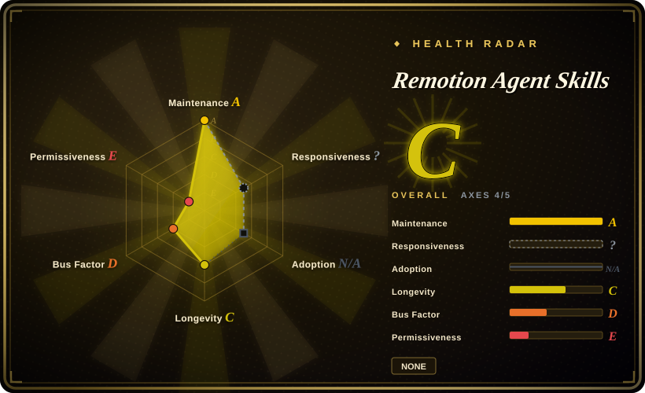

# Remotion Agent Skills

Remotion's official skills bundle: 12 self-contained skills that teach a coding agent (Claude Code, Codex, Cursor, Kimi Code) how to write correct Remotion video code — installed with `npx skills add remotion-dev/skills` and versioned in lockstep with the framework.

## When to use

You're a React developer using a coding agent to build programmatic video, and the agent keeps getting Remotion wrong: it invents APIs, animates with CSS transitions instead of the frame model (`useCurrentFrame()` / `interpolate()`), and misplaces `<Composition>` / `<Sequence>` structure — so you spend your time correcting rather than creating. You install Remotion's own skills so the agent loads the vendor's best practices on demand: `remotion-best-practices` as the router for unsure cases, `remotion-markup` for compositions / animations / layout / media, plus `remotion-create`, `remotion-studio`, `remotion-render`, `remotion-maps`, `remotion-captions`, `remotion-saas`, `remotion-interactivity`, `remotion-docs`, `remotion-upgrade`, and `remotion-multimedia`.

Reach for the vendor bundle because it is the canonical, version-locked source: every `SKILL.md` carries the same `4.0.526` version as the [Remotion](../../video-production/remotion.md) release, and the content is generated from the main repo's `packages/skills` rather than hand-maintained here [推断]. The deciding tradeoff vs the closest alternatives: [HyperFrames](../../video-production/hyperframes.md) ships skills too, but for an HTML (non-React) render engine — the two are not interchangeable; [anything2explainer](../../video-production/anything2explainer.md) is a turnkey explainer pipeline built on Remotion, not general authoring guidance.

## When NOT to use

- **You haven't chosen the engine yet.** These skills teach *how to use Remotion*, not *whether to*; compare engines on the [Remotion page](../../video-production/remotion.md) first, or take [HyperFrames](../../video-production/hyperframes.md)' skills if your stack is HTML rather than React.
- **Your agent has no skill loader.** Skills activate through a loader (Claude Code / Codex / Cursor / Kimi Code, or the `skills` CLI). On a bespoke harness or a plain chat / API call the markdown will not auto-activate — read the docs yourself, or paste the `SKILL.md` files in manually.
- **You want a finished video, not authoring guidance.** These are the framework's best practices; they do not research, script, generate assets, or QC. For a turnkey narrated explainer with a fixed style use [anything2explainer](../../video-production/anything2explainer.md); for an orchestrated research → script → asset → render pipeline use [OpenMontage](../../video-production/open-montage.md).
- **You need generated pixels (photoreal people / scenes).** Remotion renders what you compose; no Remotion skill makes it generate footage — use a generative video model / SaaS (Runway, Seedance — 未收录) for that.
- **You need a clear license for the skill text.** The repo ships **no LICENSE file** (GitHub reports no license), so the terms covering redistribution of the skill content are unstated — do not bundle it into a product without checking with Remotion; the framework's own license covers the framework, not necessarily this text.

## Comparison

| Alternative | In index | Our verdict | Tradeoff |
|---|---|---|---|
| [HyperFrames](../../video-production/hyperframes.md) | ✅ | Pick HyperFrames' skills when you committed to its build-step-free HTML engine and want agents writing HTML compositions; pick Remotion Agent Skills when your stack is React and you want the vendor's lockstep guidance, because the two skill sets teach different authoring models and are not portable between engines. | Remotion: React / bundler stack, vendor-versioned skills; HyperFrames: Apache-2.0 HTML stack with its own skill set. |
| [anything2explainer](../../video-production/anything2explainer.md) | ✅ | Pick anything2explainer when you want a turnkey narrated explainer with fixed style, human checkpoints, and QC; pick Remotion Agent Skills when you author your own compositions and only need the agent to get Remotion right, because anything2explainer is a fixed 9-stage pipeline rather than reusable best-practice guidance. | Remotion's skills: general, reusable, version-locked; anything2explainer: opinionated one-shot pipeline with its own constraints. |
| [OpenMontage](../../video-production/open-montage.md) | ✅ | Pick OpenMontage when the whole production should be orchestrated with approval gates; pick Remotion Agent Skills when Remotion is the layer you control and you only need correct API usage, because OpenMontage orchestrates engines of this class rather than teaching them. | OpenMontage: end-to-end orchestration on top; Remotion skills: low-level framework correctness only. |
| [Anthropic Skills](anthropic-skills.md) | ✅ | Choose Anthropic Skills for general document / design / MCP authoring; choose Remotion Agent Skills when the task is specifically Remotion video, because a general bundle cannot encode a framework's frame model and API surface. | Anthropic: broad, harness-native, domain-general; Remotion: one domain, vendor-canonical, version-locked. |
| [canghe-skills](../personal-collections/knowledge-content/canghe-skills.md) | ✅ | Pick canghe-skills when you want one practitioner's curated bundle that happens to include Remotion guidance; pick Remotion Agent Skills when you want the canonical, version-locked vendor source, because a personal collection carries one author's opinions and no version guarantee. | Personal collection: breadth and opinion; vendor bundle: canonical correctness and version lockstep. |

## Health & viability

- **Maintenance (radar A):** active — created 2026-01, last push 2026-09-17, last commit 2 days before scoring; ~80 commits; no tagged releases of its own — it inherits `4.0.526` from Remotion and is regenerated from the main repo's `packages/skills` [推断].
- **Governance (radar D):** 1 active maintainer in the trailing 12 months (top-contributor share ≈100%) — not a community repo but the vendor's sync pipeline; the roadmap follows the framework rather than an independent maintainer group.
- **Age & Lindy (radar C):** ~8 months old, so young by this index's Lindy prior; the mitigation is that it is a distribution artifact of a 6-year, actively developed project, so the *content* inherits Remotion's longevity even though this repo has no track record of its own [推断].
- **Adoption & ecosystem (radar ?):** structurally unscorable — a skill-pack that ships no package. The visible signal: 4,648 stars / 523 forks / 21 open issues in ~8 months (2026-09-19), reachable through `npx skills add remotion-dev/skills`, `bun create video`, and the remotion.dev Agent Skills docs.
- **Risk flags (radar E):** **no license declared** (the scorer reads `spdx_id: NONE`), so content-license terms are unstated; the repo is a mirror whose freshness depends on the upstream sync continuing; skills are prompt content, so their effect is advisory, not enforced. Overall radar: **C (4/6 axes scored)**.

## Caveats (unverified)

- [未验证] The repo has no LICENSE file (GitHub reports no license as of 2026-09-19); the terms covering the skill text's reuse / redistribution are therefore unstated — verify with Remotion before bundling it.
- [推断] The repo is a generated mirror of `remotion-dev/remotion`'s `packages/skills`: the README header says it is generated by `packages/skills/scripts/sync-readme.ts`, `package.json` sets `repository.url` to that monorepo path, and both carry version `4.0.526`. The exact CI sync cadence was not inspected.
- [未验证] The 12-skill list and descriptions come from the repo README and the GitHub contents API (2026-09-19); re-check `skills/` before relying on a specific skill.
- [未验证] Star / fork / open-issue counts (4,648 / 523 / 21) are point-in-time GitHub figures (2026-09-19); volatile.
- [推断] "Useful for Claude Code, Codex, Kimi Code or Cursor" is the project's own claim; per-harness activation fidelity was not independently tested here.
- [推断] Because the skills are markdown / prompt guidance loaded by the agent, their effect is advisory — the agent can still deviate.
