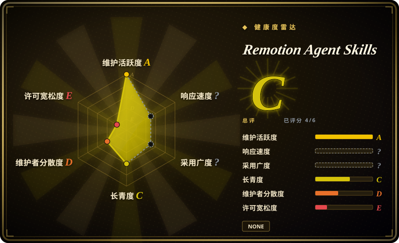

# Remotion Agent Skills

Remotion 官方的 skill 捆绑包：12 个自包含 skill，教编码 agent（Claude Code、Codex、Cursor、Kimi Code）写出正确的 Remotion 视频代码——用 `npx skills add remotion-dev/skills` 安装，版本与框架同步锁定。

## 何时使用

你是 React 开发者，正用编码 agent 做程序化视频，但 agent 老是把 Remotion 写错：编造并不存在的 API、用 CSS transition 代替帧模型（`useCurrentFrame()` / `interpolate()`）做动画、把 `<Composition>` / `<Sequence>` 结构放错——你花的时间都在纠错而不是创作。你装上 Remotion 自己的 skills，让 agent 按需加载厂商的最佳实践：不确定时用 `remotion-best-practices` 做路由，写 composition／动画／布局／媒体时用 `remotion-markup`，另有 `remotion-create`、`remotion-studio`、`remotion-render`、`remotion-maps`、`remotion-captions`、`remotion-saas`、`remotion-interactivity`、`remotion-docs`、`remotion-upgrade`、`remotion-multimedia`。

选厂商包的理由是它是**权威且版本锁定**的来源：每个 `SKILL.md` 与 [Remotion](../../video-production/remotion.zh.md) 发布版共用同一个 `4.0.526` 版本，且内容由主仓的 `packages/skills` 生成，而非在这里手工维护 [推断]。相对最近替代品的决定性取舍：[HyperFrames](../../video-production/hyperframes.zh.md) 也出 skills，但服务的是 HTML（非 React）渲染引擎，两者不可互换；[anything2explainer](../../video-production/anything2explainer.zh.md) 是架在 Remotion 上的固定风格讲解流水线，不是通用创作指导。

## 何时不用

- **你还没选定引擎。** 这些 skill 教的是**怎么用 Remotion**，不是**要不要用**；先在 [Remotion 页面](../../video-production/remotion.zh.md) 比较引擎，或者你的技术栈是 HTML 而非 React，就去用 [HyperFrames](../../video-production/hyperframes.zh.md) 的 skills。
- **你的 agent 没有 skill 加载器。** skill 要通过加载器才会激活（Claude Code／Codex／Cursor／Kimi Code，或 `skills` CLI）。在自建 harness 或纯聊天／API 调用里，markdown 不会自动激活——自己读文档，或手动把 `SKILL.md` 贴进去。
- **你要的是成品视频而不是创作指导。** 这些是框架最佳实践，不做调研、脚本、素材生成、QC。要固定风格的成品讲解片用 [anything2explainer](../../video-production/anything2explainer.zh.md)；要调研→脚本→素材→渲染全流程编排用 [OpenMontage](../../video-production/open-montage.zh.md)。
- **你需要生成画面（写实人物／场景）。** Remotion 渲染你合成的东西，任何 Remotion skill 都不能让它生成素材——这类需求用生成式视频模型／SaaS（Runway、Seedance，未收录）。
- **你需要 skill 文本的明确许可。** 该仓**没有 LICENSE 文件**（GitHub 报告无许可证），skill 文本的再分发条款没有写明——未经确认不要把它打包进产品；框架自身的许可证覆盖的是框架，未必覆盖这段文本。

## 横向对比

| 替代品 | 是否收录 | 我们的评价 | 取舍 |
|---|---|---|---|
| [HyperFrames](../../video-production/hyperframes.zh.md) | ✅ | 如果你已押注它的无构建步骤 HTML 引擎、想让 agent 写 HTML composition，选 HyperFrames 的 skills；如果你的栈是 React、想要厂商同步锁定的指导，选 Remotion Agent Skills，因为两套 skill 教的是不同的创作模型、不能互用。 | Remotion：React／打包器栈加厂商版本锁定；HyperFrames：Apache-2.0 的 HTML 栈及自带 skill 集。 |
| [anything2explainer](../../video-production/anything2explainer.zh.md) | ✅ | 如果你要固定风格、带人工确认点和 QC 的成品讲解片，选 anything2explainer；如果你在创作自己的 composition、只需要 agent 把 Remotion 写对，选 Remotion Agent Skills，因为 anything2explainer 是固定的 9 阶段流水线而非可复用最佳实践。 | Remotion 的 skills：通用、可复用、版本锁定；anything2explainer：带自身约束的一次性流水线。 |
| [OpenMontage](../../video-production/open-montage.zh.md) | ✅ | 如果你要整条生产被编排并带审批闸门，选 OpenMontage；如果 Remotion 是你掌控的层、你只需要正确的 API 用法，选 Remotion Agent Skills，因为 OpenMontage 编排的正是这一类引擎而非教你怎么用。 | OpenMontage：上层端到端编排；Remotion skills：只保证底层框架正确性。 |
| [Anthropic Skills](anthropic-skills.zh.md) | ✅ | 通用文档／设计／MCP 创作选 Anthropic Skills；任务明确是 Remotion 视频时选 Remotion Agent Skills，因为通用包编码不了某个框架的帧模型和 API 面。 | Anthropic：面广、harness 原生、领域通用；Remotion：单域、厂商权威、版本锁定。 |
| [canghe-skills](../personal-collections/knowledge-content/canghe-skills.zh.md) | ✅ | 想要某位实践者顺带包含 Remotion 指导的精选包，选 canghe-skills；想要权威且版本锁定的厂商来源，选 Remotion Agent Skills，因为个人合集承载的是单一作者观点、没有版本保证。 | 个人合集：广度与观点；厂商包：权威正确性与版本同步。 |

## 健康度与可持续性

- **维护（雷达 A）：** 活跃——创建于 2026-01，最近 push 2026-09-17，评分时最近一次 commit 在 2 天前；约 80 次 commit；自身没有 tagged release——版本 `4.0.526` 继承自 Remotion，内容由主仓 `packages/skills` 重新生成 [推断]。
- **治理（雷达 D）：** 过去 12 个月只有 1 名活跃维护者（头号贡献者占比≈100%）——它不是社区仓，而是厂商的同步管线；路线图跟随框架，而非独立维护团体。
- **年龄与 Lindy（雷达 C）：** 约 8 个月，按本索引的 Lindy 先验算年轻；缓冲在于它是 6 年活跃项目的分发产物，**内容**继承了 Remotion 的长期性，尽管该仓自身没有历史记录 [推断]。
- **采用与生态（雷达 ?）：** 结构性无法评分——不发布包的 skill-pack。可见信号：约 8 个月内 4,648 stars／523 forks／21 个 open issue（2026-09-19），经 `npx skills add remotion-dev/skills`、`bun create video` 和 remotion.dev 的 Agent Skills 文档触达用户。
- **风险信号（雷达 E）：** **未声明许可证**（评分器读到 `spdx_id: NONE`），内容许可条款未明；该仓是镜像，新鲜度取决于上游同步是否持续；skills 属提示词内容，效果是建议性的而非强制的。雷达总体：**C（6 轴中 4 轴可评分）**。

## 存疑（未验证）

- [未验证] 该仓没有 LICENSE 文件（GitHub 于 2026-09-19 报告无许可证）；skill 文本的复用／再分发条款因此未明——打包进产品前先向 Remotion 确认。
- [推断] 该仓是 `remotion-dev/remotion` 的 `packages/skills` 的生成型镜像：README 头部写明由 `packages/skills/scripts/sync-readme.ts` 生成，`package.json` 的 `repository.url` 指向该 monorepo 路径，且两者版本都是 `4.0.526`。确切的 CI 同步节奏未核查。
- [未验证] 12 个 skill 的清单与描述来自仓库 README 和 GitHub contents API（2026-09-19）；依赖某个具体 skill 前请重新核对 `skills/` 目录。
- [未验证] star／fork／open issue 数字（4,648／523／21）为 GitHub 时点数据（2026-09-19），易变。
- [推断] 「可用于 Claude Code、Codex、Kimi Code 或 Cursor」是项目自述；各 harness 的实际激活保真度未独立测试。
- [推断] 由于 skills 是 agent 加载的 markdown／提示词指导，其效果是建议性的——agent 仍可能偏离。
