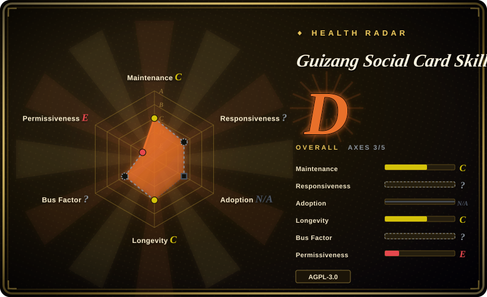
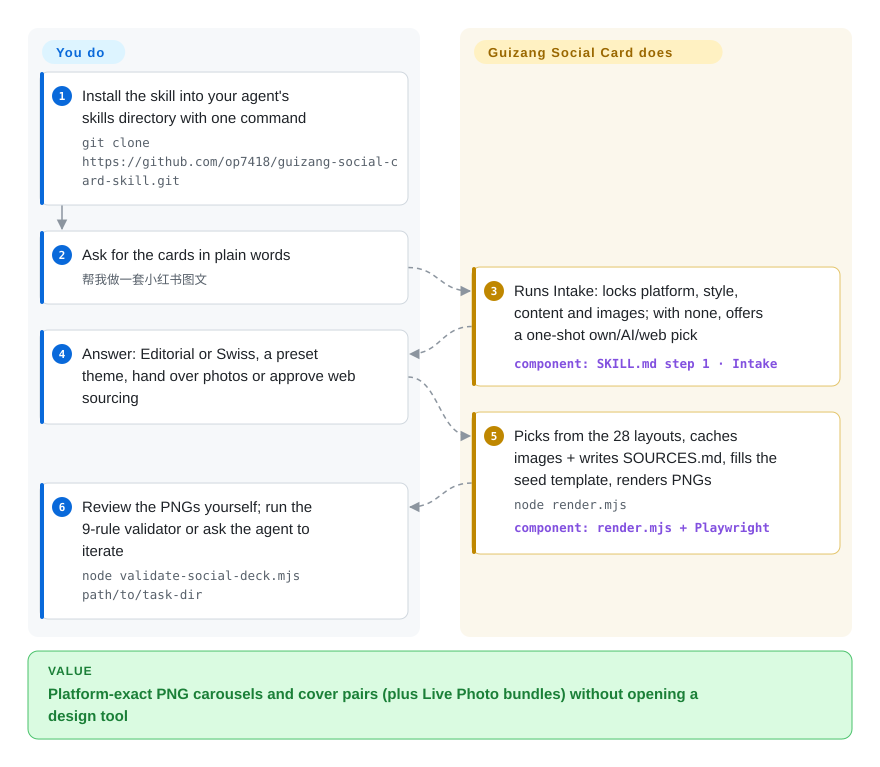

# Guizang Social Card Skill

You've got a half-written Xiaohongshu post and a folder of phone photos, and you refuse to open a design tool. This skill drives your agent through a fixed 7-step workflow that emits platform-exact cards — Xiaohongshu 3:4 carousels, WeChat 21:9 + 1:1 cover pairs, and Live Photo motion cards from videos you supply — as single-file HTML rendered to PNG by Playwright, locked to two visual systems (editorial-magazine and Swiss international).

## When to use

You're an indie maker, content creator, or domain expert who lives in Claude Code or Codex and needs a batch of social images that look art-directed rather than canva-templated. You've got a half-written Xiaohongshu post about a trip, a product teardown, or a reading list, plus a folder of phone photos, and you do not want to hand-place text boxes or fight a design tool. You drop this skill in, say "做一套小红书图文" or "公众号 21:9 + 1:1 封面对," and the agent runs a fixed 7-step flow: it collects platform/style/content, picks Editorial (Monocle/Kinfolk-style, for narrative/lifestyle/travel) or Swiss (grid + single anchor color, for product reviews/data/tutorials), chooses from 28 named layouts and 10 theme presets, sources and locally caches your images (writing a `SOURCES.md` attribution file), clones a seed `.html`, and renders to PNG with `node render.mjs`. Feed it a video instead and it enters the Live Photo branch — single, 2/3/4-up or triple-strip motion cards within the platform's `5s` (Xiaohongshu) / `3s` (WeChat article) budget, delivered as `JPG + MOV + .pvt`.

It fits best when you want a strong, opinionated aesthetic baked in and an artifact you fully control. Because each deck is one self-contained `.html` file, the agent can edit it as text, diff it, and re-render without a build chain — and an optional Playwright validator (`validate-social-deck.mjs`, 9 rules as of 2026-09) measures the real DOM for overflow, footer collisions, minimum readable font size, Swiss font-weight breaches and four-band density before you ship. You get a constrained, agent-legible design system with the exact canvas sizes the platforms expect (`.poster.xhs` 1080×1440, `.poster.wide` 2100×900, `.poster.square` 1080×1080) instead of a blank canvas.

## How it works

The product is `SKILL.md` itself: a 7-step procedure (Intake → Style & Theme → Layout Selection → Asset Prep → Compose & Render → Deliver & Review → Iterate) backed by ~16 reference docs — layout recipes, theme presets, a cookbook routing the 11 Xiaohongshu content categories, platform specs, QA checklist. The agent enforces the constraints it cannot cheat: theme color comes only from the 10 presets (no custom hex), layouts must be one of the 28 named skeletons, and type scales live in CSS variables inside two seed templates (`template-editorial-card.html`, `template-swiss-card.html`). The artifact is one `.html` file whose poster `section` blocks are the cards; `render.mjs` (Node + Playwright/Chromium) screenshots each poster to an exactly sized PNG. Review is deliberately pull-based — the workflow shows you the PNGs first and runs the 9-rule DOM validator (`validate-social-deck.mjs`) only if you ask, because auto-validation would add tens of seconds per round. What stays yours: the Node/Chromium environment, image providers' keys and network, the copy itself, and publishing — the skill produces files, it never uploads; Live Photo delivery means moving `.pvt` bundles to an iPhone and posting from the native app.

<!-- flow-steps:begin (generated from flows/guizang-social-card.json by tools/flow_card.py — do not edit) -->

Text version of the flow

1. **You**: Install the skill into your agent's skills directory with one command — `git clone https://github.com/op7418/guizang-social-card-skill.git`
2. **You**: Ask for the cards in plain words — `帮我做一套小红书图文`
3. **Guizang Social Card Skill**: Runs Intake: locks platform, style, content and images; with none, offers a one-shot own/AI/web pick — component: `SKILL.md step 1 · Intake`
4. **You**: Answer: Editorial or Swiss, a preset theme, hand over photos or approve web sourcing
5. **Guizang Social Card Skill**: Picks from the 28 layouts, caches images + writes SOURCES.md, fills the seed template, renders PNGs — `node render.mjs` — component: `render.mjs + Playwright`
6. **You**: Review the PNGs yourself; run the 9-rule validator or ask the agent to iterate — `node validate-social-deck.mjs path/to/task-dir`

**Value**: Platform-exact PNG carousels and cover pairs (plus Live Photo bundles) without opening a design tool

<!-- flow-steps:end -->

## When NOT to use

- **You need horizontal-swipe slide decks, not cards.** This skill is scoped to single social cards, covers and short Live Photos; the README routes deck work to its sibling [guizang-ppt](../slides-ppt/guizang-ppt.md) instead.
- **You're not in a file-system + browser agent.** It assumes an agent that reads/writes files and runs shell with Node + Playwright/Chromium installed (Claude Code, Codex, Cursor). A plain chatbot with no filesystem, no Node, or no headless browser cannot render the PNGs.
- **You want full color/brand control.** Themes are preset-only — no custom hex is allowed (a deliberate constraint to protect aesthetic consistency). If you must hit exact brand colors, you'll be fighting the system.
- **Photo-retouching, OOTD photosets, film-grain or "real skin test" content.** The README explicitly puts these outside scope; it composes layouts and type, it does not edit or retouch your photos.
- **AGPL-3.0 matters to you.** The skill, templates, and scripts are AGPL-3.0-licensed; vendoring parts into a service or product you ship triggers copyleft (including network-served derivatives) — read the terms first.
- **You need a stable, long-stable contract.** It's a young single-maintainer skill with no git tags or releases; the last push was 2026-07-01 (≈3 months quiet as of 2026-09-28, GitHub API), and version markers (the README FAQ cites `v0.12` rule changes) live only in docs. Layout names, theme presets, and the flow can shift without versioned notice. [推断]
- **You want one-click publishing.** Every artifact is a local file — PNGs, `MOV`, `.pvt` bundles. Live Photos in particular must be moved to an iPhone and posted from the Xiaohongshu/WeChat apps; the README states desktop/web upload does not accept them.

## Comparison

| Alternative | In index | Our verdict | Tradeoff |
|---|---|---|---|
| [guizang-ppt](../slides-ppt/guizang-ppt.md) | ✅ | Choose guizang-ppt when you need full multi-page horizontal-swipe decks instead of single cards. | Same author's sibling skill, scoped to full multi-page horizontal-swipe decks rather than single cards/covers; overlapping visual rules, different output artifact. |
| [html-anything](../../ai-design-generation/html-anything.md) | ✅ | Choose html-anything when you need general agent-driven HTML artifact generation. | General agent-driven HTML artifact generation; broader and unopinionated, so it lacks the locked card layouts, Swiss validator, platform canvas sizes, and image-sourcing workflow this skill ships. |
| [open-design](../../ai-design-generation/open-design.md) | ✅ | Choose open-design when you need broader UI/design generation rather than social-card output. | Aimed at broader UI/design generation; not a social-card specialist with platform-exact poster sizes and a render-to-PNG pipeline. |
| [Impeccable](../../ai-design-generation/impeccable.md) | ✅ | Choose Impeccable when you need a design-quality harness layer rather than card generation. | Design-quality oriented generation; different surface — not a single-file-HTML card workflow with a Playwright validator. |
| Canva / 稿定设计 | 未收录 | Choose Canva or 稿定设计 when you need hosted template SaaS rather than a repo. | Hosted template SaaS, not a repo — easier for non-agents and richer asset libraries, but closed, no local agent control, no single-file HTML artifact, and far less opinionated visual rigor. |
| Figma + plugins | 未收录 | Choose Figma plus plugins when you need full manual design control and collaboration. | Full design control and collaboration, but manual; no agent-driven 7-step flow, no auto image sourcing, and not a repo you can vendor. |

## Health & viability

- **Responsiveness**: Cannot be scored — type_na.
- **Maintenance (2026-09):** last push 2026-07-01, ≈3 months quiet as of 2026-09-28; no git tags or releases at all, and open issues ~12 (GitHub API). The README FAQ pins a template-consistency hard rule to `v0.12`, so development versions advance in docs, not tags. For a one-person skill pack the cadence is the author's availability.
- **Governance & bus factor:** [推断] **single-maintainer, `User`-owned (`op7418`)** — a bus-factor flag, though milder than its sibling `guizang-ppt` (~19k stars) since the audience is smaller. No org or co-maintainer backstop; it shares the same author and sustainability profile as `guizang-ppt`. Mitigant: each card deck is a self-contained `.html` you own outright, so abandonment only stops future updates.
- **Age & Lindy:** repo created 2026-05-27 (GitHub API), ≈4 months old as of 2026-09 — **brand-new; zero Lindy prior.** Treat the contract (28 layouts, 10 presets, canvas sizes) as unstable and verify against the current repo.
- **Adoption & ecosystem:** ~7.3k stars (GitHub API, 2026-09-28), up from ~4k in June; README + 16 reference docs cover the whole surface in Chinese, and the project actively solicits issue reports for template/style drift. [推断]
- **Risk flags:** **AGPL-3.0** copyleft (including network-served derivatives) if you vendor it — LICENSE file and README statement checked 2026-09-28; render/validator scripts need Node + Playwright/Chromium; the image-sourcing chain depends on third-party providers (Unsplash/Pexels/Flickr/Wallhaven) that may need keys or network. Whether the FSF "any later version" option applies is not pinned down — see Caveats. No CVEs relevant to a static-HTML generator.

## Caveats (unverified)

- [未验证] Copyleft scope detail: GitHub's SPDX says `AGPL-3.0` and the LICENSE is the AGPL v3 boilerplate, but whether the "…or any later version" option applies was not settled against the author's notice — check before relying on exact licensing terms.
- [未验证] ~7.3k stars (GitHub API, 2026-09-28) is a date-sensitive popularity hint; actual usage volume on Xiaohongshu/WeChat is not measured anywhere public.
- [推断] The ~3-month push quiet is read from `pushed_at`; whether the project is entering dormancy or simply feature-complete for its author's needs is unknown — no deprecation or hiatus notice exists in the README or open issues.
- [未验证] The render (`render.mjs`) and validator (`validate-social-deck.mjs`) scripts were not executed; their behavior (9 DOM-measuring rules, batch screenshot of one `.html`) is read from the README. Playwright pulls a Chromium download on install.
- [推断] "28 layouts" (Editorial M01–M16, Swiss S01–S12), "10 theme presets" (Editorial 6 / Swiss 4) and the 11 Xiaohongshu category routings are the project's own framing, re-checked against the README on 2026-09-28; counts/names may still shift.
- [推断] The image-sourcing chain (user photos → AI generation → Unsplash → Pexels → Flickr CC → Wallhaven → direct search) and MapLibre/OSM travel maps are described in the README; whether each provider works in a given environment is not verified and may need keys or network access.
- [推断] Fonts (Editorial: Playfair Display + Noto Serif; Swiss: Inter + Helvetica, CJK+bilingual coverage) are from the README FAQ; exact rendering was not verified by running the pipeline.
