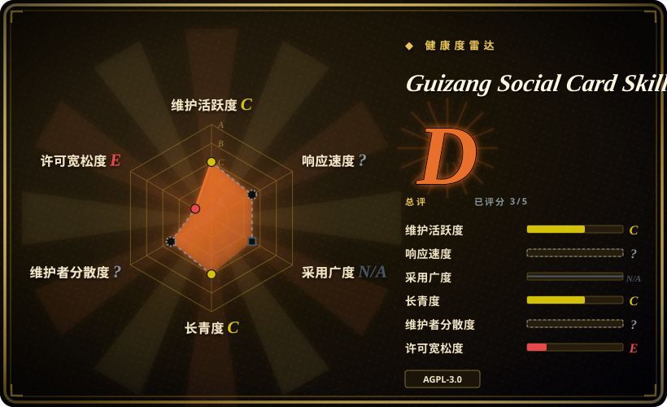
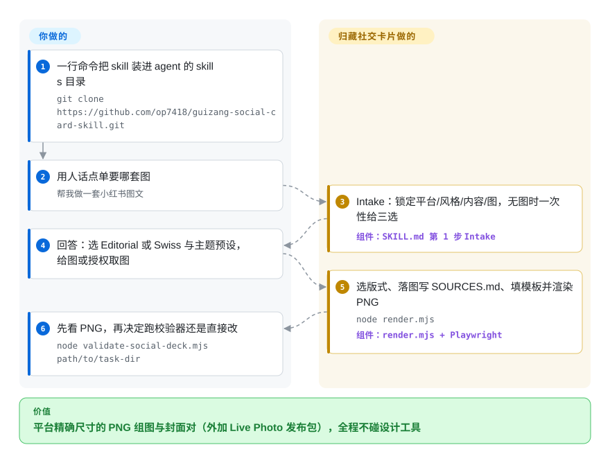

# Guizang Social Card Skill

你的小红书笔记写了一半、照片拍了一堆，唯一不想做的事就是打开设计工具。这个 skill 驱动 agent 走一条固定的 7 步流程，产出平台精确尺寸的图——小红书 3:4 组图、公众号 21:9 + 1:1 封面对，以及把你给的短视频装进去的 Live Photo 动态卡——载体是单文件 HTML，经 Playwright 渲染成 PNG，视觉锁定在两套系统（编辑杂志风与瑞士国际风）。

## 何时使用

你是独立开发者、内容创作者或领域专家，日常活在 Claude Code 或 Codex 里，需要一批看起来「被认真排过版」而不是套 Canva 模板的社交图片。你手上有一篇写到一半的小红书笔记——一次旅行、一次产品拆解，或一份书单——外加一堆手机照片，而你不想手动摆文本框，也不想跟设计工具较劲。你把这个 skill 装上，说一句「做一套小红书图文」或「公众号 21:9 + 1:1 封面对」，agent 就走一套固定的 7 步流程：收集平台/风格/内容，在 Editorial（Monocle/Kinfolk 风，适合叙事/生活方式/旅行）和 Swiss（网格 + 单一锚定色，适合产品测评/数据/教程）之间选一个，从 28 个具名版式和 10 个主题预设里挑，抓取并本地缓存你的图片（自动写一份 `SOURCES.md` 署名文件），克隆一个种子 `.html`，再用 `node render.mjs` 渲染成 PNG。你给的如果是一段视频，它会进入 Live Photo 分支——单视频、二/三/四宫格或三连拼图，按小红书 `5s`、公众号文章内 `3s` 的时长预算，交付 `JPG + MOV + .pvt`。

它最适合你想要一套强烈、有主张的美学被预先内置、同时拿到一个你完全掌控的产物的场景。因为每套图就是一个自包含的 `.html` 文件，agent 能把它当文本来编辑、做 diff、无需构建链就重渲染——而一个可选的 Playwright 校验器（`validate-social-deck.mjs`，2026-09 为 9 条规则）会在你交付前测量真实 DOM，检查溢出、页脚碰撞、正文最小字号、Swiss 字重违规和四横带密度。你得到的是一套受约束、对 agent 可读的设计系统，带着平台需要的精确画布尺寸（`.poster.xhs` 1080×1440、`.poster.wide` 2100×900、`.poster.square` 1080×1080），而不是一张白纸。

## 怎么用起来

产品就是 `SKILL.md` 本身：一条 7 步流程（Intake → 选风格主题 → 选版式 → 素材准备 → 排版渲染 → 交付确认 → 迭代），背后跟着约 16 份参考文档——版式配方、主题色票、11 个小红书品类的路由手册、平台规格、质量清单。agent 被锁在不能作弊的约束里：主题色只能从 10 套预设里选（不允许自定义 hex），版式必须是 28 个具名骨架之一，字号字距全走两份种子模板（`template-editorial-card.html`、`template-swiss-card.html`）里的 CSS 变量。产物是一个 `.html` 文件，里面每个 poster `section` 就是一张卡片；`render.mjs`（Node + Playwright/Chromium）逐张截图成尺寸精确的 PNG。审查是刻意「拉取式」的——工作流先把 PNG 给你看，只有你要求才跑那 9 条 DOM 实测校验（`validate-social-deck.mjs`），因为每轮自动校验要多花几十秒。留在你手上的事：Node/Chromium 环境、图源的 key 与网络、文案本身，以及发布——skill 只产文件、从不上传；Live Photo 交付要把 `.pvt` 包传到 iPhone，再从对应 App 发布。

<!-- flow-steps:begin (generated from flows/guizang-social-card.json by tools/flow_card.py — do not edit) -->

流程文字版

1. **你**：一行命令把 skill 装进 agent 的 skills 目录 — `git clone https://github.com/op7418/guizang-social-card-skill.git`
2. **你**：用人话点单要哪套图 — `帮我做一套小红书图文`
3. **Guizang Social Card Skill**：Intake：锁定平台/风格/内容/图，无图时一次性给三选 — 组件：`SKILL.md 第 1 步 Intake`
4. **你**：回答：选 Editorial 或 Swiss 与主题预设，给图或授权取图
5. **Guizang Social Card Skill**：选版式、落图写 SOURCES.md、填模板并渲染 PNG — `node render.mjs` — 组件：`render.mjs + Playwright`
6. **你**：先看 PNG，再决定跑校验器还是直接改 — `node validate-social-deck.mjs path/to/task-dir`

**价值**：平台精确尺寸的 PNG 组图与封面对（外加 Live Photo 发布包），全程不碰设计工具

<!-- flow-steps:end -->

## 何时不用

- **你要横滑幻灯片，而不是卡片。** 这个 skill 只做单张社交卡片、封面和短 Live Photo；README 把幻灯片需求路由给它的同门 [guizang-ppt](../slides-ppt/guizang-ppt.zh.md)。
- **你不在文件系统 + 浏览器 agent 里。** 它假设 agent 能读写文件、能跑 shell，且装了 Node + Playwright/Chromium（Claude Code、Codex、Cursor）。一个没有文件系统、没有 Node、没有 headless 浏览器的纯聊天机器人无法渲染出 PNG。
- **你要完全的颜色/品牌控制。** 主题只有预设——不允许自定义 hex（这是为保护美学一致性的刻意约束）。如果你必须命中精确品牌色，你会一直跟这套系统较劲。
- **照片精修、OOTD 穿搭图集、胶片颗粒或「真实素肌测试」类内容。** README 明确把这些放在范围之外；它只排布版式与文字，不编辑、不精修你的照片。
- **AGPL-3.0 对你是问题。** skill、模板、脚本都是 AGPL-3.0 许可；把其中部分塞进你对外发布的服务或产品会触发 copyleft（包括网络服务形态的衍生）——先读条款。
- **你需要一个长期稳定的契约。** 这是个年轻、单维护者的 skill，没有任何 git tag 或 release；最近一次 push 在 2026-07-01（截至 2026-09-28 已静默约 3 个月，GitHub API），版本标记只活在文档里（README 的 FAQ 把一条模板一致性硬规则记在 `v0.12` 名下）。版式名、主题预设和流程可能在没有版本说明的情况下变动。[推断]
- **你想一键发布。** 所有产物都是本地文件——PNG、`MOV`、`.pvt`。Live Photo 尤其要把 `.pvt` 传到 iPhone 再从对应 App 发布，README 明说电脑端/网页端一般不能直接发。

## 横向对比

| 替代品 | 是否收录 | 我们的评价 | 取舍 |
|---|---|---|---|
| [guizang-ppt](../slides-ppt/guizang-ppt.zh.md) | ✅ | 需要完整多页横滑幻灯片而非单张卡片时，选 guizang-ppt。 | 同作者的同门 skill，定位是完整多页横滑幻灯片而非单张卡片/封面；视觉规则有重叠，产物形态不同。 |
| [html-anything](../../ai-design-generation/html-anything.zh.md) | ✅ | 需要通用的 agent 驱动 HTML 产物生成时，选 html-anything。 | 通用的 agent 驱动 HTML 产物生成；更宽泛、不带主张，因此缺少这个 skill 自带的锁定卡片版式、Swiss 校验器、平台画布尺寸和图片取材流程。 |
| [open-design](../../ai-design-generation/open-design.zh.md) | ✅ | 需要更宽的 UI/设计生成而非社交卡片专项时，选 open-design。 | 面向更宽的 UI/设计生成；不是带平台精确海报尺寸和渲染成 PNG 管线的社交卡片专家。 |
| [Impeccable](../../ai-design-generation/impeccable.zh.md) | ✅ | 需要设计质量 harness 层而非卡片生成时，选 Impeccable。 | 偏设计质量导向的生成；面不同——不是带 Playwright 校验器的单文件 HTML 卡片工作流。 |
| Canva / 稿定设计 | 未收录 | 需要托管模板 SaaS 而不是仓库时，选 Canva 或稿定设计。 | 托管模板 SaaS，不是仓库——对非 agent 用户更易上手、素材库更丰富，但封闭、无本地 agent 控制、无单文件 HTML 产物，视觉严谨度也低得多。 |
| Figma + 插件 | 未收录 | 需要完整的手工设计控制与协作时，选 Figma 加插件。 | 完整设计控制与协作，但纯手动；没有 agent 驱动的 7 步流程、没有自动取材，也不是你能 vendor 的仓库。 |

## 健康度与可持续性

- **响应速度**：无法计算——type_na。
- **维护（2026-09）：** 最近一次 push 在 2026-07-01，截至 2026-09-28 静默约 3 个月；完全没有 git tag 或 release，open issue 约 12（GitHub API）。README 的 FAQ 把一条模板一致性硬规则记在 `v0.12` 名下，可见开发版本只在文档里推进。对一个一人 skill 包来说，节奏就是作者的空闲时间。
- **治理与 bus factor：** [推断] **单人维护、`User` 个人仓库（`op7418`）**——一个 bus-factor 标记，不过比它的同门 `guizang-ppt`（约 19k star）轻些，因为受众更小。没有组织或共同维护者兜底；它与 `guizang-ppt` 同一作者、可持续性画像一致。缓解点：每套卡片都是你完全拥有的自包含 `.html`，因此废弃只会停掉后续更新。
- **年龄与 Lindy：** 仓库创建于 2026-05-27（GitHub API），截至 2026-09 约 4 个月——**全新；Lindy 先验为零。** 把契约（28 个版式、10 个预设、画布尺寸）当作不稳定的，请对照当前仓库核实。
- **采用与生态：** 约 7.3k star（GitHub API，2026-09-28），较 6 月的约 4k 上涨；README 加约 16 份参考文档全程中文覆盖了整个面，项目也主动邀请为模板/风格漂移开 issue。[推断]
- **风险标记：** 若 vendoring 则触发 **AGPL-3.0** copyleft（含网络服务形态的衍生）——LICENSE 文件与 README 声明已于 2026-09-28 核对；渲染/校验脚本需要 Node + Playwright/Chromium；图片取材链依赖第三方 provider（Unsplash/Pexels/Flickr/Wallhaven），可能需要 key 或网络。「或任选后续版本」是否适用未钉死——见存疑账本。对静态 HTML 生成器而言无相关 CVE。

## 存疑（未验证）

- [未验证] copyleft 范围细节：GitHub 的 SPDX 为 `AGPL-3.0`、LICENSE 是 AGPL v3 标准文本，但「或任选后续版本」这一选项是否适用于本仓库，未对照作者的声明核实；依赖精确许可条款前请自查。
- [未验证] 约 7.3k star（GitHub API，2026-09-28）是对时间敏感的热度提示；小红书/微信上的真实使用量没有任何公开度量。
- [推断] 约 3 个月的 push 静默是从 `pushed_at` 读出来的；项目是进入休眠还是作者阶段性收工无从得知——README 与 open issue 里没有任何废弃或暂停声明。
- [未验证] 渲染脚本（`render.mjs`）与校验脚本（`validate-social-deck.mjs`）未被实际运行；其行为（9 条 DOM 实测规则、单 `.html` 批量截图）读自 README。Playwright 安装时会拉取 Chromium。
- [推断] 「28 个版式」（Editorial M01–M16、Swiss S01–S12）、「10 套主题预设」（Editorial 6 / Swiss 4）与 11 个小红书品类路由是项目自己的表述，2026-09-28 已对照 README 复核；数量/命名仍可能变动。
- [推断] 图片取材链（用户提供 → AI 生图 → Unsplash → Pexels → Flickr CC → Wallhaven → 直接搜索）与 MapLibre/OSM 旅行地图来自 README；各 provider 在具体环境是否可用未经验证，可能需要 key 或网络。
- [推断] 具体字体（Editorial：Playfair Display + Noto Serif；Swiss：Inter + Helvetica，中英覆盖）来自 README 的 FAQ；未通过实跑管线核实精确渲染。
