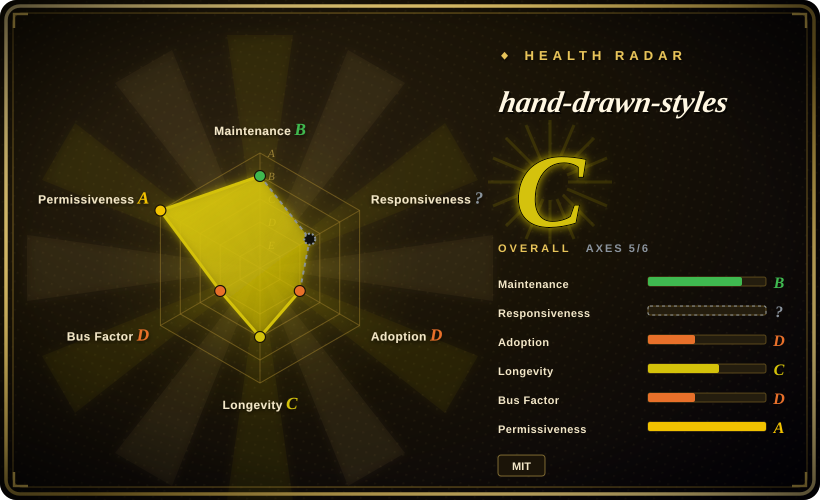
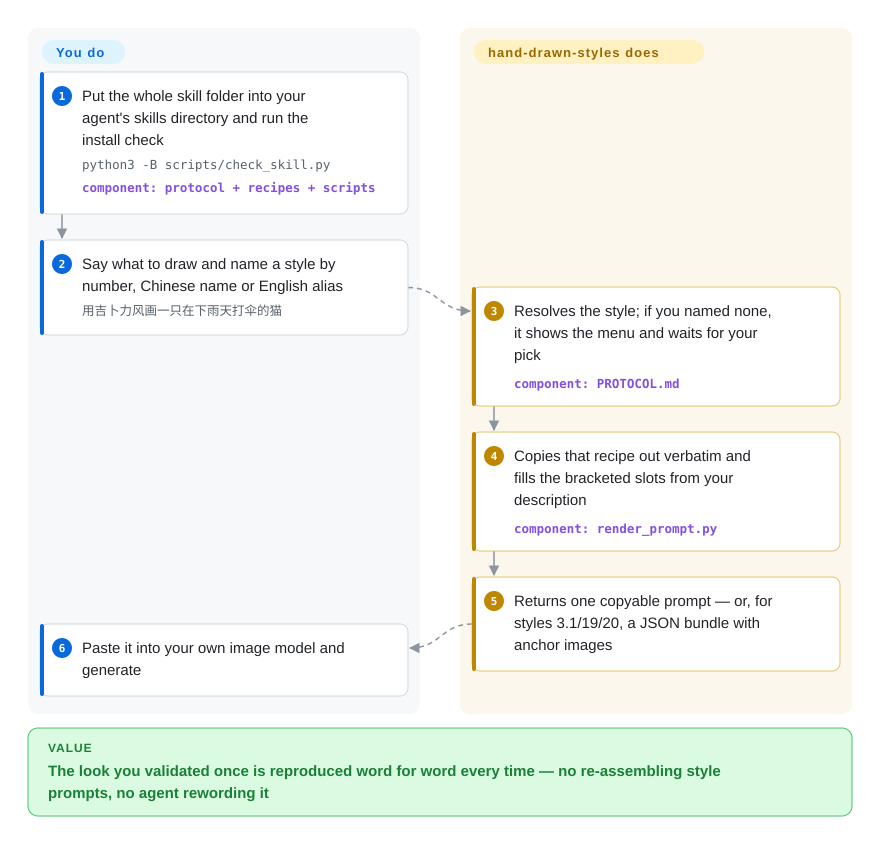

# hand-drawn-styles

You finally coax an image model into the wobbly kid-crayon look you wanted, and the next picture — same request, slightly reworded by your agent — comes back as clean digital clip-art. hand-drawn-styles keeps 22 tested style recipes in one file and has a small script copy the chosen recipe out word for word with your subject dropped in, so the agent cannot paraphrase the look away.

## When to use

You run a small Chinese content operation — parenting stories, explainer threads, quote cards — out of a coding agent, and you have already settled on two or three looks: a crayon family page, an xkcd-style stick-figure explainer, a pencil "monologue" card. The pain is not finding a style, it is keeping it. You ask for page 4 of the same story and the agent "helpfully" shortens the style paragraph, or mixes it with the brand rules in your project, and the line weight, the eyes and the paper colour all move. With this skill installed you say `用 3 号画风画……` or `用 ghibli 画……`, the agent resolves the number, Chinese name or English alias, and returns one copyable prompt assembled from the recipe exactly as it was validated.

Pick it over [handraw-style](handraw-style.md) when you want a short list of recipes that each went through recorded comparison rounds, not a 279-entry gallery to browse: the choice here is depth per style against breadth. Pick it over a single-persona skill such as [ian-xiaohei-illustrations](ian-illustrations.md) when you need several distinct looks but no article-reading planner. What is specific to this repository is the *contract* around three styles (3.1, 19, 20): instead of a prompt they produce a JSON bundle that carries a fixed anchor image, a stated model requirement and an accept/reject rubric, and the renderer refuses to hand out plain text for them unless you explicitly ask for a non-production preview.

## How it works

Nothing here draws. The repository is a skill pack: `STYLES.md` holds the recipes (21 integer-numbered styles plus the variant 3.1), `PROTOCOL.md` is the five-step procedure an agent follows (resolve the style, fetch the recipe, fill the placeholders, handle the aspect ratio, output), and `SKILL.md` / `AGENTS.md` are thin adapters that point Claude Code, Codex and other instruction-reading agents at those two files. The working part is `scripts/render_prompt.py`, a dependency-free Python script that pulls a recipe out of `STYLES.md` verbatim and substitutes placeholders — bracketed slots such as `【主体】` (the subject) that stand for the content you supply. You say what to draw; the agent infers the slot values and is told not to abbreviate, reword or blend recipes. Think of it as a rubber stamp rather than a description of a stamp: the ink pattern is fixed, only the paper underneath changes. For most styles the result is a text prompt you paste into gpt-image, Jimeng or Midjourney yourself. For 3.1, 19 and 20 the result is a JSON "call bundle": the prompt, an anchor image — a reference picture passed to the image model for style only, checked by pixel hash so a swapped file is rejected — and a workflow or scoring contract that your own generation tooling has to execute. A separate shell wrapper can generate style 21 directly through a logged-in Codex CLI; everything else stops at the prompt.

<!-- flow-steps:begin (generated from flows/hand-drawn-styles.json by tools/flow_card.py — do not edit) -->

Text version of the flow

1. **You**: Put the whole skill folder into your agent's skills directory and run the install check — `python3 -B scripts/check_skill.py` — component: `protocol + recipes + scripts`
2. **You**: Say what to draw and name a style by number, Chinese name or English alias — `用吉卜力风画一只在下雨天打伞的猫`
3. **hand-drawn-styles**: Resolves the style; if you named none, it shows the menu and waits for your pick — component: `PROTOCOL.md`
4. **hand-drawn-styles**: Copies that recipe out verbatim and fills the bracketed slots from your description — component: `render_prompt.py`
5. **hand-drawn-styles**: Returns one copyable prompt — or, for styles 3.1/19/20, a JSON bundle with anchor images
6. **You**: Paste it into your own image model and generate

**Value**: The look you validated once is reproduced word for word every time — no re-assembling style prompts, no agent rewording it

<!-- flow-steps:end -->

## When NOT to use

- **You want to browse and discover styles.** There are 22 recipes, not hundreds, and no layout or theme-colour catalogue. For a numbered gallery of 279 styles with 122 layouts and 36 palettes, use [handraw-style](handraw-style.md).
- **You want the pictures, not the prompts.** By design the agent is told not to generate; only style 21 has a direct-to-image script, and that needs a logged-in Codex CLI with image generation, `bun`, macOS `sips` for the default size, and a companion skill named `sweety-image-privacy` for which no public repository was found. If you want an agent that reads an article, plans the shots and renders them with its own image tool, use [ian-xiaohei-illustrations](ian-illustrations.md).
- **Your image endpoint cannot take reference images or pin a model version.** Styles 3.1, 19 and 20 fail closed without their anchor image, and 19/20 additionally demand the snapshot `gpt-image-2-2026-04-21` — a requirement the maintainer's own bundle marks as not observed in testing (`exact_candidate_snapshot_observed: false`). If style lock must live inside a pipeline you control, train or load a LoRA/IP-Adapter in [ComfyUI](../../on-device-ml/local-image-generation/comfyui.md) instead.
- **You need identifiers that stay put across versions.** Style numbers have already moved once: on 2026-08-04 the integers were shifted and `1.1`/`1.2` deleted, so a saved "style 13" (then the sunlit storybook look) now means paper sculpture. The first and only tagged release, v1.0.0, was published on 2026-10-08 — there is no versioned history before it and no stated compatibility policy after it. Call styles by alias and pin the v1.0.0 package; if what you need is one look that cannot be renumbered because it is the only one, use [ian-xiaohei-illustrations](ian-illustrations.md).
- **You need a deterministic, editable artifact.** A prompt is not a card; every roll differs. For HTML rendered to PNG that you can diff and re-template, use [Guizang Social Card Skill](guizang-social-card.md) or [HTML Anything](../../ai-design-generation/html-anything.md).
- **You need a commercially cleared look.** `STYLES.md` states that styles 12–17 are gpt-image replicas of specific Midjourney `--sref` codes, and others are keyed to Ghibli and xkcd. MIT covers the recipe text and scripts, not the looks they imitate. [推断] For brand work, build the style from your own artwork in [ComfyUI](../../on-device-ml/local-image-generation/comfyui.md).
- **You work in English.** Protocol, recipes, menus and error messages are Chinese, and style 21 renders handwritten Chinese copy. For a general, English-first prompt library, use [prompts.chat](../prompt-engineering/prompts-chat.md).

## Comparison

| Alternative | In index | Our verdict | Tradeoff |
|---|---|---|---|
| [handraw-style](handraw-style.md) | ✅ | Choose handraw-style when the job is picking a look from a large numbered gallery with layouts and palettes; choose this page's project when you already know the look and need the same recipe reproduced verbatim, with anchors and acceptance rules on three styles. | 22 recipes with recorded validation rounds and a tested renderer, against 279 styles with per-model activation data but thinner per-style evidence. |
| [ian-xiaohei-illustrations](ian-illustrations.md) | ✅ | Choose ian when one fixed character must illustrate a whole Chinese article and the agent should also decide where pictures go and render them; choose this project when you bring your own image model and only need the style paragraph held constant. | A complete article-to-PNG loop locked to one persona, against a prompt-only tool that covers several looks and leaves generation to you. |
| [Baoyu Skills](../ai-writing/content-production/baoyu-skills.md) | ✅ | Choose Baoyu Skills when illustration is one step in a writing-to-publishing pipeline and you want the generation and posting helpers in the same install; choose this project when style fidelity is the only problem and extra skills would just add context. | One bundle spanning translation, formatting, image generation and posting, against a single-purpose recipe pack with no generation backend. |
| [ComfyUI](../../on-device-ml/local-image-generation/comfyui.md) | ✅ | Choose ComfyUI when style consistency must be enforced by weights and nodes on your own GPU; choose this project when a hosted image model is good enough and you only want to stop prompt drift. | Pipeline-grade control with hardware and workflow upkeep, against zero runtime and whatever fidelity the hosted model gives you. |
| Midjourney style references (`--sref`) | not a repo | Choose `--sref` when you generate inside Midjourney and a style code is enough; this project exists largely to carry such looks over to gpt-image, where no style code is available. | Native one-flag style transfer inside a closed paid service — a feature, not a forkable artifact — against text recipes that travel across models but need per-model tuning. |

## Health & viability

- **Maintenance (as of 2026-10-08):** created 2026-06-28; 42 commits arriving in bursts (late June to mid-July, 2026-07-24, 2026-08-04, then one commit on 2026-09-04 and one large one on 2026-10-08). CI (unit tests, install check and package build on Python 3.10 and 3.13) passed on the latest push. The first release, v1.0.0, appeared on the verification day itself: a 9.52 MiB `hand-drawn-skill.zip` of 22 files whose SHA-256 matches the published `SHA256SUMS`. One release is not yet a cadence.
- **Governance / bus factor:** one maintainer — `threerocks`, a personal account, author of all 42 commits. The only outside pull request (#4, opened 2026-08-09, 915 files) has had no reply in two months; the one outside issue was a misfile. Treat it as a personal recipe book published in the open. [推断]
- **Age & Lindy:** about 102 days old with roughly 1.6k stars and 173 forks. Young and fast-starred is the combination the Lindy prior discounts; there is no track record of surviving an image-model generation change, and the recipes are tuned to gpt-image.
- **Backing:** none visible — no organisation, sponsor or funding link.
- **Risk flags:** the release channel is hours old at verification (the documented install link returned 404 until v1.0.0 was published the same day); style numbers have been reassigned once already; three styles depend on a model snapshot the maintainer has not verified; the optional generation script depends on an unpublished companion skill; the full repository is about 225 MB of images.

## Caveats (unverified)

- [未验证] The per-style quality claims in `STYLES.md` and commit messages (e.g. scores of "94–96" against Midjourney benchmarks, "9.5+" on three subjects) are the maintainer's own side-by-side judgments; no third-party evaluation exists and reproducing them needs paid image-model access.
- [未验证] The v1.0.0 package was downloaded and its checksum and file list were checked, but `scripts/check_skill.py` was not executed against it here, so "install check passes" rests on the upstream CI run, not on a local run.
- [推断] That the 2026-08-04 renumbering broke downstream users is inferred from one data point: a misfiled issue (#3) quoting a consumer that hard-coded `hand-drawn-styles:13-warm-childlike`, an identifier that no longer matches style 13.
- [未验证] Compatibility with Cursor, Gemini CLI, Cline, Windsurf, Continue and Jules is asserted in the README; only the Claude Code and Codex skill directories are spelled out in `INSTALL.md`, and no host was tested here.
- [推断] The licensing exposure of `--sref`-derived and Ghibli/xkcd-keyed recipes is this page's reading, not legal advice; the repository itself labels anchors for styles 19 and 20 as original and keeps frozen-reference records under `benchmarks/`.
- [未验证] `sweety-image-privacy` was searched for with `gh search repos` on 2026-10-08 and returned nothing; it may exist under another name or be private.
- [未验证] The model identifier `gpt-image-2-2026-04-21` is quoted from `scripts/render_prompt.py`; whether a given API account can pin it was not checked.
- [推断] Star growth was not traced to a source; the commit history references Xiaohongshu-style looks, suggesting Chinese creator-community circulation.
