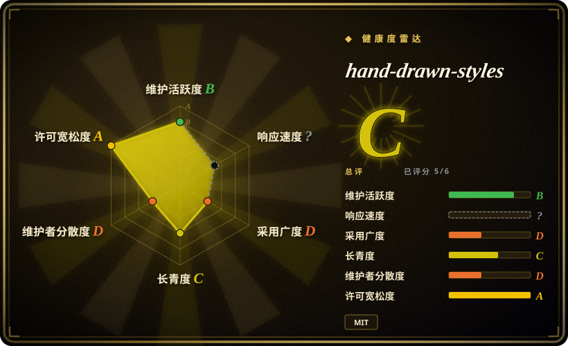
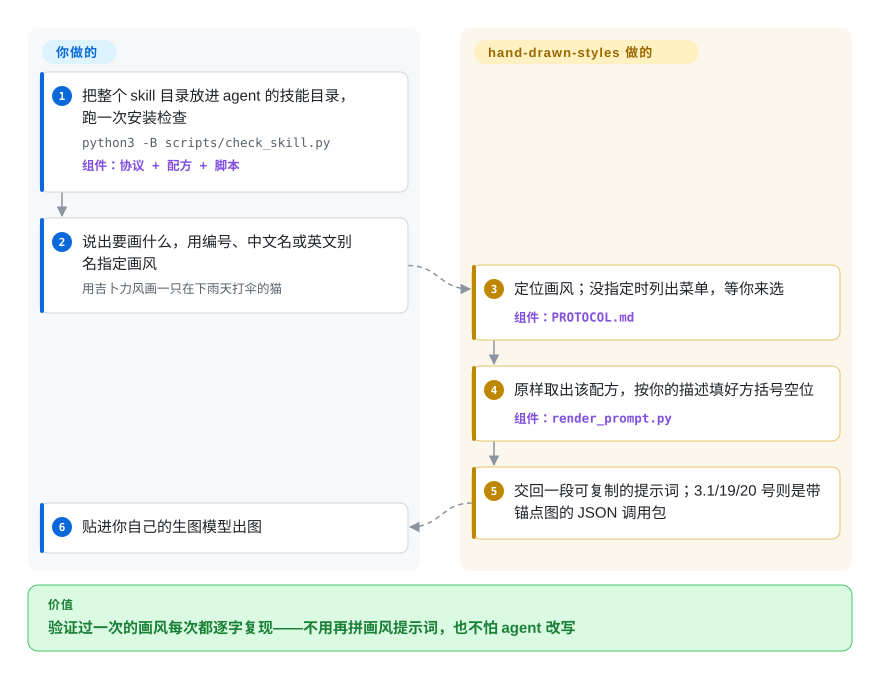

# hand-drawn-styles

好不容易让生图模型画出你要的那种歪歪扭扭的儿童蜡笔味儿，下一张图——同样的要求，只是被 agent 顺手改写了几个词——又变回干净的数字剪贴画。hand-drawn-styles 把 22 套实测过的画风配方收在一个文件里，由一个小脚本把选中的配方一字不改地取出来、只把你要画的内容填进去，agent 没有机会把画风“意译”掉。

## 何时使用

你在编码 agent 里跑一个小型中文内容生产线——亲子故事、科普讲解图、金句卡——画风其实早就定了两三种：一套家庭蜡笔页、一套 xkcd 式火柴人讲解、一套彩铅“独白卡”。难的不是找画风，而是守住它。同一个故事画到第 4 页，agent “好心”把画风段落缩写了，或者把它和项目里的品牌规则揉在一起，线条粗细、眼睛画法、纸张底色就全跑了。装上这个 skill 后，你说 `用 3 号画风画……` 或 `用 ghibli 画……`，agent 按编号、中文名或英文别名定位画风，交回一段可整段复制的提示词，内容就是验证时的那份配方原文。

和 [handraw-style](handraw-style.zh.md) 比，选它是因为你要的是少量、每套都留有对照迭代记录的配方，而不是一个 279 项的图鉴供你逛：这里的取舍是单套画风的深度对广度。和 [ian-xiaohei-illustrations](ian-illustrations.zh.md) 这类单一 IP 配图 skill 比，选它是因为你需要几种不同的画风，但不需要读文章排镜头的规划器。这个仓库独有的东西是套在三种画风（3.1、19、20）外面的**合同**：它们产出的不是一段提示词，而是一个 JSON 调用包，里面带着固定的锚点图、写明的模型要求和验收拒收规则；渲染器对这三种画风拒绝直接给纯文本，除非你显式声明只要非生产预览。

## 怎么用起来

这里没有任何东西会画画。仓库是一个 skill 包：`STYLES.md` 存配方（21 种整数编号画风加一个 3.1 变体），`PROTOCOL.md` 是 agent 要照做的五步流程（定画风、取配方、填占位符、处理比例、输出），`SKILL.md` 和 `AGENTS.md` 只是薄适配层，把 Claude Code、Codex 及其他能读自定义指令的 agent 指向前两个文件。真正干活的是 `scripts/render_prompt.py`：一个不依赖第三方库的 Python 脚本，从 `STYLES.md` 里原样取出配方，再替换占位符——配方里像 `【主体】` 这样用方括号标出的空位，代表由你提供的内容。你只说画什么；空位的值由 agent 推断，并且协议明令它不得缩写、同义改写或混配。可以把它想成一枚橡皮图章，而不是对图章的一段描述：印纹是固定的，变的只有底下那张纸。多数画风的结果是一段文本提示词，由你自己贴进 gpt-image、即梦或 Midjourney。3.1、19、20 的结果则是 JSON“调用包”：提示词，加一张锚点图——只作画风参考传给生图模型的图片，按像素哈希校验，被换过就拒绝——再加一份需要由你自己的出图工具去执行的流程或评分合同。另有一个 shell 脚本可以借已登录的 Codex CLI 直接出 21 号画风的图；其余一律止步于提示词。

<!-- flow-steps:begin (generated from flows/hand-drawn-styles.json by tools/flow_card.py — do not edit) -->

流程文字版

1. **你**：把整个 skill 目录放进 agent 的技能目录，跑一次安装检查 — `python3 -B scripts/check_skill.py` — 组件：`协议 + 配方 + 脚本`
2. **你**：说出要画什么，用编号、中文名或英文别名指定画风 — `用吉卜力风画一只在下雨天打伞的猫`
3. **hand-drawn-styles**：定位画风；没指定时列出菜单，等你来选 — 组件：`PROTOCOL.md`
4. **hand-drawn-styles**：原样取出该配方，按你的描述填好方括号空位 — 组件：`render_prompt.py`
5. **hand-drawn-styles**：交回一段可复制的提示词；3.1/19/20 号则是带锚点图的 JSON 调用包
6. **你**：贴进你自己的生图模型出图

**价值**：验证过一次的画风每次都逐字复现——不用再拼画风提示词，也不怕 agent 改写

<!-- flow-steps:end -->

## 何时不用

- **你想逛着挑画风。** 这里只有 22 套配方，不是几百套，也没有版面图型和主题色目录。要 279 种编号画风外加 122 种图型、36 种配色的图鉴，用 [handraw-style](handraw-style.zh.md)。
- **你要的是成图，不是提示词。** 协议明确要求 agent 不生图；只有 21 号画风带直接出图脚本，而它需要已登录且支持生图的 Codex CLI、`bun`、默认尺寸要用的 macOS `sips`，以及一个名为 `sweety-image-privacy` 的配套 skill——本次没有找到它的公开仓库。想让 agent 读完文章、排好镜头、再用自带生图工具画出来，用 [ian-xiaohei-illustrations](ian-illustrations.zh.md)。
- **你的出图接口传不了参考图，或锁不了模型版本。** 3.1、19、20 缺了锚点图就失败关闭，19 和 20 还额外要求模型快照 `gpt-image-2-2026-04-21`——而维护者自己的调用包里把这一条标成测试中未观察到（`exact_candidate_snapshot_observed: false`）。画风锁定必须落在你可控的管线里时，改在 [ComfyUI](../../on-device-ml/comfyui.zh.md) 里训练或加载 LoRA / IP-Adapter。
- **你需要跨版本不变的标识。** 画风编号已经动过一次：2026-08-04 整数编号整体前移，`1.1`、`1.2` 被删除，你存下的“13 号画风”（当时是暖光童画）现在指向北欧纸雕。第一个也是唯一一个带 tag 的发布 v1.0.0 在 2026-10-08 才出现——此前没有版本历史，此后也没有写明兼容策略。请用别名调用，并锁定 v1.0.0 安装包；如果你要的是一种因为只有它一种、所以不会被重新编号的画风，用 [ian-xiaohei-illustrations](ian-illustrations.zh.md)。
- **你要确定、可编辑的成品。** 提示词不是卡片，每次生成都不一样。要能 diff、能改模板的 HTML 转 PNG 产物，用 [Guizang Social Card Skill](guizang-social-card.zh.md) 或 [HTML Anything](../../ai-design-generation/html-anything.zh.md)。
- **你要商业上干净的画风。** `STYLES.md` 写明 12 到 17 号画风是特定 Midjourney `--sref` 风格码的 gpt-image 复刻，另有画风直接挂在吉卜力和 xkcd 名下。MIT 覆盖的是配方文字和脚本，覆盖不了它们模仿的画风。[推断] 做品牌项目，请在 [ComfyUI](../../on-device-ml/comfyui.zh.md) 里用自己的美术素材建立画风。
- **你的工作语言是英文。** 协议、配方、菜单和报错信息都是中文，21 号画风画进图里的也是手写中文文案。要通用的、英文优先的提示词库，用 [prompts.chat](../prompt-engineering/prompts-chat.zh.md)。

## 横向对比

| 替代品 | 是否收录 | 我们的评价 | 取舍 |
|---|---|---|---|
| [handraw-style](handraw-style.zh.md) | ✅ | 任务是从带图型和配色的大型编号图鉴里挑一种画风时，选 handraw-style；画风已经定了、要的是同一份配方被原样复现，并且其中三种画风带锚点和验收规则时，选本页项目。 | 22 套留有验证轮次记录、配了测试过的渲染器的配方，对 279 种带逐模型激活数据、但单套证据更薄的画风。 |
| [ian-xiaohei-illustrations](ian-illustrations.zh.md) | ✅ | 要让一个固定角色为整篇中文文章配图，并且由 agent 决定哪里配图、直接画出来时，选 ian；你自带生图模型、只需要画风段落保持不变时，选本页项目。 | 锁死单一 IP 的“文章到 PNG”完整闭环，对覆盖多种画风、但把出图留给你的纯提示词工具。 |
| [Baoyu Skills](../ai-writing/content-production/baoyu-skills.zh.md) | ✅ | 配图只是“写作到发布”流水线里的一步、希望出图和发布辅助装在同一个包里时，选 Baoyu Skills；唯一的问题是画风保真、多装的 skill 只会占上下文时，选本页项目。 | 一个横跨翻译、排版、生图、发布的大包，对一个不带出图后端的单用途配方包。 |
| [ComfyUI](../../on-device-ml/comfyui.zh.md) | ✅ | 画风一致性必须靠权重和节点在自己的 GPU 上强制保证时，选 ComfyUI；托管生图模型够用、只想止住提示词漂移时，选本页项目。 | 管线级控制加硬件和工作流维护成本，对零运行时、保真度随托管模型而定。 |
| Midjourney 风格参考（`--sref`） | 非仓库 | 在 Midjourney 里出图、一个风格码就够用时，选 `--sref`；本页项目很大程度上就是为了把这类画风搬到没有风格码的 gpt-image 上。 | 闭源付费服务里一个参数搞定的原生风格迁移——它是功能，不是可 fork 的仓库——对可以跨模型携带、但要逐模型调校的文字配方。 |

## 健康度与可持续性

- **维护（截至 2026-10-08）：** 2026-06-28 创建；42 次提交呈阵发式（6 月底到 7 月中、2026-07-24、2026-08-04，之后 2026-09-04 一次、2026-10-08 一次大提交）。最近一次推送的 CI（Python 3.10 与 3.13 上的单元测试、安装检查和打包）通过。第一个 release v1.0.0 就出现在核验当天：9.52 MiB 的 `hand-drawn-skill.zip`，共 22 个文件，SHA-256 与发布的 `SHA256SUMS` 一致。只有一次发布，还谈不上节奏。
- **治理 / 巴士因子：** 单人维护——`threerocks`，个人账号，42 次提交全部出自他。唯一一个外部 PR（#4，2026-08-09 提交，915 个文件）两个月没有任何回复；唯一一个外部 issue 是提错仓库。把它当成一本公开出来的个人配方册来看待。[推断]
- **年龄与 Lindy 判定：** 约 102 天，约 1.6k star、173 fork。年轻又涨星快，正是 Lindy 先验要打折的组合；它还没有经历过生图模型换代的考验，而配方是针对 gpt-image 调出来的。
- **背书：** 未见任何组织、赞助或资金入口。
- **风险信号：** 发布渠道在核验时才上线几个小时（文档里的安装链接在当天发布 v1.0.0 之前一直返回 404）；画风编号已经重排过一次；三种画风依赖一个维护者自己没验证过的模型快照；可选的出图脚本依赖一个未公开的配套 skill；完整仓库约 225 MB，基本都是图片。

## 存疑（未验证）

- [未验证] `STYLES.md` 和提交信息里的逐画风质量结论（如对照 Midjourney 标杆“94–96”分、三个题材“9.5+”）是维护者自己的并排评判；没有第三方评测，复现需要付费的生图模型额度。
- [未验证] v1.0.0 安装包已下载，校验值和文件清单都核对过，但本次没有对它执行 `scripts/check_skill.py`，所以“安装检查通过”依据的是上游 CI 的运行结果，不是本地运行。
- [推断] “2026-08-04 的重新编号影响了下游使用者”只有一个数据点：一个提错仓库的 issue（#3）引用了某个把 `hand-drawn-styles:13-warm-childlike` 写死的使用方，这个标识已经和 13 号画风对不上了。
- [未验证] README 声称兼容 Cursor、Gemini CLI、Cline、Windsurf、Continue 和 Jules；`INSTALL.md` 只写明了 Claude Code 和 Codex 的技能目录，本次没有在任何宿主上实测。
- [推断] `--sref` 衍生配方以及挂在吉卜力、xkcd 名下的配方存在授权暴露，这是本页的解读，不是法律意见；仓库自己把 19、20 号的锚点标为原创，并在 `benchmarks/` 下保留了冻结参考清单。
- [未验证] 2026-10-08 用 `gh search repos` 搜索 `sweety-image-privacy` 没有结果；它可能换了名字，也可能是私有仓库。
- [未验证] 模型标识 `gpt-image-2-2026-04-21` 引自 `scripts/render_prompt.py`；具体某个 API 账号能否锁定它，没有核对。
- [推断] 没有追查涨星来源；提交记录里提到小红书风格的画风，推测是在中文创作者社区里传播。
