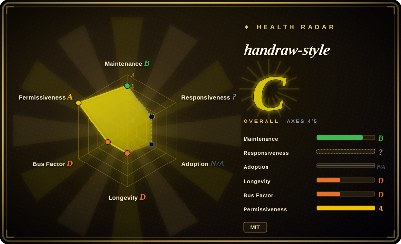
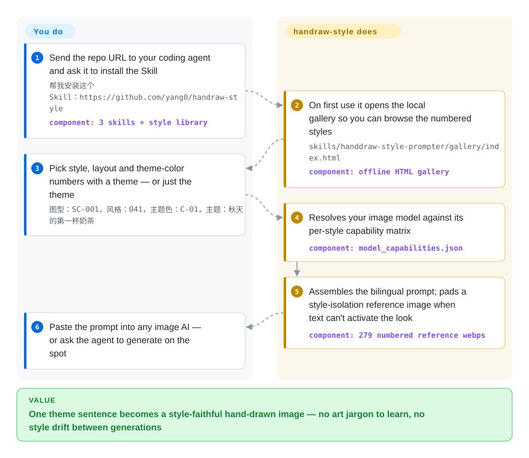

# handraw-style

You tell an image AI "cute hand-drawn style" and it keeps returning the same generic clip-art look. handraw-style numbers 279 hand-drawn styles, 122 layout templates and 36 theme colors, and its agent skills assemble bilingual prompts with a per-model strategy: activate the style by text when the model understands it, otherwise fall back to a numbered reference image.

## When to use

You publish visual content in Chinese — Xiaohongshu carousels, WeChat top images, knowledge long-form infographics, four-panel comics — from inside a coding agent, and image generation is your bottleneck: every "文艺一点、可爱一点" prompt drifts to a different, mediocrity-generic illustration, and re-rolling until it looks right is your cost. handraw-style turns that into selection: browse the numbered gallery, say `041号风格，主题：秋天的第一杯奶茶` (optionally with a layout `SC-001` and a theme color `C-01`), and the installed skill emits a tested Chinese + English prompt, or the image itself if you ask.

Pick it over a generic image-prompt library because the *number* is a stable brief: `#041` means the same look to you, your editor and your agent next month. Pick it over a single-persona illustration skill when you want to switch aesthetics per piece — 279 styles across ink-wash, chibi, woodcut, Van Gogh impasto — instead of locking one character. The differentiator against hand-rolling prompts is the model-activation data: a per-style matrix records whether the current image model evokes each style from its name/traits alone, and only injects a reference image where it doesn't.

## How it works

The repo ships no model; it is a skill pack — Markdown instruction files, JSON indexes, Python builders, and roughly 500 webp reference images. The root `SKILL.md` is the install entrypoint and routes requests between three skills: `handdraw-style-prompter` (style/layout/color → prompt), `article-illustration-planner` (reads an article, decides where illustrations add value, plans shots and writes their prompts), and `poster-prompt-generator` (structured 8-field poster briefs). Its real mechanism is `references/model_capabilities.json`: for each style and each calibrated model, whether the style is *name-activated* — the model reproduces the look just from the artist/style name — or needs positive trait descriptions, or needs a numbered reference image (`images/individual/{bucket}/{number}.webp`). When a reference image is used, the skill attaches a fixed "style-only" instruction block that tells the image model to borrow linework, medium and palette from it and to ignore its subject, composition and text, so the pad image never drags your theme along. You pick numbers and supply a theme; the skill does prompt assembly, and by default stops at copyable prompts — it only generates when you explicitly ask. The capability matrix is fully calibrated for `gpt-image-2` only; every other model (Midjourney, Flux, SD, Imagen) gets the reference-image fallback path.

<!-- flow-steps:begin (generated from flows/handraw-style.json by tools/flow_card.py — do not edit) -->

Text version of the flow

1. **You**: Send the repo URL to your coding agent and ask it to install the Skill — `帮我安装这个 Skill：https://github.com/yang0/handraw-style` — component: `3 skills + style library`
2. **handraw-style**: On first use it opens the local gallery so you can browse the numbered styles — `skills/handdraw-style-prompter/gallery/index.html` — component: `offline HTML gallery`
3. **You**: Pick style, layout and theme-color numbers with a theme — or just the theme — `图型：SC-001，风格：041，主题色：C-01，主题：秋天的第一杯奶茶`
4. **handraw-style**: Resolves your image model against its per-style capability matrix — component: `model_capabilities.json`
5. **handraw-style**: Assembles the bilingual prompt; pads a style-isolation reference image when text can't activate the look — component: `279 numbered reference webps`
6. **You**: Paste the prompt into any image AI — or ask the agent to generate on the spot

**Value**: One theme sentence becomes a style-faithful hand-drawn image — no art jargon to learn, no style drift between generations

<!-- flow-steps:end -->

## When NOT to use

- **You need a deterministic, editable artifact, not an AI image.** handraw-style outputs prompts for image models; the pixels are whatever the AI renders and can't be re-templated. If the deliverable is a card or cover you can version-control and tweak, use [guizang-social-card](guizang-social-card.md) or [html-anything](../../ai-design-generation/html-anything.md), which render HTML→PNG.
- **You want one locked visual identity across everything.** The 279-style breadth is the opposite of brand consistency. For a single fixed illustration persona applied corpus-wide, pick [ian-xiaohei-illustrations](ian-illustrations.md) instead; handraw-style exists precisely to vary.
- **Style fidelity must live inside your own pipeline.** There is no training, no LoRA, no node graph here — the skill only hands prompts off to whatever image AI you paste into. If you need batch, self-hosted, or pipeline-controllable rendering, use [ComfyUI](../../on-device-ml/local-image-generation/comfyui.md).
- **You need reproducible numbering.** Style numbers are mutable content: commit history shows `#257`, `#259` and `#260` were each *replaced* with different styles within weeks. A prompt you saved as "#260" may mean a different look after the next update — pin a version or fork before relying on an number across time.
- **You need a cleared commercial look.** Many styles are keyed to named artists (David Shrigley, Quentin Blake, living and deceased — the repo tracks this in `attribution.json`), and reference images were imported from X posts by `scrape_tweet.py`. MIT covers the code and prompts; it cannot convey rights to the bundled artwork, and mimicking a living artist's style commercially carries risk you own, not the license's. [推断]
- **Your host isn't Codex-friendly.** First-session initialization calls a Codex-only MCP tool (`mcp__codex_app__open_in_codex`) to open the gallery; other agents degrade to a manual `file://` link. Also budget a ~250 MB clone for the image assets, and expect Chinese-social-media framing throughout.

## Comparison

| Alternative | In index | Our verdict | Tradeoff |
|---|---|---|---|
| [ian-xiaohei-illustrations](ian-illustrations.md) | ✅ | Choose ian when one fixed hand-drawn persona must voice a whole Chinese article corpus consistently; choose handraw-style when you want 279 switchable aesthetics plus numbered layouts and palettes. | Breadth and numbered reproducibility vs. the guaranteed coherence of a single IP. |
| [Guizang Social Card Skill](guizang-social-card.md) | ✅ | Choose guizang when the deliverable is the rendered card itself — art-directed HTML→PNG with no image model in the loop. | Deterministic, editable output vs. AI-generated images that vary per roll and can't be re-templated. |
| [prompts.chat](../prompt-engineering/prompts-chat.md) | ✅ | Choose prompts.chat when you need a general, community-voted, self-hostable prompt platform across many tools; handraw-style is one curated domain with agent-skill wiring attached. | Curated depth + per-model activation data vs. platform breadth with no skill integration. |
| [ComfyUI](../../on-device-ml/local-image-generation/comfyui.md) | ✅ | Choose ComfyUI when style control must be self-hosted and pipeline-grade (LoRAs, ControlNet, batch); handraw-style emits prompts and delegates all rendering. | Total control over generation vs. zero-runtime prompt packs that ride any hosted AI. |
| Midjourney style references (`sref`) | not a repo | Choose it when you live inside Midjourney and want native code-level style transfer; handraw-style is host-agnostic and bilingual, and its isolation block is designed to avoid exactly the content-bleed `sref` tends to cause. | Platform-native convenience vs. multi-model coverage; `sref` is a feature of a closed service, not an artifact you can fork. |

## Health & viability

- **Maintenance (as of 2026-09-28):** created 2026-09-05, still pushing daily; `version.json` reads 1.2.24 while the newest git tag is v1.2.11 — versioning/tags are inconsistent, and there are no GitHub releases, so "cadence" is really "one person committing fast". Active but only ~3 weeks of history.
- **Governance / bus factor:** single maintainer (`yang0`, User-owned repo, 65/65 commits). Issue responsiveness is real — bug reports (#4 missing script modules, #5 prompt/preview mismatch) were closed with fixes within days — but 4 issues remain open and there's no CONTRIBUTING or team. If the author stops, the library freezes. [推断]
- **Age & Lindy:** 23 days old with ~3.5k stars and 446 forks. That is young-and-viral, the risk-flag combination Lindy warns about; growth plausibly rides the Chinese creator-economy wave (the README funnels to WeChat groups, a "monetization" Feishu wiki). No track record yet. [推断]
- **Backing:** a solo creator's audience play — no foundation, no corporate sponsor visible. Sustainability likely tied to community/monetization momentum rather than infrastructure need.
- **Risk flags:** bundled artwork provenance (artist-named styles, tweet-scraped reference images) sits outside what MIT can license; style numbers are rewritten in place; the capability matrix covers one model; the repo is ~250 MB of binary assets, which slows re-verification and forks.

## Caveats (unverified)

- [未验证] "100% 忠实还原该编号对应的线条、质感与配色" (reference-image fallback fidelity) is the author's claim in README.md; no third-party evaluation found. Not verifiable without running each of 279 styles across models.
- [推断] The MIT `LICENSE` (verified text, (c) 2026 yang0) covers the repository's code and prompts, but the ~500 bundled webp style images and artist-derived style descriptions cannot be relicensed by the author; commercial-use exposure is the user's own judgment.
- [推断] Star growth attributed to Chinese social-media/community promotion (README links WeChat groups + a Feishu knowledge base with a "创业与变现" section); no independent traffic evidence checked.
- [未验证] Cross-host install ("Codex, Claude Code, Cursor, WorkBuddy, OpenCode" per README_en.md) — only the Codex path is spelled out in SKILL.md files; other hosts not tested here.
- [推断] Style count is inconsistent in the sources: README says 279 styles, while `handdraw-style-prompter/SKILL.md` repeatedly says 278 (#001–#278); both are quoted as of v1.2.24.
- [未验证] Per-style name/traits activation grades in `model_capabilities.json` are author-reported blind-test results ("基于实际盲测"); methodology and sample size are not published.
- [未验证] GitHub linguist reports HTML (742 KB) + Python (296 KB); the bulk of the actual content is Markdown + JSON + webp, which linguist does not show.
