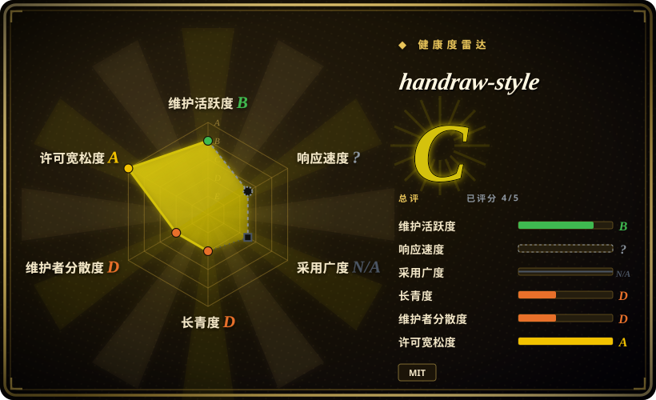
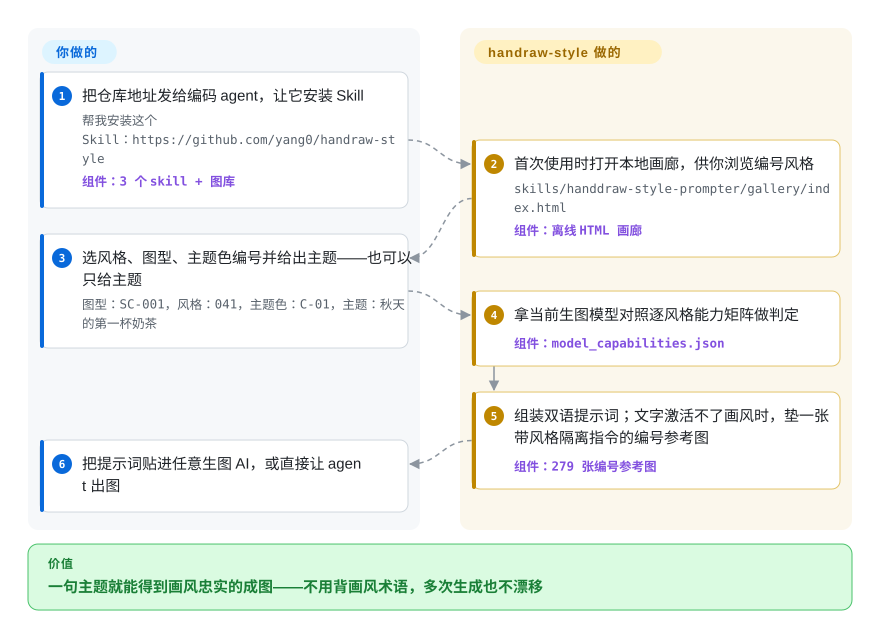

# handraw-style

让生图 AI 画点「可爱手绘风」，它十次有九次吐回同一款剪贴画味儿的图。handraw-style 把 279 种手绘画风、122 种版面图型、36 种主题色编成号，agent 装上它的 skill 后按编号拼出中英双语提示词，并且看模型下菜：文字能激活画风就纯文字出词，激活不了就垫一张编号参考图兜底。

## 何时使用

你在编码 agent 里生产中文视觉内容——小红书图文、公众号题图、科普长图、四格条漫——卡点一直是生图：每次「文艺一点、可爱一点」都漂回一张平庸的通用插画，反复重新生成到像样才是主要成本。handraw-style 把这件事变成选型：翻编号图鉴，说一句 `041号风格，主题：秋天的第一杯奶茶`（可再带图型 `SC-001`、主题色 `C-01`），装好的 skill 就交付实测过的中文 + 英文双语提示词，明确要求时直接出图。

它比通用提示词库强的地方在于**编号是稳定的需求单**：`#041` 对你、对编辑、对下个月的 agent 都指向同一张脸。它比单一 IP 配图 skill 强的地方在于每篇可换画风——279 种里从水墨写意、Q 版、木刻版画到梵高厚涂随取随用，而不是锁死一个角色。相比手写提示词，真正的差异是那份逐风格、逐模型的激活数据：当前生图模型能不能只凭画风名激活，能就纯文字，不能才垫参考图。

## 怎么用起来

仓库不带任何模型，本质是一个 skill 包——Markdown 指令文件、JSON 索引、Python 构建脚本，外加约 500 张 webp 参考图。根目录 `SKILL.md` 是安装入口，把请求路由到三个 skill：`handdraw-style-prompter`（风格/图型/主题色 → 提示词）、`article-illustration-planner`（读文章、判断哪几段值得配图、规划镜头并写提示词）、`poster-prompt-generator`（按 8 个设计字段组装海报指令）。真正的机制在 `references/model_capabilities.json`：逐风格、逐模型记录该画风能否被「名字激活」——即模型只凭画家名/风格名就能画出那味儿；不能就附正向特征描述；还不行就必须垫编号参考图（`images/individual/{bucket}/{number}.webp`），并注入一段固定的「只借画风」指令，要求生图模型只取线条、媒介、配色，忽略参考图里的主体、构图与文字，垫图不会把你的主题带跑。你只负责选编号、给主题；skill 负责组装，默认交付可复制的双语提示词，只有你明确要图它才调用生图。能力矩阵只对 `gpt-image-2` 做了全量标定，其余模型（Midjourney、Flux、SD、Imagen）一律走参考图兜底。

<!-- flow-steps:begin (generated from flows/handraw-style.json by tools/flow_card.py — do not edit) -->

流程文字版

1. **你**：把仓库地址发给编码 agent，让它安装 Skill — `帮我安装这个 Skill：https://github.com/yang0/handraw-style` — 组件：`3 个 skill + 图库`
2. **handraw-style**：首次使用时打开本地画廊，供你浏览编号风格 — `skills/handdraw-style-prompter/gallery/index.html` — 组件：`离线 HTML 画廊`
3. **你**：选风格、图型、主题色编号并给出主题——也可以只给主题 — `图型：SC-001，风格：041，主题色：C-01，主题：秋天的第一杯奶茶`
4. **handraw-style**：拿当前生图模型对照逐风格能力矩阵做判定 — 组件：`model_capabilities.json`
5. **handraw-style**：组装双语提示词；文字激活不了画风时，垫一张带风格隔离指令的编号参考图 — 组件：`279 张编号参考图`
6. **你**：把提示词贴进任意生图 AI，或直接让 agent 出图

**价值**：一句主题就能得到画风忠实的成图——不用背画风术语，多次生成也不漂移

<!-- flow-steps:end -->

## 何时不用

- **要的是确定、可编辑的成品，不是 AI 成图。** handraw-style 交付给生图模型的只是提示词，像素每次 roll 都不同、无法回头改模板。若交付物是能做版本管理、能微调的卡片封面，用 [guizang-social-card](guizang-social-card.zh.md) 或 [html-anything](../../ai-design-generation/html-anything.zh.md)，它们走 HTML→PNG 渲染。
- **要一套锁死的视觉标识贯穿全部内容。** 279 种画风的「广」正是品牌一致性的反面。要单一固定插画人格反复出场，选 [ian-xiaohei-illustrations](ian-illustrations.zh.md)；本页项目存在的意义恰恰是换着来。
- **画风控制必须放进自己的管线。** 这里没有训练、没有 LoRA、没有节点图，skill 把提示词交给任何你粘贴的生图 AI，渲染完全外包。要批量化、自托管、管线可控的出图，用 [ComfyUI](../../on-device-ml/local-image-generation/comfyui.zh.md)。
- **要编号可复现。** 风格编号是可变内容：提交记录显示 `#257`、`#259`、`#260` 都在几周内被整体*替换*成别的风貌。你存下的「260 号提示词」下次更新后可能指向另一张脸——跨时间依赖编号前先锁版本或 fork。
- **要商业上干净的画风。** 大量风格直接挂在具名画家身上（David Shrigley、Quentin Blake，在世与否仓库用 `attribution.json` 标了），参考图又是 `scrape_tweet.py` 从 X 帖子抓回的。MIT 只覆盖代码与提示词，覆盖不了打包的美术作品；模仿在世画家的商业风险由使用者自担，许可帮不了你。[推断]
- **宿主不是 Codex 系。** 首轮会话初始化调用 Codex 专属 MCP 工具（`mcp__codex_app__open_in_codex`）打开画廊，其他 agent 会退化成手动点 `file://` 链接；另外克隆体积约 250 MB 的图片资产，整体语境也默认中文社媒。

## 横向对比

| 替代品 | 是否收录 | 我们的评价 | 取舍 |
|---|---|---|---|
| [ian-xiaohei-illustrations](ian-illustrations.zh.md) | ✅ | 要让一个固定手绘 IP 在整篇中文文章里稳定出场，选 ian；要每篇换画风、要编号化的图型与配色，选 handraw-style。 | 编号化的广度与可复现 vs. 单一 IP 的绝对一致性。 |
| [Guizang Social Card Skill](guizang-social-card.zh.md) | ✅ | 交付物就是渲染好的卡片本身（HTML→PNG、不经过生图模型）时选 guizang。 | 确定可编辑的产物 vs. 每次 roll 都变、无法回改的 AI 成图。 |
| [prompts.chat](../prompt-engineering/prompts-chat.zh.md) | ✅ | 要跨工具、社区投票、可自托管的通用提示词平台选 prompts.chat；handraw-style 是单一垂类的策展库，且带 agent skill 接线。 | 策展深度 + 逐模型激活数据 vs. 平台广度、无技能集成。 |
| [ComfyUI](../../on-device-ml/local-image-generation/comfyui.zh.md) | ✅ | 画风控制必须自托管、进管线（LoRA、ControlNet、批量）时选 ComfyUI；handraw-style 只出提示词，渲染全部外包。 | 对生成的完全控制 vs. 零运行时、随贴随用的提示词包。 |
| Midjourney style reference（`sref`） | 非仓库 | 只在 Midjourney 里生活、要平台原生风格码时选它；handraw-style 跨宿主、双语，其隔离指令正是为了避开 `sref` 常见的内容串味。 | 平台原生便利 vs. 多模型覆盖；`sref` 是闭源服务的功能，不是可 fork 的仓库。 |

## 健康度与可持续性

- **维护（截至 2026-09-28）：** 2026-09-05 创建，仍在日更；`version.json` 到 1.2.24 而最新 git tag 停在 v1.2.11——版本号与 tag 脱节，GitHub 无 release，所谓「节奏」其实是一个人快节奏提交。活跃，但历史只有约 3 周。
- **治理 / 巴士因子：** 单人维护（`yang0`，User 账号，65/65 提交）。issue 响应是真实的：脚本缺模块（#4）、提示词与预览不符（#5）都在数天内被修复关闭；但仍挂着 4 个 open，且无 CONTRIBUTING、无团队。作者停下，图库就冻结。[推断]
- **年龄与 Lindy 判定：** 23 天、约 3.5k star、446 fork——典型「年轻 + 病毒式」，正是 Lindy 提醒警惕的组合（高星新库是风险信号而非背书）。README 引流微信群与带「创业与变现」栏目的飞书知识库，增长大概率吃的是中文创作者社区的热度，可持续性未经验证。[推断]
- **背书：** 个人作者的影响力项目，未见基金会或企业赞助；续航更可能绑在社群变现动能上，而非基础设施刚需。
- **风险信号：** 打包美术作品的版权来源（具名画家风格 + 抓推参考图）超出 MIT 能授予的范围；风格编号原地替换、不承诺稳定；能力矩阵只覆盖一个模型；约 250 MB 二进制资产拖慢 fork 与复核。

## 存疑（未验证）

- [未验证] 「100% 忠实还原该编号对应的线条、质感与配色」是 README 作者自述，未找到第三方评测；不逐个跑 279 种风格 × 多模型无法证实。
- [推断] `LICENSE` 已读（MIT，(c) 2026 yang0），覆盖的是代码与提示词；约 500 张打包 webp 风格图与画家风格描述不在作者可再授权的范围内，商用暴露由使用者自行判断。
- [推断] 星数增长归因于中文社媒/社群推广（README 挂微信群二维码与飞书知识库入口），未核查独立流量来源。
- [未验证] README_en 宣称可装进「Codex、Claude Code、Cursor、WorkBuddy、OpenCode」，但 SKILL.md 只写明了 Codex 路径；其余宿主本次未实测。
- [推断] 风格总数在源文件中不一致：README 称 279 种，`handdraw-style-prompter/SKILL.md` 多处写 278（#001–#278），两个口径均截至 v1.2.24。
- [未验证] `model_capabilities.json` 的逐风格激活等级是作者自述「基于实际盲测」，方法与样本量未公开。
- [未验证] GitHub linguist 只报 HTML（742 KB）+ Python（296 KB）；内容主体其实是 Markdown + JSON + webp，linguist 不显示。
