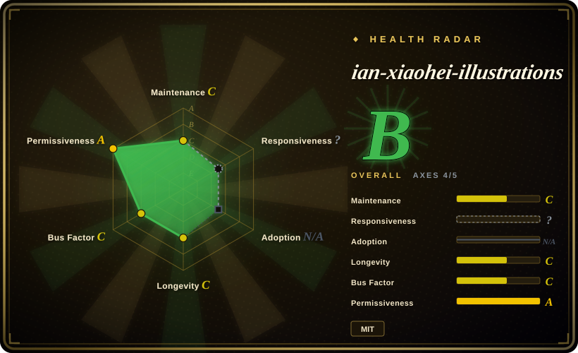
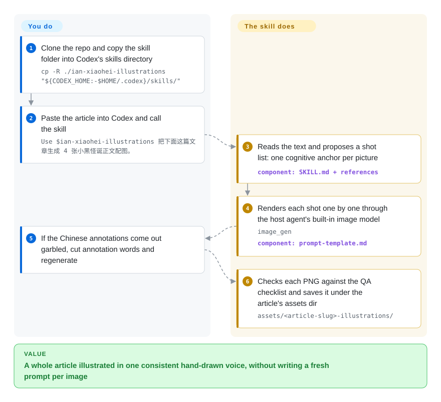

# ian-xiaohei-illustrations

The Chinese article you just wrote has a judgment that begs for a picture — but a stock banner misses the point, and writing a fresh image prompt per figure makes the visuals drift. This skill has your coding agent read the prose, pick the spots worth illustrating, and render 4–8 hand-drawn 16:9 sketches around one recurring ink character, 小黑, using your host agent's own image model.

## When to use

You're writing a Chinese long-form piece — a 公众号 post, a Notion methodology doc, a blog — and the prose is carrying ideas that *want* a picture: a two-breakpoint judgment, an input→output loop, a before/after, a "one fish, many dishes" reuse. You don't want a stock-photo banner or a tidy corporate infographic; you want something that looks like the author sketched it by hand and is a little weird but lands the point. You drop the article into your coding agent (Codex), invoke this skill, and it first reads the text to find the *cognitive anchors* worth illustrating, proposes a shot list (which paragraph, the core meaning, the structure type, what 小黑 is doing, suggested Chinese annotations), and then — using the agent's built-in `image_gen` — renders each shot as a separate white-background line drawing with sparse red/orange/blue handwritten notes.

Reach for it specifically when consistency of *one* visual voice matters across a whole article and you'd rather steer with a persona ("小黑 pulling the rope", "小黑 stamping the toolbox") than hand-write a fresh prompt per image. The skill is a set of reference docs — style DNA, the IP's action library, composition patterns, a prompt template, a QA checklist — that constrain the model toward a coherent, repeatable look rather than letting each call drift.

## How it works

It is a prompt/style pack, not software: a `SKILL.md` pipeline plus reference docs (style DNA, the 小黑 IP's action library, composition patterns, a prompt template, a QA checklist) that your agent reads on demand. Once invoked with an article, the agent proposes a shot list — a plan of candidate illustrations, each built around one "cognitive anchor" (the judgment, flow, before/after or metaphor a paragraph carries) — defaulting to 4–8 pictures. For each shot it invents a fresh low-tech physical metaphor, assembles a prompt from the template, and calls the host agent's built-in image tool (`image_gen`) once per picture; the repo ships no model, API key or renderer of its own. It then checks every PNG against the QA checklist — white background, generous margins, 小黑 actually performing the core action, short Chinese annotations — and saves the set under `assets/<article-slug>-illustrations/`. What stays yours: supplying the article, steering the shot list, and re-requesting any shot whose Chinese text came out garbled (the README's advice: cut annotation words and regenerate).

<!-- flow-steps:begin (generated from flows/ian-illustrations.json by tools/flow_card.py — do not edit) -->

Text version of the flow

1. **You**: Clone the repo and copy the skill folder into Codex's skills directory — `cp -R ./ian-xiaohei-illustrations "${CODEX_HOME:-$HOME/.codex}/skills/"`
2. **You**: Paste the article into Codex and call the skill — `Use $ian-xiaohei-illustrations 把下面这篇文章生成 4 张小黑怪诞正文配图。`
3. **ian-xiaohei-illustrations**: Reads the text and proposes a shot list: one cognitive anchor per picture — component: `SKILL.md + references`
4. **ian-xiaohei-illustrations**: Renders each shot one by one through the host agent's built-in image model — `image_gen` — component: `prompt-template.md`
5. **You**: If the Chinese annotations come out garbled, cut annotation words and regenerate
6. **ian-xiaohei-illustrations**: Checks each PNG against the QA checklist and saves it under the article's assets dir — `assets/<article-slug>-illustrations/`

**Value**: A whole article illustrated in one consistent hand-drawn voice, without writing a fresh prompt per image

<!-- flow-steps:end -->

## When NOT to use

- **You need editable vector/structured artifacts.** It outputs PNGs only — it explicitly refuses PPTX/PDF/Keynote and SVG/HTML/Canvas editable graphics. If you need an editable deck or a card you can re-template, use [guizang-ppt](../slides-ppt/guizang-ppt.md) or [guizang-social-card](guizang-social-card.md) / [html-anything](../../ai-design-generation/html-anything.md).
- **Your content isn't Chinese (or isn't prose).** The whole skill is tuned for Chinese articles and Chinese handwritten annotations; English decks, data dashboards, or UI mockups are out of scope.
- **You want commercial illustration, cute cartoons, or dense infographics.** The skill deliberately steers *away* from polished commercial art and text-heavy infographics — that's a non-goal, not a limitation to work around.
- **Your host agent has no image-generation tool.** This is a prompt/skill pack, not a renderer: it assumes an agent with a built-in `image_gen` (the repo is packaged as a Codex skill). Without that, you get shot lists but no pictures.
- **You need brand/style lock-in or guaranteed reproducibility.** Output quality and adherence track whatever image model your agent calls; the skill biases the look but cannot pin exact results, and the 小黑 IP is one specific aesthetic you may not want.
- **Maturity:** small single-author skill at v1.0.0; treat longevity and ongoing maintenance as unproven.

## Comparison

| Alternative | In index | Our verdict | Tradeoff |
|---|---|---|---|
| [guizang-social-card](guizang-social-card.md) | ✅ | Choose guizang-social-card when you need polished social/quote cards rather than hand-drawn article sketches. | Generates polished social/quote cards (often via editable templates), not hand-drawn in-article explanatory sketches; different visual register. |
| [guizang-ppt](../slides-ppt/guizang-ppt.md) | ✅ | Choose guizang-ppt when you need structured multi-page slide decks. | Builds slide decks (structured, multi-page); this skill makes single-concept inline illustrations and refuses decks. |
| [html-anything](../../ai-design-generation/html-anything.md) | ✅ | Choose html-anything when you need editable/hostable HTML/CSS artifacts. | Produces HTML/CSS artifacts you can edit and host; this produces flat PNGs in one fixed art style. |
| [open-design](../../ai-design-generation/open-design.md) | ✅ | Choose open-design when you need reusable UI/design-system artifacts. | Toward reusable UI/design-system artifacts; orthogonal to a hand-drawn article-illustration persona. |
| [impeccable](../../ai-design-generation/impeccable.md) | ✅ | Choose impeccable when your target is general design artifacts rather than a fixed Chinese illustration voice. | Different generation target (design artifacts) rather than a fixed-IP Chinese illustration voice. |
| nano-banana / gpt-image prompt packs | 未收录 | Choose generic image-prompt packs when raw model access is enough. | Generic image-prompt collections give you raw model access with no article-analysis, shot-list, or consistent-IP layer this skill adds. |

## Health & viability

- **Responsiveness**: Cannot be scored — type_na.
- **Maintenance (as of 2026-09):** pushed 2026-09-24, not archived; the June snapshot's 111-day silence has ended and activity resumed. The repo was still *created 2026-05-27*, so ~4 months of history — the tagged release is still v1.0.0 even though pushes continued, so "release cadence" cannot be judged yet. [推断]
- **Governance & bus factor:** a `User`-owned, single-author skill (helloianneo); one person owns the 小黑 IP, the style DNA and the prompt templates. Classic single-maintainer bus-factor risk — if the author stops, nothing carries it. [推断]
- **Age & Lindy verdict:** age ~4 months with ~12.2k stars (2026-09) is **young + fast-hyped, longevity unproven**; it has not survived long enough for Lindy to say anything. Bet on the *idea* (a consistent illustration persona), not on this repo being here in two years. [推断]
- **Risk flags:** it is a thin prompt/style layer with no renderer of its own (depends on the host agent's `image_gen`), and the README now frames install as Codex-only, so other hosts are on you to adapt. Low lock-in (MIT, plain markdown, LICENSE file present since the 2026-09 check) offsets this — you can fork and keep the prompts.

## Caveats (unverified)

- [未验证] Star count ~12.2k as of 2026-09-28 (`gh api`); GitHub stars are date-sensitive — indicative only.
- [推断] The README and SKILL.md frame the skill as a **Codex** skill (install path `${CODEX_HOME:-$HOME/.codex}/skills/`, `agents/openai.yaml`); running it under Claude Code or other hosts is untested here — verify against your own agent.
- [未验证] Rendering fidelity depends on the host agent's built-in `image_gen` tool (SKILL.md, 2026-09); the repo ships no model or API key, and we did not generate images to confirm output quality.
- [未验证] "4–8 illustrations per article" and the refused-output list (PPTX/SVG/etc.) come from README/SKILL.md's own instructions, not independent testing.
