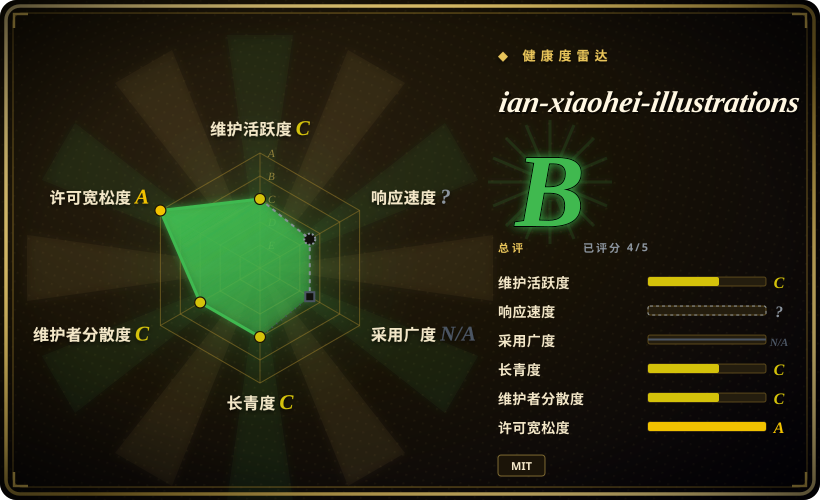
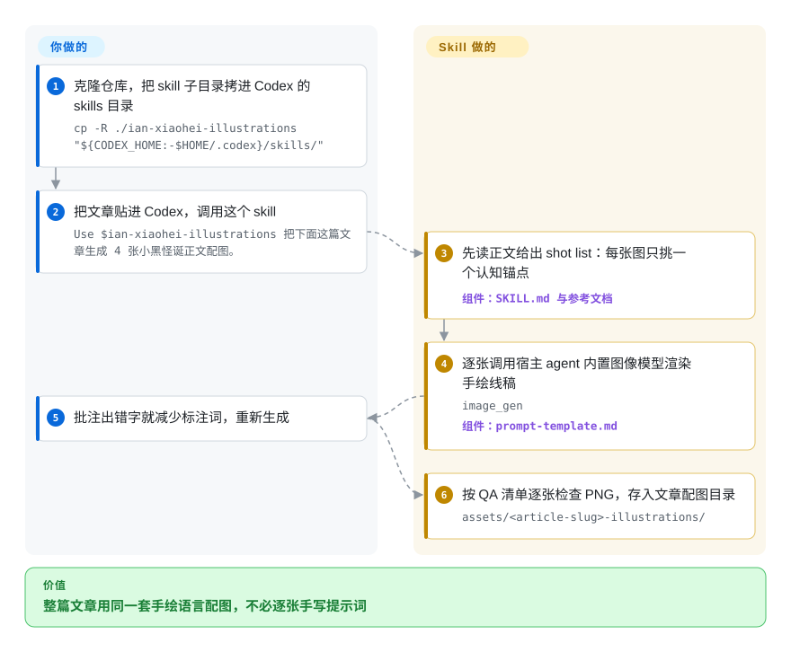

# ian-xiaohei-illustrations

你刚写完的中文文章里有个判断天生「想要一张图」——但图库 banner 词不达意，逐张手写提示词又让画风四处漂移。这个 skill 让你的 coding agent 先读正文、挑出值得配图的段落，再围绕同一个「小黑」墨点角色，用宿主 agent 自带的图像模型渲染出 4–8 张手绘 16:9 配图。

## 何时使用

你在写一篇中文长内容——公众号推文、Notion 方法论文档、博客——正文里有些观点天生「想要一张图」：两个断点的判断、输入→输出闭环、前后对比、「一鱼多吃」式复用。你不想要图库 banner，也不想要规整的商业信息图，而是想要一种「像作者亲手画的、有点怪但能戳中要点」的东西。于是你把文章丢进你的 coding agent（Codex），调用这个 skill：它先读正文、找出值得配图的「认知锚点」，给出一份 shot list（放在哪一段、核心意思、结构类型、小黑在做什么、建议的中文手写批注），再用 agent 内置的 `image_gen`，把每张图单独渲染成纯白背景的手绘线稿，配上少量红/橙/蓝手写标注。

当你需要整篇文章保持**同一种视觉嗓音**、并且更愿意用一个人设（「小黑拉线」「小黑盖章工具箱」）来掌舵、而不是逐图手写提示词时，它尤其合适。这个 skill 本质是一组参考文档——风格 DNA、小黑 IP 的动作库、构图模式、提示词模板、QA 检查清单——用来把模型约束到一致、可复用的观感上，而不是让每次调用各自漂移。

## 怎么用起来

它是一组提示词/风格包，不是软件：一份 `SKILL.md` 流程加上参考文档（风格 DNA、小黑的动作库、构图模式、提示词模板、QA 清单），由你的 agent 按需读取。被调用并拿到文章后，agent 先给出 shot list——候选配图清单，每张只围绕一个「认知锚点」（某段正文承载的判断、流程、前后对比或隐喻）——默认 4–8 张。每张图重新发明一个低科技物理隐喻，按模板拼出提示词，然后逐张调用宿主 agent 内置的图像工具（`image_gen`）；仓库自身不带模型、API key 或渲染器。接着按 QA 清单逐张检查——纯白背景、大量留白、小黑必须真的在承担核心动作、中文批注要短——并把成品存到 `assets/<article-slug>-illustrations/`。仍归你的部分：提供文章、修正 shot list、以及图里中文出错字时按 README 建议减少标注词重新生成。

<!-- flow-steps:begin (generated from flows/ian-illustrations.json by tools/flow_card.py — do not edit) -->

流程文字版

1. **你**：克隆仓库，把 skill 子目录拷进 Codex 的 skills 目录 — `cp -R ./ian-xiaohei-illustrations "${CODEX_HOME:-$HOME/.codex}/skills/"`
2. **你**：把文章贴进 Codex，调用这个 skill — `Use $ian-xiaohei-illustrations 把下面这篇文章生成 4 张小黑怪诞正文配图。`
3. **ian-xiaohei-illustrations**：先读正文给出 shot list：每张图只挑一个认知锚点 — 组件：`SKILL.md 与参考文档`
4. **ian-xiaohei-illustrations**：逐张调用宿主 agent 内置图像模型渲染手绘线稿 — `image_gen` — 组件：`prompt-template.md`
5. **你**：批注出错字就减少标注词，重新生成
6. **ian-xiaohei-illustrations**：按 QA 清单逐张检查 PNG，存入文章配图目录 — `assets/<article-slug>-illustrations/`

**价值**：整篇文章用同一套手绘语言配图，不必逐张手写提示词

<!-- flow-steps:end -->

## 何时不用

- **你需要可编辑的矢量/结构化产物。** 它只输出 PNG，并明确拒绝 PPTX/PDF/Keynote 和 SVG/HTML/Canvas 可编辑图。要可编辑的 deck 或可改模板的卡片，用 [guizang-ppt](../slides-ppt/guizang-ppt.zh.md) 或 [guizang-social-card](guizang-social-card.zh.md) / [html-anything](../../ai-design-generation/html-anything.zh.md)。
- **你的内容不是中文（或不是散文）。** 整个 skill 是为中文文章和中文手写批注调校的；英文 deck、数据看板、UI 稿都在范围外。
- **你想要商业插画、可爱卡通或密集信息图。** skill 刻意**避开**精修商业画风和文字密集的信息图——这是 non-goal，不是可绕过的限制。
- **你的宿主 agent 没有图像生成工具。** 它是提示词/skill 包，不是渲染器：默认 agent 自带 `image_gen`（仓库按 Codex skill 打包）。没有这个工具，你只能拿到 shot list，没有图。
- **你需要品牌/风格锁定或可复现保证。** 出图质量与贴合度取决于你 agent 调用的图像模型；skill 只能偏置观感、无法钉死结果，而且小黑 IP 是一种特定审美，未必是你想要的。
- **成熟度：** 单作者小 skill，v1.0.0；长期维护与延续性都尚未被证明。

## 横向对比

| 替代品 | 是否收录 | 我们的评价 | 取舍 |
|---|---|---|---|
| [guizang-social-card](guizang-social-card.zh.md) | ✅ | 需要精修社交/金句卡片而非手绘正文解释草图时，选 guizang-social-card。 | 生成精修的社交/金句卡片（常走可编辑模板），不是手绘的正文解释草图；视觉调性不同。 |
| [guizang-ppt](../slides-ppt/guizang-ppt.zh.md) | ✅ | 需要结构化多页幻灯片 deck 时，选 guizang-ppt。 | 做幻灯片 deck（结构化、多页）；本 skill 只做单概念正文配图，并拒绝做 deck。 |
| [html-anything](../../ai-design-generation/html-anything.zh.md) | ✅ | 需要可编辑、可托管的 HTML/CSS 产物时，选 html-anything。 | 产出可编辑、可托管的 HTML/CSS 产物；本 skill 产出固定画风的扁平 PNG。 |
| [open-design](../../ai-design-generation/open-design.zh.md) | ✅ | 需要可复用 UI/设计系统产物时，选 open-design。 | 偏向可复用的 UI/设计系统产物；与「固定 IP 的中文配图嗓音」是正交诉求。 |
| [impeccable](../../ai-design-generation/impeccable.zh.md) | ✅ | 目标是通用设计产物而非固定中文插画 voice 时，选 impeccable。 | 生成目标不同（设计类产物），而非固定 IP 的中文插画风格。 |
| nano-banana / gpt-image 提示词包 | 未收录 | 裸模型访问已经足够时，选通用出图提示词包。 | 通用出图提示词集合给你裸的模型访问，但没有本 skill 的文章分析、shot list、一致 IP 这一层。 |

## 健康度与可持续性

- **响应速度**：无法计算——type_na。
- **维护（截至 2026-09）：** 最后 push 2026-09-24，未归档；6 月快照里 111 天的沉寂已经结束、活动恢复。但仓库*创建于 2026-05-27*，只有约 4 个月历史——push 一直在进行而 tag 仍是 v1.0.0，发布节奏暂时无从判断。[推断]
- **治理与 bus factor：** `User` 所有、单作者（helloianneo）；小黑 IP、风格 DNA 和提示词模板都由一人掌握。典型的单维护者 bus-factor 风险——作者一旦停手，没人接得住。[推断]
- **年龄与 Lindy 判断：** 约 4 个月大却有约 12.2k star（2026-09），属于**年轻＋快速炒作、延续性未被证明**；它还没活够长到 Lindy 能说什么。押注它背后的*想法*（一致的插画人设），而不是押这个仓库两年后还在。[推断]
- **风险标记：** 它是一层薄薄的提示词/风格层，自身不带渲染器（依赖宿主 agent 的 `image_gen`），且 README 现在把安装框定为 Codex 专用，其他宿主得自行适配。低锁定（MIT、纯 markdown，2026-09 检查时 LICENSE 文件在仓库里）抵消了部分风险——你可以 fork 把提示词留下。

## 存疑（未验证）

- [未验证] star 数约 12.2k（2026-09-28，`gh api`）；GitHub star 对时间敏感，仅供参考。
- [推断] README 与 SKILL.md 把 skill 框定为 **Codex** skill（安装路径 `${CODEX_HOME:-$HOME/.codex}/skills/`、`agents/openai.yaml`）；在 Claude Code 等其他宿主上运行未经测试——依赖前请对照你自己的 agent 核实。
- [未验证] 出图保真度取决于宿主 agent 内置的 `image_gen`（SKILL.md，2026-09）；仓库不带模型或 API key，我们未实际生成图片验证质量。
- [未验证] 「每篇 4–8 张」和被拒绝的输出清单（PPTX/SVG 等）来自 README/SKILL.md 自身的指令，并非独立测试结论。
