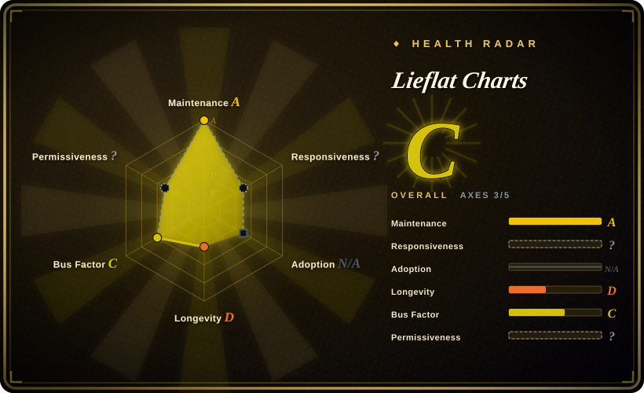
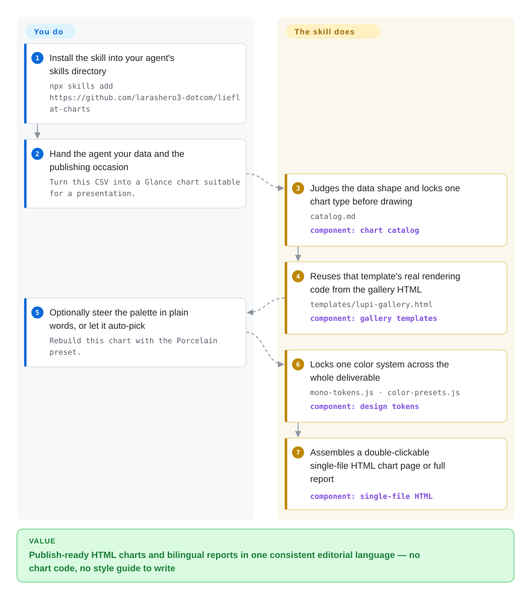

# Lieflat Charts

You ask your coding agent to "turn this CSV into a chart" and it returns a default-styled bar: correct, generic, and something you would not paste into an article or send to your boss. Lieflat Charts is an installable agent skill that forces the agent to build every chart from a numbered catalog of hand-designed templates and ship one double-clickable HTML file — charts, or full-page bilingual reports.

## When to use

You are a writer, operator, or PM — the persona SKILL.md targets explicitly ("帮我把这季度转化画一下，发公众号用") — and you have real data plus a publishing occasion: a long-form article needs three evidence charts, a weekly review needs one fast-reading graphic, an annual recap needs a poster-like report page. You drop the data into Claude Code or Codex with this skill installed, and the agent must first classify your data's shape, pick a chart type from the skill's 63-entry catalog, and reuse that template's real rendering code — you get a single-file HTML page in one consistent editorial visual language, in Chinese or English, with no build step.

Reach for this over a generic HTML-artifact generator specifically when the *visual contract* is the point: the skill locks template choice (Lupi Editorial → Basics → Glance, in that order), bans off-catalog invention as a last resort, and pins one color system per deliverable (Mono greyscale where lightness encodes importance, or one of three presets). That produces batches that read as designed rather than generated. The price: you inherit its taste rules instead of your own, and the PolyForm Noncommercial license makes external commercial use a paid conversation with the author.

## How it works

It is an instruction-and-assets pack, not a service. `SKILL.md` is the rulebook: a mandatory six-step workflow (judge the data shape → audit candidates against `catalog.md`, which indexes 63 chart types tagged by data shape, occasion, and reader-time → lock one real template ID → assemble the page → render → self-check against the hard rules). The reference implementations live in multi-card gallery HTML files — `templates/lupi-gallery.html` and friends — and the agent must copy the chosen card's actual skeleton, keeping its SVG/Canvas/ECharts structure and animation instead of drawing a "similar" chart. Visual grammar comes from `mono-tokens.js` (paper-grey `#F0EFEB` to charcoal `#1C1C1A`, a 7-step grey ladder where lightness is data) with three color presets in `color-presets.js` (Porcelain, Palm, Wire) or a user-supplied custom palette — exactly one system per deliverable. Report mode swaps in 12 full-page skeletons from `templates/reports/` (R01–R12, each shipped as `.zh.html` and `.en.html`). What stays yours: installing, handing over data and occasion, and iterating in the same chat. One catch the README states itself: pure-SVG Lupi/Basics charts open offline, but Glance, Interactive, and some report templates load Chart.js/ECharts from jsDelivr and Inter from Google Fonts, so those outputs need internet unless you inline the dependencies.

<!-- flow-steps:begin (generated from flows/lieflat-charts.json by tools/flow_card.py — do not edit) -->

Text version of the flow

1. **You**: Install the skill into your agent's skills directory — `npx skills add https://github.com/larashero3-dotcom/lieflat-charts`
2. **You**: Hand the agent your data and the publishing occasion — `Turn this CSV into a Glance chart suitable for a presentation.`
3. **Lieflat Charts**: Judges the data shape and locks one chart type before drawing — `catalog.md` — component: `chart catalog`
4. **Lieflat Charts**: Reuses that template's real rendering code from the gallery HTML — `templates/lupi-gallery.html` — component: `gallery templates`
5. **You**: Optionally steer the palette in plain words, or let it auto-pick — `Rebuild this chart with the Porcelain preset.`
6. **Lieflat Charts**: Locks one color system across the whole deliverable — `mono-tokens.js · color-presets.js` — component: `design tokens`
7. **Lieflat Charts**: Assembles a double-clickable single-file HTML chart page or full report — component: `single-file HTML`

**Value**: Publish-ready HTML charts and bilingual reports in one consistent editorial language — no chart code, no style guide to write

<!-- flow-steps:end -->

## When NOT to use

- **The charts must live inside your own app.** The skill's output is one-off HTML files, not components — no reactive data binding, no API surface. Embed Apache ECharts or Chart.js directly instead of routing every render through an agent chat.
- **A team needs a live, refreshable dashboard.** Output is static files with no data connection; use [Evidence](../../data-visualization/evidence.md) (versioned SQL pages your warehouse re-renders) or Metabase for anything that must update without you.
- **The artifact leaves your org commercially.** PolyForm Noncommercial 1.0.0 forbids commercial use without a separate license; the author's own issue replies (2026-09-21: "内部可以直接使用，对外需要看具体使用场景收费授权") confirm external use is a paid conversation, arranged ad hoc by email/WeChat. Pick a permissively-licensed generator such as [HTML Anything](../../ai-design-generation/html-anything.md) (Apache-2.0) when the legal posture must be clean by default.
- **Delivery is offline or air-gapped.** Only the hand-written SVG families are dependency-free; Glance/Interactive templates and report R11/R12 pull Chart.js/ECharts from jsDelivr and fonts from Google Fonts (README, THIRD_PARTY_NOTICES.md, 2026-09-28), so plan to inline deps or choose another route.
- **You want flowcharts, sequence or architecture diagrams.** Those are text-to-diagram work — use [Mermaid](../../diagramming/mermaid.md) or [D2](../../diagramming/d2.md); Lieflat is data-shape-driven and has no diagram grammar.
- **You want free-form dataviz design.** The skill bans "looks similar" charts: every deliverable must trace back to a locked catalog ID and its gallery skeleton. If your data shape falls outside the 63 types, its off-catalog translation flow is friction, not a feature.
- **You are betting longevity on it.** ~2.5 months of history, one owner account, two contributors — treat the templates as a taste asset you would fork rather than infrastructure you depend on (forking does not cure the license, though).
- **You mind agent-side branding.** SKILL.md instructs the agent to append a suggestion to credit the author after each delivered chart or report.

## Comparison

| Alternative | In index | Our verdict | Tradeoff |
|---|---|---|---|
| [HTML Anything](../../ai-design-generation/html-anything.md) | ✅ | When the deliverable is a data-first chart page or bilingual report that must honor one locked visual language, pick this skill; pick HTML Anything when you also generate decks, social cards and magazine layouts from one tool. | HTML Anything is the broader generator (Apache-2.0, so commercially safe); this skill trades that range and license freedom for enforced template reuse and per-batch color-system locks. |
| [Evidence](../../data-visualization/evidence.md) | ✅ | Choose this for one-off artifacts a non-programmer chats into existence; choose Evidence when charts sit on versioned SQL that a team refreshes on schedule. | Evidence is a build framework (MIT) wired to warehouses with proper engineering as-of-dates; this ships static HTML with no data connection — near-zero setup, zero refresh. |
| [Mermaid](../../diagramming/mermaid.md) | ✅ | Use Mermaid when the answer belongs in the Markdown document itself (flows, architecture, sequences); use this skill when the artifact is quantitative charts rendered for publishing. | Mermaid renders inline in docs viewers with no HTML handling at all; it has no data-shape-to-chart catalog, no editorial color system, no report layouts. |
| Apache ECharts | not indexed | Reach for the skill when you want the finished chart, not the library — embed ECharts directly when the visualization is part of software you ship. | The engine this skill drives for most Glance/Interactive templates; Apache-2.0 (commercial-safe) and fully configurable, but you own the design rules it would otherwise enforce. Not added in this tab-intake batch. |
| Chart.js | not indexed | Pick this skill for publishable, consistently styled output from a chat; pick Chart.js when you are coding a simple canvas chart into a page yourself. | MIT, smaller API, the default "generic-looking" baseline this skill's README positions against — not added in this tab-intake batch. |

## Health & viability

- **Maintenance (as of 2026-09-28):** created 2026-07-16; 50 commits on `main` through 2026-09-05 (`gh api`); releases v1.1.0 (2026-08-05) and v1.2.0 (2026-08-14); issues closed within days, including license questions answered 2026-09-21. Active burst, nothing yet proving multi-year cadence.
- **Governance / bus factor:** owned by a personal GitHub `User` account with 2 contributors (24 + 10 commits); one author "躺在废墟里" owns the style, catalog and roadmap. Single-maintainer risk is total. [推断: 依据 contributors API，无治理文件可读]
- **Backing:** README states it was "Created at moxt.ai" and recommends the Moxt hub as the native environment; whether that is an employer, a product the author sells, or marketing is not documented in the repo. [未验证: 未查 moxt.ai 条款与归属关系]
- **Age & Lindy:** ~2.4 months with ~5.8k stars and only 8 watchers (2026-09-28) — a young hype spike, not a Lindy signal; longevity is unproven and the stars/forks ratio suggests drive-by adoption. [推断: 依据当日 API 计数的比值形态]
- **Risk flags:** PolyForm Noncommercial 1.0.0 (read from `LICENSE`; GitHub badge says NOASSERTION) — non-OSI, external commercial use sold ad hoc per issue replies; the machine radar therefore leaves the license axis `?` (`license_unparsed`, 2026-09-28) even though the body above is explicit. CDN dependencies (jsDelivr, Google Fonts) baked into templates; a credit-the-author instruction inside SKILL.md; README's template counts (49 chart types) lag the catalog (63) as of 2026-09-28. [推断: 计数差异来自 README 未随最新 commit 更新]

## Caveats (unverified)

- [未验证: 未安装运行] Output fidelity, animation quality and the "publish-ready" look come from the repo's own previews and README; we did not run the skill on real data to reproduce them.
- [未验证: 缺 moxt.ai 条款] Whether installing via the Moxt hub grants different (e.g. commercial) terms than the repo's PolyForm NC license.
- [推断: 依据 issue #17/#19 回复（2026-09-21），未写入 LICENSE] The maintainer's informal stance — internal business use allowed, external use paid — is a chat position, not a documented license grant; treat it as renegotiable.
- [未验证: 未复现] The offline claim (pure-SVG templates run without internet; CDN-dependent ones do not) is stated by README/SKILL.md/THIRD_PARTY_NOTICES.md; not reproduced here.
- [未验证: 星标计数随日期变化] ~5.8k stars / 357 forks / 8 watchers as measured via `gh api` on 2026-09-28 — indicative of reach, not of durability.
- [推断: 基于 SKILL.md 硬约束条文，未实测] The strict template-lock rules can make unusual data shapes fall back to the translation flow and cost quality; the catalog↔gallery consistency is validated by `scripts/validate.mjs`, but agent obedience was not tested.
