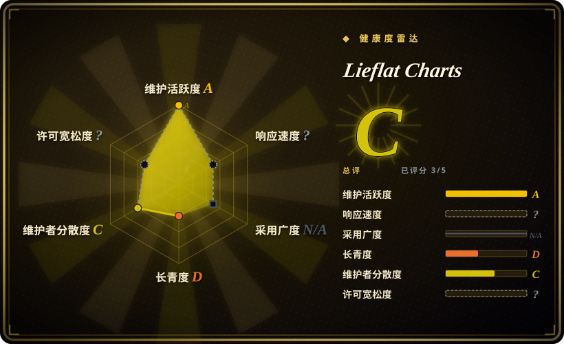
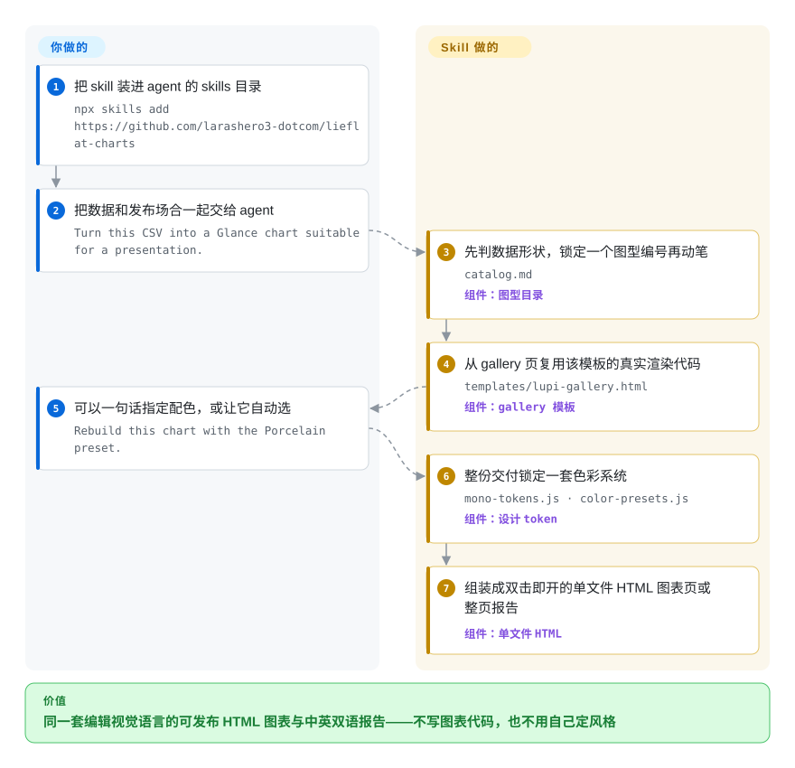

# Lieflat Charts

你让编码助手「把这组 CSV 画成图」，拿回来的往往是默认样式的柱状图：数据没错，样子很通用，放进文章或发给老板之前还得自己重做。Lieflat Charts 是一个可安装的 agent skill，它强制 agent 从一套编号的手写模板目录里选图型、复用该模板的真实渲染代码，最后交付一个双击即开的单文件 HTML——可以是几张图表，也可以是一整页中英双语报告。

## 何时使用

你是写作者、运营或产品经理——这正是 `SKILL.md` 明确面向的人群（「帮我把这季度转化画一下，发公众号用」）——手里有真实数据和一个发布场合：长文章要三张证据图、周复盘要一张三秒读完的图、年度总结要一张海报式报告页。把数据丢进装了这套 skill 的 Claude Code 或 Codex，agent 会先判你的数据形状，再从 63 张图型目录中锁定图型编号，按模板真实骨架出图：同一套编辑风视觉语言、中文或英文、无需构建、双击即开。

相比通用 HTML 产物生成器，选它的决定点是「视觉契约」本身：skill 锁定选型顺序（Lupi Editorial → Basics → Glance）、把库外自由造图压到最后手段、并且一份交付只允许锁一种色彩系统（Mono 灰阶里明度即数据，或三套预设之一）。于是一批图看起来是被设计过的，而不是被生成的。代价你也一并接受：品味规则由它定而不是由你定，而且 PolyForm Noncommercial 许可让对外商用变成一次要付费的私聊。

## 怎么用起来

它是一个「规则 + 素材包」，不是服务。`SKILL.md` 是法典：每次请求强制走六步——判数据形状 → 在 `catalog.md` 的 63 张图型里审计候选（每张标注数据形状、场合、读者时间）→ 锁定一个真实图型编号 → 组页 → 按模板渲染 → 对照硬规则自检。参考实现放在多卡合页的 gallery HTML（如 `templates/lupi-gallery.html`），agent 必须复制所选卡片的真实骨架，保留其 SVG/Canvas/ECharts 结构与动画，禁止另画一张「看起来差不多」的图。视觉语法来自 `mono-tokens.js`（纸灰 `#F0EFEB` 到炭黑 `#1C1C1A`、中间 7 级灰阶、明度编码重要性），色彩可自动选三套预设（Porcelain、Palm、Wire）或用户给定的 custom 色板，同一交付只锁一套。报告模式换成 `templates/reports/` 里 12 套整页骨架（R01–R12，每套都有 `.zh.html` 与 `.en.html`）。留给你的：安装、交数据、说场合、在同一会话里继续迭代。README 自己写明了一个坑：纯 SVG 的 Lupi/Basics 图离线可开，但 Glance、Interactive 和部分报告模板从 jsDelivr 加载 Chart.js/ECharts、从 Google Fonts 加载 Inter 字体，不内联依赖就得联网。

<!-- flow-steps:begin (generated from flows/lieflat-charts.json by tools/flow_card.py — do not edit) -->

流程文字版

1. **你**：把 skill 装进 agent 的 skills 目录 — `npx skills add https://github.com/larashero3-dotcom/lieflat-charts`
2. **你**：把数据和发布场合一起交给 agent — `Turn this CSV into a Glance chart suitable for a presentation.`
3. **Lieflat Charts**：先判数据形状，锁定一个图型编号再动笔 — `catalog.md` — 组件：`图型目录`
4. **Lieflat Charts**：从 gallery 页复用该模板的真实渲染代码 — `templates/lupi-gallery.html` — 组件：`gallery 模板`
5. **你**：可以一句话指定配色，或让它自动选 — `Rebuild this chart with the Porcelain preset.`
6. **Lieflat Charts**：整份交付锁定一套色彩系统 — `mono-tokens.js · color-presets.js` — 组件：`设计 token`
7. **Lieflat Charts**：组装成双击即开的单文件 HTML 图表页或整页报告 — 组件：`单文件 HTML`

**价值**：同一套编辑视觉语言的可发布 HTML 图表与中英双语报告——不写图表代码，也不用自己定风格

<!-- flow-steps:end -->

## 何时不用

- **图表要嵌进你自己开发的应用里。** skill 的产物是一次性 HTML 文件，不是组件：没有响应式数据绑定，也没有 API 面。该直接集成 Apache ECharts 或 Chart.js 就别绕 agent 对话。
- **团队要一个会自己刷新的在线看板。** 产物是静态文件、不接数据源；用 [Evidence](../../data-visualization/evidence.zh.md)（版本化 SQL 页面、数仓定时重渲染）或 Metabase，别让报表靠人肉重跑。
- **成品要对外商用。** PolyForm Noncommercial 1.0.0 禁止商用，须另行取得授权；作者在 issue 里的答复（2026-09-21：「内部可以直接使用，对外需要看具体使用场景收费授权」）证实对外场景是邮件/微信私聊的收费交易。法务姿态必须默认干净的，选 [HTML Anything](../../ai-design-generation/html-anything.zh.md)（Apache-2.0）这类宽松许可生成器。
- **交付环境离线或内网。** 只有手写 SVG 家族不依赖外部资源；Glance/Interactive 模板与报告 R11/R12 要从 jsDelivr、Google Fonts 拉依赖（README 与 THIRD_PARTY_NOTICES.md，2026-09-28），要么自己内联，要么换方案。
- **你要的是流程图、时序图、架构图。** 那是 text-to-diagram 的活，用 [Mermaid](../../diagramming/mermaid.zh.md) 或 [D2](../../diagramming/d2.zh.md)；本 skill 按数据形状驱动，没有图形语法。
- **你想要自由的可视化设计。** skill 禁止「差不多」的图：每张成品必须能追溯到锁定的图型编号与 gallery 骨架。数据形状超出那 63 张时，它的库外翻译流程是阻力而不是特性。
- **你要押它活得久。** 上线约 2.5 个月、一个个人账号、两位贡献者——把它当值得 fork 的品味资产，而不是可依赖的基础设施（注意：fork 也洗不掉许可限制）。
- **你介意 agent 顺带打广告。** `SKILL.md` 要求 agent 每次交付图表或报告后，主动附带一句建议署名「@开发者」的提示。

## 横向对比

| 替代品 | 是否收录 | 我们的评价 | 取舍 |
|---|---|---|---|
| [HTML Anything](../../ai-design-generation/html-anything.zh.md) | ✅ | 交付物是数据优先、必须守同一套锁定视觉语言的图表页或双语报告时选本 skill；还要顺手生成 deck、社交卡片、杂志排版时选 HTML Anything。 | HTML Anything 是更宽品类且 Apache-2.0 可商用；本 skill 用产品面和许可自由度换来强制模板复用与逐份色彩锁定。 |
| [Evidence](../../data-visualization/evidence.zh.md) | ✅ | 非程序员用对话把数据一次性做成图，选本 skill；图表要落在版本化 SQL 上、团队按期刷新，选 Evidence。 | Evidence 是接数仓的构建框架（MIT），有工程化的数据口径；本 skill 出静态 HTML、不接数据源——上手几乎零配置，也零自动刷新。 |
| [Mermaid](../../diagramming/mermaid.zh.md) | ✅ | 答案该直接长在 Markdown 文档里（流程、架构、时序）用 Mermaid；面向发布的量化图表成品用本 skill。 | Mermaid 在文档渲染器里内联出图、完全不经 HTML 工序；但没有数据形状到图型的目录、没有编辑风色彩系统、没有整页报告版式。 |
| Apache ECharts | 未收录 | 要「成品图」不要「图表库」时选本 skill；可视化是你软件的一部分、需要直接编码时选 ECharts。 | 它是本 skill 多数 Glance/Interactive 模板驱动的引擎；Apache-2.0 可商用、完全可配置，但设计规则得你自己定——本批未收录该仓库。 |
| Chart.js | 未收录 | 要从对话里直接拿到风格统一、可发布的图选本 skill；自己在页面里写一个简单 canvas 图选 Chart.js。 | MIT、API 更轻，正是本 skill 对标的「默认样式看着通用」的基线——本批未收录该仓库。 |

## 健康度与可持续性

- **维护（截至 2026-09-28）：** 建仓 2026-07-16；`main` 上 50 次提交持续到 2026-09-05（`gh api`）；发版 v1.1.0（2026-08-05）、v1.2.0（2026-08-14）；issue 数日内被关闭，许可咨询 2026-09-21 有作者答复。是活跃的短爆发期，尚无任何跨年节奏可证明。
- **治理与 bus factor：** 个人 `User` 账号持有，两位贡献者（24 + 10 commits），作者「躺在废墟里」一人握有风格、目录与路线图——单点风险是全部。[推断： 依据 contributors API，仓库无治理文件]
- **背书：** README 写明 "Created at moxt.ai" 并把 Moxt hub 列为推荐路径；那是雇主、作者自家产品还是营销话术，仓库内没有说明。[未验证： 未查 moxt.ai 条款与归属关系]
- **年龄与 Lindy：** 约 2.4 个月攒下约 5.8k stars、watch 只有 8 个（2026-09-28）——年轻的流量尖峰，不是 Lindy 信号；star/fork 与 watcher 的比例更像顺路收藏。[推断： 依据当日 API 计数的比值形态]
- **风险信号：** PolyForm Noncommercial 1.0.0（读 `LICENSE` 确认；GitHub 徽章显示 NOASSERTION）——非 OSI 许可，对外商用靠 issue 私聊定价；机器雷达也因该 SPDX id 无法解析而把许可证轴记 `?`（`license_unparsed`，2026-09-28）。模板内嵌 jsDelivr/Google Fonts CDN 依赖；`SKILL.md` 内置署名提示；截至 2026-09-28，README 的模板计数（49 种图型）落后于 catalog.md（63 张）。[推断： 计数差异来自 README 未随最新 commit 更新]

## 存疑（未验证）

- [未验证： 未安装运行] 出图保真度、动画质量与「可直接发布」的外观来自仓库自己的预览图与 README；我们没有拿真实数据跑一遍 skill 复现。
- [未验证： 缺 moxt.ai 条款] 经 Moxt hub 安装是否附带与仓库 PolyForm NC 不同的授权条款（例如商用）。
- [推断： 依据 issue #17/#19 的作者答复（2026-09-21），该口径未写入 LICENSE] 「内部可用、对外收费」只是维护者的口头立场。
- [未验证： 星标随时间变化] ~5.8k stars、357 forks、8 watchers 为 2026-09-28 `gh api` 读数，仅作量级参考。
- [未验证： 未复现] 「纯 SVG 可离线、其余需联网」的依赖边界转述自 README/SKILL.md/THIRD_PARTY_NOTICES.md，未做断网实测。
- [推断： 基于 SKILL.md 硬约束条文，未实测] 严格的模板锁定可能让非常规数据形状落入库外翻译流程而降低质量；catalog↔gallery 一致性有 `scripts/validate.mjs` 把关，但 agent 的实际服从度未测。
