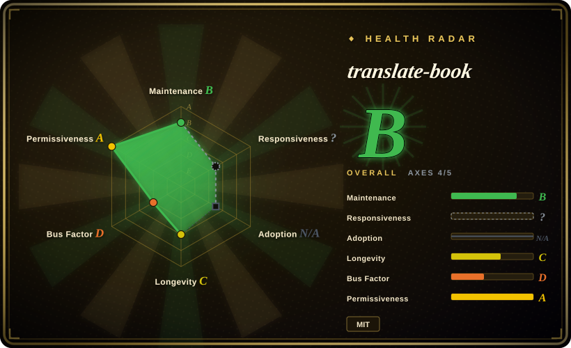

# translate-book

An agent skill for Codex, Claude Code, and OpenClaw that translates entire books (PDF/DOCX/EPUB) into another language using parallel subagents, with a glossary + neighbor-context machinery aimed at cross-chapter term and pronoun consistency.

## When to use

You're a technical reader (or engineer) with a whole ebook — say a 300-page English EPUB or PDF — that you want to read in Chinese, and you already run a skill-capable coding agent (Codex, Claude Code, OpenClaw). Pasting chapters into a chat window loses consistency by chapter ten: the same proper noun comes back translated three different ways, and a "he" flips gender mid-book. You install translate-book (`npx skills add deusyu/translate-book`), point the agent at the file, and it runs a full pipeline: Calibre converts to Markdown chunks (~6000 chars), a pre-built `glossary.json` pins canonical translations that get injected into every chunk's prompt as hard constraints, each chunk sees short read-only excerpts of its neighbors for pronoun/entity resolution, and eight parallel subagents translate with manifest hash validation and resumable state before merging into HTML/DOCX/EPUB/PDF.

You pick it over [bilingual_book_maker](../../reading-tools/bilingual-book-maker.md) when you want the translation done *by your agent subscription* (no separate API key setup) with deliberate term-consistency machinery, rather than a scriptable CLI that streams through an LLM API and emits bilingual side-by-side ebooks; you pick it over [claude_translater](claude-translater.md) — the project it was inspired by — because it restructures the same pipeline as a portable skill with parallel subagents, manifest validation, and selective re-translation instead of sequential shell scripts.

## When NOT to use

- **You want a scriptable, unattended CLI.** If you need a one-command batch job that calls an LLM/MT API directly (OpenAI, Anthropic, DeepL, local Ollama, …) without driving an agent loop, use [bilingual_book_maker](../../reading-tools/bilingual-book-maker.md) instead — translate-book requires an interactive agent harness orchestrating subagents, which is harder to schedule and supervise.
- **You only translate webpages or short articles.** If your reading is in the browser, use [Read Frog](../../reading-tools/read-frog.md) or [FluentRead](../../reading-tools/fluentread.md) instead — they translate in place as you read, with no file pipeline at all.
- **You can't install Calibre and Pandoc.** Both are hard prerequisites (input conversion and output building). If you want a pure-Python install, bilingual_book_maker needs only `pip` and an API key.
- **You need bilingual (side-by-side) output.** translate-book produces a single target-language book. For bilingual epub/txt/srt output, use bilingual_book_maker instead.
- **You need publication-grade or legally safe translation.** For books you will publish or sell, use professional CAT tooling (e.g. Trados — 未收录, commercial) and human translators instead; this is an LLM pipeline with heuristic consistency checks, not a certified workflow.
- **You need a mature bet for a critical pipeline.** The project is ~6 months old (created 2026-03-15) with a single maintainer; if longevity is the deciding factor, bilingual_book_maker (active since 2023-03) is the safer pick.

## Comparison

| Alternative | In index | Our verdict | Tradeoff |
|---|---|---|---|
| [bilingual_book_maker](../../reading-tools/bilingual-book-maker.md) | ✅ | Choose bilingual_book_maker when you want a scriptable CLI that talks straight to LLM/MT APIs and emits bilingual ebooks; choose translate-book when the translation should run inside your coding-agent subscription with explicit glossary/neighbor-context consistency machinery. | bilingual_book_maker is older (2023), PyPI-packaged, backend-agnostic, and unattended-friendly; translate-book gives per-chunk term tables, pronoun context, and selective re-translation, but only inside an agent harness and with Calibre+Pandoc installed. |
| [claude_translater](claude-translater.md) | ✅ | Choose translate-book over its inspiration in almost every case: it keeps the same Calibre→chunk→translate pipeline but adds parallel subagents, manifest validation, resume, and a glossary feedback loop. | claude_translater is the earlier shell-script version (Claude CLI only, sequential, no tagged releases, no LICENSE file); translate-book is the restructured, actively maintained successor — but claude_translater also ships a PPTX translator, which translate-book does not. |
| [Baoyu Skills](baoyu-skills.md) | ✅ | Choose Baoyu Skills when translation is one task among many in a content pipeline (format, publish, images); choose translate-book when the job is specifically a whole book. | Baoyu's `baoyu-translate` is a three-mode text-translation skill with glossary support, not a book-length pipeline with chunking, manifest validation, and ebook output — installing the 20+ skill pack for one book job is the wrong shape. |
| [Read Frog](../../reading-tools/read-frog.md) | ✅ | Choose Read Frog when the reading happens in the browser and you want in-place bilingual overlays; choose translate-book when you own an ebook file and want a finished translated artifact. | Read Frog is a browser extension for webpages and subtitles with BYOK providers — it never produces a translated EPUB/DOCX/PDF you can keep or send to a Kindle. |

## Health & viability

- **Maintenance:** Active — created 2026-03-15, last push 2026-09-07, ~55 commits; a four-phase roadmap for term consistency (issue #7) has three phases shipped. No tagged releases; you track `main` (as of 2026-09-18).
- **Governance / bus factor:** Single maintainer (`deusyu`, 3 contributors on record). The README explicitly declares PRs are not the preferred contribution path and may be closed in favor of maintainer-owned rework from issues — roadmap control is deliberately centralized, so bus factor is 1 and outside influence is low.
- **Backing & longevity (Lindy):** No organizational backing. At ~6 months old it has no Lindy track record; 1.9k stars on a repo this young reads as launch hype rather than proven staying power [推断]. Age × still-active is not yet satisfiable — treat as promising, not proven.
- **Adoption & ecosystem:** Installs through the skills.sh ecosystem (`npx skills add`) across three agent runtimes; 220 forks suggests hands-on usage, but independent reports of completed whole-book runs are scarce [未验证].
- **Risk flags:** MIT, clean. Real risks are youth, single-maintainer governance, and heavy external prerequisites (Calibre + Pandoc); output fidelity for complex PDF layouts depends on Calibre's conversion quality [推断].

## Caveats (unverified)

- [未验证] The effectiveness of the glossary + neighbor-context machinery on real 100+ chunk books (how much term drift and pronoun error it actually removes) has no independent evaluation; the project's own roadmap (issue #7) lists full-book organic validation as future work.
- [未验证] Translation quality and cost per book depend entirely on the agent runtime and model you run it under; no benchmarks are published.
- [未验证] The 3-contributor count may include bot accounts; effective human maintainer count is likely 1.
- [推断] The 1.9k star count accumulated over ~6 months likely reflects launch-period visibility (e.g. trending/social posts) more than sustained production adoption.
- [推断] PDF input quality is bounded by Calibre's `ebook-convert` — complex layouts, tables, and math may degrade before translation even starts.
- [未验证] Claimed support for seven target languages (zh, en, ja, ko, fr, de, es) is from the README; per-language output quality is untested here.
