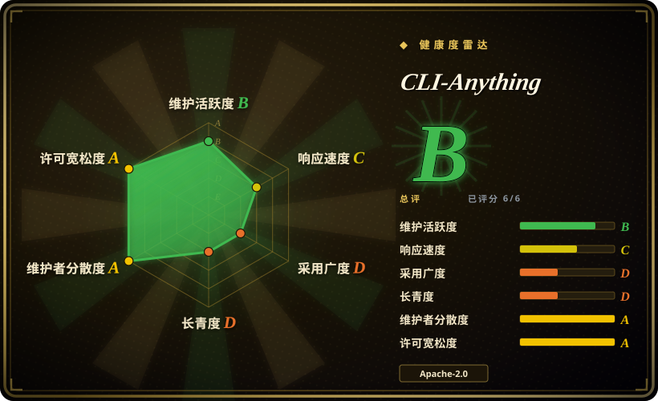

# CLI-Anything

一个**生成器 + 注册表**：把现有软件变成 agent 可调用的 CLI——把它的插件/技能装进编码 agent，跑 `/cli-anything <应用>`，就得到一个 `cli-anything-<应用>` 命令（`--json` 输出加一份 `SKILL.md`），它驱动软件**自身**的后端，而不是重新实现它。

## 何时使用

你日常在用编码 agent（Claude Code、Cursor、Codex……），却总要它去操作那些只有 GUI、或只有一份半文档化原生脚本接口的软件：把一文件夹 `.odt` 批量导出成 PDF、按规格搭一个 Blender 场景、产出一张 QGIS 地图、录制并粗剪一段 OBS 会话。你可以给每个应用手写一个包装，或者退而用像素级自动化，但这两条路在十几个软件上都会迅速失控。

于是你把 CLI-Anything 插件装进 agent，跑 `/cli-anything <应用>`；agent 按仓库里 7 阶段的 `HARNESS.md` SOP，产出一个由该软件真实后端支撑的 `cli-anything-<应用>` 命令（LibreOffice `--headless`、Blender `--background --python`、GIMP Script-Fu、`melt`/`ffmpeg`），带 `--json` 输出和一份 agent 可发现的 `SKILL.md`。它胜过 [PyAutoGUI](../desktop-automation/pyautogui.zh.md) 的地方在于：后端调用是确定性的，而像素坐标不是；它胜过手写 MCP server 的地方在于：否则你要为每个应用重造一遍那个适配层。如果现成 harness 已存在，就完全不用生成：`pip install cli-anything-hub`，然后 `cli-hub search` / `install` / `launch`。

## 何时不用

- **你的目标是自己那套带 OpenAPI spec 的 HTTP API。** 这套 SOP 是围绕 GUI 应用写的（「识别后端引擎」「把 GUI 动作映射成 API 调用」），API 项目没有可发现的引擎，你最终只会多维护一层薄 HTTP 壳。改用 OpenAPI→MCP 生成器，或直接让 agent 调 API。
- **你的 agent 运行时只会说 MCP。** 生成的 harness 靠 shell 调 CLI 来执行；客户端不能起进程时，应改用 MCP server——浏览器场景具体用 [Playwright MCP](../web-automation/playwright-family/playwright-mcp.zh.md)。
- **你需要对没有脚本后端的应用做像素级控制。** 那正是 [PyAutoGUI](../desktop-automation/pyautogui.zh.md) 的活；CLI-Anything 要求有一个可包的后端，不会凭空造一个。
- **该应用已经有在维护的 agent 集成。** 优先用它——比如浏览器活走 [Playwright CLI](../web-automation/playwright-family/playwright-cli.zh.md)——因为重新生成的社区 harness 只增加变动成本，不增加能力。
- **你需要稳定、受支持的契约或 SLA。** 项目仍在 1.0 之前，harness 由社区贡献，且跟随上游应用的版本走。稳定性是硬要求时，请绑到应用原生 API 并自己锁版本。
- **你装不了目标软件**（受限的 CI、没有桌面版授权）。harness 的设计就是调用真实应用；它是依赖，不是自带运行时。改用能重做同一件事的库（某个 Python/Rust 库，或该应用的无头版本）更合适。
- **有凭据或受监管的环境，且没有 review 预算。** 每个 `cli-anything-<应用>` 都是第三方代码，握有你的 token、能驱动你的应用。优先用厂商维护的 MCP server，或自研的内部包装；真要装社区 harness，就把它当作一次供应链审查，而不是默认安装。

## 横向对比

| 替代品 | 是否收录 | 我们的评价 | 取舍 |
|---|---|---|---|
| [PyAutoGUI](../desktop-automation/pyautogui.zh.md) | ✅ | 目标软件暴露了脚本/CLI 后端时，用 CLI-Anything 生成的 harness；只有它没有后端、你必须直接驱动 GUI 时，才选 PyAutoGUI。 | 后端调用是确定性的，能扛住 DPI/主题/分辨率变化；像素自动化适用范围更广但会静默失效——你是拿覆盖度换可靠性。 |
| [Playwright CLI](../web-automation/playwright-family/playwright-cli.zh.md) | ✅ | 浏览器目标用微软官方维护的 CLI+SKILLs 路线；只有当你希望在多个非浏览器应用上统一一套 harness 形态时，才选 CLI-Anything。 | Playwright 在浏览器上更深、有版本管理、厂商支持；CLI-Anything 覆盖面更广，但每个 harness 更薄、且归社区所有。 |
| 手写 MCP server | 未收录 | 你只需要把一个应用以精心设计、稳定的工具 schema 暴露出来时，选手写 MCP server。 | 控制力最强，也是 MCP-only 客户端的唯一选择，但你得为每个应用建并维护一套适配——这正是 CLI-Anything 想摊薄的成本。 |
| 直接调用应用自带的脚本后端 | 未收录 | 当你只需要一两个操作时，自己敲 `blender --background --python`、`gimp -i -b`、`libreoffice --headless`。 | 零抽象、没有需要信任的生成代码，但参数拼装、错误处理、JSON 整形和面向 agent 的文档都得你自己扛，每次调用都一样。 |
| 自研一套 CLI 包装 + `SKILL.md` | 未收录 | 你的操作不常见或涉及安全、值得专门审查时，自己留在内部维护。 | 完全掌控凭据与暴露面，代价是 CLI、测试和技能文档都得自己写——而且下一个应用还要再来一遍。 |

## 技术栈

- **Python 3.10+**；CLI 层用 Click；测试用 pytest。
- `cli_anything/` 是 **PEP 420 命名空间包**（没有 `__init__.py`），所以每个 `cli-anything-<应用>` 包各贡献一个子包，多个包可在同一环境并存。
- 单个 harness 的目录形态：`<SOFTWARE>.md`（SOP）、`core/`（每个领域一个模块）、`utils/<应用>_backend.py`（以 subprocess / HTTP / MCP 客户端对接真实软件）、`utils/repl_skin.py`、`tests/test_core.py` 加 `tests/test_full_e2e.py`、`setup.py`。
- 生成器本体是 `cli-anything-plugin/`：`HARNESS.md`（7 阶段 SOP）外加 `guides/`（会话锁、预览方法论、技能生成、PyPI 发布、MCP 后端模式）。
- 输出契约：默认人类可读，给 agent 用 `--json`，无子命令时进交互式 REPL。
- 分发：PyPI 上的 `cli-anything-hub` 包管理器、按应用 `pip install cli-anything-<应用>`、Claude Code 插件市场，以及 `npx skills add HKUDS/CLI-Anything --skill cli-anything-<应用>`。

## 依赖

- **Python ≥ 3.10** 加 `click>=8.0`；`cli-anything-hub` 包还需 `requests>=2.28`（据其 PyPI 元数据）。
- **目标应用本身**——GIMP、Blender、LibreOffice、QGIS、OBS Studio 等等。harness 会 shell 出去调它；HARNESS.md 明确软件是必需依赖，而非可选。
- **凭据与网络访问**，用于对接服务的 harness（Zoom token、对象存储密钥、REST API key）。
- **应用的 MCP server 加 `mcp` Python SDK**，用于走 MCP 后端模式的 harness。
- **一个真实的测试环境**——SOP 要求 E2E 测试必须调用真实后端，所以跑某个 harness 的测试套件需要装好该应用（对接服务的还要凭据）。

## 运维难度

**消费端低；自己持有生成的 harness 则中等偏高。** 消费端就是装个包、`cli-hub launch`。成本落在维护上：E2E 测试需要真实桌面应用，上游应用版本一变包装就可能坏，生成的 Python 变成你要 review 的代码，Windows 还需要 `bash`/`cygpath`（项目为此带了守卫）。自托管或受监管场景下，真正的负担是逐个 review 你装进去的每个 harness。

## 健康度与可持续性

- **响应速度** —— Grade C：雷达窗口内 14 个 qualifying issue 的中位首次响应 278.5 小时（≈11.6 天）——足以持续合并社区 harness，但不是快速支持型项目。
- **维护** —— 2026-03-08 创建；885 次提交；三个带 tag 的 release（最新 **v0.4.0，2026-06-25**）；最后 push **2026-08-21**，距本次审查约一个月。活跃，且仍在 1.0 之前。
- **治理 / 巴士因子** —— 归 `Organization` 所有（`HKUDS`，港大数据智能实验室，93 个公开仓库），而非个人账号。贡献者 145 位（含匿名提交作者），但头号贡献者握着 290 次提交、身后是长尾——相当于一位事实上的主理人加大量路过式的 harness PR；没有基金会，也没有书面商业 SLA。
- **年龄与 Lindy** —— 约六个月大：太年轻，两个方向都给不出 Lindy 裁决（雷达：longevity D）。请按发布节奏和单个 harness 的 review 质量来评判，而不是履历。
- **采用与生态** —— 49.6k star / 4.6k fork / 197 watcher；仓库内注册表 **79** 条，另有公共注册表 **24** 条第三方 CLI；已发布 70 个技能目录；配套一篇 arXiv 技术报告（[2606.03854](https://arxiv.org/abs/2606.03854)）。实测的包采用量并不高——`cli-anything-hub` 上月约 5.1k 次下载，抽样的单个 harness 包 3235 次下载（雷达：adoption D），star 数远远跑在安装量前面。[推断]
- **风险旗标** —— 1.0 之前，且 harness 由社区贡献、深浅不一；对一个六个月大的仓库来说 star 增速极端、watcher 基数却很小，读起来更像热度而非稳定的采用；仓库 `LICENSE` 是 **Apache-2.0**，而 PyPI 上 `cli-anything-hub` 的元数据标 **MIT** [未验证]。安装一个 harness 意味着运行第三方代码，它能接触你的应用和凭据。

## 存疑（未验证）

- [未验证] README 徽章里的「2,461 tests passing」是自报数字；此处无法复现，因为 E2E 套件需要逐个装好上游桌面应用。
- [未验证] 79 条注册表条目的单个 harness 质量、维护状况与安全性参差不齐，未经逐项审计。
- [未验证] PyPI 上 `cli-anything-hub` 声明 `MIT`，而仓库 `LICENSE` 为 Apache-2.0；hub 包究竟以哪个为准未查明。
- [未验证] 平台支持声明（OpenClaw、Nanobot、Hermes、Reasonix、Qodercli、GitHub Copilot CLI……）来自 README 与注册表，未经独立测试。
- [推断] 把 star 增速（约 6 个月 49.6k，对着 197 个 watcher）视为热度风险信号；star 数对日期敏感，且不是质量指标。
- [推断] 「与 MCP 互补」这一说法属于推理：仓库本身也提供 MCP 后端模式，两者可能重叠。
- [未验证] 个别加固记录（token 文件路径穿越修复、引入 `defusedxml`）取自项目自己的 news 条目；不存在独立安全审计。
