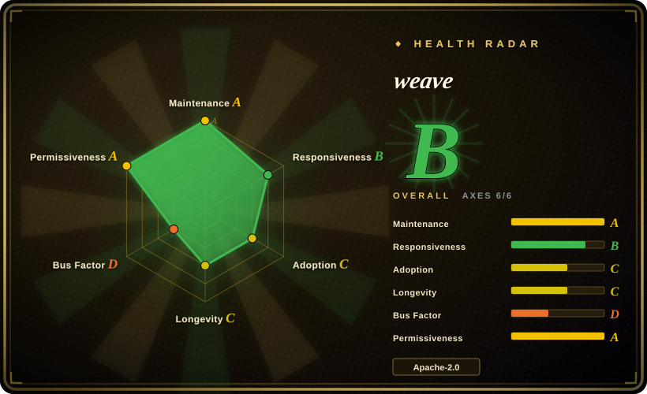
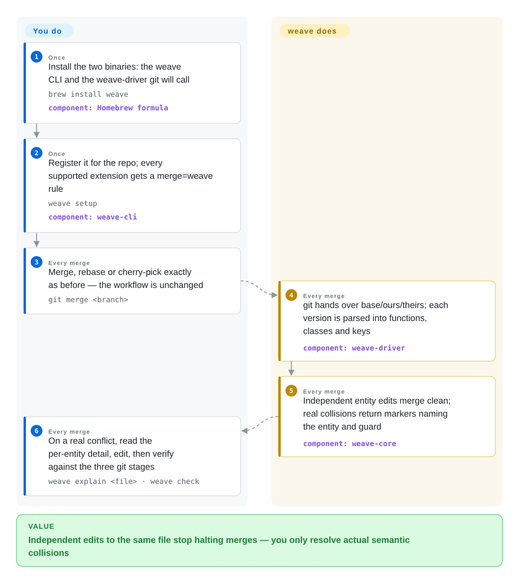

# weave

Two of your coding agents each added a *different* function to the same file, and the merge still stops with a conflict box for a human to resolve — git compares line ranges, and both edits happened to land near the same line numbers. weave replaces that comparison inside `git merge`: it parses the three versions of a file into functions, classes, and keys, and merges those entities, so independent edits stop colliding.

## When to use

You run two or more coding agents in parallel over one repository — Claude Code in one worktree, Codex or kilo in another, a fleet fanning out over a backlog — and merges land all day. The halts are almost never real disagreements: agent A appended `validateToken` to `utils.ts`, agent B appended `formatDate` ten lines below, and git refuses because both edits touch overlapping line ranges; someone (usually you) opens the file, confirms the two functions have nothing to do with each other, and deletes the markers by hand. Install weave, run `weave setup` once per repo (or `weave setup --global` for every repo on the machine), and from then on `git merge`, `rebase`, and `cherry-pick` compare *entities* — functions, classes, JSON keys — instead of lines. Most of those halts simply disappear; the conflicts that remain come back as markers that name the entity, its type, and which internal guard refused to auto-merge, with `weave explain <file>` and `weave check` around the resolution.

The deciding tradeoff against substitutes is *where the fix lives*: weave is a merge driver **underneath the git you already run** — no new VCS to adopt, no hosted service, no per-PR bot, and your workflow commands stay byte-for-byte the same. jj buys better conflict ergonomics by changing your version control system; git-imerge restructures how you sequence a merge; hosted AI resolvers only exist on the platform's PR page and bill you per repo. weave's bet is that the merge itself should understand the code — deterministically, with a parser, no LLM in the loop.

## How it works

weave is a pair of binaries that sit inside git's existing merge-driver slot. **You run two commands ever (`brew install weave`, `weave setup`); the project owns everything that happens between `git merge` and your editor.** When git hits a file registered as `merge=weave`, it invokes `weave-driver` with the base, ours, and theirs versions of that file. The driver parses all three with tree-sitter (38 languages, via Ataraxy's `sem-core`), extracts entities — functions, classes, keys — plus the interstitial text between them, matches entities across versions by identity (file, type, name, parent, including renames), then runs a 3-way merge at entity granularity: different entities changed on each side merge clean; the same entity changed on both sides attempts an intra-entity merge and conflicts only if genuinely incompatible; modify-vs-delete is flagged with the entity's name. The merge itself is deterministic and stateless — a pure function over three file revisions, the same contract as `git merge-file`, not a CRDT. Files over 1 MB, binary files, and four deliberately declined types (Vue, Svelte, ERB, Haskell) fall back to git's line merge automatically. A separate, optional layer does live coordination: `weave-crdt` (an Automerge document at `.weave/state.automerge`) lets registered agents claim entities and see each other's in-flight edits *before* commit, and `weave-mcp` exposes 22 MCP tools (merge analysis, entity/dependency inspection, live coordination) to agent frameworks — but nothing in the merge path depends on that layer ever having run.

<!-- flow-steps:begin (generated from flows/weave.json by tools/flow_card.py — do not edit) -->

Text version of the flow

1. **You** (Once): Install the two binaries: the weave CLI and the weave-driver git will call — `brew install weave` — component: `Homebrew formula`
2. **You** (Once): Register it for the repo; every supported extension gets a merge=weave rule — `weave setup` — component: `weave-cli`
3. **You** (Every merge): Merge, rebase or cherry-pick exactly as before — the workflow is unchanged — `git merge <branch>`
4. **weave** (Every merge): git hands over base/ours/theirs; each version is parsed into functions, classes and keys — component: `weave-driver`
5. **weave** (Every merge): Independent entity edits merge clean; real collisions return markers naming the entity and guard — component: `weave-core`
6. **You** (Every merge): On a real conflict, read the per-entity detail, edit, then verify against the three git stages — `weave explain <file> · weave check`

**Value**: Independent edits to the same file stop halting merges — you only resolve actual semantic collisions

<!-- flow-steps:end -->

## When NOT to use

- **You work solo on a linear history.** No parallel branches means no false conflicts; stock git plus its built-in `rerere` (which replays your previous manual resolutions) is the zero-install answer.
- **Your conflict hotspots are Vue, Svelte, ERB, or Haskell files.** weave parses all four but deliberately declines to claim them — their per-file entity model is too coarse, so those files always take git's line merge. Plan on plain manual resolution for them; adopting weave buys nothing there.
- **Merge outcomes must stay identical to git's.** In audited or golden-file paths, a semantic driver changes outcomes *by design*, and weave's own verdicts moved between patch releases (0.5.3 deliberately conflicts where 0.5.2 resolved — divergent same-name additions, a JSON-key resurrection case). Keep the driver out of the audited path, or pin one version across everyone and everything that merges — humans, CI, agents. [推断]
- **You want an LLM to write the resolution.** weave is deterministic parser work; it never invents code. Hosted conflict-resolution features on forge platforms do author resolutions with an LLM — accept that nondeterminism deliberately, don't expect it here.
- **The break you fear is cross-file.** A rename in `a.py` whose surviving caller lives in `b.py` merges both files cleanly and still breaks the build — a per-file merge driver cannot see it. weave's MCP `weave_check` surfaces exactly this repo-wide binding risk, but the resolution is still yours; pair it with a repo-wide review pass ([Open Code Review](../../ai-code-review/open-code-review.md)) rather than expecting the driver to fix what it can only detect.
- **Your merges are huge and long-diverged rather than many and small.** For finding the true conflict boundary of a months-old divergence, an incremental tool (git-imerge) or bite-size re-merging strategies fit better than a smarter per-file driver.
- **You need to trust the engine absolutely today.** The 0.5.x line fixed three merge-correctness bugs (silently dropped top-level text, non-ASCII identifier crash, hollow-import splice), and the project's own real-repo replay reports 86 regressions versus line-merge alongside 344 wins. Read the benchmarks page before turning it on for large merges in any language; for a slower-moving baseline, mergiraf or stock git still merge lines the boring way.

## Comparison

| Alternative | In index | Our verdict | Tradeoff |
|---|---|---|---|
| mergiraf | 未收录 | Closest like-for-like: a tree-sitter syntax-aware merge driver. Choose weave when entity granularity (both-add-at-end, insert-between-existing), the multi-agent CRDT/MCP surface, and 38-language coverage matter; choose mergiraf when you want the older, slower-moving baseline that errs toward keeping conflict markers. | Real repo at Codeberg (`mergiraf/mergiraf`, Rust); resolves at AST-node granularity with per-language declarative specs; not added in this tab-intake batch. weave's own 31-scenario corpus scores itself 29/29 clean merges vs mergiraf 26/29 — favorable-by-construction, run `weave bench` before trusting it. |
| Jujutsu (jj) | 未收录 | Choose weave when you want better merges inside the git you already run; choose jj when you are willing to change version control to get first-class conflicts — conflicts recorded in commits, resolved lazily, never blocking mid-operation. | `jj-vcs/jj`, ~31.8k stars, Apache-2.0, very active (2026-09); git-compatible so it can sit over the same repos. Different layer of the stack — weave even plugs into jj as its merge tool, so they compose more than they compete. Not added in this tab-intake batch. |
| git-imerge | 未收录 | Choose git-imerge when the job is one giant semantic merge — finding the true conflict boundary of long-diverged branches incrementally; choose weave when the job is many small false conflicts during daily multi-agent merges. | `mhagger/git-imerge` (GPL-2.0) — real repo but last pushed 2024-07, effectively stale; works above git as merge/rebase assistance, not a driver. Not added in this tab-intake batch. |
| Git rerere (built into git) | not a repo | Keep rerere when the same conflicts recur and you want git to replay your previous manual resolutions; choose weave when conflicts are novel each time and shouldn't have been conflicts at all. | A git feature, not a project (`git config rerere.enabled true`); zero install and zero trust questions, but it understands nothing about code and can only replay what you already resolved by hand. |
| SemanticMerge | not a repo | Only relevant if you already live in the Plastic SCM ecosystem: it is a closed-source commercial semantic-merge product. For an open, scriptable, git-native driver the choice is weave (or mergiraf). | Codice Software's commercial product; no repository exists (its old GitHub home is gone — 404 as of 2026-09), only third-party parser plugins remain open. |

## Tech stack

- **Core:** Rust workspace — `weave-core` (entity extraction, entity-level 3-way merge, reconstruction), `weave-driver` (the binary git invokes via `%O %A %B %L %P`), `weave-cli` (setup/explain/check/preview/patch/bench + CRDT commands), `weave-crdt` (Automerge-backed coordination state), `weave-mcp` (stdio MCP server, 22 tools), `weave-github` (webhook service behind the hosted PR-comment integration).
- **Parsing:** tree-sitter grammars via `sem-core` from Ataraxy Labs/sem; 38 supported languages with per-language five-scenario merge sweeps and a parity test that fails the build if a grammar is left unclaimed.
- **Determinism:** the merge path is a pure function over three file revisions (like `git merge-file`); the CRDT layer is separate and optional.
- **Distribution:** Homebrew core formula (bottled, verified on formulae.brew.sh), npm wrapper `@ataraxy-labs/weave` that downloads release binaries and exposes all three commands, `cargo install` from the two crate paths, and a nix flake.
- **Quality:** 441 unit/integration tests; CI (`cargo fmt --check`, `cargo clippy -D warnings`, `cargo test --workspace`) on Linux and Windows; dependabot with auto-merge; published benchmark methodology with per-repo breakdowns.

## Dependencies

- **git** — any version with merge-driver support; also works as a jj merge tool via `merge-tools.weave` config.
- **Two binaries on PATH:** `weave` (your CLI) and `weave-driver` (the one git calls) — `weave setup` fails without the driver; the npm wrapper installs both plus `weave-mcp`.
- **Merge path:** no daemon, no database, no network, no account. Opt-in lifetime counters only with `WEAVE_STATS=1` (off by default).
- **CRDT layer (optional):** writes `.weave/state.automerge` in the worktree; weave adds `.weave/` to the repo's local `.git/info/exclude` on first write so it never enters commits.
- **MCP server (optional):** `weave-mcp` over stdio for agent frameworks (`claude mcp add --scope user weave -- weave-mcp`); repo discovery via the first tool call's path, `WEAVE_REPO`, or cwd.
- **Fallbacks:** files >1 MB, binary files, unsupported types, and the four declined extensions always take git's line-level merge — no data loss path, just no weave benefit.

## Ops difficulty

**Low.** Two binaries, one setup command per repo (`--global` for the machine, `--local` to avoid touching `.gitattributes`, `weave unsetup` to revert), and the merge path has no moving parts beyond that. Difficulty concentrates in rollout discipline: every machine and CI job that merges needs the *same* driver version or verdicts can differ (0.5.2 → 0.5.3 changed outcomes on purpose); brew/npm wrappers make pinning easy but nobody enforces it. Adopting the CRDT/MCP coordination layer adds a shared state file, agent registration, and advisory claims (not enforced; crashed agents' claims are not reaped), which is where this goes from "a better merge" to "a coordination system you operate".

## Health & viability

- **Maintenance (2026-09-28):** very active — v0.5.4 released 2026-09-01, 30 releases (v0.1.1 → v0.5.4) in ~8 months, last push 2026-09-26, green CI on Linux and Windows, dependabot auto-merge running. Not archived.
- **Governance / bus factor — the main risk.** Organization-owned (Ataraxy Labs Inc., "software for reliability of agents", org created 2025-10), but contributions are effectively one core author (rs545837: 202 commits) plus dependabot (67) and one secondary contributor (29); everyone else is ≤3. CONTRIBUTING states incoming PRs are "reviewed and adapted before merge rather than merged as-is" — honest, and also a single-roadmap signal. The parser layer (`sem-core`) comes from the same org, so the dependency chain shares one bus. [推断]
- **Age & Lindy — young-repo flag.** Created 2026-02-06: ~8 months old with ~1.3k stars and a Homebrew core formula already. Fast traction, zero Lindy protection; treat as early adoption, not a durable bet.
- **Adoption & engineering culture.** Homebrew core (bottled), npm distribution, 441 tests with per-language merge sweeps, and an unusually honest benchmark posture — the README publishes its own regressions (86 vs line-merge in the 0.5.3 replay) and explains them rather than hiding them. Real users file merge-correctness issues and get them fixed in days (#165, #166, #169, all closed 2026-09).
- **Risk flags.** Pre-1.0 with engine verdicts still moving between releases; correctness bugs fixed as recently as 0.5.4 (silently dropped top-level text). Dual MIT OR Apache-2.0, no relicense history, no CLA, no feature-gating observed. Vendor-suite positioning (weave is one of four Ataraxy products) is a roadmap-coupling watch item, not a present defect.

## Caveats (unverified)

- [未验证] The repo description's "~95% reduction vs. line-based merge" appears nowhere in the README; the reproducible benchmark instead reports 344 wins / 86 regressions / 4,971 file merges across five repos. I did not run `weave bench` or `weave bench-repo` myself.
- [未验证] All benchmark tables (including the mergiraf comparison, measured against mergiraf v0.16.3 on weave's own 31 hand-crafted scenarios) are maintainer-self-reported; commands ship in the repo, but no third party has reproduced them as far as I can see.
- [推断] "Deterministic and stateless" merge path is read from the README/CHANGELOG, not verified by reading `weave-core` source.
- [未验证] The 38-language support list rests on the README plus CI language sweeps; I exercised none of the parsers directly.
- [推断] Cross-machine verdict drift under mixed versions follows from the documented 0.5.2 → 0.5.3 tightening; no multi-version experiment was run.
- [未验证] Ataraxy Labs Inc.'s funding, headcount, and business model beyond the org bio ("software for reliability of agents") — the hosted PR-comment integration (`weave-github` on fly.toml) suggests a commercial tier may exist, but none is announced in the repo.
- [未验证] Star trajectory (~1.3k in ~8 months) is date-sensitive and I did not investigate how it was acquired; 45 forks and 4 watchers alongside it is a plausible early-adoption shape, not proof of organic growth.
