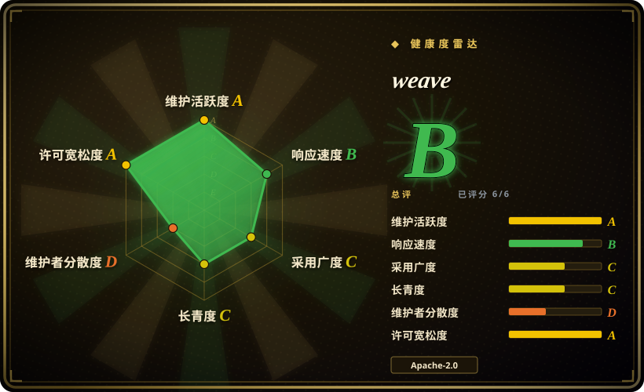
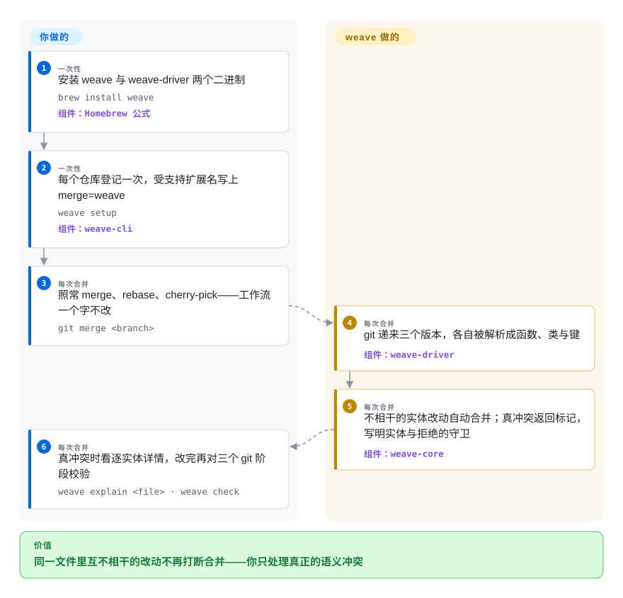

# weave

两个编码 agent 在同一个文件里各加了一个**不同的**函数，合并却照样停下来，丢给你一框冲突标记等人处理——因为 git 比的是行号区间，两处互不相干的改动恰好落在相邻的行上。weave 把 `git merge` 内部的这步比较从「行」换成「实体」：把文件的三个版本各自解析成函数、类、键，按实体合并，互不相干的改动就撞不上了。

## 何时使用

你在同一个仓库上并行跑两个以上的编码 agent——一个 worktree 里的 Claude Code、另一个里的 Codex 或 kilo，或者一队 agent 摊开一张待办清单——合并一整天都在发生。而停下来等人的地方几乎从来不是真分歧：agent A 往 `utils.ts` 末尾加了 `validateToken`，agent B 在下面十行加了 `formatDate`，git 因为两处改动的行区间重叠而拒绝合并；总得有人（通常是你）打开文件，确认两个函数毫无关系，再手工删掉标记。装上 weave，每个仓库跑一次 `weave setup`（或 `weave setup --global` 一次管全机），此后 `git merge`、`rebase`、`cherry-pick` 比较的就是**实体**——函数、类、JSON 键——而不是行。这类停顿大多直接消失；剩下的真冲突会带着实体名、类型和拒绝自动合并的内部守卫回来，旁边还有 `weave explain <file>` 和 `weave check` 接住解决环节。

相对替代品的决定性取舍是**修复长在哪一层**：weave 是一个跑在**你现有 git 底下**的合并驱动——不换版本控制系统、不接托管服务、不装逐 PR 的机器人，你的工作流命令一个字都不改。jj 用「换掉版本控制」换更好的冲突处理；git-imerge 重新组织合并的推进方式；托管平台的 AI 解决器只活在平台自己的 PR 页面上，还要按仓库收费。weave 押的是：合并这一步本身应当看得懂代码——用解析器、确定性地做，循环里没有 LLM。

## 怎么用起来

weave 是一对二进制，坐进 git 既有的 merge-driver 槽位。**你一共只敲两条命令（`brew install weave`、`weave setup`）；从 `git merge` 到你打开编辑器之间的一切都归它。**git 遇到登记为 `merge=weave` 的文件时，把该文件的 base、ours、theirs 三个版本交给 `weave-driver`。驱动用 tree-sitter（38 种语言，经 Ataraxy 的 `sem-core`）把三个版本都解析一遍，抽出实体——函数、类、键——以及实体之间的间隙文本，再按身份（文件、类型、名字、父级，含重命名）跨版本匹配实体，然后在实体粒度上做三方合并：两边各改了不同实体的，干净合并；同一个实体两边都改的，先尝试实体内合并，只有真不兼容才冲突；一边改一边删的，会带着实体名标出来。合并算法本身是确定性、无状态的——三个文件版本进一个结果出，与 `git merge-file` 同一个契约，不是 CRDT。超过 1 MB 的文件、二进制文件和四种被明确拒收的类型（Vue、Svelte、ERB、Haskell）自动回落到 git 的行级合并。另有一层可选的活协调：`weave-crdt`（工作树里一份 Automerge 文档 `.weave/state.automerge`）让注册过的 agent 在**提交之前**认领实体、看到彼此正在进行的编辑；`weave-mcp` 则以 22 个 MCP 工具（合并分析、实体/依赖检视、活协调）面向 agent 框架——但合并路径不依赖这层跑没跑过。

<!-- flow-steps:begin (generated from flows/weave.json by tools/flow_card.py — do not edit) -->

流程文字版

1. **你**（一次性）：安装 weave 与 weave-driver 两个二进制 — `brew install weave` — 组件：`Homebrew 公式`
2. **你**（一次性）：每个仓库登记一次，受支持扩展名写上 merge=weave — `weave setup` — 组件：`weave-cli`
3. **你**（每次合并）：照常 merge、rebase、cherry-pick——工作流一个字不改 — `git merge <branch>`
4. **weave**（每次合并）：git 递来三个版本，各自被解析成函数、类与键 — 组件：`weave-driver`
5. **weave**（每次合并）：不相干的实体改动自动合并；真冲突返回标记，写明实体与拒绝的守卫 — 组件：`weave-core`
6. **你**（每次合并）：真冲突时看逐实体详情，改完再对三个 git 阶段校验 — `weave explain <file> · weave check`

**价值**：同一文件里互不相干的改动不再打断合并——你只处理真正的语义冲突

<!-- flow-steps:end -->

## 何时不用

- **你一个人线性开发。**没有并行分支就没有假冲突；原版 git 加自带的 `rerere`（回放你之前手工解决过的冲突）就是零安装的答案。
- **冲突热点在 Vue、Svelte、ERB、Haskell 文件上。**weave 解析得了这四种，却刻意拒收——它们逐文件的实体模型太粗，所以这些文件永远走 git 的行级合并。这种场景装 weave 买不到东西，老老实实手工解决。
- **合并结果必须与 git 逐字节一致。**在要审计或用 golden file 钉死的路径上，语义驱动**按设计**改变合并结果，而且 weave 自己的判定就在补丁版本之间动过（0.5.3 有意把 0.5.2 会合的情况改成冲突——同名分歧新增、JSON 键复活两类）。要么把驱动挡在审计路径之外，要么让人、CI、agent 全体钉死同一版本。[推断]
- **你想让 LLM 把解决方案写出来。**weave 是确定性的解析器工作，从不发明代码。托管 forge 平台上的冲突解决功能确实用 LLM 写方案——那是你主动接受不确定性，别指望在这里得到。
- **你怕的是跨文件断裂。**`a.py` 里改了名、`b.py` 里的调用方还在用旧名——两个文件各自合并得干干净净，构建照样炸；逐文件合并驱动看不见这一层。weave 的 MCP 工具 `weave_check` 恰好能把这种全仓绑定风险亮出来，但解决仍然归你：给它配一道全仓评审（[Open Code Review](../../ai-code-review/open-code-review.zh.md)），别指望驱动修好它只能探测的东西。
- **你的合并是又大又久远的一次性分歧，而不是又多又小的日常冲突。**找几个月分叉的真冲突边界，增量工具（git-imerge）或化整为零的重合并策略比更聪明的逐文件驱动更对口。
- **你今天就需要无条件信任这台引擎。**0.5.x 线刚修过三个合并正确性 bug（顶层文本被静默丢弃、非 ASCII 标识符崩溃、空心 import 拼接），项目自己的真实仓库回放也报告 86 例相对行级合并的回归、344 例胜出。给大合并开它之前，先把基准页读一遍；要一台动得慢的基线，mergiraf 或原版 git 仍在用无聊的方式并着行。

## 横向对比

| 替代品 | 是否收录 | 我们的评价 | 取舍 |
|---|---|---|---|
| mergiraf | 未收录 | 最同构的对手：tree-sitter 语法感知合并驱动。实体粒度（两边都在文件尾新增、插在既有条目之间）、多 agent 的 CRDT/MCP 面和 38 语言覆盖对你重要时选 weave；想要更老、动得更慢、宁可留着冲突标记也不冒进的基线时选 mergiraf。 | 本体是 Codeberg 上的真实仓库（`mergiraf/mergiraf`，Rust）；在 AST 节点粒度上合并，各语言用声明式规格描述；本批次未收录。weave 自家的 31 场景集给自己评 29/29、mergiraf 26/29——既是运动员又是裁判，信之前先跑 `weave bench`。 |
| Jujutsu（jj） | 未收录 | 想在现有 git 底下把合并变好，选 weave；愿意为此换版本控制系统、换取一等公民的冲突——冲突记录进提交、惰性解决、绝不中途卡死——选 jj。 | `jj-vcs/jj`，约 31.8k star，Apache-2.0，非常活跃（2026-09）；兼容 git，可以架在同一批仓库上。层级不同——weave 甚至能作为 jj 的合并工具插进去，两者更多是组合而非互斥。本批次未收录。 |
| git-imerge | 未收录 | 任务是**一次巨大的语义合并**——增量找出长期分叉分支的真冲突边界——时选 git-imerge；任务是日常多 agent 合并里**又多又小的假冲突**时选 weave。 | `mhagger/git-imerge`（GPL-2.0）——真实仓库，但最后推送停在 2024-07，事实停更；它工作在 git 之上做合并/rebase 辅助，不是驱动。本批次未收录。 |
| Git 内建 rerere | 非仓库 | 同样的冲突反复出现、想让 git 回放你此前手工解决方案时，继续用 rerere；冲突每次都是新的、而且本来就不该算冲突时，换 weave。 | git 的内建特性，不是独立项目（`git config rerere.enabled true`）；零安装、零信任问题，但它不理解代码，只能重放你已经手工解决过的东西。 |
| SemanticMerge | 非仓库 | 只在你本来就活在 Plastic SCM 生态里时才相关：闭源商业语义合并产品。要开源、可脚本化、git 原生的驱动，答案是 weave（或 mergiraf）。 | Codice Software 的商业产品，不存在仓库（旧 GitHub 主页已消失——2026-09 查证为 404），只剩第三方解析器插件是开源的。 |

## 技术栈

- **核心：**Rust workspace——`weave-core`（实体抽取、实体级三方合并、重建）、`weave-driver`（git 经 `%O %A %B %L %P` 调用的二进制）、`weave-cli`（setup／explain／check／preview／patch／bench 及 CRDT 命令）、`weave-crdt`（Automerge 承载的协调状态）、`weave-mcp`（stdio MCP 服务器，22 个工具）、`weave-github`（托管 PR 评论集成背后的 webhook 服务）。
- **解析：**经 Ataraxy Labs/sem 的 `sem-core` 接 tree-sitter 文法；38 种受支持语言，每种过五场景合并扫测，另有一条奇偶校验测试——新文法没被认领就挂构建。
- **确定性：**合并路径是三个文件版本进一个结果出的纯函数（同 `git merge-file` 契约）；CRDT 层独立且可选。
- **分发：**Homebrew core 公式（有 bottle，formulae.brew.sh 已核）、下载 release 二进制并暴露全部三个命令的 npm 包装 `@ataraxy-labs/weave`、从两个 crate 路径 `cargo install`、nix flake。
- **质量：**441 个单元/集成测试；CI（`cargo fmt --check`、`cargo clippy -D warnings`、`cargo test --workspace`）覆盖 Linux 与 Windows；dependabot 带自动合并；基准方法论连同逐仓库细目一并公开。

## 依赖

- **git**——任何支持 merge driver 的版本；也可经 `merge-tools.weave` 配置成为 jj 的合并工具。
- **PATH 上两个二进制：**`weave`（你敲的 CLI）与 `weave-driver`（git 调的那个）——缺了驱动 `weave setup` 会直接失败；npm 包装会把两个连同 `weave-mcp` 一起装好。
- **合并路径：**无守护进程、无数据库、无网络、无账号。生命周期计数器默认关闭，仅设 `WEAVE_STATS=1` 才累计。
- **CRDT 层（可选）：**在工作树写 `.weave/state.automerge`；首次写入时 weave 会把 `.weave/` 加进仓库本地的 `.git/info/exclude`，保证它永远进不了提交。
- **MCP 服务器（可选）：**`weave-mcp` 走 stdio 面向 agent 框架（`claude mcp add --scope user weave -- weave-mcp`）；仓库发现靠第一个工具调用的路径、`WEAVE_REPO` 或工作目录。
- **回落：**超过 1 MB 的文件、二进制文件、无解析器的类型和四种拒收扩展一律走 git 的行级合并——不存在数据丢失路径，只是没有 weave 收益。

## 运维难度

**低。**两个二进制、每个仓库一条 setup 命令（`--global` 管全机、`--local` 不动 `.gitattributes`、`weave unsetup` 一键回退），合并路径之外没有任何活动部件。难度集中在推广纪律上：每台机器、每个会做合并的 CI 任务都需要**同一个**驱动版本，否则判定可能不一致（0.5.2 到 0.5.3 就有意改过结果）；brew／npm 包装让钉版本很容易，但没人替你强制。一旦采用 CRDT/MCP 协调层，就多了一份共享状态文件、agent 注册和只作建议的认领（不强制；崩溃 agent 的认领不会被回收）——那是从「更好的合并」变成「一套要你运营的协调系统」的转折点。

## 健康度与可持续性

- **维护（2026-09-28）：**非常活跃——v0.5.4 发布于 2026-09-01，约 8 个月里 30 个 release（v0.1.1 至 v0.5.4），最后推送 2026-09-26，Linux 与 Windows CI 皆绿，dependabot 自动合并在跑。未归档。
- **治理 / bus factor——主要风险。**Organization 所有（Ataraxy Labs Inc.，「software for reliability of agents」，组织创建于 2025-10），但贡献实际上是单一核心作者（rs545837：202 次提交）加 dependabot（67）加一位次级贡献者（29），其余都不超过 3 次。CONTRIBUTING 写明外部 PR「先读、改编后再合，而非原样合并」——坦诚，同时也是单一路线图的信号。解析层（`sem-core`）来自同一组织，依赖链共享同一辆车。[推断]
- **年龄与 Lindy——年轻仓库标记。**创建于 2026-02-06：约 8 个月、约 1.3k star、已进 Homebrew core。增长快，但零 Lindy 保护；当早期采用对待，不是可长期押注的资产。
- **采用度与工程文化。**Homebrew core（有 bottle）、npm 分发、441 个测试加逐语言合并扫测，以及少见诚实的基准姿态——README 公布自己的回归（0.5.3 回放中对行级合并 86 例回归），并解释而不是藏起来。真实用户在提合并正确性 issue，且几天内修复（#165、#166、#169，均于 2026-09 关闭）。
- **风险标记。**pre-1.0，引擎判定仍在版本间移动；正确性 bug 一直修到 0.5.4（顶层文本被静默丢弃）。双许可 MIT OR Apache-2.0，无转许可历史，无 CLA，未见功能门控。厂商套件定位（weave 是 Ataraxy 四件产品之一）是路线图耦合的观察项，眼下不是缺陷。

## 存疑（未验证）

- [未验证] 仓库描述里的「相对行级合并减少约 95%」在 README 中没有再出现；可复现的基准给出的是五个仓库 4,971 次文件合并中 344 胜、86 回归。我没有亲自跑 `weave bench` 或 `weave bench-repo`。
- [未验证] 所有基准表（含对 mergiraf 的对比，测的是 mergiraf v0.16.3、跑在 weave 自建的 31 个手工场景上）均为维护者自报；命令随仓库发布，但据我所见尚无第三方复现。
- [推断] 合并路径「确定性、无状态」读自 README/CHANGELOG，未读 `weave-core` 源码验证。
- [未验证] 38 种语言支持清单依托 README 与 CI 语言扫测；我没有逐个解析器实测。
- [推断] 混合版本导致跨机器判定漂移，是由 0.5.2 至 0.5.3 收紧行为这一已记录事实推出来的，没有做多版本实验。
- [未验证] Ataraxy Labs Inc. 的融资、人数与商业模式，超出组织简介（「software for reliability of agents」）的部分一概不知——托管 PR 评论集成（`weave-github` 跑在 fly.toml 上）暗示可能存在商业层，但仓库里没有任何公告。
- [未验证] star 轨迹（约 8 个月约 1.3k）对时间敏感，其获取方式未做调查；旁边的 45 fork、4 watcher 是早期采用的合理形状，不是有机增长的证明。
