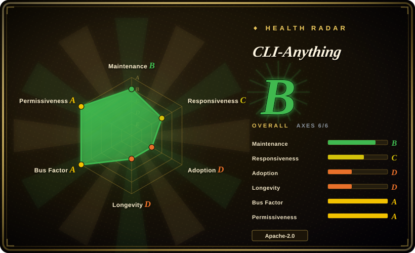

# CLI-Anything

A generator + registry that makes existing software agent-callable by emitting CLI harnesses: install its plugin/skill into a coding agent, run `/cli-anything <app>`, and get a `cli-anything-<app>` command (`--json` output plus a `SKILL.md`) that drives the software's **own** backend instead of reimplementing it.

## When to use

You run a coding agent (Claude Code, Cursor, Codex, …) and keep needing it to operate software that ships as a GUI or a half-documented native scripting interface: batch-export a folder of `.odt` files to PDF, assemble a Blender scene from a spec, produce a QGIS map, record and cut an OBS session. You could hand-write a wrapper per app, or reach for pixel automation, but both scale badly across a dozen pieces of software.

You install the CLI-Anything plugin into your agent and run `/cli-anything <app>`; the agent follows the repo's 7-phase `HARNESS.md` SOP and emits a `cli-anything-<app>` command backed by the app's real backend (LibreOffice `--headless`, Blender `--background --python`, GIMP Script-Fu, `melt`/`ffmpeg`), with `--json` output and a `SKILL.md` your agent can discover. It wins over [PyAutoGUI](../../desktop-automation/pyautogui.md) because backend calls are deterministic where pixel coordinates are not, and over a hand-written MCP server because you would otherwise rebuild that adapter once per application. If a harness already exists, skip generation entirely: `pip install cli-anything-hub`, then `cli-hub search` / `install` / `launch`.

## When NOT to use

- **Your target is your own HTTP API with an OpenAPI spec.** The SOP is written around GUI apps ("identify the backend engine", "map GUI actions"), so an API project has no engine to discover and you end up with a thin HTTP shim to maintain. Use an OpenAPI→MCP generator, or let the agent call the API directly.
- **Your agent runtime only speaks MCP.** A generated harness is invoked by shelling out to a CLI; if the client cannot run processes, use an MCP server instead — for browsers specifically, [Playwright MCP](../../web-automation/playwright-family/playwright-mcp.md).
- **You need pixel-level control of an app with no scripting backend.** That is exactly what [PyAutoGUI](../../desktop-automation/pyautogui.md) is for; CLI-Anything requires a backend to wrap and will not synthesize one.
- **The app already has a maintained agent integration.** Prefer it — e.g. [Playwright CLI](../../web-automation/playwright-family/playwright-cli.md) for browser work — because a regenerated community harness adds churn without adding capability.
- **You need a stable, supported contract or an SLA.** The project is pre-1.0, harnesses are community-contributed, and they track the upstream app's version. Bind to the app's native API and pin versions yourself if stability is the requirement.
- **You cannot install the target software** (locked-down CI, no license for the desktop app). The harness invokes the real application by design — it is a dependency, not a bundled runtime. Use a library that reimplements the same job (a Python/Rust library, or the app's headless sibling) instead.
- **Credentialed or regulated environments, without a review budget.** Each `cli-anything-<app>` is third-party code that holds your tokens and drives your apps. Prefer vendor-maintained MCP servers or your own in-house wrapper, and treat any community harness you do install as a supply-chain review rather than a default install.

## Comparison

| Alternative | In index | Our verdict | Tradeoff |
|---|---|---|---|
| [PyAutoGUI](../../desktop-automation/pyautogui.md) | ✅ | When the target exposes a scripting/CLI backend, take CLI-Anything's generated harness; pick PyAutoGUI only when it does not and you must drive the GUI itself. | Backend calls are deterministic and survive DPI/theme/resolution changes; pixel automation applies universally but breaks silently — you trade coverage for reliability. |
| [Playwright CLI](../../web-automation/playwright-family/playwright-cli.md) | ✅ | For browser targets, use Microsoft's vendor-maintained CLI+SKILLs path; choose CLI-Anything only when you want one uniform harness pattern across many non-browser apps. | Playwright is browser-deep, versioned, and vendor-supported; CLI-Anything is broader but each harness is thinner and community-owned. |
| Hand-written MCP server | 未收录 | Choose a hand-written MCP server when you need one app exposed with a curated, stable tool schema. | Highest control and the only option for MCP-only clients, but you build and maintain one adapter per application — the cost CLI-Anything exists to amortize. |
| The app's native scripting backend, driven directly | 未收录 | Drive `blender --background --python`, `gimp -i -b`, `libreoffice --headless` yourself when you only need one or two operations. | Zero abstraction and no generated code to trust, but you own argument construction, error handling, JSON shaping, and the agent-facing docs for every call. |
| A DIY CLI wrapper + `SKILL.md` kept in-house | 未收录 | Keep it in-house when your operations are unusual or security-sensitive and worth bespoke review. | Full control of credentials and surface area, at the cost of writing the CLI, tests, and skill doc yourself — and redoing it for the next app. |

## Tech stack

- **Python 3.10+**; Click drives the CLI surface; pytest for tests.
- `cli_anything/` is a **PEP 420 namespace package** (no `__init__.py`), so each `cli-anything-<app>` package contributes a sub-package and many install side by side in one environment.
- Per-harness layout: `<SOFTWARE>.md` (SOP), `core/` (one module per domain), `utils/<app>_backend.py` (subprocess / HTTP / MCP client to the real software), `utils/repl_skin.py`, `tests/test_core.py` + `tests/test_full_e2e.py`, `setup.py`.
- The generator is `cli-anything-plugin/`: `HARNESS.md` (the 7-phase SOP) plus `guides/` for session locking, preview methodology, skill generation, PyPI publishing, and the MCP-backend pattern.
- Output contract: human-readable by default, `--json` for agents, and an interactive REPL when no subcommand is given.
- Distribution: the PyPI `cli-anything-hub` package manager, per-app `pip install cli-anything-<app>`, a Claude Code plugin marketplace, and `npx skills add HKUDS/CLI-Anything --skill cli-anything-<app>`.

## Dependencies

- **Python ≥ 3.10** with `click>=8.0` — and `requests>=2.28` for the `cli-anything-hub` package (per its PyPI metadata).
- **The target application itself** — GIMP, Blender, LibreOffice, QGIS, OBS Studio, and so on. The harness shells out to it; HARNESS.md states the software is a required dependency, not optional.
- **Credentials and network access** for service-backed harnesses (Zoom tokens, object-storage keys, REST API keys).
- **The app's MCP server plus the `mcp` Python SDK** for harnesses using the MCP-backend pattern.
- **A real test environment** — the SOP requires E2E tests that invoke the real backend, so running a harness's suite needs the app installed (and credentials for service harnesses).

## Ops difficulty

**Low to consume; medium-to-high to own a generated harness.** Consuming is a package install and a `cli-hub launch`. Maintenance is where the cost lands: E2E tests need the real desktop app, wrappers break as the upstream app's version drifts, the generated Python becomes your code to review, and Windows needs `bash`/`cygpath` (the project ships a guard for it). For self-hosted or regulated use, the real burden is reviewing each harness you install.

## Health & viability

- **Responsiveness** — Grade C: median first response 278.5 hours (≈11.6 days) across 14 qualifying issues in the radar window — enough attention to keep merging community harnesses, not a fast-support project.
- **Maintenance** — created 2026-03-08; 885 commits; three tagged releases (latest **v0.4.0, 2026-06-25**); last push **2026-08-21**, about a month before this review. Active, and pre-1.0.
- **Governance / bus factor** — `Organization`-owned (`HKUDS`, the HKU Data Intelligence Lab, 93 public repos) rather than a personal account. 145 contributors including anonymous commit authors, but the top contributor holds 290 commits against a long tail — a de facto lead plus many drive-by harness PRs; no foundation and no documented commercial SLA.
- **Age & Lindy** — about six months old: too young for a Lindy verdict either way (radar: longevity D). Judge it on shipping cadence and per-harness review quality, not on track record.
- **Adoption & ecosystem** — 49.6k stars / 4.6k forks / 197 watchers; **79** in-repo registry entries plus **24** third-party entries in the public registry; 70 shipped skill folders; a companion arXiv tech report ([2606.03854](https://arxiv.org/abs/2606.03854)). Measured package adoption is modest — the `cli-anything-hub` package saw ~5.1k downloads in the last month and a sampled per-app harness 3235 downloads (radar: adoption D), so stars run far ahead of installs. [推断]
- **Risk flags** — pre-1.0 with community-contributed harnesses of uneven depth; extreme star velocity for a six-month-old repo with a small watcher base, which reads as hype rather than settled adoption; the repo `LICENSE` is **Apache-2.0** while the PyPI `cli-anything-hub` metadata declares **MIT** [未验证]. Installing a harness means running third-party code with access to your applications and credentials.

## Caveats (unverified)

- [未验证] The README badge's "2,461 tests passing" figure is self-reported; it cannot be reproduced here because the E2E suites require each upstream desktop application installed.
- [未验证] Per-harness quality, maintenance, and security are uneven across the 79 registry entries and were not individually audited.
- [未验证] The PyPI `cli-anything-hub` package declares `MIT` while the repository `LICENSE` is Apache-2.0; which governs the hub package was not resolved.
- [未验证] Platform-support claims (OpenClaw, Nanobot, Hermes, Reasonix, Qodercli, GitHub Copilot CLI, …) come from the README and registry, not from an independent test.
- [推断] Star velocity (49.6k in ~6 months against 197 watchers) is treated as a hype-risk signal; star counts are date-sensitive and are not a quality measure.
- [推断] The "complementary to MCP" framing is reasoning: the repo also ships an MCP-backend pattern, so the two approaches can overlap.
- [未验证] Individual hardening notes (token-file path-traversal fixes, `defusedxml` adoption) are taken from the project's own news entries; no independent security audit exists.
