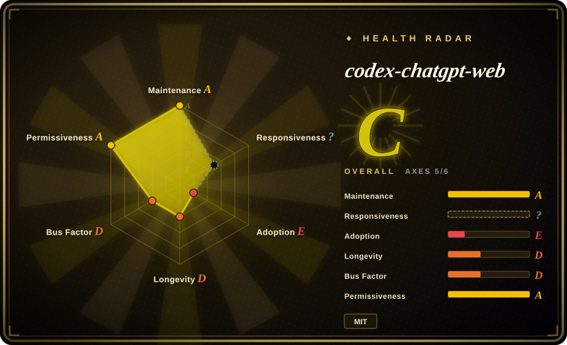
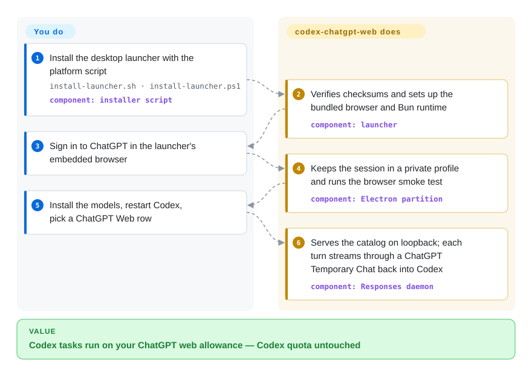

# codex-chatgpt-web

Your Codex session hits its usage wall mid-task, while the ChatGPT Plus/Pro subscription you already pay for sits idle in a browser tab. codex-chatgpt-web bolts that **web** ChatGPT session onto Codex as if it were just another entry in the model picker — coding turns then burn the web plan's separate allowance instead of Codex quota.

## When to use

You live in the Codex CLI/app on a ChatGPT Plus or Pro subscription, and the month's Codex quota runs out first: the agent stops mid-refactor with a usage limit, while the web plan's message allowance — a separate pool — still has headroom. Install this launcher, sign in to ChatGPT once inside its embedded browser, and "ChatGPT Web — …" rows appear in Codex's native model picker; tasks keep running in the same harness (diffs, approvals, compaction) on the web plan's budget. It wins over upgrading Codex quota or buying API tokens precisely when the marginal capacity you need is already paid for in the subscription — the trade you accept is an unofficial, browser-automation transport instead of a supported API.

The second trigger is model access: web-only tiers and modes (Pro-level reasoning, the account's Luna/Think or Instant–High rows, web usage of models like GPT-5.6 Sol Pro / GPT-6 Astra) never appear in Codex's catalog, because Codex routes through its own backend. This bridge is currently the only way to drive them inside Codex's harness with local tools attached.

## How it works

You install a desktop launcher (it ships its own Electron browser and a pinned Bun runtime, so no Chrome/Node install) and sign in to ChatGPT inside it. The launcher runs a daemon on `127.0.0.1` that impersonates a model provider to Codex: it forwards the official model catalog and appends `chatgpt-web/` rows. When you pick one and send a task, the daemon compiles the Codex context into a single prompt, types it into a ChatGPT **Temporary Chat** (the privacy mode that keeps no history) in its managed browser tab, then parses the rendered reply and streams it back in the Responses-API format Codex expects — Codex believes it is talking to an ordinary model. Three automation levels set who touches the web page: **browser-only** (it sends for you, no local tools), **full harness** (an outbound OpenAI tunnel-client plus an MCP connector route ChatGPT's tool calls back to your local Codex sandbox — requires ChatGPT Developer Mode), and **Zero Risk** (it only prepares the prompt into your clipboard; you paste, send, and confirm manually). Token usage is counted with the GPT-5 tokenizer, and the bridge advertises a measured context window (about 90k tokens on Plus, 270k with the experimental 3× mode) so Codex's native compaction fires before the web composer's hard limit.

<!-- flow-steps:begin (generated from flows/codex-chatgpt-web.json by tools/flow_card.py — do not edit) -->

Text version of the flow

1. **You**: Install the desktop launcher with the platform script — `install-launcher.sh · install-launcher.ps1` — component: `installer script`
2. **codex-chatgpt-web**: Verifies checksums and sets up the bundled browser and Bun runtime — component: `launcher`
3. **You**: Sign in to ChatGPT in the launcher's embedded browser
4. **codex-chatgpt-web**: Keeps the session in a private profile and runs the browser smoke test — component: `Electron partition`
5. **You**: Install the models, restart Codex, pick a ChatGPT Web row
6. **codex-chatgpt-web**: Serves the catalog on loopback; each turn streams through a ChatGPT Temporary Chat back into Codex — component: `Responses daemon`

**Value**: Codex tasks run on your ChatGPT web allowance — Codex quota untouched

<!-- flow-steps:end -->

## When NOT to use

- **Anything that must still work next quarter.** Selectors are pinned to ChatGPT's DOM; every UI reshuffle breaks turns until a patch ships (v5.0.8 itself was an urgent fix for a changed reply container, #538). For a workload you can't afford to lose to upstream churn, pay per token on the official OpenAI API or expand Codex quota — a supported contract beats a repurposed subscription.
- **Managed, corporate, or compliance-sensitive accounts.** This is unofficial browser automation of a consumer UI; the README says so itself, and the author's release notes actively campaign for public "this is not abuse" evidence because upstream restriction is a live threat. Use official enterprise/API channels instead.
- **Locked-down or audited machines.** Release binaries are unsigned (Gatekeeper/SmartScreen warnings), and the loopback Responses endpoint has no independent bearer secret — any process under the same OS user can reach it. Prefer vendor-signed tooling with real auth boundaries.
- **Shared or multi-user hosts.** The persistent Electron profile is a complete ChatGPT login artifact; treat it like a password. On shared machines, use API-key-based model providers instead.
- **Non-Codex agents.** It speaks Codex's Responses wiring specifically; pointing Claude Code, Cursor, or your own agent at it is not a supported path. Configure those with their native provider settings or the OpenAI API.
- **Heavy, predictable workloads.** Web allowances are rate-limited per hours, not billed per token; sustained batch runs will hit them too, with no retry/upgrade path. That is the API's job.

## Comparison

| Alternative | In index | Our verdict | Tradeoff |
|---|---|---|---|
| [Official Codex (openai/codex)](https://github.com/openai/codex) | 未收录 | If quota suffices or the budget allows API spend, stay on the official path; choose this bridge only when an already-paid web subscription is the cheaper marginal capacity. | Official gives a stable, supported contract; the bridge converts quota you already own into coding turns, paying for it with a DOM-coupled transport that upstream can break unilaterally. |
| ChatGPT web / Codex plans (the subscription itself) | 非仓库 | Use the subscription in the browser/app when you want the supported path through the same allowance. | Same budget pool, zero install and zero ToS gray zone — but you lose Codex's harness (repo tools, diffs, approvals) unless you run this bridge. |
| OpenAI platform API (pay-per-token) | 非仓库 | For production or team workloads, buy API tokens; the bridge is a personal-cost optimization, not infrastructure. | Linear cost per token, but a real contract, no login-state artifact on disk, and no dependence on ChatGPT's UI layout. |
| [CLI-Anything](cli-anything.md) | ✅ | Both bolt extra capability onto a coding-agent harness; pick CLI-Anything to make GUI software agent-callable, pick this to make subscription web models Codex-callable. | Different axis entirely: one wraps external apps' backends into CLIs, the other wraps a web UI into a model endpoint — neither substitutes for the other. |

## Tech stack

- **TypeScript** throughout; **Bun 1.4.0** pinned as runtime/manager (`bun.lock`, `packageManager`), **Electron** desktop launcher with an embedded browser driven by **playwright-core**.
- Local **Responses bridge** daemon (loopback, SSE/WebSocket negotiation via HTTP 426) + **stdio MCP server** (`@modelcontextprotocol/sdk`).
- `tiktoken` for GPT-5-tokenizer usage accounting; `turndown` (+GFM plugin) to turn ChatGPT HTML into Markdown; `zod`/`ajv` for schema validation.
- Full mode downloads OpenAI's official **tunnel-client** build, verified against a SHA-256 manifest; runtime files are checksum-verified on first launch before any port opens.
- CI gates runtime, tests, and packaging on macOS/Windows/Linux; releases carry per-asset checksums (not platform-signed).

## Dependencies

- **A ChatGPT account** — Free/Go gets Luna/Think rows; accounts with reasoning controls get Instant–High (+ Extra High/Pro when exposed). No Codex-side API key needed.
- **Codex** (the CLI/app this extends) — it rewrites Codex's provider route to the local daemon and restores it on disconnect/uninstall.
- Nothing else user-installed: browser, Bun runtime, and (in full mode) the tunnel client are bundled or fetched-and-verified by the launcher. Platforms: macOS 13+ (arm64/x64), Windows x64, Linux x64.
- **Full harness only:** ChatGPT Developer Mode, a self-created MCP connector named `Codex Native2`, and a tunnel API key (Tunnels Read + Use scope).

## Ops difficulty

**Medium.** Installing is one script (checksum-verified) and a browser login. The cost is operational vigilance, not setup: full-harness mode needs a multi-step connector setup inside ChatGPT (Developer Mode, tunnel, exact connector name), updates must be applied by quitting the launcher first, and breakage arrives from upstream — when ChatGPT changes its DOM you check the launcher for an Update before anything else. Unsigned binaries mean a one-time Gatekeeper/SmartScreen bypass per install.

## Health & viability

- **Maintenance** — created 2026-07-26; 325 commits; release cadence is extremely fast (v5.0.7 and v5.0.8 both shipped 2026-09-16, the latter an urgent DOM-drift hotfix); last push 2026-09-19. Highly active, in a fire-brigade rhythm the upstream forces. [推断]
- **Governance / bus factor** — single maintainer (`miuuyy`, 279/325 ≈ 86% of commits; #2 has 23); personal account, no foundation, no org backing. Bus factor is effectively one.
- **Age & Lindy** — under two months old with 10.5k stars: the anti-Lindy profile — high-velocity stars on a young repo read as hype risk, and survival is not in the project's own hands (an OpenAI UI change or policy shift can kill it regardless of code quality).
- **Adoption** — 10.5k stars / 866 forks / 25 watchers; v5.0.8 assets totaled ~15k installer downloads within days; active issue tracker (37 open) with same-week maintainer responses.
- **Risk flags** — unofficial automation of a consumer UI (ToS gray zone the author publicly lobbies to keep open); unsigned release binaries; upstream single point of failure; loopback daemon without independent auth. Against that, the security model docs are unusually thorough (fail-closed drift handling, turn-scoped MCP tokens, no secret in argv/logs).

## Caveats (unverified)

- [未验证] Account-tier model rows (Luna/Think, Instant–High, Extra High/Pro) and per-plan message allowances come from the README and discussion #309; not independently tested per tier.
- [未验证] The measured ~90k-token (and 3× / 270k) context windows are the project's own figures; not reproduced here.
- [推断] "Without using Codex quota" is stated per the README; whether every forwarded path (native Search / Image Gen passthrough) is metered the same way was not verified.
- [推断] Upstream-restriction risk (OpenAI treating the method as abuse) is judged from the author's own release-note campaign, not from any OpenAI statement; actual enforcement probability is unknown.
- [未验证] Security invariants (loopback-only binding, 0600 storage, fail-closed UI drift) are documented in the project's security-model.md; no third-party audit exists.
- [推断] Star velocity (10.5k in <2 months, 25 watchers) is treated as a hype-risk signal, not evidence of quality or durability.
