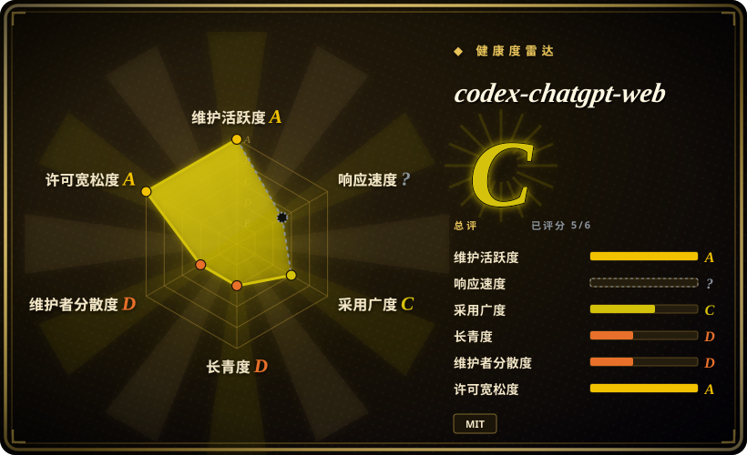
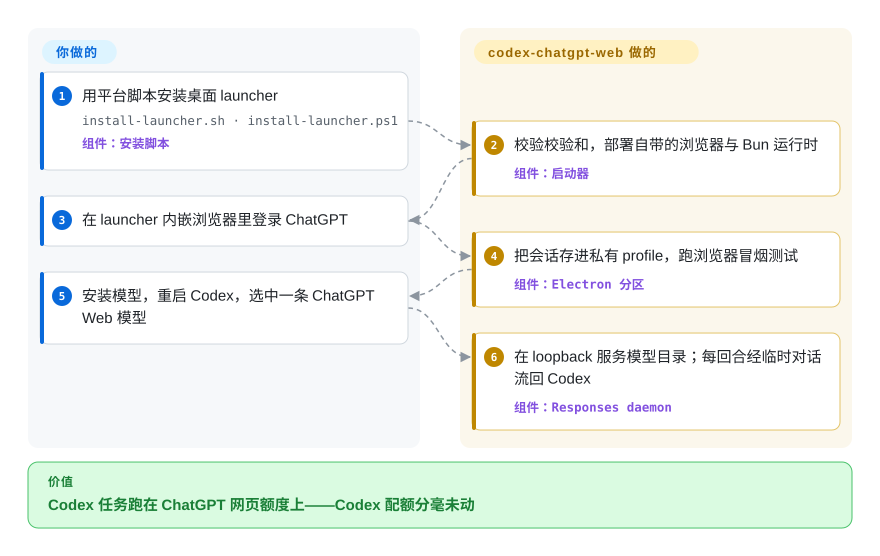

# codex-chatgpt-web

Codex 干到一半撞上用量墙，而你付费的 ChatGPT Plus/Pro 订阅在浏览器里闲着——两边的额度本来就不互通。codex-chatgpt-web 在本地架一座桥，把网页版 ChatGPT 变成 Codex 模型选择器里普普通通的一行，编码任务从此消耗 Web 套餐的独立额度，不动 Codex 配额。

## 何时使用

你日常在 Codex CLI/应用里干活，手里有 ChatGPT Plus 或 Pro 订阅，而每月总是 Codex 配额先用完：任务改到一半被 usage limit 打断，可网页版的对话额度——另一个独立池子——还有大把余量。装上这个 launcher，在它内嵌的浏览器里登录一次 ChatGPT，Codex 原生模型选择器里就会出现“ChatGPT Web — …”条目；任务照旧跑在原来的 harness 里（diff、审批、压缩都还在），账却记到 Web 套餐头上。它胜过升级 Codex 配额或另购 API token 的场景，恰好就是“你要的算力其实已经付过钱”——代价是接受一条非官方的浏览器自动化通道，而不是受支持的 API。

第二个触发点是模型可达性：只在网页端开放的档位和模式（Pro 级推理、账号对应的 Luna/Think 或 Instant–High 档、GPT-5.6 Sol Pro / GPT-6 Astra 这类模型的网页用量）永远不会出现在 Codex 目录里，因为 Codex 走自己的后端。想在 Codex 的 harness 里、带着本地工具驱动这些模型，目前这座桥是唯一路径。

## 怎么用起来

你装一个桌面 launcher（自带 Electron 浏览器和锁定的 Bun 运行时，不用另装 Chrome/Node），在里面登录 ChatGPT。launcher 在本机 `127.0.0.1` 起一个 daemon，对 Codex 扮演模型提供方：转发官方模型目录，再追加 `chatgpt-web/` 前缀的行。你选中其中一个、发出任务后，daemon 把 Codex 上下文编译成一条 prompt，在它自己管理的浏览器标签页里输入到一个 ChatGPT**临时对话**（Temporary Chat，不留历史的隐私模式），再把渲染出来的回复解析成 Codex 期望的 Responses API 流式格式喂回去——Codex 全程以为自己面对的是一个普通模型。三档自动化决定谁碰网页：**Browser-only**（它替你发送，但无本地工具）、**Full harness**（经 OpenAI 官方 tunnel-client 出站隧道加 MCP 连接器，把 ChatGPT 的工具调用接回你本地的 Codex 沙箱——需要开 ChatGPT Developer Mode）、**Zero Risk**（它只把 prompt 备进剪贴板，你手动粘贴、发送、确认，它不读页面）。token 用量按 GPT-5 tokenizer 计数，桥接层上报实测上下文窗口（Plus 约 9 万 token，实验性 3× 模式约 27 万），让 Codex 原生压缩赶在网页输入框的硬上限之前触发。

<!-- flow-steps:begin (generated from flows/codex-chatgpt-web.json by tools/flow_card.py — do not edit) -->

流程文字版

1. **你**：用平台脚本安装桌面 launcher — `install-launcher.sh · install-launcher.ps1` — 组件：`安装脚本`
2. **codex-chatgpt-web**：校验校验和，部署自带的浏览器与 Bun 运行时 — 组件：`启动器`
3. **你**：在 launcher 内嵌浏览器里登录 ChatGPT
4. **codex-chatgpt-web**：把会话存进私有 profile，跑浏览器冒烟测试 — 组件：`Electron 分区`
5. **你**：安装模型，重启 Codex，选中一条 ChatGPT Web 模型
6. **codex-chatgpt-web**：在 loopback 服务模型目录；每回合经临时对话流回 Codex — 组件：`Responses daemon`

**价值**：Codex 任务跑在 ChatGPT 网页额度上——Codex 配额分毫未动

<!-- flow-steps:end -->

## 何时不用

- **下个季度还得能跑的活。** 选择器绑死 ChatGPT 的 DOM，上游每次改版式都会打断任务，直到补丁发布（v5.0.8 本身就是修“回复容器变了”的紧急补丁，#538）。承担不起上游漂移的工作负载，走官方 OpenAI API 按 token 付费或扩 Codex 配额——受支持的合同胜过复用订阅。
- **受管理的公司账号、合规敏感环境。** 这是对消费级网页 UI 的非官方自动化，README 自己写明，作者还在 release note 里公开征集“这不算滥用”的证据——上游收紧是现实威胁。此类场景走官方企业/API 渠道。
- **锁死或要审计的机器。** 发布二进制未签名（Gatekeeper/SmartScreen 会告警），且 loopback 的 Responses 端点没有独立鉴权——同一 OS 用户下的任何进程都能摸到。要真实安全边界的场景选厂商签名、带鉴权的工具。
- **共享或多用户主机。** 持久化的 Electron profile 是一份完整 ChatGPT 登录态，把它当密码对待。共享机器上改用基于 API key 的模型提供方。
- **非 Codex 的 agent。** 它只讲 Codex 的 Responses 接线；让 Claude Code、Cursor 或自研 agent 接进来不是受支持的路径。那些用各自原生的 provider 配置或 OpenAI API。
- **可预期的大批量负载。** 网页额度按小时限速而非按 token 计费，持续批跑同样会撞墙，且没有重试/升配通道——那是 API 的活。

## 横向对比

| 替代品 | 是否收录 | 我们的评价 | 取舍 |
|---|---|---|---|
| [官方 Codex（openai/codex）](https://github.com/openai/codex) | 未收录 | 配额够用、或预算允许 API 支出时，留在官方路径；只有当已付费的 Web 订阅是更便宜的边际算力时才选这座桥。 | 官方给稳定受支持的合同；桥把你已拥有的额度换成编码回合，代价是一条上游可单方面打断的、绑死 DOM 的通道。 |
| ChatGPT 网页/Codex 订阅本身 | 非仓库 | 想走同一份额度的受支持路径时，直接在浏览器/应用里用订阅。 | 同一个额度池、零安装、零 ToS 灰区——但不用这座桥就失去了 Codex 的 harness（仓库工具、diff、审批）。 |
| OpenAI 平台 API（按 token 付费） | 非仓库 | 生产或团队负载买 API token；这座桥是个人成本优化，不是基础设施。 | 按 token 线性计费换来真合同：磁盘上没有登录态工件，也不依赖 ChatGPT 的页面版式。 |
| [CLI-Anything](cli-anything.zh.md) | 已收录 | 两者都给编码 agent 的 harness 外挂新能力；要让 GUI 软件 agent 可调用选 CLI-Anything，要让订阅网页模型进 Codex 选本页。 | 轴向完全不同：一个把外部应用后端包成 CLI，一个把网页 UI 包成模型端点——互不替代。 |

## 技术栈

- 全栈 **TypeScript**；锁定 **Bun 1.4.0** 作运行时/包管理（`bun.lock`、`packageManager`），**Electron** 桌面 launcher 加内嵌浏览器，由 **playwright-core** 驱动。
- 本地 **Responses 桥** daemon（loopback，经 HTTP 426 协商 SSE/WebSocket）加 **stdio MCP server**（`@modelcontextprotocol/sdk`）。
- `tiktoken` 按 GPT-5 tokenizer 计量用量；`turndown`（加 GFM 插件）把 ChatGPT 的 HTML 转回 Markdown；`zod`/`ajv` 做校验。
- Full 模式另下载 OpenAI 官方 **tunnel-client** 并按 SHA-256 清单校验；首次启动先逐文件校验运行时再开端口。
- CI 在 macOS/Windows/Linux 三平台门禁运行时、测试与打包；发布产物带逐资产校验和（未平台签名）。

## 依赖

- **一个 ChatGPT 账号**——Free/Go 有 Luna/Think 档；带推理控制的账号有 Instant–High（暴露时另有 Extra High/Pro）。Codex 侧无需 API key。
- **Codex**（被扩展的 CLI/应用）——它把 Codex 的 provider 路由改写到本地 daemon，断连/卸载时原样恢复。
- 其余无需用户安装：浏览器、Bun 运行时、（Full 模式的）tunnel client 由 launcher 内置或下载后校验。平台：macOS 13+（arm64/x64）、Windows x64、Linux x64。
- **仅 Full harness 需要：** ChatGPT Developer Mode、自建名为 `Codex Native2` 的 MCP 连接器、一个隧道 API key（Tunnels Read + Use 权限）。

## 运维难度

**中等。** 安装是一条脚本（带校验和验证）加一次浏览器登录。成本在日常警觉而非搭建：Full harness 要在 ChatGPT 里走完多步连接器配置（Developer Mode、隧道、精确的连接器名），升级前必须退出 launcher，而且故障来自上游——ChatGPT 一改 DOM，先去 launcher 里点 Update 再谈别的。未签名二进制意味着每次安装都要手动过一次 Gatekeeper/SmartScreen。

## 健康度与可持续性

- **维护** —— 2026-07-26 创建；325 commits；发布节奏极快（v5.0.7 与 v5.0.8 同在 2026-09-16 发布，后者是修 DOM 漂移的紧急补丁）；最后 push 2026-09-19。高度活跃，但那是上游逼出来的救火节奏。[推断]
- **治理/公交因子** —— 单人维护（`miuuyy`，279/325 ≈ 86% commits；第二名 23）；个人账号，无基金会、无组织背书。公交因子实际为一。
- **年龄/Lindy** —— 不到两个月拿到 10.5k stars：典型反向 Lindy——年轻仓库的高星读作热度风险，且存亡不掌握在项目自己手里（OpenAI 改 UI 或改政策都能终结它，与代码质量无关）。
- **采用** —— 10.5k stars / 866 forks / 25 watchers；v5.0.8 各安装包数日合计约 1.5 万下载；issue 区活跃（37 open），维护者当周回应。
- **风险旗标** —— 对消费级 UI 的非官方自动化（作者公开游说保住灰色地带的 ToS 风险）；未签名发布二进制；上游单点；loopback daemon 无独立鉴权。另一面：安全模型文档异常扎实（漂移 fail-closed、回合级 MCP token、密钥不进 argv/日志）。

## 存疑（未验证）

- [未验证] 各账号档位的模型行（Luna/Think、Instant–High、Extra High/Pro）与各套餐消息额度来自 README 及 discussion #309；未按档位逐一实测。
- [未验证] 实测约 9 万 token（及 3× 模式约 27 万）的上下文窗口是项目自家数字；此处未复现。
- [推断] “不消耗 Codex 配额”按 README 口径陈述；每条转发路径（原生 Search / Image Gen 直通）计量方式是否一致未验证。
- [推断] 上游收紧风险（OpenAI 把该用法认定为滥用）的判断来自作者自己的 release note 动员，无 OpenAI 官方表态可查；实际执法概率未知。
- [未验证] 安全不变量（仅绑 loopback、0600 存储、UI 漂移 fail-closed）来自项目 security-model.md 自述；无第三方审计。
- [推断] star 速度（两个月 10.5k、watchers 仅 25）视为热度风险信号，不作为质量或耐久性证据。
