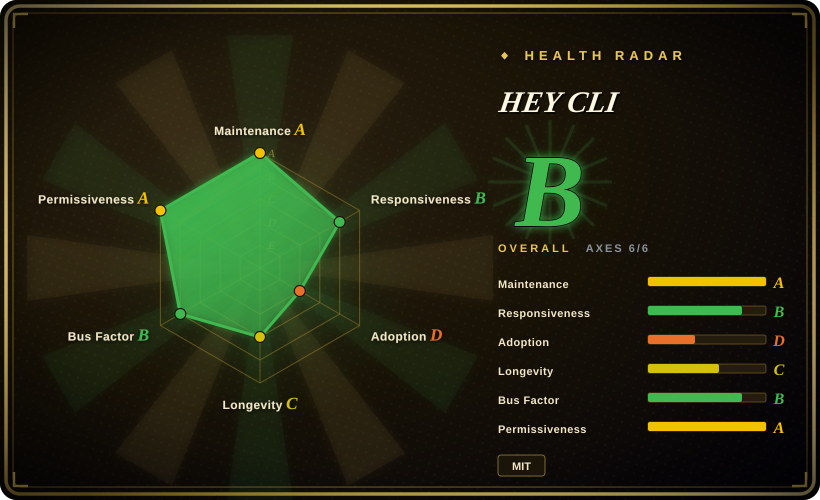
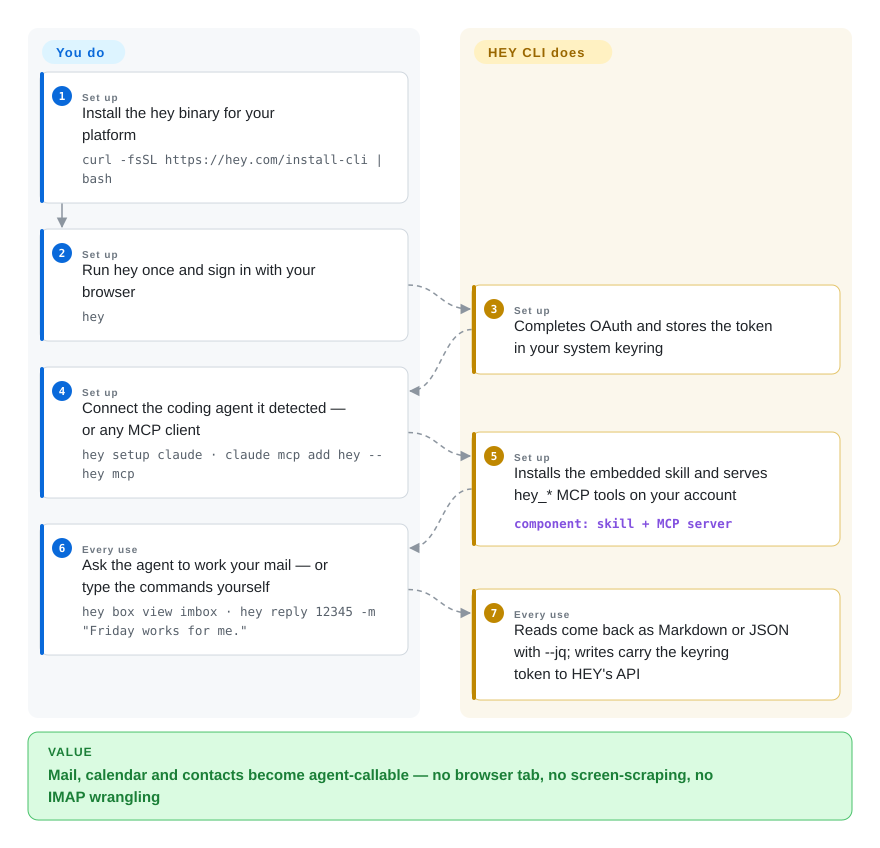

# HEY CLI

Your coding agent can dig through the whole repo but cannot touch the place the decision actually landed: the email thread sitting in a web app it cannot read, so you break focus and answer it yourself. HEY CLI is 37signals' official Go binary that turns the HEY mail/calendar service into commands — Markdown at a terminal, JSON down a pipe — plus an embedded agent skill and an MCP server, so mailbox triage becomes something you can delegate.

## When to use

You keep your personal or small-company mail on HEY (37signals' hosted subscription service — 30-day free trial, then paid), and your day alternates between a terminal and a coding agent. The pain is the context switch: every mid-task email check means leaving the editor for a browser, and the agent that already writes your code cannot read the thread where the customer confirmed the deadline. You install `hey` (one curl, or mise/Homebrew/deb/Scoop/Nix), run `hey` once to sign in through your browser, then wire your agent — `hey setup claude`, `hey setup codex`, or `claude mcp add hey -- hey mcp` for any MCP client. From then on the agent reads threads as Markdown, replies, works the Screener, contacts, todos and calendar; `hey tui` gives you the same Mail/Contacts/Calendar/Journal as a full keyboard-driven terminal app.

You pick it over the generic alternatives precisely because it is the vendor's own client on the official API (modeled by `basecamp/hey-sdk`): no DOM-scraping to break when HEY ships a redesign (the Playwright MCP path), and no per-app community harness to go stale (the CLI-Anything path). The output contract is agent-first by design — every data command answers `--json`, `--jq` filters without an external `jq`, exit codes are documented (`hey help exit-codes`), and `hey watch --box imbox --events new` emits one JSON line per incoming email so scripts can react as mail lands. Credentials stay in the OS keyring, and the MCP server can be narrowed to `--read-only` or a subset of `--domains`.

## How it works

hey-cli is one Go binary with three faces: a command catalog (`hey box view imbox`, `hey reply …`), a full-screen terminal app (`hey tui`), and — the part this page is about — an agent surface. Underneath, everything goes through the official HEY API: you sign in once with your browser (OAuth — the delegated-login flow where HEY's own server hands the CLI a refreshable token), the token lands in your OS keyring, and every later command carries it. **You** install the binary and connect an agent; **the CLI** installs its embedded skill into `~/.agents/skills/hey`, serves seven `hey_*` gateway tools (`hey_boxes`, `hey_search`, `hey_threads`, `hey_contacts`, `hey_todos`, `hey_calendar`, `hey_identity`) over stdio MCP on your signed-in account, and shapes each answer for its reader — Markdown when a human is at the terminal, JSON when piped, `--jq` filtering built in. Writes are never auto-retried (a rate-limited send surfaces as an error rather than risking a duplicate email), and `hey watch` turns the mailbox into a stream you can tail. It is the difference between teaching an agent to operate a mail *website* and handing it a mail *API*.

<!-- flow-steps:begin (generated from flows/hey-cli.json by tools/flow_card.py — do not edit) -->

Text version of the flow

1. **You** (Set up): Install the hey binary for your platform — `curl -fsSL https://hey.com/install-cli | bash`
2. **You** (Set up): Run hey once and sign in with your browser — `hey`
3. **HEY CLI** (Set up): Completes OAuth and stores the token in your system keyring
4. **You** (Set up): Connect the coding agent it detected — or any MCP client — `hey setup claude · claude mcp add hey -- hey mcp`
5. **HEY CLI** (Set up): Installs the embedded skill and serves hey_* MCP tools on your account — component: `skill + MCP server`
6. **You** (Every use): Ask the agent to work your mail — or type the commands yourself — `hey box view imbox · hey reply 12345 -m "Friday works for me."`
7. **HEY CLI** (Every use): Reads come back as Markdown or JSON with --jq; writes carry the keyring token to HEY's API

**Value**: Mail, calendar and contacts become agent-callable — no browser tab, no screen-scraping, no IMAP wrangling

<!-- flow-steps:end -->

## When NOT to use

- **Your mail is not on HEY.** The CLI speaks only HEY's API — no IMAP, SMTP, JMAP or Gmail. Migrating your mailbox to get a CLI is backwards: for Gmail/Workspace accounts use a Google-side MCP server ([google_workspace_mcp](https://github.com/taylorwilsdon/google_workspace_mcp), not indexed), and for any IMAP mailbox use [neomutt](https://github.com/neomutt/neomutt) at the terminal or the [imapflow](https://github.com/postalsys/imapflow) library for automation (both not indexed).
- **You need self-hosted, data-sovereign mail.** HEY is a hosted commercial service and every command round-trips 37signals' cloud; an MIT-licensed CLI changes nothing about where the mail lives. Run your own mail server with a standard IMAP client such as [neomutt](https://github.com/neomutt/neomutt) instead.
- **A regulated/audited mailbox where the agent must not act on your credentials.** `hey mcp` serves your signed-in account, writes included; `--read-only` and `--domains` narrow the surface but there is no per-action approval inside the CLI. Gate it at the harness (or keep the agent out of mail entirely) rather than hoping the tool refuses.
- **You need one automation that spans mail providers.** This is a single-vendor surface by design. For provider-independent pipelines, build on IMAP/SMTP libraries ([imapflow](https://github.com/postalsys/imapflow)) or each provider's own SDK, not on one vendor's CLI.
- **You need a library contract, not a binary.** Build on [basecamp/hey-sdk](https://github.com/basecamp/hey-sdk) (Go/Rust/TypeScript/Kotlin/Swift) — the SDK the CLI itself is built on — and own your auth/output shaping.
- **You need a frozen surface.** The repo is seven months old and ships fast (five tagged releases in September 2026 alone); surface-compat gates exist in CI, but pin `HEY_VERSION` in any automation that depends on exact output.

## Comparison

| Alternative | In index | Our verdict | Tradeoff |
|---|---|---|---|
| [CLI-Anything](cli-anything.md) | ✅ | Pick CLI-Anything when you must make many GUI apps agent-callable under one pattern; pick HEY CLI when the target is HEY and you can have the vendor's own supported surface. | Generated harnesses amortize one pattern across apps but stay community-maintained per app; hey-cli is first-party with a stable output contract — and single-purpose by the same token. |
| [Playwright MCP](../../web-automation/playwright-family/playwright-mcp.md) | ✅ | Drive HEY's web UI with browser automation only when no API path exists; for HEY, the first-party CLI/MCP is deterministic where selectors break on every redesign. | Browser automation needs no vendor cooperation but couples you to DOM, selectors and login state; hey-cli rides the documented API with keyring credentials and stable exit codes. |
| [basecamp/hey-sdk](https://github.com/basecamp/hey-sdk) | 未收录 | Choose the SDK when you are writing your own integration in Go/Rust/TypeScript/Kotlin/Swift; choose hey-cli when you want the finished surface (TUI, skill, MCP server) today. | The SDK hands you the API as code with none of the UX; the CLI adds auth, keyring storage, output shaping and agent wiring — and its fast release train is then the thing you track. Not added in this tab-intake batch. |
| [google_workspace_mcp](https://github.com/taylorwilsdon/google_workspace_mcp) | 未收录 | If your mail actually lives on Gmail/Workspace and you want agent access, use that project — do not switch mail providers for a CLI. | Covers Gmail/Calendar/Drive for Google accounts (MIT, active); community-maintained where hey-cli is first-party, and provider-locked in the other direction. Not added in this tab-intake batch. |
| [neomutt](https://github.com/neomutt/neomutt) | 未收录 | Choose neomutt when you want a terminal mail client for any IMAP mailbox with no agent story and no vendor tie; choose hey-cli when the agent integration is the point. | neomutt speaks standard IMAP against any server you point it at (self-hosted included); hey-cli speaks only HEY but adds the JSON/MCP/skill surfaces neomutt will never grow. Not added in this tab-intake batch. |

## Tech stack

- **Go 1.27**, single binary; CLI surface on `spf13/cobra`; TUI on Charm's Bubble Tea stack (`bubbletea/v2`, `bubbles/v2`, `lipgloss/v2`, `glamour/v2`).
- Talks to HEY through the official SDK `github.com/basecamp/hey-sdk/go` (generated from a Smithy model of the API, per the SDK README); `basecamp/actioncable-go` and `internal/cable/` sit in the tree alongside the README's "follows HEY live" claim.
- MCP server via `modelcontextprotocol/go-sdk`; the agent skill lives in `skills/hey/` and is embedded into the binary (`skills/embed.go`); `--jq` is an embedded `gojq`.
- Auth: browser OAuth against HEY's OAuth server (or token/cookie login); credentials in the system keyring (`zalando/go-keyring`) with file fallback.
- Release engineering: goreleaser; releases signed keyless via Sigstore and verified by the installer (`sigstore/sigstore-go`), SHA-256 checksums; CI includes CodeQL, OpenSSF Scorecard, gitleaks, actionlint; bats e2e + Go smoke suites; a size budget and CLI-surface compatibility gates.
- Platforms: macOS/Linux/Windows; install via curl script, mise, Homebrew cask, deb/rpm/apk, Scoop, Nix, or `go install`.

## Dependencies

- **A HEY account** — the hard dependency: a hosted, paid 37signals service (30-day free trial, no credit card, per hey.com 2026-09-28). Without it the binary has nothing to talk to.
- **Network access to HEY's API** (SDK default config points at `https://app.hey.com`).
- Nothing else to run: one static binary, no daemon; the MCP server is the same binary in stdio mode. Credentials in the OS keyring (fallback `~/.config/hey-cli/credentials.json`).
- **A coding agent, optionally**: Claude Code (embedded skill + `hey@37signals` plugin), Codex (shared `~/.agents/skills/hey` skill), or any MCP client over stdio.

## Ops difficulty

**Low.** One binary, one browser sign-in; `hey doctor` checks install, sign-in and agent wiring, and `hey upgrade` self-updates per install method. The real exposure is operational trust, not toil: an agent holding mailbox writes on your account (narrow with `hey mcp --read-only` / `--domains`), and a fast v1.x release train (pin `HEY_VERSION` for automation).

## Health & viability

- **Maintenance** — created 2026-03-03; five tagged releases in September 2026 (v1.4.2 → v1.7.0, latest 2026-09-25); last push the day of this review. Extremely active, on a vendor team's cadence.
- **Governance / bus factor** — owned by the `basecamp` org (37signals); three core committers (150/128/108 commits) plus dhh; [推断] the core committers are 37signals staff. Vendor-owned roadmap, no foundation — but that is the point of a first-party client.
- **Backing & longevity** — the vendor that runs the HEY service maintains its own CLI; strongest backing available for this surface, with the flip side being total coupling: the CLI is MIT but the service and API are proprietary, and if 37signals changes HEY, the CLI follows. Seven months old — no Lindy verdict yet; the service itself predates the CLI by years [未验证].
- **Adoption & ecosystem** — ~390 stars / 47 forks (2026-09-28); adoption is bounded by HEY's subscriber base rather than by general CLI demand. The companion five-language SDK is the ecosystem; docs are unusually complete (per-command help, four doc pages, stable exit-codes/environment help topics).
- **Risk flags** — young and fast-moving v1.x (CI surface-compat gates mitigate); agent-with-your-mailbox is a trust surface, partially fenced by `--read-only`/`--domains`; no CVE history to inspect at this age. For a seven-month-old tool the security posture is notably serious: Sigstore-signed releases, checksums, CodeQL/Scorecard/gitleaks pipelines.

## Caveats (unverified)

- [推断] The three core committers (monorkin, robzolkos, jeremy) are 37signals employees — org ownership and commit patterns suggest it; individual employment was not verified.
- [未验证] HEY trial/subscription terms ("30-day free trial, no credit card") were read off hey.com's landing copy on 2026-09-28; exact plans and prices were not audited.
- [推断] Live updates ride ActionCable WebSockets — inferred from `basecamp/actioncable-go` in `go.mod`, the `internal/cable/` package, and the README's "follows HEY live"; no traffic capture was done.
- [未验证] The MCP gateway tool set (`hey_boxes` … `hey_identity`) reflects `docs/agents.md` at v1.7.0; it was not exercised against a live account in this pass (no HEY credentials).
- [未验证] Star/fork counts are point-in-time (2026-09-28) and low-signal at this repo's age.
