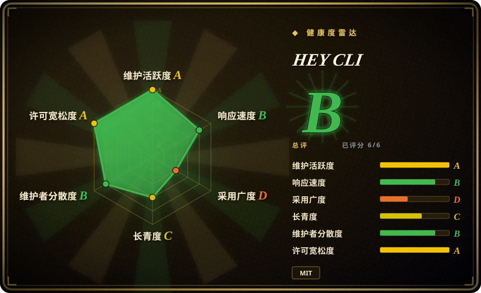
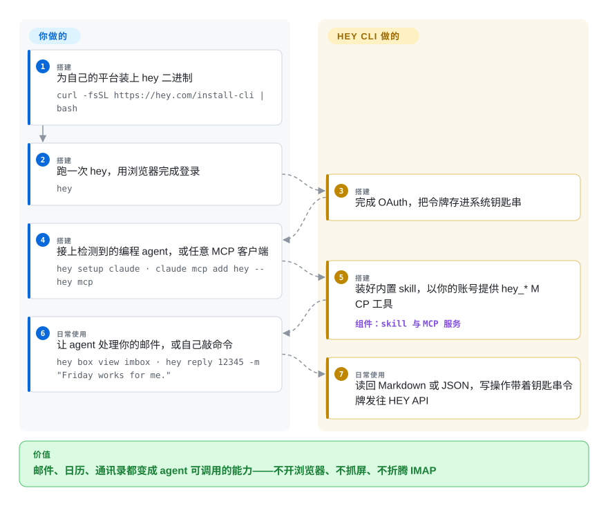

# HEY CLI

编码 agent 能翻遍整个仓库，却碰不到真正拍板的地方：那封邮件躺在它读不到的网页应用里，你只能切出去亲手回。HEY CLI 是 37signals 官方的 Go 二进制，把 HEY 邮箱和日历服务变成命令——终端里给人读 Markdown，管道里给 agent 吐 JSON——还自带一份 agent skill 和一个 MCP 服务，收件箱的分拣从此可以外包。

## 何时使用

你的个人或小公司邮件跑在 HEY 上（37signals 托管的订阅服务——30 天免费试用，之后付费），而你的日常在终端和编程 agent 之间切换。痛点是上下文切换：任务做到一半要查封邮件，就得离开编辑器开浏览器；那个替你写代码的 agent，却读不到客户确认截止日期的那根邮件线程。装上 `hey`（一条 curl，或 mise/Homebrew/deb/Scoop/Nix），跑一次 `hey` 用浏览器登录，再接上 agent——`hey setup claude`、`hey setup codex`，或对任意 MCP 客户端执行 `claude mcp add hey -- hey mcp`。此后 agent 能把线程读成 Markdown、回信、处理 Screener、联系人、待办和日历；`hey tui` 则给你同一个邮件、联系人、日历、日记的全键盘终端应用。

在同类手段里选它，恰恰因为这是厂商自己的客户端、走官方 API（由 `basecamp/hey-sdk` 建模）：没有网页改版就碎掉的 DOM 抓取（Playwright MCP 那条路），也没有逐应用社区维护、会烂掉的生成 harness（CLI-Anything 那条路）。输出契约天生为 agent 设计——所有数据命令都答 `--json`，`--jq` 内置过滤不用另装 jq，退出码有文档（`hey help exit-codes`），`hey watch --box imbox --events new` 则在新邮件落箱时逐行吐 JSON，脚本可以即时反应。凭据存在系统钥匙串里，MCP 服务还能收窄成 `--read-only` 或只开部分 `--domains`。

## 怎么用起来

hey-cli 是一个 Go 二进制的三张脸：一套命令目录（`hey box view imbox`、`hey reply …`）、一个全屏终端应用（`hey tui`），以及本页的主角——agent 接口。底下所有操作都走官方 HEY API：你用浏览器登录一次（OAuth——由 HEY 自己的服务器发给 CLI 一个可刷新令牌的委托登录流程），令牌落进系统钥匙串，之后的每条命令都带着它。**你**负责装二进制、接 agent；**CLI** 负责把内置 skill 装进 `~/.agents/skills/hey`，以你登录的身份在 stdio MCP 上提供七个 `hey_*` 网关工具（`hey_boxes`、`hey_search`、`hey_threads`、`hey_contacts`、`hey_todos`、`hey_calendar`、`hey_identity`），并把每个答案按读者塑形——终端前的人读到 Markdown，管道里输出 JSON，`--jq` 过滤内建。写操作从不自动重试（被限流的发送会以错误浮出，而不是冒险重发一封重复邮件），`hey watch` 则把收件箱变成一条可以 tail 的流。这就像教会 agent 操作一个邮件**网站**和直接递给它一套邮件 **API** 的区别。

<!-- flow-steps:begin (generated from flows/hey-cli.json by tools/flow_card.py — do not edit) -->

流程文字版

1. **你**（搭建）：为自己的平台装上 hey 二进制 — `curl -fsSL https://hey.com/install-cli | bash`
2. **你**（搭建）：跑一次 hey，用浏览器完成登录 — `hey`
3. **HEY CLI**（搭建）：完成 OAuth，把令牌存进系统钥匙串
4. **你**（搭建）：接上检测到的编程 agent，或任意 MCP 客户端 — `hey setup claude · claude mcp add hey -- hey mcp`
5. **HEY CLI**（搭建）：装好内置 skill，以你的账号提供 hey_* MCP 工具 — 组件：`skill 与 MCP 服务`
6. **你**（日常使用）：让 agent 处理你的邮件，或自己敲命令 — `hey box view imbox · hey reply 12345 -m "Friday works for me."`
7. **HEY CLI**（日常使用）：读回 Markdown 或 JSON，写操作带着钥匙串令牌发往 HEY API

**价值**：邮件、日历、通讯录都变成 agent 可调用的能力——不开浏览器、不抓屏、不折腾 IMAP

<!-- flow-steps:end -->

## 何时不用

- **你的邮件不在 HEY 上。** 这个 CLI 只会说 HEY 的 API——没有 IMAP、SMTP、JMAP，也不支持 Gmail。为了一个 CLI 迁移邮箱是本末倒置：Gmail/Workspace 账号用 Google 侧的 MCP 服务（[google_workspace_mcp](https://github.com/taylorwilsdon/google_workspace_mcp)，未收录）；任意 IMAP 邮箱在终端用 [neomutt](https://github.com/neomutt/neomutt)，自动化用 [imapflow](https://github.com/postalsys/imapflow) 库（均未收录）。
- **你要自托管、数据主权在自己手里的邮件。** HEY 是托管的商业服务，每条命令都在 37signals 的云端走一个来回；CLI 是 MIT 改变不了邮件存在哪里的事实。自己跑邮件服务器，配 neomutt 这类标准 IMAP 客户端。
- **受监管、要审计的邮箱，agent 不能拿你的凭据乱动。** `hey mcp` 以你登录的身份提供服务，写操作也在内；`--read-only` 和 `--domains` 能收窄接口，但 CLI 内部没有逐动作审批。在 harness 层设闸，或者干脆别让 agent 碰邮件，别指望工具自己拒绝。
- **你需要一套自动化横跨多个邮件服务商。** 它天生是单厂商接口。跨厂商的流水线请建在 IMAP/SMTP 库（[imapflow](https://github.com/postalsys/imapflow)）或各服务商自己的 SDK 上，而不是某一家厂商的 CLI 上。
- **你要的是库契约，不是二进制。** 直接用 [basecamp/hey-sdk](https://github.com/basecamp/hey-sdk)（Go/Rust/TypeScript/Kotlin/Swift）——CLI 自己就建在它上面——认证和输出塑形自己掌舵。
- **你需要冻结不变的接口。** 仓库只有七个月大、发版极快（仅 2026 年 9 月就有五个 tagged release）；CI 里有接口兼容闸门，但依赖精确输出的自动化请用 `HEY_VERSION` 锁版本。

## 横向对比

| 替代品 | 是否收录 | 我们的评价 | 取舍 |
|---|---|---|---|
| [CLI-Anything](cli-anything.zh.md) | ✅ | 要用一套模式让一大批 GUI 软件变得 agent 可调用，选 CLI-Anything；目标就是 HEY、能拿到厂商自己的受支持接口时，选 HEY CLI。 | 生成式 harness 把一套模式摊到多个应用上，但逐应用靠社区维护；hey-cli 是第一方、输出契约稳定——代价是同样天生单一用途。 |
| [Playwright MCP](../../web-automation/playwright-family/playwright-mcp.zh.md) | ✅ | 只有在没有任何 API 通路时才用浏览器自动化去开 HEY 的网页；对 HEY 而言，第一方 CLI/MCP 是确定性的，而选择器每次改版都会碎。 | 浏览器自动化不需要厂商配合，但你被绑死在 DOM、选择器和登录态上；hey-cli 走有文档的 API，凭据进钥匙串、退出码稳定。 |
| [basecamp/hey-sdk](https://github.com/basecamp/hey-sdk) | 未收录 | 要用 Go/Rust/TypeScript/Kotlin/Swift 自己写集成，选 SDK；想要现成的界面（TUI、skill、MCP 服务），选 hey-cli。 | SDK 把 API 原样交给你、不带任何使用体验；CLI 补上认证、钥匙串存储、输出塑形和 agent 接线——代价是你要跟着它的快发版节奏走。本批 tab-intake 未收录。 |
| [google_workspace_mcp](https://github.com/taylorwilsdon/google_workspace_mcp) | 未收录 | 如果你的邮件本来就在 Gmail/Workspace 上又想要 agent 接入，用这个项目——不要为了一个 CLI 换邮件服务商。 | 它覆盖 Google 账号的 Gmail/日历/Drive（MIT、活跃），但由社区维护，而 hey-cli 是第一方；两者各自锁死在自己服务商那头。本批 tab-intake 未收录。 |
| [neomutt](https://github.com/neomutt/neomutt) | 未收录 | 想要一个对任意 IMAP 邮箱可用的终端邮件客户端、不需要 agent 也不绑厂商，选 neomutt；agent 接入才是重点时，选 hey-cli。 | neomutt 说标准 IMAP，指向哪台服务器都行（自托管也行）；hey-cli 只会说 HEY，但长出 neomutt 永远不会有的 JSON/MCP/skill 接口。本批 tab-intake 未收录。 |

## 技术栈

- **Go 1.27** 单二进制；命令面用 `spf13/cobra`；TUI 建在 Charm 的 Bubble Tea 全家桶上（`bubbletea/v2`、`bubbles/v2`、`lipgloss/v2`、`glamour/v2`）。
- 通过官方 SDK `github.com/basecamp/hey-sdk/go` 与 HEY 通信（按其 README，由 API 的 Smithy 模型生成）；`go.mod` 里有 `basecamp/actioncable-go`，树里有 `internal/cable/`，README 也宣称“实时跟随 HEY”。
- MCP 服务基于 `modelcontextprotocol/go-sdk`；agent skill 放在 `skills/hey/` 并嵌进二进制（`skills/embed.go`）；`--jq` 是内嵌的 `gojq`。
- 认证：对 HEY 自己的 OAuth 服务器做浏览器登录（或令牌/Cookie 登录）；凭据进系统钥匙串（`zalando/go-keyring`），文件兜底。
- 发布工程：goreleaser；release 用 Sigstore 无密钥签名、安装器会校验（`sigstore/sigstore-go`），附 SHA-256 校验和；CI 含 CodeQL、OpenSSF Scorecard、gitleaks、actionlint；bats 端到端加 Go 冒烟测试；还有体积预算和命令面兼容闸门。
- 平台：macOS/Linux/Windows；curl 脚本、mise、Homebrew cask、deb/rpm/apk、Scoop、Nix 或 `go install` 安装。

## 依赖

- **一个 HEY 账号**——硬依赖：37signals 的付费托管服务（依 hey.com 2026-09-28 所见，30 天免费试用、无需信用卡）。没有账号，这个二进制无事可做。
- **能访问 HEY 的 API**（SDK 默认配置指向 `https://app.hey.com`）。
- 其余什么都不用跑：单个静态二进制，无守护进程；MCP 服务就是同一二进制的 stdio 模式。凭据在系统钥匙串（兜底文件 `~/.config/hey-cli/credentials.json`）。
- **编程 agent（可选）**：Claude Code（内置 skill 加 `hey@37signals` 插件）、Codex（共享 `~/.agents/skills/hey` skill），或任意 stdio MCP 客户端。

## 运维难度

**低。** 一个二进制加一次浏览器登录；`hey doctor` 检查安装、登录和 agent 接线，`hey upgrade` 按安装方式自更新。真正的暴露面是信任而非体力活：agent 拿着你的账号能写邮箱（用 `hey mcp --read-only` / `--domains` 收窄），外加一趟快节奏的 v1.x 发布列车（自动化请用 `HEY_VERSION` 锁版本）。

## 健康度与可持续性

- **维护** —— 2026-03-03 创建；仅 2026 年 9 月就有五个 tagged release（v1.4.2 → v1.7.0，最新 2026-09-25）；本页核查当天还有推送。极度活跃，是厂商团队的节奏。
- **治理与巴士因子** —— 归 `basecamp` 组织（37signals）所有；三位核心提交者（150/128/108 次提交）外加 dhh；[推断] 核心提交者是 37signals 员工。路线图归厂商，无基金会——但第一方客户端本来就是这个形态。
- **背书与寿命** —— 由运营 HEY 服务的厂商亲自维护自家 CLI；对这个接口面而言是最强的背书，反面则是彻底的耦合：CLI 是 MIT，服务和 API 却是专有的，37signals 改了 HEY，CLI 只能跟着或死掉。七个月大——还谈不上 Lindy 判决；服务本身比 CLI 早问世多年 [未验证]。
- **采用与生态** —— 约 390 star、47 fork（2026-09-28）；采用上限由 HEY 订户数而非通用 CLI 需求决定。配套的五语言 SDK 就是它的生态；文档异常齐整（逐命令帮助、四份文档页、稳定的退出码/环境变量帮助主题）。
- **风险信号** —— 年轻且快节奏的 v1.x（CI 兼容闸门有所缓解）；“agent 拿着你的邮箱”是信任面，`--read-only`/`--domains` 立了部分栅栏；这个年纪还没有可查的 CVE 记录。对一个七个月大的工具，安全姿态罕见地认真：Sigstore 签名的 release、校验和、CodeQL/Scorecard/gitleaks 流水线。

## 存疑（未验证）

- [推断] 三位核心提交者（monorkin、robzolkos、jeremy）是 37signals 员工——组织归属和提交模式支持这一推断；个人雇佣关系未查证。
- [未验证] HEY 试用/订阅条款（“30 天免费试用、无需信用卡”）来自 2026-09-28 读到的 hey.com 落地页文案；具体套餐与价格未审计。
- [推断] 实时更新走 ActionCable WebSocket——由 `go.mod` 里的 `basecamp/actioncable-go`、`internal/cable/` 包和 README 的“实时跟随 HEY”推得；未做抓包验证。
- [未验证] MCP 网关工具集（`hey_boxes` … `hey_identity`）反映的是 v1.7.0 时点的 docs/agents.md；本批没有真实账号可实测。
- [未验证] star/fork 数是 2026-09-28 的时点值，在这个仓库的年纪上信号量很低。
