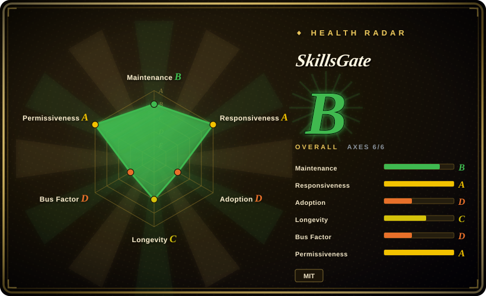
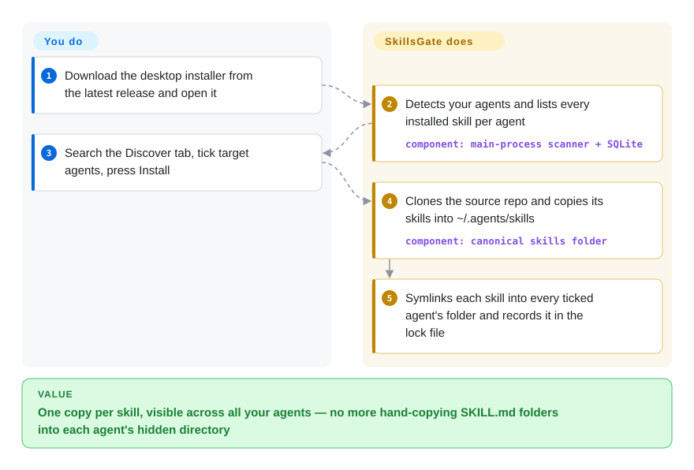

# SkillsGate

You use three or four coding agents and each keeps its skills in a different hidden folder, so you end up copying the same `SKILL.md` directory by hand into `~/.claude/skills`, `~/.cursor/skills`, `~/.codex/skills`… and can never see at a glance which agent has what. SkillsGate is a desktop window over all of those folders: it lists every installed skill per agent, installs from the skills.sh catalog with a click, and keeps one copy that it links into each agent you tick.

## When to use

You're a developer who hops between Claude Code, Cursor and Codex on the same laptop, and your skills have sprawled: `ls ~/.claude/skills` shows eleven folders, `~/.cursor/skills` shows six, two of them are stale copies of the same skill with different contents, and a colleague's "try the frontend-design skill" means another round of clone-and-copy. You don't want another CLI to remember; you want to *see* the matrix of skills × agents and flip cells.

That's the trigger for SkillsGate over [Vercel Skills](vercel-skills.md) (the `npx skills` CLI it builds on): same skills.sh catalog and the same `~/.agents/skills` canonical folder, but a GUI with per-agent checkboxes, a rendered/raw `SKILL.md` editor, and an SSH "remote servers" pane that can list and push your local skills to a dev box — none of which the CLI does. Pick it over the Rust/Tauri managers (Skills Manager, Skills Hub) when the SSH push to remote machines and the skills.sh-first catalog matter more to you than project-scope workspaces, presets or git-backed multi-device sync, which those have and this does not.

## How it works

SkillsGate is an Electron app whose main process does all the file work; the window is only a view. On launch it detects which of ~20 agents you have (by checking their config folders), then scans each one's global skills folder for `SKILL.md` files and caches the result in a local SQLite database — no account, no backend (the hosted backend and auth were removed in April 2026). When you press Install in the Discover tab, the app `git clone`s the skill's source repository into a temp folder, copies every skill it finds there into one canonical folder, `~/.agents/skills/<name>`, and then puts a symlink — a shortcut that points at the real folder — into each agent you ticked (it falls back to a plain copy if symlinks fail, e.g. without Windows privileges). It also records the install in `~/.agents/.skill-lock.json`, the lock file format it adapted from the skills.sh CLI. You decide which skills and which agents; it does the cloning, linking, rescanning and, for remote servers, the `ssh`/`tar` round-trips using your existing `~/.ssh` keys.

<!-- flow-steps:begin (generated from flows/skillsgate.json by tools/flow_card.py — do not edit) -->

Text version of the flow

1. **You**: Download the desktop installer from the latest release and open it
2. **SkillsGate**: Detects your agents and lists every installed skill per agent — component: `main-process scanner + SQLite`
3. **You**: Search the Discover tab, tick target agents, press Install
4. **SkillsGate**: Clones the source repo and copies its skills into ~/.agents/skills — component: `canonical skills folder`
5. **SkillsGate**: Symlinks each skill into every ticked agent's folder and records it in the lock file

**Value**: One copy per skill, visible across all your agents — no more hand-copying SKILL.md folders into each agent's hidden directory

<!-- flow-steps:end -->

## When NOT to use

- **You also run `npx skills` on the same machine.** SkillsGate reads and writes `~/.agents/.skill-lock.json` as lock **version 1**; the upstream skills.sh CLI (`vercel-labs/skills`, `src/skill-lock.ts`) is at **version 3** and wipes any older lock it reads. SkillsGate, in turn, treats a v3 lock as empty and overwrites it on create/remove/update (open issue #30, 2026-09-26, reproduced on dummy files). Two tools ping-ponging one lock file loses install-source records. Pick **one** manager: [Vercel Skills](vercel-skills.md) if you want the CLI and its update tracking, SkillsGate only if you stay inside its GUI.
- **You want to install one skill out of a multi-skill repository.** Discover's Install passes the skill's `owner/repo` source, and the installer copies *every* `SKILL.md` it finds in that clone to the ticked agents [推断: read from `skills:install` in `ipc-handlers.ts` at the v0.7.3 tag, not run]. For surgical installs use `npx skills add <repo> --skill <name>` via [Vercel Skills](vercel-skills.md).
- **You need per-project skill sets or profiles.** Installs are global only (`installSkill(source, agents, "global")`); project folders like `.claude/skills` are *scanned and shown*, not managed, and "profiles" is still an open request (issue #13). Skills Hub or xingkongliang's Skills Manager (not indexed) have project-scope workspaces and presets.
- **You need your skill library synced across machines through git.** SkillsGate's sync is a one-way SSH push/mirror to servers you register; there is no git-backed library. Skills Hub (not indexed) syncs a library through GitHub/GitLab/Gitee.
- **You want a headless or scriptable tool.** The terminal UI and the `skillsgate` / `@skillsgate/tui` npm packages were discontinued in September 2026 (README; PR #27); what's left is a GUI. In CI, dotfiles bootstrap or over SSH, use [Vercel Skills](vercel-skills.md) or a plain `git clone` + symlink script.
- **You need a vetted catalog.** Discover searches skills.sh's public API and clones whatever repository a result points at; nothing is reviewed before it lands in your agents' context. Treat every install as third-party prompt content — no manager in this row solves that for you.
- **You're on an old build or a flaky network path.** Versions ≤ 0.7.0 have a broken macOS auto-updater (README banner: manual reinstall required), and issue #28 (Discover `fetch failed` on macOS while `curl` works) is still being fixed via PR #29. Budget for a manual upgrade.

## Comparison

| Alternative | In index | Our verdict | Tradeoff |
|---|---|---|---|
| [Vercel Skills](vercel-skills.md) | ✅ | If you're comfortable in a terminal or need scripted installs, pick the `npx skills` CLI; pick SkillsGate only when a visual skills × agents matrix and SSH push are what you're missing. | The CLI is the upstream of SkillsGate's catalog and lock format, runs anywhere Node does and supports `--skill` / project scope — but has no GUI, editor or remote-server view; mixing both on one machine corrupts the shared lock (v1 vs v3). |
| Skills Manager (xingkongliang/skills-manager) | not indexed | When you want project workspaces, presets and multi-device backup in a lighter native app, pick this Rust/Tauri manager over SkillsGate; pick SkillsGate for SSH push to dev servers. | ~5.1k stars, MIT, active (2026-09) with a central library, per-project sync and agent-driven management; no SSH remote-server pane that we found. Not added in this tab-intake batch. |
| Skills Hub (qufei1993/skills-hub) | not indexed | When your skill library must follow you across computers, pick Skills Hub for its git-backed (GitHub/GitLab/Gitee) sync and scheduled updates; pick SkillsGate when the target is a remote server, not another laptop. | Tauri + React, MIT, active (2026-09); adds tags, recycle bin, global/project scope and scheduled updates — more features, more state to reason about. Not added in this tab-intake batch. |
| Skills Manager (jiweiyeah/Skills-Manager) | not indexed | When you want the same symlink-to-32-tools model plus a Homebrew cask and AI translation of skills, pick this; pick SkillsGate if you prefer its notarized macOS build and SSH servers. | ~1k stars, MIT; its cask is ad-hoc signed and strips quarantine, and its README carries a sponsor ad. Not added in this tab-intake batch. |
| `git clone` + `ln -s` script in your dotfiles | not a repo | When you have a handful of hand-written skills and already version your dotfiles, a ten-line symlink script beats any GUI; pick SkillsGate once catalog browsing and per-agent toggles are worth an Electron app. | Zero dependencies and fully reviewable, but you maintain the per-agent path table yourself and get no discovery or editor. A technique, not a project. |

## Tech stack

- **App:** Electron 42 (`electron-vite` build, `electron-builder` packaging: DMG/zip for macOS — notarized — NSIS for Windows, AppImage/deb for Linux), auto-update via `electron-updater` against GitHub Releases.
- **UI:** React 19 + React Router 7, Tailwind CSS 4, CodeMirror 6 (markdown editor), `marked` for rendering, `react-window` for long lists; i18n with a zh-CN locale.
- **Storage:** `better-sqlite3` (native module) for settings, favorites, server configs and the skills cache; skill files on disk under `~/.agents/skills` plus per-agent symlinks; `gray-matter` for `SKILL.md` frontmatter.
- **Monorepo:** npm workspaces — `apps/desktop`, `apps/web` (the React Router 7 landing page on Cloudflare Workers), `packages/ui`. TypeScript throughout.

## Dependencies

- **To run the app:** just the installer — no server, no account. `git` must be on `PATH` for catalog installs (it shells out to `git clone --depth 1`); the system `ssh` and `tar` binaries plus keys in `~/.ssh` for the remote-servers feature.
- **Network:** `skills.sh/api/search` and `www.skills.sh/trending` (catalog), `api.github.com` / `raw.githubusercontent.com` (skill previews), GitHub clones, and GitHub Releases for updates. Offline, you can still view/edit/toggle already-installed skills.
- **To build from source:** Node.js 22+; `better-sqlite3` is rebuilt for Electron on `npm install` (`npm run rebuild:native` if install scripts were skipped).

## Ops difficulty

**Low** for a single user — install the desktop app and it manages files under your home directory. The real burden is correctness, not infrastructure: know that it rewrites `~/.agents/.skill-lock.json` and replaces existing per-agent skill folders with symlinks, so back up hand-edited skill folders before first use and don't let `npx skills` share the machine. Upgrades are manual if you are on ≤ 0.7.0. Remote servers need working key-based SSH; the app runs `find`/`tar` on the remote over that connection.

## Health & viability

- **Maintenance (2026-09-28):** active — desktop releases roughly monthly (0.5.0 in April → 0.7.3 on 2026-09-24), last push 2026-09-24, not archived; issues get a maintainer reply, and the data-loss report (#30) is two days old and still open.
- **Governance / bus factor:** effectively one person. `sultanvaliyev` has 438 of ~454 commits; the other five contributors have 1–8 each. The GitHub org is a wrapper around a solo project with no stated funding.
- **Age & Lindy:** created 2026-02-10, so about 7.5 months old — young, no longevity track record. It has already changed shape twice (hosted backend and auth removed in April; CLI/TUI discontinued in September), which cuts both ways: responsive pruning, but expect more surface changes.
- **Adoption:** ~1.3k stars and 82 forks (2026-09-28), but release-asset downloads total ~9.3k across all releases and only tens for the latest one (e.g. 59 Windows installers, 20 Apple-Silicon DMGs as of 2026-09-28), and the deprecated `skillsgate` npm package still sees ~287 downloads/month. Star count runs well ahead of measured usage.
- **Risk flags:** MIT (LICENSE file checked), no CLA. The load-bearing risk is ecosystem coupling: it depends on skills.sh's undocumented trending HTML and search API, and on a lock-file format whose upstream has already moved to v3 without it.

## Caveats (unverified)

- [推断] "Install copies every skill in the source repository" is read from the `skills:install` handler and `discover.tsx` at the v0.7.3 tag; not executed in a running app.
- [未验证] Issue #30's lock-overwrite path was reproduced by its reporter on dummy files only; no live user data loss has been observed, and a fix may land after 2026-09-28.
- [推断] The collision with `npx skills` (which wipes locks below v3) is inferred from reading both `readSkillLock` implementations; the exact sequence of lost entries was not reproduced here.
- [未验证] The count of "20+ supported agents" is the README's framing; the agent table in `ipc-handlers.ts` changes by release (PR #26 proposes 8 more), and each agent's folder path is upstream's claim, not verified against every agent.
- [未验证] "No telemetry" is inferred from grepping main-process and renderer files for analytics/Sentry/PostHog hooks at v0.7.3; bundled third-party dependencies were not audited.
- [未验证] Star count ~1.3k and release-asset download counts are point-in-time GitHub API values (2026-09-28) and do not count installs through the auto-updater.
- [推断] Feature claims for the substitute managers (project workspaces, git-backed sync, presets) come from their READMEs read on 2026-09-28, not from running them.
