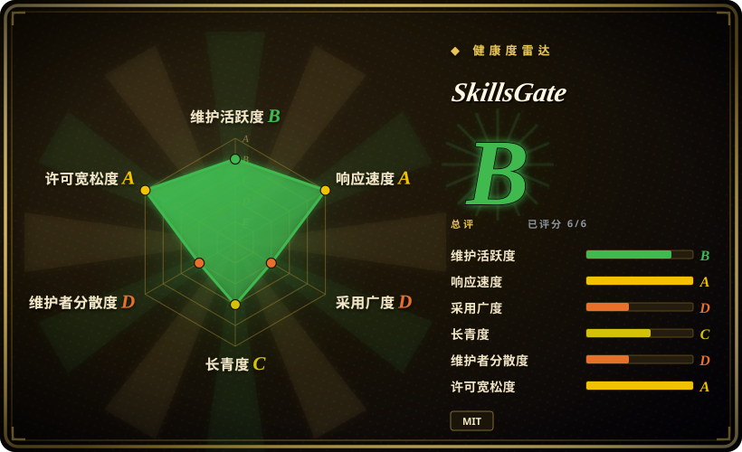
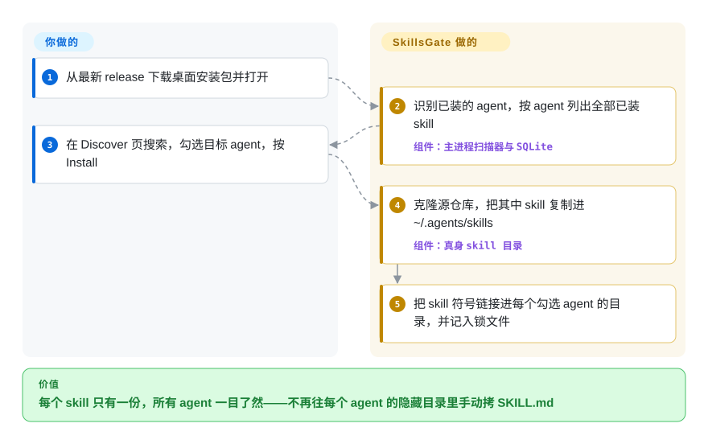

# SkillsGate

你同时在用三四个编程 agent，每个都把 skill 藏在自己的隐藏目录里：同一个 `SKILL.md` 文件夹要手动往 `~/.claude/skills`、`~/.cursor/skills`、`~/.codex/skills` 里各拷一遍，而且永远看不清哪个 agent 装了什么。SkillsGate 是一扇盖在这些目录上的桌面窗口：按 agent 列出所有已装 skill，点一下从 skills.sh 目录安装，只保留一份真身，再链接到你勾选的每个 agent。

## 何时使用

你在同一台笔记本上轮流用 Claude Code、Cursor 和 Codex，skill 已经失控：`ls ~/.claude/skills` 有十一个文件夹，`~/.cursor/skills` 有六个，其中两个是同一个 skill 的旧拷贝、内容还不一样；同事一句“试试 frontend-design 那个 skill”，又得来一轮 clone 再拷贝。你不想再记一个 CLI，你想直接*看到* skill × agent 的矩阵，然后逐格开关。

这时选 SkillsGate，而不是它背后的 [Vercel Skills](vercel-skills.zh.md)（`npx skills` 命令行）：两者用同一个 skills.sh 目录、同一个 `~/.agents/skills` 真身目录，但 SkillsGate 多了按 agent 勾选的图形界面、能切换渲染/源码的 `SKILL.md` 编辑器，以及一个 SSH“远程服务器”面板，可以列出并把本机 skill 推到开发机上——这些 CLI 都没有。和 Rust/Tauri 写的同类管理器（Skills Manager、Skills Hub）相比：如果你更在意把 skill 推到远程机器、以 skills.sh 为主的目录，选它；如果你要项目级工作区、预设组合、基于 git 的多设备同步，那几家有，它没有。

## 怎么用起来

SkillsGate 是个 Electron 应用，所有文件操作都在主进程里做，窗口只负责显示。启动时它检查约 20 个 agent 的配置目录来判断你装了哪些，再扫描每个 agent 的全局 skill 目录找 `SKILL.md`，结果缓存在本地 SQLite 数据库里——不需要账号，也没有后端（托管后端和登录在 2026 年 4 月已移除）。你在 Discover 页按下 Install 时，它把这个 skill 所在的源仓库 `git clone` 到临时目录，把里面找到的每个 skill 复制进一个真身目录 `~/.agents/skills/<name>`，然后在你勾选的每个 agent 目录里放一个符号链接——指向真身文件夹的“快捷方式”（链接建不起来时，比如 Windows 没有权限，就退回直接复制）。它还把这次安装记进 `~/.agents/.skill-lock.json`，这是它从 skills.sh CLI 改写来的锁文件格式。选哪些 skill、装给哪些 agent 由你决定；clone、建链接、重新扫描，以及对远程服务器用你现有 `~/.ssh` 密钥跑 `ssh`/`tar` 来回传输，都由它来做。

<!-- flow-steps:begin (generated from flows/skillsgate.json by tools/flow_card.py — do not edit) -->

流程文字版

1. **你**：从最新 release 下载桌面安装包并打开
2. **SkillsGate**：识别已装的 agent，按 agent 列出全部已装 skill — 组件：`主进程扫描器与 SQLite`
3. **你**：在 Discover 页搜索，勾选目标 agent，按 Install
4. **SkillsGate**：克隆源仓库，把其中 skill 复制进 ~/.agents/skills — 组件：`真身 skill 目录`
5. **SkillsGate**：把 skill 符号链接进每个勾选 agent 的目录，并记入锁文件

**价值**：每个 skill 只有一份，所有 agent 一目了然——不再往每个 agent 的隐藏目录里手动拷 SKILL.md

<!-- flow-steps:end -->

## 何时不用

- **同一台机器上你也在跑 `npx skills`。** SkillsGate 按**第 1 版**格式读写 `~/.agents/.skill-lock.json`；上游 skills.sh CLI（`vercel-labs/skills` 的 `src/skill-lock.ts`）已经是**第 3 版**，读到旧版锁文件会直接清空。反过来，SkillsGate 把第 3 版锁文件当成空的，在新建、删除、更新 skill 时覆盖写回（issue #30，2026-09-26，报告人用假数据复现）。两个工具来回改同一个锁文件，会丢掉安装来源记录。只选**一个**管理器：想要 CLI 和它的更新追踪，用 [Vercel Skills](vercel-skills.zh.md)；只在图形界面里操作，才用 SkillsGate。
- **你只想从一个多 skill 仓库里装其中一个。** Discover 的 Install 传的是 skill 的 `owner/repo` 来源，安装器会把克隆下来的仓库里*所有* `SKILL.md` 都装给勾选的 agent（[推断]：依据是 v0.7.3 标签下 `ipc-handlers.ts` 的 `skills:install` 源码，未实际运行）。要精确安装，用 [Vercel Skills](vercel-skills.zh.md) 的 `npx skills add <repo> --skill <name>`。
- **你需要按项目区分 skill 组合或“配置档”。** 安装只有全局一种（`installSkill(source, agents, "global")`）；`.claude/skills` 这类项目目录只会被*扫描展示*，不受它管理，“配置档”功能仍是未关闭的需求（issue #13）。Skills Hub 或 xingkongliang 的 Skills Manager（均未收录）有项目级工作区和预设。
- **你要让 skill 库通过 git 在多台电脑间同步。** SkillsGate 的同步是单向的 SSH 推送/镜像到你登记的服务器，没有基于 git 的库。Skills Hub（未收录）能通过 GitHub/GitLab/Gitee 同步整个库。
- **你要无界面、可脚本化的工具。** 终端界面以及 `skillsgate` / `@skillsgate/tui` 两个 npm 包已于 2026 年 9 月停止维护（README；PR #27），剩下的只有图形界面。在 CI、dotfiles 初始化脚本或 SSH 会话里，用 [Vercel Skills](vercel-skills.zh.md) 或一段 `git clone` 加符号链接的脚本。
- **你需要经过审核的目录。** Discover 查询的是 skills.sh 的公开 API，搜索结果指向哪个仓库就克隆哪个，进入 agent 上下文之前没有任何审核。每次安装都当作引入第三方提示词内容来对待——这一行里的任何管理器都替你解决不了这个问题。
- **你还在旧版本上，或者网络路径不稳。** 0.7.0 及更早版本的 macOS 自动更新是坏的（README 顶部横幅：必须手动重装）；issue #28（macOS 上 Discover 报 `fetch failed`，而 `curl` 正常）还在通过 PR #29 修复。要预留一次手动升级。

## 横向对比

| 替代品 | 是否收录 | 我们的评价 | 取舍 |
|---|---|---|---|
| [Vercel Skills](vercel-skills.zh.md) | ✅ | 习惯终端或需要脚本化安装，选 `npx skills` 命令行；只有当你缺的正是 skill × agent 的可视矩阵和 SSH 推送时，才选 SkillsGate。 | CLI 是 SkillsGate 目录和锁文件格式的上游，有 Node 的地方就能跑，支持 `--skill` 和项目级安装——但没有界面、编辑器和远程服务器视图；两者在同一台机器上混用会弄坏共享锁文件（第 1 版对第 3 版）。 |
| Skills Manager（xingkongliang/skills-manager） | 未收录 | 想要项目工作区、预设组合和多设备备份、又想要更轻的原生应用，选这个 Rust/Tauri 管理器；要把 skill 推到开发服务器，选 SkillsGate。 | 约 5.1k 星、MIT、2026-09 仍活跃，有中央库、按项目同步、可由 agent 驱动管理；我们没找到 SSH 远程服务器面板。本批次按标签页收录，未添加。 |
| Skills Hub（qufei1993/skills-hub） | 未收录 | skill 库要跟着你换电脑，选 Skills Hub——它用 GitHub/GitLab/Gitee 仓库同步、还能定时更新；同步目标是远程服务器而不是另一台笔记本时，选 SkillsGate。 | Tauri + React、MIT、2026-09 仍活跃；多了标签、回收站、全局/项目两种范围和定时更新——功能更多，要理解的状态也更多。本批次按标签页收录，未添加。 |
| Skills Manager（jiweiyeah/Skills-Manager） | 未收录 | 想要同样的“符号链接到 32 个工具”模型，外加 Homebrew cask 和 AI 翻译 skill，选这个；更看重经过公证的 macOS 安装包和 SSH 服务器，选 SkillsGate。 | 约 1k 星、MIT；它的 cask 只做了 ad-hoc 签名并会去掉隔离属性，README 里还挂着赞助广告。本批次按标签页收录，未添加。 |
| dotfiles 里一段 `git clone` + `ln -s` 脚本 | 非仓库 | 只有几个自己写的 skill、dotfiles 本来就在版本管理里，十行符号链接脚本胜过任何图形界面；等到浏览目录和按 agent 开关值得一个 Electron 应用时，再选 SkillsGate。 | 零依赖、完全可审查，但每个 agent 的路径表要自己维护，也没有发现功能和编辑器。这是一种做法，不是一个项目。 |

## 技术栈

- **应用：** Electron 42（`electron-vite` 构建，`electron-builder` 打包：macOS 出 DMG/zip 并做公证，Windows 出 NSIS，Linux 出 AppImage/deb），通过 `electron-updater` 从 GitHub Releases 自动更新。
- **界面：** React 19 + React Router 7、Tailwind CSS 4、CodeMirror 6（Markdown 编辑器）、`marked` 渲染、`react-window` 渲染长列表；带 zh-CN 语言包。
- **存储：** `better-sqlite3`（原生模块）存设置、收藏、服务器配置和 skill 缓存；skill 文件落在 `~/.agents/skills`，再加各 agent 目录里的符号链接；用 `gray-matter` 解析 `SKILL.md` 头部元数据。
- **单体仓库：** npm workspaces——`apps/desktop`、`apps/web`（跑在 Cloudflare Workers 上的 React Router 7 落地页）、`packages/ui`，全部 TypeScript。

## 依赖

- **运行应用：** 只要安装包，不需要服务器和账号。从目录安装需要 `PATH` 上有 `git`（它调用 `git clone --depth 1`）；远程服务器功能需要系统自带的 `ssh`、`tar` 和 `~/.ssh` 里的密钥。
- **网络：** `skills.sh/api/search` 与 `www.skills.sh/trending`（目录），`api.github.com` / `raw.githubusercontent.com`（skill 预览），GitHub 克隆，以及 GitHub Releases（更新）。离线时仍可查看、编辑、开关已安装的 skill。
- **从源码构建：** Node.js 22+；`npm install` 时会为 Electron 重新编译 `better-sqlite3`（跳过了安装脚本就手动跑 `npm run rebuild:native`）。

## 运维难度

**低**（单人使用）——装好桌面应用，它只管理你家目录下的文件。真正的负担在正确性而不是基础设施：它会改写 `~/.agents/.skill-lock.json`，并把各 agent 目录里已有的同名 skill 文件夹替换成符号链接，所以首次使用前先备份手改过的 skill，也别让 `npx skills` 共用这台机器。停在 0.7.0 及更早版本的要手动升级。远程服务器需要可用的密钥登录 SSH，应用会通过这条连接在远端执行 `find`/`tar`。

## 健康度与可持续性

- **维护（2026-09-28）：** 活跃——桌面版大约每月一个版本（4 月的 0.5.0 到 2026-09-24 的 0.7.3），最后推送 2026-09-24，未归档；issue 有维护者回复，数据丢失报告（#30）才开两天，尚未关闭。
- **治理与巴士因子：** 实际上是一个人。`sultanvaliyev` 贡献了约 454 次提交中的 438 次，其余五位各 1–8 次。GitHub 组织只是个人项目的外壳，没有公开的资金来源。
- **年龄与 Lindy：** 创建于 2026-02-10，约 7.5 个月——年轻，没有长寿记录。它已经两次改变形态（4 月移除托管后端和登录，9 月停掉 CLI/TUI），这有两面：能果断砍掉包袱，但也要预期接口还会变。
- **采用度：** 约 1.3k 星、82 个 fork（2026-09-28），但所有版本安装包累计下载约 9.3k 次，最新版本只有几十次（截至 2026-09-28，Windows 安装包 59 次、Apple Silicon DMG 20 次），已废弃的 `skillsgate` npm 包每月仍有约 287 次下载。星数明显跑在实测用量前面。
- **风险信号：** MIT（已核对 LICENSE 文件），无 CLA。真正的风险是生态耦合：它依赖 skills.sh 没有文档的 trending 页面 HTML 和搜索 API，还依赖一个上游已经升到第 3 版、而它没跟上的锁文件格式。

## 存疑（未验证）

- [推断]“安装会复制源仓库里的所有 skill”来自阅读 v0.7.3 标签下的 `skills:install` 处理函数和 `discover.tsx`，未在运行中的应用里验证。
- [未验证]issue #30 的锁文件覆盖路径只由报告人在假数据上复现过，尚未观察到真实用户丢数据，2026-09-28 之后可能已修复。
- [推断]与 `npx skills`（锁文件低于第 3 版就清空）的冲突，是对比两边 `readSkillLock` 实现推出来的，没有在本机复现具体丢了哪些条目。
- [未验证]“支持 20+ 个 agent”是 README 的说法；`ipc-handlers.ts` 里的 agent 表随版本变化（PR #26 提议再加 8 个），每个 agent 的目录路径是上游的声明，没有逐个核对。
- [未验证]“没有遥测”是在 v0.7.3 的主进程和界面代码里搜索 analytics/Sentry/PostHog 未命中得出的；打包进来的第三方依赖没有审计。
- [未验证]约 1.3k 星和安装包下载量是 2026-09-28 的 GitHub API 快照，不含通过自动更新完成的安装。
- [推断]替代品管理器的功能（项目工作区、git 同步、预设）来自 2026-09-28 阅读的各自 README，没有实际运行。
