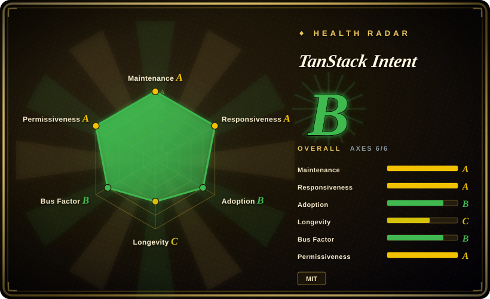
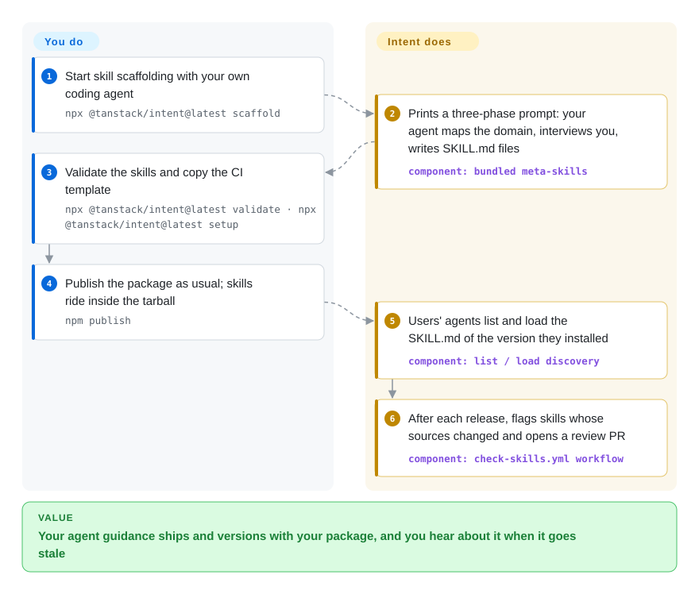

# TanStack Intent

Your library shipped a breaking change, and every coding agent keeps writing the old API because its training data holds both versions and nothing tells it which one is installed. Intent lets the library's maintainers put agent instructions (`SKILL.md` files) inside the npm package itself, so the instructions a user's agent loads always match the version in that user's `node_modules`.

## When to use

You maintain a JavaScript/TypeScript library on npm. Issues keep arriving with code your users' agents wrote: a v4 option passed to your v5 API, a pattern you removed two releases ago. Your docs are right and your types are right, but the agent never opened either. Community "rules files" for your library exist, you didn't write them, and nobody updates them when you release. You want the fix to come from you and to travel with each release.

That is what Intent is for. You write skills (short Markdown instruction files in the open Agent Skills format) in a `skills/` folder of your package. Intent validates them, adds them to your published `files`, and gives you a CI check that flags a skill once the source files it was written from change. Your users run one command in their app and their agent learns to list and load the skills of whatever package versions they have installed. Pick it over a git-based skill installer like [Vercel Skills](vercel-skills.md) when you want a skill tied to a package **version**, not to whatever a repo's default branch holds today, and over a hosted docs service like Context7 when you want the text to come from the tarball the user already installed, with no service or API key involved. As of 2026-09 the npm registry lists 422 packages carrying its `tanstack-intent` keyword (Redux Toolkit, Apollo Client, tRPC and several TanStack libraries among them), so users of those libraries already have skills to load.

## How it works

Intent is a Node CLI you run with `npx @tanstack/intent@latest <command>`; there is no server. On the maintainer side, `scaffold` does not write skills itself. It prints a long prompt that your own coding agent follows: read your docs, source and issues, interview you about the mistakes users make, then write a skill tree plus planning files under `skills/_artifacts`. `validate` checks the result (frontmatter, name/folder match, 500-line cap), `edit-package-json` adds the `tanstack-intent` keyword and puts `skills/` into your published files, and `setup` copies a GitHub Actions workflow that runs `stale` after each release. On the user side, the skills just sit in `node_modules`. `intent install` writes a short guidance block into `AGENTS.md` (or `CLAUDE.md`, `.cursorrules`) telling the agent to run `intent list` and `intent load <package>#<skill>` before editing, and records which packages may supply instructions in `package.json#intent.skills`. Intent only reads files and never runs the discovered packages' code. Think of it as a leaflet printed into the box: the manufacturer writes it, it is always the edition that matches the product, and the reader still has to open it. Whether the agent actually loads the skill and follows it is outside Intent's control; its optional hooks for Claude Code, Codex and Copilot CLI block file edits until the agent has at least run `list` or `load`.

<!-- flow-steps:begin (generated from flows/tanstack-intent.json by tools/flow_card.py — do not edit) -->

Text version of the flow

1. **You**: Start skill scaffolding with your own coding agent — `npx @tanstack/intent@latest scaffold`
2. **TanStack Intent**: Prints a three-phase prompt: your agent maps the domain, interviews you, writes SKILL.md files — component: `bundled meta-skills`
3. **You**: Validate the skills and copy the CI template — `npx @tanstack/intent@latest validate · npx @tanstack/intent@latest setup`
4. **You**: Publish the package as usual; skills ride inside the tarball — `npm publish`
5. **TanStack Intent**: Users' agents list and load the SKILL.md of the version they installed — component: `list / load discovery`
6. **TanStack Intent**: After each release, flags skills whose sources changed and opens a review PR — component: `check-skills.yml workflow`

**Value**: Your agent guidance ships and versions with your package, and you hear about it when it goes stale

<!-- flow-steps:end -->

## When NOT to use

- **You are not a library maintainer and the libraries you use ship no skills.** The consumer side only surfaces skills that package authors published. If your dependencies carry none, `intent list` returns nothing. For current docs on arbitrary libraries, use a docs retrieval service such as Context7 (see Comparison) instead.
- **Your skills are not tied to an npm package.** Team workflows, personal habits and cross-language skill packs have no package version to follow. Use [Vercel Skills](vercel-skills.md) to install them from a git repo, or [SkillsGate](skillsgate.md) for a desktop GUI over them.
- **Your library is not published to npm (or not JavaScript at all).** Discovery walks `node_modules`, workspaces and Yarn PnP. There is no PyPI, crates.io or Go-module path, and Deno support is best-effort through `npm:` interop. For other ecosystems, keep skills in the repo and use a git-based installer.
- **You expect Intent to make the agent obey.** The docs say plainly that Intent can confirm it delivered guidance but not that the agent loaded the right skill or applied it. Hooks exist only for Claude Code, Codex and Copilot CLI (user scope); Cursor and generic `AGENTS.md` agents get guidance text only. If you need hard enforcement, add your own review or test gates; Intent is a nudge plus a delivery channel.
- **You want the skill content reviewed when it changes.** The `intent.skills` allowlist decides which packages may supply instructions, but approving a package does not approve future text: a dependency update can change what your agent is told, and Intent does not yet track or notify you about such changes (open issue #235). If that is not acceptable, pin the skills you trust in your own repo with a git-based installer and review each diff.
- **You need a stable CLI surface today.** It is v0.x. The docs site and the released 0.4.0 CLI use `scaffold`, but `main` (2026-09-13) has already replaced it with a `maintainer setup / add / sync / review / check` workflow that the README describes before it has been released. Frontmatter rules changed in 0.2.0 (Intent fields moved under `metadata`). Pin the version in CI and expect migrations.
- **Windows + pnpm projects that rely on `list`.** Open issue #297 (2026-09-28) reports `list` finding zero skills on Windows with pnpm's isolated layout while an explicit `load` works; #206 reports `list --global` finding nothing with pnpm 11 global installs. Use explicit `load <package>#<skill>` there, or wait for the fixes.

## Comparison

| Alternative | In index | Our verdict | Tradeoff |
|---|---|---|---|
| [Vercel Skills](vercel-skills.md) | ✅ | Pick Intent when the skill documents a specific npm package and must match the installed version; pick Vercel Skills when skills are general-purpose and live in git repos. | Vercel Skills installs from any repo into ~79 agents' skill folders and has a large discovery registry, but a skill fetched from a branch is not tied to your installed library version. Intent ties the two but only covers npm packages and only a few agents get hooks. |
| [SkillsGate](skillsgate.md) | ✅ | Pick SkillsGate if the problem is managing many skills across agents on one desktop; it does not help a library author publish versioned skills, which is Intent's job. | SkillsGate gives a GUI, per-agent toggles and SSH push for global installs; it has no concept of package versions, publishing, or staleness checks. |
| skills-npm (`antfu/skills-npm`) | not indexed | Pick skills-npm on the consumer side if you want skills already inside `node_modules` symlinked into your agent's native skill folder on every `npm install`; pick Intent if you are the maintainer who needs authoring, validation and staleness CI. | skills-npm (created 2026-01, ~530 stars) hooks into `prepare` and hands off to the `skills` CLI, so skills become native agent skills without an extra load step. It has no authoring or staleness tooling and requires Node ≥22.20. Not added in this tab-intake batch. |
| Context7 (`upstash/context7`) | not indexed | Pick Context7 when you need current docs for libraries whose authors ship no skills; pick Intent when the library author will write and version the guidance. | Context7 covers far more libraries with no author involvement, but answers come from its hosted index (an API key is recommended for rate limits), not from the tarball you installed. Intent needs no service but only covers packages that opted in. Not added in this tab-intake batch. |
| llms.txt (`AnswerDotAI/llms-txt`) | not indexed | Pick llms.txt when you want to expose a docs website to LLMs in one file; pick Intent when the guidance must follow the installed package version and target coding agents. | llms.txt is a lightweight convention that any site can adopt, in any language ecosystem, but it is one unversioned file per site with no load/validate tooling. Not added in this tab-intake batch. |

## Tech stack

- **Language:** TypeScript, built with `tsdown` to ESM (`dist/cli.mjs`, bin `intent`); also exports a library entry and a `./core` entry.
- **Runtime:** Node.js `>=20.12.0` (`engines`, 0.4.0). Supported runners: `npx`, `pnpm dlx`, `yarn dlx`, `bunx`; Deno is best-effort.
- **Monorepo tooling:** pnpm workspace, Nx, Changesets for releases, Vitest for unit/integration tests, plus an `evals/` suite (intent discovery, maintainer workflow) and `benchmarks/`.
- **Skill format:** Agent Skills `SKILL.md` (YAML frontmatter `name` + `description`, Intent-specific fields under `metadata`), plus maintainer planning files in `skills/_artifacts` (`domain_map.yaml`, `skill_spec.md`, `skill_tree.yaml`).
- **Bundled meta-skills:** `domain-discovery`, `tree-generator`, `generate-skill`, `skill-staleness-check` (in `packages/intent/meta`), which are the prompts `scaffold` / `meta` hand to your agent.

## Dependencies

- **Runtime:** Node.js ≥20.12 and your project's package manager; no daemon, database or hosted service.
- **npm dependencies (0.4.0):** `@clack/prompts`, `cac`, `jsonc-parser`, `semver`, `std-env`, `yaml`.
- **Network:** `list` / `load` / `install` read local files only. `stale` queries `registry.npmjs.org/<pkg>/latest` to detect version drift. The maintainer flow's scaffolding runs inside whatever coding agent (and model provider) you use, which Intent does not supply.
- **CI (optional):** GitHub Actions for the generated `check-skills.yml` workflow; it opens a review PR when skills drift after a release.
- **Agents with hook support:** Claude Code (`.claude/settings.json`), Codex (`.codex/hooks.json`; Codex asks you to trust the hook first), GitHub Copilot CLI (user scope only). Other agents get the guidance block only.

## Ops difficulty

**Low** for consumers: run `install` once in an interactive terminal (first-run permission setup refuses to run without a TTY), commit the guidance block and the `intent.skills` allowlist, done. **Medium** for maintainers, and the cost is editorial rather than infrastructure: the upstream docs warn that scaffolding takes several review rounds with your agent, every skill is a document you now have to keep true, and each release can open a stale-skills PR that someone has to process with an agent. Add a little churn cost for v0.x command and frontmatter migrations.

## Health & viability

- **Maintenance (2026-09-28):** very active. 0.x releases roughly weekly to monthly since 2026-06 (0.1.0 on 2026-06-14, 0.4.0 on 2026-09-05), commits on `main` as recent as 2026-09-13 and pushes on 2026-09-28, 19 open issues/PRs.
- **Responsiveness:** median first response 1.2 hours across 4 qualifying issues in the health scorer's window (2026-09-28) — maintainers answer fast.
- **Governance / bus factor:** owned by the TanStack organization, but in practice two people carry it: `LadyBluenotes` (122 commits) and `KyleAMathews` (92), with the next human contributor at 7. The roadmap depends on those two.
- **Backing & age (Lindy):** repo created 2026-01-23, first npm publish 2026-03-03, so it is about 8 months old. Lindy gives it no credit on age. The TanStack org's long record of maintaining Query, Table and Router is the real backing signal [推断: org track record is not a promise for this particular repo].
- **Adoption:** 553,908 npm downloads in the health scorer's last-month window (586,332 on npm's own 2026-08-29→2026-09-27 count) and 422 npm packages carrying its keyword, including libraries outside TanStack. Downloads are high against ~330 GitHub stars, which fits a CLI run through `npx` inside many projects rather than a library people star.
- **Risk flags:** MIT, no CLA or relicense history found. The real risks are v0.x churn (the release/`main` split around `scaffold` vs `maintainer`) and the trust model: skill text is prompt input from your dependencies, the allowlist is still opt-in (a future version will require it), and changes to approved skills are not surfaced yet.

## Caveats (unverified)

- [推断] The claim that versioned, author-written skills lead to fewer wrong-API agent edits comes from the project's own pitch; the repo has `evals/` and `benchmarks/` directories, but their results were not reproduced here.
- [推断] The `maintainer setup / add / sync / review / check` workflow is on `main` (commit `305ca7f`, 2026-09-13) but not in the 0.4.0 npm release (`npx @tanstack/intent@0.4.0 --help` lists `scaffold`, not `maintainer`); whether the next release drops `scaffold` entirely was not confirmed.
- [推断] The ~550–590k monthly downloads likely include repeated `npx` runs from CI and hook scripts, so they overstate distinct adopting projects; not measured.
- [推断] "422 packages carry the `tanstack-intent` keyword" is the npm search total on 2026-09-28; a keyword does not prove the package actually ships valid skills.
- [未验证] Issues #297 (Windows + pnpm `list`) and #206 (pnpm 11 global) were open on 2026-09-28; not reproduced here because no Windows/pnpm 11 environment was available.
- [未验证] Star count (~330, `gh api`, 2026-09-28) is indicative only.
