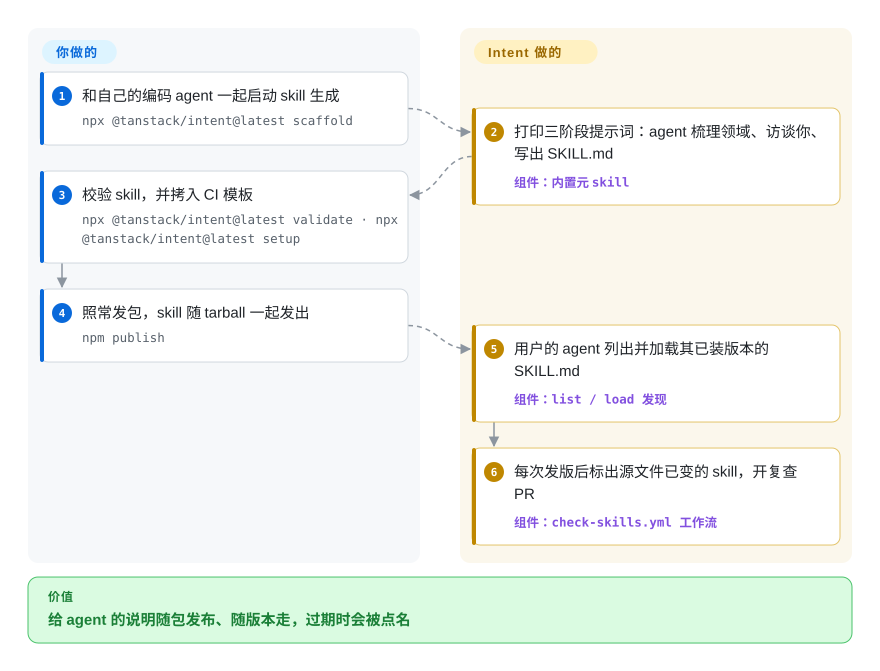

# TanStack Intent

你的库发了一个破坏性版本，可各家编码 agent 还在写旧 API：它的训练数据里新旧两版都有，没有任何东西告诉它用户装的是哪一版。Intent 让库作者把给 agent 看的说明（`SKILL.md` 文件）直接打进 npm 包里，用户的 agent 读到的说明永远和他 `node_modules` 里那一版对得上。

## 何时使用

你在 npm 上维护一个 JavaScript/TypeScript 库。issue 里不断出现用户的 agent 写出来的代码：给 v5 的 API 传了 v4 的参数，用了你两个版本前就删掉的写法。你的文档没错，类型也没错，但 agent 两样都没打开。网上倒是有人替你的库写了“规则文件”，可那不是你写的，你发版时也没人去更新。你希望纠正来自你自己，并且随每次发版一起走。

这正是 Intent 的用处。你把 skill（开放 Agent Skills 格式的简短 Markdown 说明）写在包里的 `skills/` 目录；Intent 负责校验、把它们加进发布的 `files`，再给你一个 CI 检查：某个 skill 所依据的源文件一改，它就被标记为需要复查。用户在自己的应用里跑一条命令，他的 agent 就学会列出并加载当前已装版本的那些 skill。和 [Vercel Skills](vercel-skills.zh.md) 这类按 git 仓库安装的工具相比，选 Intent 是因为你要 skill 绑定到包的**版本**，而不是某个仓库默认分支今天的内容；和 Context7 这类托管文档服务相比，选 Intent 是因为你要说明来自用户已经装好的那个 tarball，不经过任何服务、不需要 API key。截至 2026-09，npm 上带 `tanstack-intent` 关键词的包有 422 个（包括 Redux Toolkit、Apollo Client、tRPC 和若干 TanStack 库），用这些库的人已经有 skill 可加载。

## 怎么用起来

Intent 是一个 Node 命令行工具，用 `npx @tanstack/intent@latest <命令>` 调用，没有服务端。维护者这边，`scaffold` 自己并不写 skill：它打印一段很长的提示词，交给你自己的编码 agent 去执行——读你的文档、源码和 issue，就用户常犯的错误来访谈你，然后写出一棵 skill 树，外加放在 `skills/_artifacts` 下的规划文件。`validate` 检查结果（frontmatter、name 与目录一致、每个不超过 500 行），`edit-package-json` 加上 `tanstack-intent` 关键词并把 `skills/` 放进发布文件，`setup` 拷一份 GitHub Actions 工作流，在每次发版后跑 `stale`（过期检查）。用户这边，skill 就静静躺在 `node_modules` 里。`intent install` 往 `AGENTS.md`（或 `CLAUDE.md`、`.cursorrules`）写一小段引导，让 agent 在改代码前先跑 `intent list` 和 `intent load <包名>#<skill>`，并把允许哪些包提供说明记进 `package.json#intent.skills`（白名单）。Intent 只读文件，从不执行被发现的包里的代码。可以把它想成印在包装盒里的说明书：厂家亲自写，版本永远和产品对应，但读者得自己拆开看。agent 到底有没有加载、有没有照做，不归 Intent 管；它为 Claude Code、Codex 和 Copilot CLI 提供的可选钩子，只能做到在 agent 至少跑过一次 `list` 或 `load` 之前拦住改文件操作。

<!-- flow-steps:begin (generated from flows/tanstack-intent.json by tools/flow_card.py — do not edit) -->

流程文字版

1. **你**：和自己的编码 agent 一起启动 skill 生成 — `npx @tanstack/intent@latest scaffold`
2. **TanStack Intent**：打印三阶段提示词：agent 梳理领域、访谈你、写出 SKILL.md — 组件：`内置元 skill`
3. **你**：校验 skill，并拷入 CI 模板 — `npx @tanstack/intent@latest validate · npx @tanstack/intent@latest setup`
4. **你**：照常发包，skill 随 tarball 一起发出 — `npm publish`
5. **TanStack Intent**：用户的 agent 列出并加载其已装版本的 SKILL.md — 组件：`list / load 发现`
6. **TanStack Intent**：每次发版后标出源文件已变的 skill，开复查 PR — 组件：`check-skills.yml 工作流`

**价值**：给 agent 的说明随包发布、随版本走，过期时会被点名

<!-- flow-steps:end -->

## 何时不用

- **你不是库作者，而你用的库都没发 skill。** 用户侧只能呈现包作者发布过的 skill；依赖里一个都没有，`intent list` 就是空的。要给任意库拿最新文档，改用 Context7 这类文档检索服务（见横向对比）。
- **你的 skill 和某个 npm 包无关。** 团队流程、个人习惯、跨语言的技能包都没有包版本可跟。改用 [Vercel Skills](vercel-skills.zh.md) 从 git 仓库安装，或用 [SkillsGate](skillsgate.zh.md) 的桌面界面管理。
- **你的库不在 npm 上（或根本不是 JavaScript）。** 发现机制只走 `node_modules`、workspace 和 Yarn PnP；没有 PyPI、crates.io、Go module 的路径，Deno 也只是经 `npm:` 互通的尽力支持。其它生态请把 skill 放在仓库里，用按 git 安装的工具分发。
- **你指望 Intent 让 agent 一定照做。** 文档写得很直白：Intent 能确认自己把引导送到了，不能确认 agent 加载了正确的 skill、更不能确认照做了。钩子只支持 Claude Code、Codex 和 Copilot CLI（仅用户级）；Cursor 和通用 `AGENTS.md` agent 只拿到引导文字。需要硬约束，就自己加评审或测试门禁；Intent 是一个提醒加一条送达通道。
- **你要求 skill 内容一变就要人审。** `intent.skills` 白名单决定哪些包可以提供说明，但批准一个包不等于批准它将来的文字：依赖一升级，你的 agent 被告知的内容就可能变，而 Intent 目前不追踪、也不提醒这种变化（open issue #235）。接受不了的话，把信得过的 skill 用按 git 安装的工具固定在自己仓库里，逐个审 diff。
- **你现在就需要稳定的命令面。** 它还是 v0.x。文档站和已发布的 0.4.0 用的是 `scaffold`，而 `main`（2026-09-13）已经换成 `maintainer setup / add / sync / review / check` 一整套流程，README 在发版前就按新流程写了。0.2.0 还改过 frontmatter 规则（Intent 专属字段挪进 `metadata`）。CI 里请锁版本，并预期要迁移。
- **Windows + pnpm 且依赖 `list` 的项目。** open issue #297（2026-09-28）报告 Windows 下 pnpm 隔离布局时 `list` 一个 skill 都找不到，而显式 `load` 可用；#206 报告 pnpm 11 全局安装时 `list --global` 什么也找不到。在这类环境下请直接用 `load <包名>#<skill>`，或等修复。

## 横向对比

| 替代品 | 是否收录 | 我们的评价 | 取舍 |
|---|---|---|---|
| [Vercel Skills](vercel-skills.zh.md) | ✅ | skill 讲的是某个具体 npm 包、必须与已装版本一致时选 Intent；skill 是通用的、放在 git 仓库里时选 Vercel Skills。 | Vercel Skills 能从任意仓库装进约 79 个 agent 的 skill 目录，还有大的发现目录，但从分支拉来的 skill 和你装的库版本没有绑定。Intent 把两者绑在一起，代价是只覆盖 npm 包，钩子也只有少数 agent 支持。 |
| [SkillsGate](skillsgate.zh.md) | ✅ | 问题是在一台机器上跨 agent 管一堆 skill 时选 SkillsGate；它帮不了库作者发布带版本的 skill，那是 Intent 的活。 | SkillsGate 提供图形界面、按 agent 开关和面向全局安装的 SSH 推送，但没有包版本、发布或过期检查的概念。 |
| skills-npm（`antfu/skills-npm`） | 未收录 | 站在使用方、想让 `node_modules` 里已有的 skill 在每次 `npm install` 时软链进 agent 原生 skill 目录，选 skills-npm；你是维护者、需要编写、校验和过期 CI，选 Intent。 | skills-npm（2026-01 创建，约 530 星）挂在 `prepare` 脚本上、底层调用 `skills` CLI，skill 直接变成 agent 原生 skill，省掉一步 load；但它没有编写和过期检查工具，且要求 Node ≥22.20。本次标签页收录批次未添加。 |
| Context7（`upstash/context7`） | 未收录 | 库作者没发 skill、你又要最新文档时选 Context7；库作者愿意亲自写并按版本维护引导时选 Intent。 | Context7 覆盖的库多得多，也不需要作者参与，但答案来自它的托管索引（建议申请 API key 以放宽限流），不是你装的那个 tarball。Intent 不需要任何服务，但只覆盖主动加入的包。本次标签页收录批次未添加。 |
| llms.txt（`AnswerDotAI/llms-txt`） | 未收录 | 想用一个文件把文档网站开放给大模型时选 llms.txt；引导必须跟随已装包版本、面向编码 agent 时选 Intent。 | llms.txt 是轻量约定，任何网站、任何语言生态都能用，但每站只有一个不带版本的文件，也没有加载、校验工具。本次标签页收录批次未添加。 |

## 技术栈

- **语言：** TypeScript，用 `tsdown` 打包成 ESM（`dist/cli.mjs`，命令名 `intent`）；另外导出库入口和 `./core` 入口。
- **运行时：** Node.js `>=20.12.0`（0.4.0 的 `engines`）。支持的调用方式：`npx`、`pnpm dlx`、`yarn dlx`、`bunx`；Deno 为尽力支持。
- **仓库工具：** pnpm workspace、Nx、Changesets 发版、Vitest 单元与集成测试，另有 `evals/` 评测（intent 发现、维护者流程）和 `benchmarks/`。
- **skill 格式：** Agent Skills 的 `SKILL.md`（YAML frontmatter 含 `name` 与 `description`，Intent 专属字段放在 `metadata` 下），外加维护者规划文件 `skills/_artifacts`（`domain_map.yaml`、`skill_spec.md`、`skill_tree.yaml`）。
- **内置元 skill：** `domain-discovery`、`tree-generator`、`generate-skill`、`skill-staleness-check`（位于 `packages/intent/meta`），就是 `scaffold` / `meta` 交给你的 agent 的那些提示词。

## 依赖

- **运行时：** Node.js ≥20.12 和项目自己的包管理器；没有常驻进程、数据库或托管服务。
- **npm 依赖（0.4.0）：** `@clack/prompts`、`cac`、`jsonc-parser`、`semver`、`std-env`、`yaml`。
- **网络：** `list` / `load` / `install` 只读本地文件；`stale` 会请求 `registry.npmjs.org/<pkg>/latest` 判断版本漂移。维护者的生成流程跑在你自己的编码 agent（及其模型服务）里，Intent 不提供模型。
- **CI（可选）：** GitHub Actions 跑生成的 `check-skills.yml`，发版后 skill 漂移时自动开一个复查 PR。
- **支持钩子的 agent：** Claude Code（`.claude/settings.json`）、Codex（`.codex/hooks.json`，需要先在 Codex 里信任该钩子）、GitHub Copilot CLI（仅用户级）。其它 agent 只有引导文字。

## 运维难度

使用方**低**：在交互式终端跑一次 `install`（首次的权限设置没有 TTY 会直接失败），把引导段落和 `intent.skills` 白名单提交进仓库即可。维护方**中**，成本在内容而不在基础设施：上游文档提醒生成 skill 要和 agent 来回审好几轮；每个 skill 都是一份你从此得保持正确的文档；每次发版都可能冒出一个过期 skill 的 PR，需要有人配合 agent 处理。再加上 v0.x 命令和 frontmatter 迁移带来的一点折腾。

## 健康度与可持续性

- **维护（2026-09-28）：** 非常活跃。自 2026-06 起 0.x 版本约每周到每月一发（0.1.0 于 2026-06-14，0.4.0 于 2026-09-05），`main` 最近提交在 2026-09-13，2026-09-28 仍有推送，open 的 issue 和 PR 共 19 个。
- **响应速度：** 健康度评分窗口内 4 个合格 issue 的首次响应中位数为 1.2 小时（2026-09-28），维护者回应很快。
- **治理与巴士因子：** 归 TanStack 组织所有，但实际由两个人撑着：`LadyBluenotes`（122 次提交）和 `KyleAMathews`（92 次），第三位人类贡献者只有 7 次。路线图取决于这两人。
- **背书与年龄（Lindy）：** 仓库 2026-01-23 创建，npm 首发 2026-03-03，约 8 个月大，按 Lindy 先验得不到年龄加分。真正的背书信号是 TanStack 组织长期维护 Query、Table、Router 的记录[推断：组织的历史不等于对这个仓库的承诺]。
- **采用度：** 健康度评分窗口内一个月 npm 下载 553,908 次（npm 自己 2026-08-29→2026-09-27 的计数为 586,332），npm 上 422 个包带它的关键词，其中不少来自 TanStack 之外。下载量相对约 330 的星数很高，这符合一个在大量项目里经 `npx` 调用、而不是被人收藏的命令行工具。
- **风险信号：** MIT，未发现 CLA 或改协议历史。真正的风险是 v0.x 的变动（`scaffold` 与 `maintainer` 在发布版和 `main` 之间的分叉），以及信任模型：skill 文本是来自依赖的提示词输入，白名单目前仍是可选（未来版本会强制），已批准 skill 的内容变化还不会提示。

## 存疑（未验证）

- [推断] “作者亲写、带版本的 skill 能减少 agent 写错 API” 来自项目自己的说法；仓库里有 `evals/` 和 `benchmarks/` 目录，但此处没有复现其结果。
- [推断] `maintainer setup / add / sync / review / check` 流程在 `main`（提交 `305ca7f`，2026-09-13）上，但不在 0.4.0 的 npm 版本里（`npx @tanstack/intent@0.4.0 --help` 列出的是 `scaffold` 而非 `maintainer`）；下一版是否彻底移除 `scaffold` 未确认。
- [推断] 每月约 55 万到 59 万的下载很可能包含 CI 和钩子脚本里反复的 `npx` 调用，会高估真正采用它的项目数；未测量。
- [推断] “422 个包带 `tanstack-intent` 关键词” 是 2026-09-28 的 npm 搜索总数；带关键词不代表该包真的发了合规的 skill。
- [未验证] issue #297（Windows + pnpm 的 `list`）和 #206（pnpm 11 全局）在 2026-09-28 仍为 open；手头没有 Windows / pnpm 11 环境，未复现。
- [未验证] 星数（约 330，`gh api`，2026-09-28）仅供参考。
