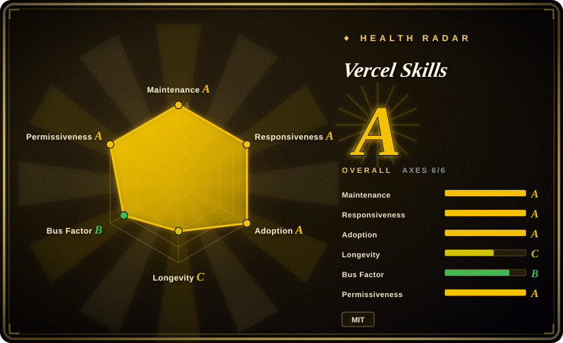
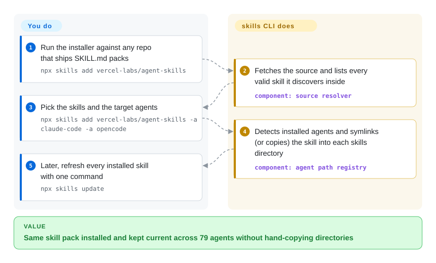

# Vercel Skills

You copy the same `SKILL.md` folder by hand into `.claude/skills`, `~/.codex/skills` and Cursor's directory on every machine, and a month later nobody knows which copy went stale. `npx skills` is the npm-style installer for agent skills: one command adds a pack from GitHub/GitLab/Azure/local sources into the right place for 79 coding agents, another updates them all. It is the *installer*, not the skill content.

## When to use

You're a developer who has collected a handful of agent skills — some you wrote, some pulled from `SKILL.md` packs you found on GitHub — and you're sick of the manual ritual: clone the repo, copy the right directory into `.claude/skills` (or `.opencode`, or `.cursor`, depending on which agent you're driving today), repeat for every machine and every project, then have no idea which ones drifted out of date a month later. You want the npm-style affordance for skills: one command to add a pack from `owner/repo`, one to list what's installed, one to update them all.

So you run `npx skills add owner/repo` to drop a skill into the right agent directory, `npx skills find <keyword>` to discover packs through the skills.sh registry, and `npx skills list` / `npx skills update` to keep them current — and because it knows the layout conventions of OpenCode, Claude Code, Codex, Cursor and 75 more agents (README, 2026-09), the *same* command lands the skill in the correct place regardless of which agent you happen to use. For a one-off you can skip installing entirely with `npx skills use owner/repo@skill`. It's a thin, dependency-light TypeScript CLI you invoke through `npx`, so there's nothing to host and nothing to keep running.

## How it works

The CLI resolves whatever source you name — `owner/repo` shorthand, a full GitHub/GitLab/Azure-Repos URL, a direct path to one skill inside a repo, a download URL for a `SKILL.md`/zip, or a local folder — fetches it, and discovers every valid skill: a directory whose `SKILL.md` carries `name` + `description` frontmatter, looked for in known container paths (`skills/`, `.claude/skills/`, …, walked three levels deep) plus any `.claude-plugin/` manifests. It then detects which coding agents you actually have installed and writes each selected pack into that agent's project (`./<agent>/skills/`) or global (`~/<agent>/skills/`) directory — by default as a **symlink** to one canonical copy (or a real copy with `--copy`), so a later `npx skills update` refreshes all the agents' views of that skill at once. What stays yours: trusting the pack's prompt content (anything you install lands in your agent's context), version pinning (no lockfile is documented), and deciding whether the project-scoped skill dir gets committed to git.

<!-- flow-steps:begin (generated from flows/vercel-skills.json by tools/flow_card.py — do not edit) -->

Text version of the flow

1. **You**: Run the installer against any repo that ships SKILL.md packs — `npx skills add vercel-labs/agent-skills`
2. **Vercel Skills**: Fetches the source and lists every valid skill it discovers inside — component: `source resolver`
3. **You**: Pick the skills and the target agents — `npx skills add vercel-labs/agent-skills -a claude-code -a opencode`
4. **Vercel Skills**: Detects installed agents and symlinks (or copies) the skill into each skills directory — component: `agent path registry`
5. **You**: Later, refresh every installed skill with one command — `npx skills update`

**Value**: Same skill pack installed and kept current across 79 agents without hand-copying directories

<!-- flow-steps:end -->

## When NOT to use

- **You want the skills themselves, not a way to manage them.** This is the installer/manager. The actual reusable instructions are *content* packs — the [skill-pack] siblings below (Planning with Files, Context Mode, etc.) are the kind of thing it installs. Adding this tool gives you zero new agent capabilities until you point it at content.
- **You only use one agent and rarely change skills.** If you live entirely in Claude Code and hand-copy two skills a year, the value (cross-agent path resolution, bulk update) is marginal over `cp` + a git submodule; you're taking a dependency for ergonomics you won't exercise.
- **You need MCP-server, plugin, or tool-binary management.** Its scope is `SKILL.md` instruction packs only — it does not install or run MCP servers, manage agent binaries, or orchestrate runtime state. For task/state tooling see the comparison row for [beads](../work-state/beads.md).
- **You need a curated, security-reviewed marketplace.** Sources resolve straight from arbitrary GitHub/GitLab/Azure/git URLs; installing a pack means trusting third-party prompt content that goes into your agent's context. There is no vetting gate, so supply-chain / prompt-injection caution is on you.
- **You object to any telemetry.** The CLI sends anonymous usage data — for GitHub sources that GitHub positively confirms are public it includes the repository and skill identifiers; other source types may include source/skill identifiers too. Disable with `DISABLE_TELEMETRY=1` or `DO_NOT_TRACK=1`.
- **Reproducible, pinned installs across a team.** No lockfile / `skills.json` manifest is documented (README, 2026-09), so version-pinning and deterministic re-install across machines are not first-class today (verify against the current release before depending on it).
- **You assumed one uniform feature set across agents.** Basic `SKILL.md` skills work everywhere, but `allowed-tools`, `context: fork` and hooks are agent-specific — the README's compatibility matrix shows e.g. `context: fork` as Claude-Code-only. A pack leaning on agent-specific features will not behave identically on all 79 targets.
- **Maturity ceiling.** Pre-2.0 (v1.7.x), single-vendor (`vercel-labs`) project moving fast (frequent point releases); the command surface and the registry it talks to can shift release-to-release.

## Comparison

| Alternative | In index | Our verdict | Tradeoff |
|---|---|---|---|
| [Planning with Files](../work-state/planning-with-files.md) | ✅ | Choose Planning with Files when you need skill-pack content rather than an installer. | A skill-pack (content) — the *kind of thing* Skills installs, not a competitor. Use Skills to deliver packs like this into your agent. |
| [Context Mode](../work-state/context-mode.md) | ✅ | Choose Context Mode when you need workflow content rather than skill distribution. | Also a skill-pack / workflow content, not an installer. Orthogonal: Skills is the delivery mechanism, this is the payload. |
| [beads](../work-state/beads.md) | ✅ | Choose beads when you need persistent task/memory state for agents, not skill distribution. | Different layer: persistent task/memory *state* for agents, not skill distribution. You might install both — they don't overlap. |
| Claude Code plugin marketplaces (`.claude-plugin/marketplace.json`) | 未收录 | Choose Claude Code plugin marketplaces when you need Claude-Code-native plugin distribution. | Native Claude Code plugin/marketplace mechanism; richer (commands, hooks, MCP) but Claude-Code-only. Skills targets `SKILL.md` packs across 70+ agents instead. |
| git submodule / manual `cp` | 未收录 | Choose git submodules or manual copying when zero new dependency and transparency matter most. | Zero new dependency and fully transparent, but no cross-agent path resolution, no discovery registry, no bulk `update` — the manual flow Skills replaces. |
| npm / pnpm packaging a skill dir | 未收录 | Choose npm/pnpm packaging when you want JS-ecosystem versioning and lockfiles. | Reuses the JS package ecosystem (real versioning + lockfiles), but skills aren't npm-shaped and you'd hand-place files per agent; Skills is purpose-built for the `SKILL.md` layout. |

## Tech stack

- **Language:** TypeScript (GitHub language stats: TypeScript ≈1.0 MB vs JavaScript <1 kB); built to an `.mjs` CLI (`bin/cli.mjs`, bins `skills` and `add-skill`).
- **Runtime:** Node.js, invoked via `npx skills`; `engines` now requires Node `>=22.20.0`.
- **Distribution:** published to npm as `skills` (v1.7.0, 2026-09-17); run with `npx` (no global install needed).
- **Discovery:** a skills registry at `skills.sh` backs `npx skills find` (keyword search, `--owner` org search).
- **Sources resolved:** GitHub shorthand (`owner/repo`), GitHub/GitLab/Azure-Repos/generic-git URLs, a direct path to one skill in a repo, download URLs for single `SKILL.md`/zip/tar archives (size-capped), and local paths.
- **Skill format consumed:** directories containing a `SKILL.md` with YAML frontmatter (`name`, `description`); also discovers via Claude plugin manifests (`.claude-plugin/marketplace.json` / `plugin.json`); `metadata.internal: true` skills are hidden unless `INSTALL_INTERNAL_SKILLS=1`.

## Dependencies

- **Runtime:** Node.js `>=22.20.0` (per `engines`); no separate service, daemon, or datastore.
- **Production deps:** two declared runtime dependencies — `yaml` (frontmatter parsing) and `tar` (archive sources). The rest of the implementation is first-party; `ThirdPartyNoticeText.txt` covers bundled notices.
- **Network/auth:** reaches GitHub/GitLab/Azure/git remotes to fetch packs and the `skills.sh` registry for discovery; private repos reuse your existing git credential helper / GitHub CLI / SSH auth (optionally `GITHUB_TOKEN`). Offline use is limited to already-fetched / local-path sources.
- **Targets:** writes into per-agent skill directories — project (`./<agent>/skills/`) by default or global (`~/<agent>/skills/` with `-g`) — as symlinks (recommended) or copies; no global runtime to manage.

## Ops difficulty

**Low.** It is a stateless `npx` CLI: nothing to deploy, no server, no database, no background process. "Operating" it is running commands on demand; the only moving parts are Node `>=22.20.0`, git auth for private sources, and network access to the source remotes / registry. The real operational consideration is governance, not infrastructure — because it installs third-party prompt content directly into agent context, treat *which* packs you add (and from where) as the thing to review, and pin/track them yourself since no lockfile mechanism is documented.

## Health & viability

- **Responsiveness**: Grade A — median first-response time 14.1 hours across 3 qualifying issues/PRs in the scorer's window (2026-09-28).
- **Maintenance (2026-09):** [推断] actively maintained — last push 2026-09-18, latest release v1.7.0 (2026-09-17), not archived, on a frequent point-release cadence. Open-issue count (~1,241 as of 2026-09) is high for a small CLI; read it as active usage churn rather than neglect, but expect a backlog.
- **Governance & backing:** [推断] `vercel-labs` is Vercel's experimental/labs org, not a core Vercel product line. "Labs" repos carry a real deprecation/abandonment risk — Vercel ships many experiments and not all graduate or get long-term support. Single-vendor roadmap; no foundation neutrality.
- **Age & Lindy:** [推断] created 2026-01, so ~8.5 months old as of 2026-09 — **young, unproven by Lindy**, though adoption is mainstream-scale (npm `skills`: 28,456,872 downloads in the scorer's last month, 2026-09-28). The install/update ergonomics are useful now, but a pre-2.0 labs tool has no longevity track record; the command surface and `skills.sh` registry it depends on can still shift.
- **Risk flags:** [未验证] no lockfile/manifest for pinned reproducible installs (see Caveats); MIT with a real `LICENSE` file since the 2026-09 check (the 2026-06 "no LICENSE file" gap is resolved); it installs arbitrary third-party prompt content into agent context and ships anonymous telemetry (both the supply-chain / prompt-injection surface and the phone-home are on the operator, the latter disableable). It is an *installer*, so its own viability is somewhat decoupled from the skill content you actually run.

## Caveats (unverified)

- [未验证] Star count ~32.6k (`gh api`, 2026-09-28); GitHub stars are unreliable and date-sensitive — indicative only.
- [未验证] "79 supported agents" (README: OpenCode, Claude Code, Codex, Cursor, and 75 more) and the per-agent feature matrix (`allowed-tools` / `context: fork` / hooks) are the README's own framing; the exact list and each agent's path mapping shift release-to-release — verify a given agent before relying on it.
- [未验证] Absence of a lockfile / `skills.json` manifest is inferred from the docs not mentioning one as of 2026-09; a pinning mechanism may exist or land in a later release.
- [推断] Two declared production dependencies (`yaml`, `tar`) are from `package.json` (2026-09); transitive/bundled code under `src/` and `scripts/` was not audited, so "dependency-light" describes the declared surface only.
- [推断] v1.7.0 latest release dated 2026-09-17, last push 2026-09-18, not archived (gh metadata, 2026-09-28); cadence and "active" status are point-in-time observations, not a maintenance guarantee.
