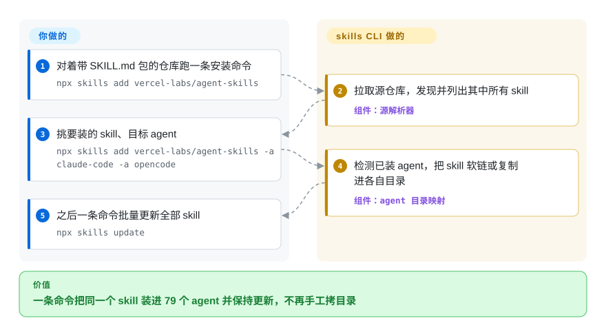

# Vercel Skills

同一个 `SKILL.md` 文件夹，你要手抄进 `.claude/skills`、`~/.codex/skills` 和 Cursor 的目录，每台机器抄一遍，一个月后没人记得哪份已经过期。`npx skills` 就是 skills 版的 npm 安装器：一条命令把包从 GitHub/GitLab/Azure/本地源装进 79 个编码 agent 各自正确的目录，另一条命令全部更新。它是*安装器*，不是 skill 内容本身。

## 何时使用

你是一名开发者，手头攒了一批 agent skills——有自己写的，有从 GitHub 上扒下来的 `SKILL.md` 包——你已经受够了那套手工流程：clone 仓库、把对的目录拷进 `.claude/skills`（或者 `.opencode`、`.cursor`，取决于你今天用哪个 agent），每台机器每个项目都重来一遍，一个月后还完全不知道哪些早就过期了。你想要的是 skills 版的 npm 体验：一条命令从 `owner/repo` 装一个包，一条命令列出已装的，一条命令把它们全部更新。

于是你用 `npx skills add owner/repo` 把一个 skill 放进对应的 agent 目录，用 `npx skills find <关键词>` 通过 skills.sh 注册表发现可用的包，再用 `npx skills list` / `npx skills update` 保持更新——因为它内置了 OpenCode、Claude Code、Codex、Cursor 以及另外 75 个 agent 的目录布局约定（README，2026-09），*同一条*命令无论你当下用哪个 agent，都能把 skill 落到正确位置。只想临时用一次的话，`npx skills use owner/repo@skill` 可以跳过安装直接取用。它是一个轻量、依赖极少的 TypeScript CLI，通过 `npx` 调用，无需托管、无需常驻进程。

## 怎么用起来

CLI 先解析你给的任何源——`owner/repo` 简写、GitHub/GitLab/Azure Repos/通用 git 的完整 URL、仓库内某个 skill 的直接路径、指向单个 `SKILL.md`/zip 的下载 URL，或本地目录——拉取后找出所有有效 skill：即带 `name` + `description` frontmatter 的 `SKILL.md` 所在目录，在已知容器路径（`skills/`、`.claude/skills/` 等，最多往下走三层）加 `.claude-plugin/` 清单里发现。然后它检测你机器上实际装了哪些 coding agent，把选中的每个包写进该 agent 的项目级（`./<agent>/skills/`）或全局（`~/<agent>/skills/`）目录——默认用指向单一规范副本的**软链接**（`--copy` 则改为真实复制），所以之后一条 `npx skills update` 就能刷新所有 agent 对同一 skill 的视图。仍归你的部分：信任包的 prompt 内容（装进去的一切都会进入 agent 上下文）、版本锁定（文档里没有 lockfile），以及决定要不要把项目级 skill 目录提交进 git。

<!-- flow-steps:begin (generated from flows/vercel-skills.json by tools/flow_card.py — do not edit) -->

流程文字版

1. **你**：对着带 SKILL.md 包的仓库跑一条安装命令 — `npx skills add vercel-labs/agent-skills`
2. **Vercel Skills**：拉取源仓库，发现并列出其中所有 skill — 组件：`源解析器`
3. **你**：挑要装的 skill、目标 agent — `npx skills add vercel-labs/agent-skills -a claude-code -a opencode`
4. **Vercel Skills**：检测已装 agent，把 skill 软链或复制进各自目录 — 组件：`agent 目录映射`
5. **你**：之后一条命令批量更新全部 skill — `npx skills update`

**价值**：一条命令把同一个 skill 装进 79 个 agent 并保持更新，不再手工拷目录

<!-- flow-steps:end -->

## 何时不用

- **你要的是 skills 本身，而不是管理它们的方式。** 这是安装器/管理器。真正可复用的指令是*内容*包——下方的 [skill-pack] 同类项（Planning with Files、Context Mode 等）正是它要安装的东西。装上这个工具，在你把它指向内容之前，不会给你的 agent 带来任何新能力。
- **你只用一个 agent，且很少换 skills。** 如果你完全活在 Claude Code 里、一年手工拷两个 skill，那它的价值（跨 agent 路径解析、批量更新）相比 `cp` + git submodule 就很边际；为了用不上的便利去引一个依赖，不划算。
- **你需要管理 MCP server、plugin 或工具二进制。** 它的范围只有 `SKILL.md` 指令包——不安装也不运行 MCP server、不管理 agent 二进制、不编排运行时状态。任务/状态类工具见对比表里的 [beads](../work-state/beads.zh.md) 一行。
- **你需要一个经过策展、做过安全审查的市场。** 源直接从任意 GitHub/GitLab/Azure/git URL 解析，装一个包意味着信任会进入你 agent 上下文的第三方 prompt 内容。没有审核闸门，供应链 / prompt 注入的警惕得你自己扛。
- **你反对任何遥测。** CLI 会上报匿名使用数据——对 GitHub 确认公开的仓库，事件里含仓库与 skill 标识；其他源类型也可能带上源与 skill 标识。用 `DISABLE_TELEMETRY=1` 或 `DO_NOT_TRACK=1` 关闭。
- **团队内可复现、可锁定版本的安装。** 文档（2026-09）里没有 lockfile / `skills.json` 清单，所以版本锁定和跨机器确定性重装目前不是一等公民（依赖前请对照当前版本核实）。
- **你以为 79 个 agent 功能面一致。** 基础 `SKILL.md` 到处可用，但 `allowed-tools`、`context: fork`、hooks 是 agent 特有的——README 兼容性矩阵显示 `context: fork` 目前只有 Claude Code 支持。依赖这些特性的包在不同 agent 上行为不会相同。
- **成熟度上限。** 2.0 之前（v1.7.x）、单一厂商（`vercel-labs`）、迭代很快（频繁小版本）；命令面和它对接的注册表可能随版本变动。

## 横向对比

| 替代品 | 是否收录 | 我们的评价 | 取舍 |
|---|---|---|---|
| [Planning with Files](../work-state/planning-with-files.zh.md) | ✅ | 需要 skill-pack 内容而非安装器时，选 Planning with Files。 | 一个 skill-pack（内容）——正是 Skills 要安装的*那类东西*，不是竞品。用 Skills 把这样的包送进你的 agent。 |
| [Context Mode](../work-state/context-mode.zh.md) | ✅ | 需要工作流内容而非 skill 分发机制时，选 Context Mode。 | 同样是 skill-pack / 工作流内容，不是安装器。正交关系：Skills 是投递机制，这是被投递的载荷。 |
| [beads](../work-state/beads.zh.md) | ✅ | 需要 agent 的持久任务/记忆状态，而不是 skill 分发时，选 beads。 | 不同层：给 agent 的持久任务/记忆*状态*，而非 skill 分发。你可能两个都装——它们不重叠。 |
| Claude Code 插件市场（`.claude-plugin/marketplace.json`） | 未收录 | 需要 Claude Code 原生插件分发时，选 Claude Code 插件市场。 | Claude Code 原生的插件/市场机制；更丰富（命令、hooks、MCP）但仅限 Claude Code。Skills 转而面向跨 70+ agent 的 `SKILL.md` 包。 |
| git submodule / 手工 `cp` | 未收录 | 零新依赖和完全透明最重要时，选 git submodule 或手工复制。 | 零新依赖、完全透明，但没有跨 agent 路径解析、没有发现注册表、没有批量 `update`——正是 Skills 取代的手工流程。 |
| 用 npm / pnpm 打包一个 skill 目录 | 未收录 | 想复用 JS 包生态的版本管理和 lockfile 时，选 npm/pnpm 打包。 | 复用 JS 包生态（有真正的版本管理 + lockfile），但 skills 不是 npm 形态，你得按 agent 手工摆放文件；Skills 是为 `SKILL.md` 布局专门做的。 |

## 技术栈

- **语言：** TypeScript（GitHub 语言统计约 1.0 MB 对 JavaScript 不到 1 kB）；构建为 `.mjs` CLI（`bin/cli.mjs`，bin 名 `skills` 与 `add-skill`）。
- **运行时：** Node.js，通过 `npx skills` 调用；`engines` 现在要求 Node `>=22.20.0`。
- **分发：** 以 `skills` 发布到 npm（v1.7.0，2026-09-17）；用 `npx` 运行（无需全局安装）。
- **发现：** `npx skills find` 背后是 `skills.sh` 注册表（关键词搜索、`--owner` 按组织搜索）。
- **可解析的源：** GitHub 简写（`owner/repo`）、GitHub/GitLab/Azure Repos/通用 git URL、仓库内单个 skill 的直接路径、指向 `SKILL.md`/zip/tar 的下载 URL（有大小上限），以及本地路径。
- **消费的 skill 格式：** 含 `SKILL.md`（YAML frontmatter，`name`、`description`）的目录；也经 Claude 插件清单（`.claude-plugin/marketplace.json` / `plugin.json`）发现；`metadata.internal: true` 的 skill 默认隐藏，需 `INSTALL_INTERNAL_SKILLS=1` 才可见/安装。

## 依赖

- **运行时：** Node.js `>=22.20.0`（据 `engines`）；无独立服务、守护进程或数据存储。
- **生产依赖：** 声明了两个运行时依赖——`yaml`（解析 frontmatter）与 `tar`（归档源）。其余实现为自有代码；`ThirdPartyNoticeText.txt` 覆盖捆绑的第三方声明。
- **网络/认证：** 需访问 GitHub/GitLab/Azure/git 远端拉取包，以及 `skills.sh` 注册表做发现；私有仓库复用你已配置的 git credential helper / GitHub CLI / SSH 认证（可选 `GITHUB_TOKEN`）。离线使用仅限已拉取 / 本地路径源。
- **落地目标：** 写入各 agent 的项目级（默认 `./<agent>/skills/`）或全局（`-g`，`~/<agent>/skills/`）skill 目录，以软链（推荐）或复制方式；无需管理任何全局运行时。

## 运维难度

**低。** 它是一个无状态的 `npx` CLI：无需部署、无 server、无数据库、无后台进程。「运维」它就是按需跑命令；活动部件只有 Node `>=22.20.0`、私有源的 git 认证，以及到源远端 / 注册表的网络访问。真正要操心的是治理而非基础设施——因为它把第三方 prompt 内容直接装进 agent 上下文，要把*装哪些*包（以及从哪装）当成需要审查的对象，并自己做版本锁定/追踪，因为文档里没有找到 lockfile 机制。

## 健康度与可持续性

- **响应速度**：Grade A——中位首次响应时间 14.1 小时，基于评分窗口内 3 个 qualifying issues/PRs（2026-09-28）。
- **维护（2026-09）：** [推断] 在积极维护——最近 push 在 2026-09-18，最新发布 v1.7.0（2026-09-17），未归档，小版本发布节奏很快。未关闭 issue 约 1,241（截至 2026-09）对一个小型 CLI 偏高，更应读作活跃使用带来的流转，而非疏于维护，但要预期有积压。
- **治理与背书：** [推断] `vercel-labs` 是 Vercel 的实验/labs 组织，并非 Vercel 的核心产品线。「labs」仓库带有真实的弃坑/废弃风险——Vercel 发很多实验项目，并非都会毕业或获得长期支持。单一厂商主导路线图，无基金会中立性。
- **年龄与 Lindy：** [推断] 创建于 2026-01，截至 2026-09 约 8 个半月大——**年轻、按 Lindy 尚未证明**，但采用度已是主流规模（npm 包 `skills`，评分器近一月下载量 28,456,872，2026-09-28）。安装/更新的人体工学现在确实有用，但一个 2.0 之前的 labs 工具没有寿命记录；它的命令面以及所依赖的 `skills.sh` 注册表仍可能变动。
- **风险标记：** [未验证] 没有用于固定可复现安装的 lockfile/清单（见存疑）；MIT，且 2026-09 检查时仓库已带真正的 `LICENSE` 文件（2026-06 那次「无 LICENSE 文件」的存疑已解决）；它会把任意第三方 prompt 内容装进 agent 上下文，并自带匿名遥测（供应链 / prompt 注入面由操作者承担，遥测可关）。它是*安装器*，因此自身的可持续性与你实际运行的 skill 内容在一定程度上是解耦的。

## 存疑（未验证）

- [未验证] star 数约 32.6k（`gh api`，2026-09-28）；GitHub star 不可靠且对日期敏感——仅供参考。
- [未验证]「79 个支持的 agent」（README：OpenCode、Claude Code、Codex、Cursor 加另外 75 个）与 per-agent 功能矩阵（`allowed-tools` / `context: fork` / hooks）是 README 自己的说法；确切列表及每个 agent 的路径映射会随版本变动——依赖某个 agent 前请核实。
- [未验证] 没有 lockfile / `skills.json` 清单这一点，是 2026-09 从文档未提及推得的；锁定机制可能已存在或在后续版本落地。
- [推断] 两个声明的生产依赖（`yaml`、`tar`）取自 `package.json`（2026-09）；`src/` 与 `scripts/` 下的传递/捆绑代码未审计，所以「依赖少」只描述声明层面。
- [推断] v1.7.0 最新发布于 2026-09-17，最后 push 于 2026-09-18，未归档（gh 元数据，2026-09-28）；迭代节奏与「活跃」状态是时间点观察，非维护保证。
