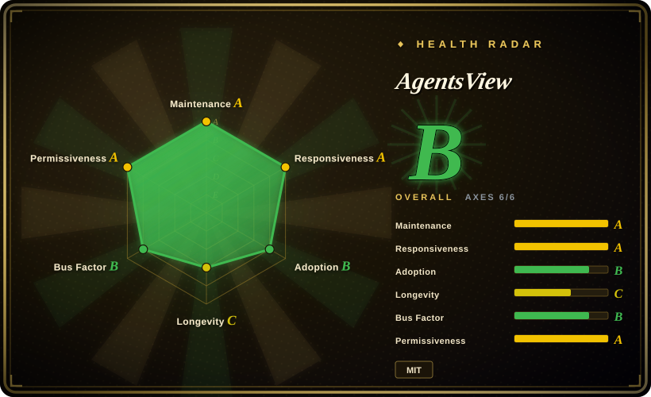
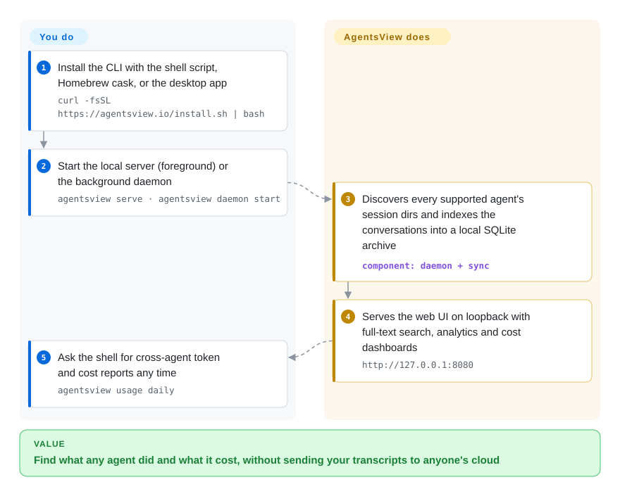

# AgentsView

You run three coding agents this week and none of them remembers last week: finding "which session fixed that bug" means grepping JSONL files by hand, and nobody totals your token spend across tools. AgentsView indexes every supported agent's local session files into a SQLite archive and gives you full-text search, analytics and cost rollups in a web UI bound to `127.0.0.1` — no account, nothing uploaded unless you opt in.

## When to use

You're a developer (or a small team lead) running several coding agents day to day — Claude Code in one repo, Codex in another, maybe Cursor and Gemini too — and you've lost the thread: which session solved that bug last week, how many tokens (and dollars) you're actually burning across agents, what prompts you keep repeating. The per-tool histories are scattered in different local directories and none of them give you a cross-agent view. You install AgentsView (a `curl | sh` CLI, a Homebrew/desktop app, or Docker), point it at your machine, and it indexes the local session logs into SQLite, serves a Svelte web UI at `127.0.0.1:8080`, and lets you full-text search every conversation, see token/cost breakdowns per agent and per session, and browse analytics — without sending your transcripts to anyone's cloud. Its Supported Agents table currently lists roughly 60 agents (README, 2026-09), covering CLIs from Claude Code, Codex, Gemini and the Copilot CLIs to IDE histories like Cursor, Kiro, Zed and Windsurf.

You reach for it specifically when you want **observability over your own agent usage** (cost control, "where did I do X", usage patterns) and you care that the session data stays local. Team views are opt-in: push the archive to shared PostgreSQL or ClickHouse, mirror it to a DuckDB file (optionally served over DuckDB's Quack protocol), or sync machines via plain filesystem copies — and semantic/hybrid search can be enabled against any OpenAI-compatible embeddings endpoint.

## How it works

One local process does everything. `agentsview serve` (foreground) or `agentsview daemon start` (background; CLI commands auto-start it when needed and it self-exits when idle) discovers each supported agent's session directory under your home (`~/.claude/projects/`, `~/.codex/sessions/`, …), parses the transcripts, and syncs them into a SQLite archive with FTS5 full-text search — money is stored as integer microdollars, pricing resolved via LiteLLM/OpenRouter rates with an offline fallback. The same archive powers three surfaces you touch: the loopback web UI (search, dashboards, activity heatmap, Recent-Edits feed), a small REST API (`GET /api/v1/sessions/{id}/usage`), and CLI reports (`agentsview usage daily`, `agentsview stats`, `agentsview session search`). What stays yours: keeping the agents' session files on the machine, opting into any push (`pg push` / `clickhouse push` / `duckdb push`) or hosted-raw processing before anything leaves your disk, and deciding whether to disable the optional PostHog heartbeat and update check via the documented env vars/flags.

<!-- flow-steps:begin (generated from flows/agentsview.json by tools/flow_card.py — do not edit) -->

Text version of the flow

1. **You**: Install the CLI with the shell script, Homebrew cask, or the desktop app — `curl -fsSL https://agentsview.io/install.sh | bash`
2. **You**: Start the local server (foreground) or the background daemon — `agentsview serve · agentsview daemon start`
3. **AgentsView**: Discovers every supported agent's session dirs and indexes the conversations into a local SQLite archive — component: `daemon + sync`
4. **AgentsView**: Serves the web UI on loopback with full-text search, analytics and cost dashboards — `http://127.0.0.1:8080`
5. **You**: Ask the shell for cross-agent token and cost reports any time — `agentsview usage daily`

**Value**: Find what any agent did and what it cost, without sending your transcripts to anyone's cloud

<!-- flow-steps:end -->

## When NOT to use

- **You want a managed/hosted team dashboard out of the box.** It's local-first and binds to loopback by default; team sharing means *you* stand up Postgres/ClickHouse/DuckDB and networking (or run `pg push --watch` as an OS service). If you want a SaaS, this isn't it.
- **You need a mature, battle-tested tool.** It's ~7 months old with a very high star count — that combination is a hype/maturity *risk flag*, not proof of stability; it's still v0.x and expect churn, breaking changes, and rough edges. [未验证]
- **Your agent isn't supported or has no central session directory.** Coverage is per-agent (roughly 60 listed, README 2026-09); Aider is opt-in because it keeps per-repo Markdown logs instead of one store, and Amp support is *deprecated* because current Amp releases may store threads server-side. Verify your agent is handled. [未验证]
- **You're on a locked-down build environment.** SQLite FTS5 needs CGO; the desktop app is a Tauri wrapper and frontend dev now needs Go 1.27+ and Node 24.11+ — fine for prebuilt binaries, but building from source has real toolchain prerequisites.
- **You object to any telemetry.** An anonymous PostHog `daemon_active` heartbeat is sent at server start and every 24 h (version/OS/arch only, no session content), plus an optional update check; both are disableable (`AGENTSVIEW_TELEMETRY_ENABLED=0`, `--no-update-check`) — if zero phone-home is a hard requirement, configure it off and verify. [未验证]
- **"Nothing ever leaves my machine" is absolute.** The default is local, but the *opt-in* paths do move data: `pg push`/`clickhouse push` replicate transcripts to databases you point at, and the opt-in "hosted raw processing" uploads sources for parsing — read those configs (and `chmod 600` the DSN-bearing `config.toml`) before enabling.

## Comparison

| Alternative | In index | Our verdict | Tradeoff |
|---|---|---|---|
| Per-agent built-in history (Claude Code `/resume`, etc.) | 未收录 | Choose built-in agent history when native zero-install recall is enough. | Native and zero-install, but single-agent and no cross-tool search/cost rollup — the gap AgentsView fills. |
| ccusage / token-cost CLIs | 未收录 | Choose ccusage or token-cost CLIs when you only need focused agent cost reporting. | Focused Claude Code/agent token-cost reporters; narrower scope (cost, often one agent) vs. AgentsView's search + analytics + multi-agent. |
| [Langfuse](../../llm-eval/langfuse.md) / Helicone / observability SaaS | 部分已收录 | Choose Langfuse or Helicone when you need production LLM observability platforms. | Production LLM observability platforms (tracing, evals); built for app pipelines and usually hosted/instrumented, not local-first browsing of *your own* coding-agent sessions. |
| grep over `~/.claude` / session dirs | 未收录 | Choose grep over local session dirs when zero-dependency local search is enough. | Zero-dependency and fully local, but no UI, no token/cost math, no cross-agent normalization. |

## Tech stack

- **Backend:** Go (1.27+, CGO for SQLite FTS5), with **SQLite** as the primary local archive; optional **PostgreSQL** and **ClickHouse** sync targets and a **DuckDB** mirror (serveable read-only locally or over DuckDB's Quack protocol).
- **Frontend:** Svelte 5 SPA (Vite+, TypeScript).
- **Desktop:** Tauri wrapper for the macOS/Windows desktop app.
- **Search:** SQLite FTS5 full-text; optional semantic/hybrid search via any OpenAI-compatible embeddings endpoint; CJK segmentation (cppjieba) in SQLite builds.
- **Distribution:** CLI install script (shell/PowerShell), Homebrew (`brew install --cask agentsview`), GitHub Releases, and a `ghcr.io` Docker image.

## Dependencies

- **Runtime:** the prebuilt binary/app is self-contained; it reads your **local agent session directories** as its data source and stores its index in SQLite. Server binds to `127.0.0.1` by default and validates the `Host` header (use `--public-url` behind SSH forwarding/proxies; `--require-auth` when exposed beyond loopback).
- **Optional infra:** PostgreSQL, ClickHouse, or a DuckDB file/mirror if you want team sharing or alternate analytics backends; a container can only see agents whose session dirs you mount in.
- **Build-from-source:** Go 1.27+, CGO (for SQLite FTS5), and Node 24.11+ for the frontend.
- **Network:** core features work offline; an anonymous PostHog `daemon_active` heartbeat and an update check are on by default but disableable.

## Ops difficulty

**Low-to-medium.** For a single user the happy path is a one-line install or a desktop app, pointed at your own machine — nothing to operate, data stays local, loopback-bound; the daemon starts itself for CLI commands and self-exits when idle. Difficulty rises if you (a) build from source (CGO + Go 1.27 + Node 24.11 toolchain), or (b) run the team path — Postgres/ClickHouse/DuckDB targets, auto-push services (`pg service install`), credentials in `config.toml`, and a service you may expose beyond loopback (then enable `--require-auth`). Because the project is young and fast-moving, expect upgrade churn and occasional breakage between versions — operational risk is more "moving target" than "complex to run."

## Health & viability

- **Responsiveness**: Grade A — median first-response time 21.8 hours across 6 qualifying issues/PRs (scorer window, 2026-09-28).
- **Maintenance (2026-09).** Extremely active — created 2026-02, last push 2026-09-27 (0 days stale), every week of the last 13 active, shipping rapid minor releases (v0.34.x → v0.44.0 since June). Clearly in heavy development, not coasting. Not archived. [推断]
- **Governance / bus factor.** Owner is the `kenn-io` **Organization**, ~7 months old, with a top contributor (wesm) still dominating commits (top-1 share ≈0.46, 97 active maintainers in 12 months per the scorer) — org-backed but early-stage concentration; treat bus factor as unproven. [推断]
- **Age & Lindy — RISK.** Created 2026-02 yet already ~6k stars. **Young + high stars is a hype/maturity risk flag, not a Lindy signal**: there is no track record yet, APIs and storage formats may still churn (v0.x), and longevity is unproven. Bet on it as a *new* tool, not a settled one. [推断]
- **Adoption.** Growing across channels (pypi 50,765 downloads/month, Homebrew ~2.5k installs/90d, release assets ~239k downloads per the 2026-09 scorer) — real interest, though whether it sustains and stabilizes is the open question. [未验证]
- **Risk flags.** Youth/hype mismatch (above); CGO/Tauri/Node build complexity; default-on telemetry and update check (both disableable); pre-1.0 versioning implies no stability guarantee; the opt-in push/hosted paths move transcript data off-disk by design. [推断]

## Caveats (unverified)

- [未验证] ~6.0k GitHub stars as of 2026-09-28 (`gh api`) on a repo created 2026-02; star counts are date-sensitive and the young-repo/high-star combination is treated as a risk signal, not validation.
- [未验证] "Roughly 60 supported agents" is a count of the README's Supported-Agents table (2026-09-28); per-agent coverage changes release-to-release and the GitHub description itself says "more than 20 other agents" — verify your agent.
- [未验证] Tech-stack specifics (Go 1.27+, SQLite FTS5/CGO, Svelte 5, Tauri, optional Postgres/ClickHouse/DuckDB+Quack, Node 24.11+, cppjieba CJK segmentation) are from the README and not independently built/tested here.
- [未验证] Local-first / loopback-bind / Host-header validation and the exact telemetry payload ("no session, project, prompt, file path…") are README claims; not verified against the running binary.
- [推断] Pre-1.0 versioning (v0.44.x) is read as "no stability guarantee / expect breaking changes," an inference from the version scheme.
