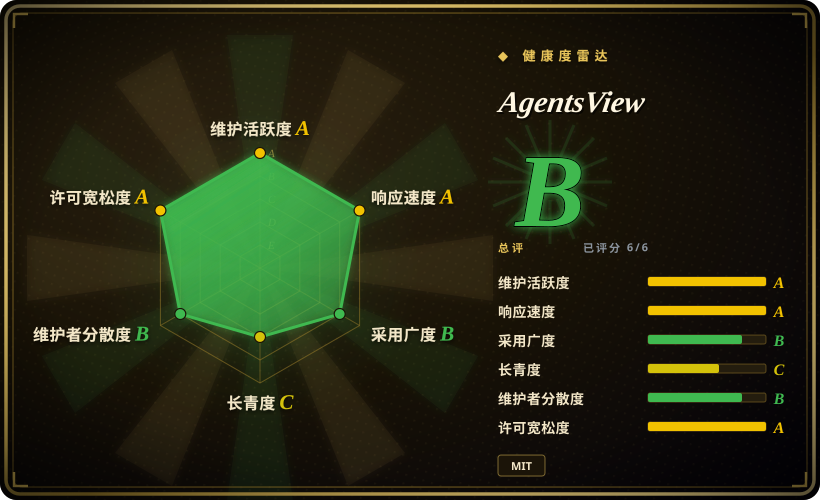
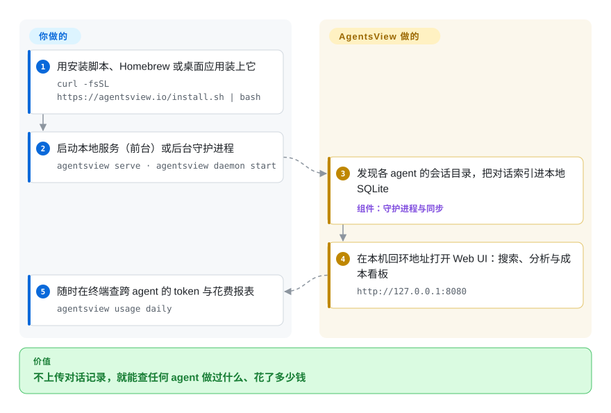

# AgentsView

你这周用了三个编码 agent，可没有一个记得上周那次会话：想找「哪个会话修掉了那个 bug」，只能手工 grep 各家 JSONL；跨工具的 token 花费也没人替你汇总。AgentsView 把所有受支持 agent 的本机会话文件索引进一个 SQLite 归档，在绑定 `127.0.0.1` 的 Web UI 里给你全文搜索、分析与成本汇总——没有账号，除非你主动开启，数据不上传。

## 何时使用

你是一名开发者（或小团队负责人），日常同时跑好几个编码 agent——这个仓库用 Claude Code、那个用 Codex，可能还有 Cursor 和 Gemini——结果线索全乱了：上周哪个会话修了那个 bug、你跨 agent 实际烧了多少 token（和多少钱）、你反复重复哪些 prompt。各工具的历史散落在不同的本地目录里，没有一个能给你跨 agent 的视图。你装上 AgentsView（一个 `curl | sh` 的 CLI、Homebrew/桌面应用，或 Docker），让它指向你的机器，它把本地会话日志索引进 SQLite，在 `127.0.0.1:8080` 提供一个 Svelte Web UI，让你全文搜索每段对话、按 agent 和会话看 token/成本拆分、浏览分析——而不必把你的对话记录发到任何人的云上。它的 Supported Agents 表现在列了约 60 个 agent（README，2026-09），从 Claude Code、Codex、Gemini、各家 Copilot CLI 到 Cursor、Kiro、Zed、Windsurf 这类 IDE 历史。

当你想要**对自己 agent 用量的可观测性**（成本控制、「我在哪儿做过 X」、用量模式）、并在意会话数据留在本地时，你会专门选它。团队视图是主动选择的结果：把归档推到共享 PostgreSQL 或 ClickHouse、镜像成 DuckDB 文件（可选走 DuckDB 的 Quack 协议服务），或用纯文件系统方式在机器间同步；语义/混合搜索也可以对接任何 OpenAI 兼容的 embeddings 端点。

## 怎么用起来

一个本地进程包办一切。`agentsview serve`（前台）或 `agentsview daemon start`（后台；CLI 命令需要时会自动拉起，闲置一段时间会自行退出）发现你主目录下每个受支持 agent 的会话目录（`~/.claude/projects/`、`~/.codex/sessions/` 等），解析对话记录，同步进带 FTS5 全文搜索的 SQLite 归档——金额以整数微美元存储，单价经 LiteLLM/OpenRouter 费率解析并带离线兜底。同一份归档撑起你能碰的三个界面：回环地址上的 Web UI（搜索、看板、活跃热力图、最近编辑流）、一个小型 REST API（`GET /api/v1/sessions/{id}/usage`）、以及 CLI 报表（`agentsview usage daily`、`agentsview stats`、`agentsview session search`）。仍归你的部分：把各 agent 的会话文件留在本机；任何 `pg push` / `clickhouse push` / `duckdb push` 或 hosted raw processing 都要你显式开启，数据才会离开磁盘；以及决定是否用文档化的环境变量/参数关掉 PostHog 心跳与更新检查。

<!-- flow-steps:begin (generated from flows/agentsview.json by tools/flow_card.py — do not edit) -->

流程文字版

1. **你**：用安装脚本、Homebrew 或桌面应用装上它 — `curl -fsSL https://agentsview.io/install.sh | bash`
2. **你**：启动本地服务（前台）或后台守护进程 — `agentsview serve · agentsview daemon start`
3. **AgentsView**：发现各 agent 的会话目录，把对话索引进本地 SQLite — 组件：`守护进程与同步`
4. **AgentsView**：在本机回环地址打开 Web UI：搜索、分析与成本看板 — `http://127.0.0.1:8080`
5. **你**：随时在终端查跨 agent 的 token 与花费报表 — `agentsview usage daily`

**价值**：不上传对话记录，就能查任何 agent 做过什么、花了多少钱

<!-- flow-steps:end -->

## 何时不用

- **你想开箱即用的托管/在线团队看板。** 它是 local-first，默认绑回环；团队共享意味着*你自己*要起 Postgres/ClickHouse/DuckDB 并配网络（或把 `pg push --watch` 装成系统服务）。要 SaaS 的话，这不是。
- **你需要一个成熟、久经考验的工具。** 它才约 7 个月大却 star 很高——这种组合是炒作/成熟度*风险标记*，不是稳定性的证明；版本还在 v0.x，预期会有动荡、破坏性变更和粗糙处。[未验证]
- **你的 agent 不被支持、或没有集中的会话目录。** 覆盖是逐个 agent 的（README 2026-09 列了约 60 个）；Aider 要手动开启，因为它只有逐仓库的 Markdown 日志而没有集中存储；Amp 支持已被标记弃用，因为新版 Amp 可能把会话存在服务端、本地只剩占位文件。请核实你的 agent 被处理。[未验证]
- **你处在受限的构建环境。** SQLite FTS5 需要 CGO；桌面应用是 Tauri 封装，前端开发现在要求 Go 1.27+ 和 Node 24.11+——用预编译产物没问题，但从源码构建有真实的工具链前置。
- **你反对任何遥测。** 服务端启动时和此后每 24 小时会发一个匿名 PostHog `daemon_active` 心跳（只含版本/系统/架构，不含会话内容），另有一个可选的更新检查；两者都可关（`AGENTSVIEW_TELEMETRY_ENABLED=0`、`--no-update-check`）——若「零外联」是硬要求，请配置关闭并核实。[未验证]
- **「数据绝不出机器」是绝对要求。** 默认确实是本地，但*主动开启*的那些路径会搬数据：`pg push`/`clickhouse push` 把对话复制进你指定的数据库，hosted raw processing 会上传源文件用于解析——开启前先读配置，并把含数据库连接串的 `config.toml` 设成 `chmod 600`。

## 横向对比

| 替代品 | 是否收录 | 我们的评价 | 取舍 |
|---|---|---|---|
| 各 agent 内置历史（Claude Code 的 `/resume` 等） | 未收录 | 原生零安装召回已经够用时，选各 agent 内置历史。 | 原生、零安装，但单 agent 且无跨工具搜索/成本汇总——正是 AgentsView 填的缺口。 |
| ccusage / token 成本 CLI | 未收录 | 只需要聚焦 agent 成本报告时，选 ccusage 或 token 成本 CLI。 | 聚焦 Claude Code/agent 的 token 成本报告器；范围更窄（成本，常为单 agent），对比 AgentsView 的搜索＋分析＋多 agent。 |
| [Langfuse](../../llm-eval/langfuse.zh.md) / Helicone / 可观测性 SaaS | 部分已收录 | 需要生产级 LLM 可观测性平台时，选 Langfuse 或 Helicone。 | 生产级 LLM 可观测性平台（tracing、evals）；为应用管线而建，通常托管/需埋点，而非对*你自己*编码 agent 会话做 local-first 浏览。 |
| 对 `~/.claude` / 会话目录做 grep | 未收录 | 零依赖本地搜索已经够用时，选 grep 会话目录。 | 零依赖且完全本地，但没有 UI、没有 token/成本计算、没有跨 agent 归一化。 |

## 技术栈

- **后端：** Go（1.27+，SQLite FTS5 需 CGO），主存储为 **SQLite** 本地归档；可选 **PostgreSQL**、**ClickHouse** 同步目标，以及 **DuckDB** 镜像（本地只读服务，或经 DuckDB 的 Quack 协议远程读）。
- **前端：** Svelte 5 SPA（Vite+ ＋ TypeScript）。
- **桌面：** Tauri 封装，用于 macOS/Windows 桌面应用。
- **搜索：** SQLite FTS5 全文；可选语义/混合搜索，对接任何 OpenAI 兼容 embeddings 端点；SQLite 构建内含 CJK 分词（cppjieba）。
- **分发：** CLI 安装脚本（shell/PowerShell）、Homebrew（`brew install --cask agentsview`）、GitHub Releases，以及 `ghcr.io` Docker 镜像。

## 依赖

- **运行时：** 预编译的二进制/应用自包含；以你的**本地 agent 会话目录**为数据源，索引存进 SQLite。服务默认绑 `127.0.0.1` 并校验 `Host` 头（SSH 转发/反代后用 `--public-url`；暴露到回环之外时开 `--require-auth`）。
- **可选基础设施：** 想要团队共享或替代分析后端时用 PostgreSQL、ClickHouse 或 DuckDB 文件/镜像；容器里只能发现被显式挂载进来的 agent 会话目录。
- **从源码构建：** Go 1.27+、CGO（SQLite FTS5 用），以及前端用的 Node 24.11+。
- **网络：** 核心功能可离线；匿名 PostHog `daemon_active` 心跳与更新检查默认开启、均可关闭。

## 运维难度

**低到中。** 对单用户，顺路径就是一行安装或一个桌面应用，指向自己机器——没什么要运维的，数据留本地、绑回环；守护进程被 CLI 命令按需拉起、闲置自动退出。难度上升发生在你（a）从源码构建（CGO ＋ Go 1.27 ＋ Node 24.11 工具链），或（b）走团队路径——Postgres/ClickHouse/DuckDB 目标、自动推送服务（`pg service install`）、`config.toml` 里的凭据，以及可能暴露到回环之外的服务（那就开 `--require-auth`）。因为项目年轻且快速演进，预期版本间会有升级动荡和偶发破坏——运维风险更像「移动靶」而非「跑起来很复杂」。

## 健康度与可持续性

- **响应速度**：Grade A——中位首次响应时间 21.8 小时，基于评分窗口内 6 个 qualifying issues/PRs（2026-09-28）。
- **维护（2026-09）。** 极其活跃——2026-02 创建，最后 push 2026-09-27（0 天前），近 13 周周周有活动，小版本一路从 6 月的 v0.34.x 发到 v0.44.0。显然在重度开发，不是吃老本。未归档。[推断]
- **治理 / bus factor。** owner 是 `kenn-io` **组织**，项目约 7 个月大，头部贡献者（wesm）仍主导提交（评分器：top-1 占比约 0.46，12 个月内活跃维护者 97 人）——有组织背书但早期集中度高；bus factor 视作未经证明。[推断]
- **年龄与 Lindy——风险。** 2026-02 创建却已约 6k star。**年轻＋高 star 是炒作/成熟度风险标记，不是 Lindy 信号**：尚无历史记录，API 与存储格式（v0.x）可能仍会动荡，长期存续未经证明。把它当*新*工具来押注，而非已尘埃落定的东西。[推断]
- **采用度。** 各渠道都在涨（评分器 2026-09：pypi 月下载 50,765、Homebrew 90 天安装约 2.5 千、Release 附件下载约 23.9 万）——早期兴趣真实；能否持续并稳定下来是悬而未决的问题。[未验证]
- **风险标记。** 年轻/炒作错配（见上）；CGO/Tauri/Node 构建复杂度；默认开启的遥测与更新检查（都可关）；pre-1.0 版本意味着没有稳定性保证；主动开启的 push/hosted 路径设计上就会把对话数据搬离本机。[推断]

## 存疑（未验证）

- [未验证] 截至 2026-09-28 约 6.0k GitHub star（`gh api`），而仓库创建于 2026-02；star 数对时间敏感，「年轻仓库＋高 star」的组合被当作风险信号而非验证。
- [未验证] 「约 60 个受支持 agent」是对 README Supported-Agents 表的逐行数（2026-09-28）；逐 agent 覆盖随版本变动，GitHub 仓库描述自己也只写「more than 20 other agents」——请核实你的 agent。
- [未验证] 技术栈细节（Go 1.27+、SQLite FTS5/CGO、Svelte 5、Tauri、可选 Postgres/ClickHouse/DuckDB+Quack、Node 24.11+、cppjieba CJK 分词）取自 README，未在此独立构建/测试。
- [未验证] local-first / 绑回环 / `Host` 头校验与遥测载荷细节（「不含会话、项目、prompt、文件路径……」）均为 README 声明，未对运行中的二进制核实。
- [推断] pre-1.0 版本（v0.44.x）被解读为「无稳定性保证 / 预期破坏性变更」，这是从版本方案做出的推断。
