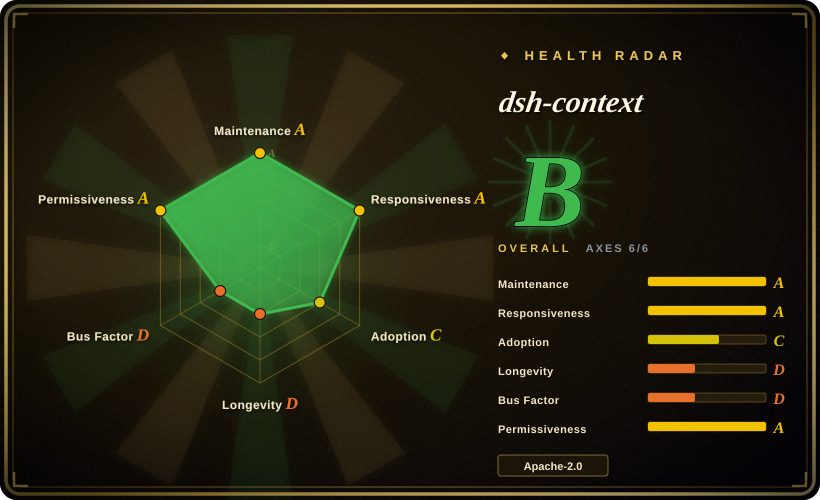
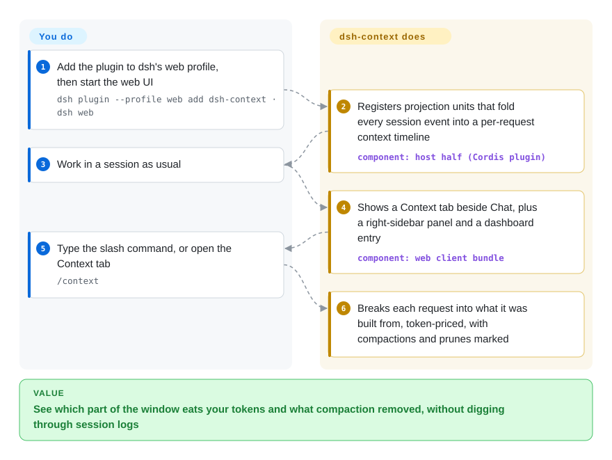

# dsh-context

Your DeepSeek Harness session starts forgetting things or the bill jumps, and the chat's context ring only says the window is 70% full — not whether it is forty tool schemas, a quietly loaded skill or last turn's giant grep output doing it. dsh-context adds a Context tab, a `/context` modal and a cross-session dashboard to dsh's web UI that take every model request apart into what it was assembled from, with a token price on each piece.

## When to use

You live in DeepSeek Harness (`dsh`) through its web UI, and a long session is going sideways: replies get vaguer, an automatic compaction fires and half the conversation disappears, or the day's spend is twice what you expected. The composer's ring gives you one number — occupancy — and the session log is a zstd-compressed event stream you are not going to read by hand. What you want to know is *which part* of the window is heavy: the system prompt, the tool schemas every MCP server registered, a skill that loaded itself, or the tool results piling up turn after turn — and what exactly the last compaction removed.

That is the moment to install dsh-context. It is built for this one host and reads the harness's own event log from inside it, so it can show you the per-request makeup the ring is computed from, the compaction/prune/injection events with their producer and token delta, which plugin registered each tool, and which files the agent touched — plus a dashboard of spend and cache-hit rate across sessions. Pick it over the built-in ring when you need the *breakdown*, not the total; pick it over a cross-agent analytics tool like [AgentsView](agentsview.md) when your question is "what did *this* request contain" rather than "what did all my agents cost this month".

## How it works

The package has two halves that dsh loads for you. The **host half** is an ordinary plugin for Cordis, dsh's plugin runtime: it registers three *projection units* — small reducers the harness feeds every event of a session's durable log — which fold that stream into a per-request timeline of what the context window held, the tool schemas in play, and per-day activity. The harness then pushes those finished values to the browser the same way it pushes its own state. The **client half** is a web bundle that dsh's web app loads: it adds the Context tab beside Chat, a right-sidebar panel, a Context Dashboard entry above Settings, and a `/context` slash command that opens a modal without sending anything to the model. Think of it as an X-ray for the envelope each request mailed to the model: the harness already knew what went in, and this plugin lays the contents on the table. You only install it and look; there is nothing to configure, although the plugin does change a few things on the host side (see When NOT to use).

<!-- flow-steps:begin (generated from flows/dsh-context.json by tools/flow_card.py — do not edit) -->

Text version of the flow

1. **You**: Add the plugin to dsh's web profile, then start the web UI — `dsh plugin --profile web add dsh-context · dsh web`
2. **dsh-context**: Registers projection units that fold every session event into a per-request context timeline — component: `host half (Cordis plugin)`
3. **You**: Work in a session as usual
4. **dsh-context**: Shows a Context tab beside Chat, plus a right-sidebar panel and a dashboard entry — component: `web client bundle`
5. **You**: Type the slash command, or open the Context tab — `/context`
6. **dsh-context**: Breaks each request into what it was built from, token-priced, with compactions and prunes marked

**Value**: See which part of the window eats your tokens and what compaction removed, without digging through session logs

<!-- flow-steps:end -->

## When NOT to use

- **You drive dsh from the terminal.** The client half is declared `"platform": "web"` in its manifest and every surface (tab, sidebar, dashboard, `/context` modal) lives in the web app; the README only documents web/desktop installs. For a context bar, cost and TPS in the TUI, use dsh-TUI (`ccch1mneyyy/dsh-TUI`) instead.
- **Your agent is not DeepSeek Harness.** It is a dsh plugin and nothing else: it reads dsh's projection pipeline and log shapes. For cross-agent session search and cost analytics (Claude Code, Codex, and dsh via `~/.dsh/sessions/`), use [AgentsView](agentsview.md); on Claude Code the built-in `/context` covers the basic breakdown.
- **You want the context smaller, not explained.** dsh-context observes; it does not compress, prune or rewrite what the model sees. For dsh, a model-driven pruning plugin such as billion-context-dsh is the substitute; on other harnesses, [Token Optimizer](../work-state/token-optimizer.md) or [Context Mode](../work-state/context-mode.md).
- **You need a strictly passive, zero-footprint observer.** It runs inside the harness process: it wraps the `tools` service's `register` at runtime to attribute tools to plugins (restored on unload), prepends an `agent/pre-step` listener that stamps a `dshctx-` id onto any step message missing one (a guard against a harness load-time check, issue #51), and its reducers run over every session's events. Early versions broke blank-session creation (#27–#30) and the session list (#43, v0.38.5) before being fixed. If you only need after-the-fact numbers, read the session files out of process with [AgentsView](agentsview.md).
- **Your sessions are very large or the host is small.** An open issue (#101, 2026-09-30) reports opening the dashboard on one 27 MB session pinned a CPU core for about five minutes and added ~1 GB RSS, with no progress log. On a constrained box or with giant sessions, stick to the built-in ring until that is resolved.
- **You need billing-grade numbers.** Category shares are estimates from dsh's own fixed-density heuristic (only the billed total and the pinned per-request actuals are provider-exact), and cost is priced from models.dev list prices — relay and custom-gateway providers have repeatedly shown up unpriced or mispriced (#72, #77, #78, #91). Reconcile spend against your provider's billing console.
- **The machine must make no outbound calls.** The browser half checks the npm registry (falling back to npmmirror) for a newer version at most hourly and fetches the models.dev price book; the host half calls DeepSeek's `/user/balance` with your configured DeepSeek API key to show a balance capsule. All fail silently, but they are egress.
- **You pin versions and upgrade slowly.** 121 npm versions shipped in 47 days, the support matrix covers three dsh prerelease lines (`0.1.5-rc.1`, `0.1.7-rc.2`, `0.2.0-rc.2`), and older dsh lines were dropped at v0.56. Expect to upgrade the plugin in lockstep with dsh.

## Comparison

| Alternative | In index | Our verdict | Tradeoff |
|---|---|---|---|
| dsh built-in context ring and stats line (`deepseek-ai/deepseek-harness`) | not indexed | Stay with the built-in ring when occupancy and the billed total answer your question; add dsh-context once you need to see which category, element or event moved the number. | Zero install and no extra host work, but a single occupancy figure with no per-request makeup, event log or cross-session dashboard. The host repo was not added in this tab batch. |
| [AgentsView](agentsview.md) | ✅ | Pick AgentsView when you run several agents and want searchable transcripts and cost rollups across all of them; pick dsh-context when you are on dsh and need to open a single request's context. | Out-of-process and cross-agent (it reads `~/.dsh/sessions/` too), but works from finished transcripts, not the per-request assembled window, compaction events or tool-to-plugin attribution. |
| dsh-TUI (`ccch1mneyyy/dsh-TUI`) | not indexed | Choose dsh-TUI if you use dsh in a terminal and a live context bar, TPS and session cost are enough; choose dsh-context in the web UI when you need the breakdown behind the bar. | A whole terminal front end (status bar, rewind, session manager) with a context gauge, versus a web-only inspector that shows the contents. Not added in this tab batch. |
| billion-context-dsh (`Tyan66666/billion-context-dsh`) | not indexed | Use billion-context-dsh when the goal is to keep a small window alive by letting the model prune its own context; use dsh-context to see what is in the window and whether pruning helped. | Acts on the context (changes what the model sees), versus observes it (changes nothing the model sees); the two can coexist. Not added in this tab batch. |

## Tech stack

- **Language:** TypeScript (ESM), built with `tsdown`; `oxlint` for linting; `vitest` tests with a 100% per-file coverage gate stated in the repo's `AGENTS.md`.
- **Host half:** a Cordis plugin (`@deepseek-ai/cordis` ^4) that registers session-projection units and a connection fetch route; `zod` is the only runtime dependency.
- **Client half:** React 18 components (React is supplied by the dsh web app), Tailwind CSS 4, with Shiki, KaTeX and micromark bundled for rendering message content.
- **Pricing data:** models.dev price book via `@opencode-ai/models`; DeepSeek image-token and peak/off-peak rules in the host code.

## Dependencies

- **DeepSeek Harness** (`@deepseek-ai/dsh`) on a supported line: `0.1.5-rc.1+`, `0.1.7-rc.2+` or `0.2.0-rc.2+` (per `docs/compatibility.md`, verified 2026-09-29). Below the floor the plugin loads empty fallback units and shows an upgrade prompt.
- **The dsh web profile** and a browser (or a desktop client that loads web plugins); peer packages (`dsh-session`, `dsh-settings`, `schemastery`, React) come from the harness.
- **Node.js** `^22.19.0 || >=24.0.0` per `engines`.
- **Optional:** a DeepSeek API key already configured in dsh (for the balance capsule) and outbound HTTPS to the npm registry and models.dev (version badge and cost estimates).

## Ops difficulty

**Low**, with a moving-target caveat. Installation is one `dsh plugin --profile web add dsh-context` (or the web UI's Add plugin wizard), there is no service, database or port of its own, and removal is `dsh plugin remove`. The real operating cost is churn and host coupling: near-daily releases, a support matrix tied to dsh prereleases, and a fold that runs inside the harness process — so a bad release or a very large session shows up as harness trouble (a broken session list in #43, a pegged CPU in #101) rather than as a separate component you can restart.

## Health & viability

- **Maintenance (2026-09-30).** Hyperactive: 126 GitHub releases (v0.1.0 on 2026-08-14 through v0.62.1 on 2026-09-30) and 121 npm versions over the same span; last push the day of verification. Not archived.
- **Governance / bus factor.** A single personal account owns it and wrote essentially all of it (781 of 786 contributor commits; four others with one or two each). The roadmap, releases and npm publishing all sit with one person — bus factor 1.
- **Responsiveness.** Grade A — median first response 0.2 hours across 48 qualifying issues (scorer, 2026-09-30). 80 issues and 20 PRs from 76 distinct authors in seven weeks, with only one open at verification (#101, filed that day); in the threads read (#43, #69, #101) the maintainer answered within hours and shipped fixes as point releases.
- **Age & Lindy.** 47 days old, riding a host that is itself 48 days old and still on prerelease lines. There is no Lindy track record for either; the plugin has already dropped support for earlier dsh lines once. Bet on it as a young tool tied to a young platform.
- **Adoption — the stars check out against usage.** ~1.65k stars and 53 forks are backed by ~118k npm downloads in the 30 days to 2026-09-28 (~32k in the last week), about 6.6% of the host package's 1.78M over the same window, and by the 76 distinct issue/PR authors, many filing detailed source-level reports. Downloads are inflated by the release cadence (every update is a download), so read them as an upper bound on installs. [推断]
- **Risk flags.** Apache-2.0, no relicense history, no CLA file seen. The real risks are coupling (host prerelease churn has caused several load/compatibility breakages, fixed quickly) and single-maintainer concentration.

## Caveats (unverified)

- [未验证] Star count (~1.65k, 2026-09-30) could not be checked for bursts: the stargazers-with-timestamps API returned 404 for this repo, so the star timeline is unexamined; the adoption judgment rests on npm downloads and issue-author counts instead.
- [推断] npm downloads (118,238 for 2026-08-30 → 2026-09-28) overstate unique installs, because 121 published versions and in-app updates each count as downloads; the true install base is unknown.
- [推断] That the terminal (TUI) front end shows none of the plugin's UI is inferred from the manifest's `"platform": "web"` client declaration and web-only install docs; not tested on a TUI profile.
- [未验证] Issue #101's measurements (27 MB session, ~5 minutes of one core, ~1 GB extra RSS) are the reporter's; not reproduced here, and the issue was still open at verification.
- [未验证] The compatibility claims (three supported dsh lines, fail-open baseline gate, parity with dsh's token meter) are from `docs/compatibility.md` and the source comments; not exercised against a running harness here.
- [未验证] Whether custom-gateway/relay pricing gaps (#72, #77, #91) are fully closed in the current release was not checked; the issues are closed but some were feature requests.
