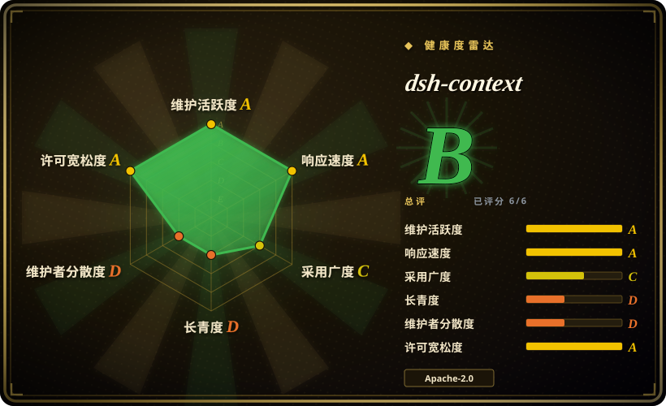
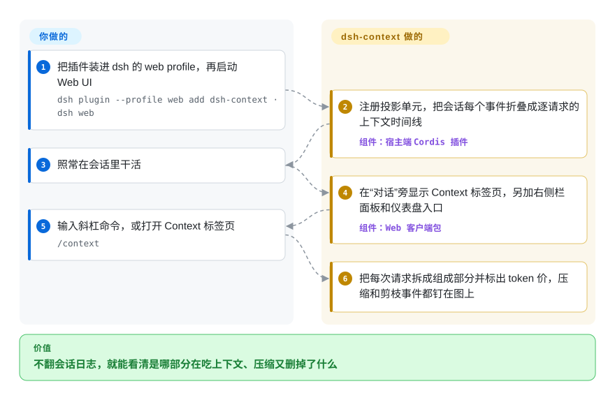

# dsh-context

DeepSeek Harness 的会话开始“忘事”，或者账单突然翻倍，可对话框旁边那个上下文圆环只告诉你“已用 70%”——到底是四十个工具的 schema、一个悄悄加载的技能，还是上一轮那段巨长的 grep 输出在占地方，它不说。dsh-context 给 dsh 的 Web 界面加上 Context 标签页、`/context` 弹窗和跨会话仪表盘，把每一次发给模型的请求拆开，逐项标出各部分花了多少 token。

## 何时使用

你平时通过 Web 界面用 DeepSeek Harness（`dsh`），一个长会话开始走样：回答越来越含糊，自动压缩一触发半段对话就没了，或者今天的花费是预期的两倍。输入框旁的圆环只给一个数——占用率；会话日志是 zstd 压缩的事件流，你不可能手翻。你真正想知道的是**哪一块**重：系统提示词、各个 MCP 服务注册进来的工具 schema、某个自己加载进来的技能，还是一轮轮堆起来的工具结果——以及上一次压缩到底删掉了什么。

这时就该装 dsh-context。它只为这一个宿主而做，在宿主内部读 harness 自己的事件日志，所以能给你看圆环背后的逐请求组成、带生产者和 token 增减的压缩／剪枝／注入事件、每个工具是哪个插件注册的、agent 动过哪些文件，外加一个跨会话的花费与缓存命中率仪表盘。需要的是**拆解**而不是总数时，选它而不是自带圆环；你的问题是“这一次请求里装了什么”，而不是“我所有 agent 这个月花了多少”时，选它而不是 [AgentsView](agentsview.zh.md) 这类跨 agent 分析工具。

## 怎么用起来

这个包分两半，都由 dsh 替你加载。**宿主端**是一个普通的 Cordis 插件（Cordis 是 dsh 的插件运行时）：它注册三个“投影单元”——harness 会把会话持久日志里的每个事件依次喂给它们的小型归约函数——把事件流折叠成逐请求的上下文窗口组成时间线、当时在用的工具 schema，以及按天的活跃度。然后 harness 用推送自身状态的同一条管道，把这些结果送到浏览器。**客户端**是 dsh Web 应用加载的一个前端包：它在“对话”旁边加上 Context 标签页，加一个右侧栏面板、一个位于“设置”上方的 Context Dashboard 入口，以及一个 `/context` 斜杠命令——命令只打开弹窗，不会往模型那边发任何东西。可以把它想成给每封寄给模型的信拍 X 光：harness 本来就知道信封里装了什么，这个插件把内容摊到桌上给你看。你要做的只有安装和查看，不需要配置；不过它确实会在宿主端动几处东西（见“何时不用”）。

<!-- flow-steps:begin (generated from flows/dsh-context.json by tools/flow_card.py — do not edit) -->

流程文字版

1. **你**：把插件装进 dsh 的 web profile，再启动 Web UI — `dsh plugin --profile web add dsh-context · dsh web`
2. **dsh-context**：注册投影单元，把会话每个事件折叠成逐请求的上下文时间线 — 组件：`宿主端 Cordis 插件`
3. **你**：照常在会话里干活
4. **dsh-context**：在“对话”旁显示 Context 标签页，另加右侧栏面板和仪表盘入口 — 组件：`Web 客户端包`
5. **你**：输入斜杠命令，或打开 Context 标签页 — `/context`
6. **dsh-context**：把每次请求拆成组成部分并标出 token 价，压缩和剪枝事件都钉在图上

**价值**：不翻会话日志，就能看清是哪部分在吃上下文、压缩又删掉了什么

<!-- flow-steps:end -->

## 何时不用

- **你在终端里用 dsh。** 客户端在清单里声明为 `"platform": "web"`，标签页、侧栏、仪表盘、`/context` 弹窗全都在 Web 应用里，README 也只写了 Web／桌面端的安装方式。想在 TUI 里看上下文进度条、花费和 TPS，改用 dsh-TUI（`ccch1mneyyy/dsh-TUI`）。
- **你的 agent 不是 DeepSeek Harness。** 它只是一个 dsh 插件，依赖 dsh 的投影管道和日志格式。要跨 agent 的会话搜索和成本分析（Claude Code、Codex，以及通过 `~/.dsh/sessions/` 读 dsh），用 [AgentsView](agentsview.zh.md)；在 Claude Code 上，自带的 `/context` 已能给出基本拆解。
- **你想让上下文变小，而不是看懂它。** dsh-context 只观察，不压缩、不剪枝、不改写模型看到的内容。在 dsh 上可以换成由模型自己决定剪枝的插件，比如 billion-context-dsh；在其他 harness 上用 [Token Optimizer](../work-state/token-optimizer.zh.md) 或 [Context Mode](../work-state/context-mode.zh.md)。
- **你要一个严格被动、零痕迹的观察者。** 它跑在 harness 进程里：运行时包裹 `tools` 服务的 `register`，以便把工具归属到插件（卸载时还原）；前置一个 `agent/pre-step` 监听器，给缺 id 的步骤消息补上 `dshctx-` 前缀的 id（为绕开 harness 加载时的校验，见 issue #51）；它的归约函数会跑遍每个会话的事件。早期版本曾导致新建空会话失败（#27–#30）和会话列表加载不出（#43，v0.38.5），之后已修复。如果你只要事后的数字，用 [AgentsView](agentsview.zh.md) 在进程外读会话文件。
- **会话特别大，或者宿主机器很小。** 一个仍开着的 issue（#101，2026-09-30）报告：在一个 27 MB 的会话上打开仪表盘，单核满载约五分钟、常驻内存多出约 1 GB，期间没有任何进度日志。机器资源紧或会话巨大时，在它解决前先用自带圆环。
- **你需要能对账的精确数字。** 各类别占比是按 dsh 自己的固定密度启发式估算的（只有计费总数和钉住的单次请求实际值来自服务商），费用按 models.dev 的挂牌价计算——中转商和自定义网关的服务商多次出现无法计价或计错价（#72、#77、#78、#91）。花费请以服务商的计费后台为准。
- **机器不允许任何外连。** 浏览器端最多每小时查一次 npm registry（失败再查 npmmirror）看有没有新版本，并拉取 models.dev 价目表；宿主端会用你在 dsh 里配置的 DeepSeek API key 调用 DeepSeek 的 `/user/balance` 来显示余额胶囊。失败都会静默处理，但它们都是出网请求。
- **你习惯锁版本、慢升级。** 47 天里发了 121 个 npm 版本，支持矩阵只覆盖 dsh 的三条预发布线（`0.1.5-rc.1`、`0.1.7-rc.2`、`0.2.0-rc.2`），更早的 dsh 版本线在 v0.56 起已不再支持。要做好插件跟着 dsh 同步升级的准备。

## 横向对比

| 替代品 | 是否收录 | 我们的评价 | 取舍 |
|---|---|---|---|
| dsh 自带的上下文圆环和统计行（`deepseek-ai/deepseek-harness`） | 未收录 | 占用率和计费总数就能回答你的问题时，留在自带圆环；一旦要看是哪个类别、哪个元素、哪次事件让数字变了，再加 dsh-context。 | 零安装、不给宿主加活，但只有一个占用率数字，没有逐请求组成、事件日志和跨会话仪表盘。宿主仓库本批次未收录。 |
| [AgentsView](agentsview.zh.md) | ✅ | 同时跑多个 agent、要在所有 agent 上搜对话和汇总成本时选 AgentsView；用的是 dsh、要打开单次请求的上下文时选 dsh-context。 | 在进程外运行、跨 agent（也读 `~/.dsh/sessions/`），但基于成品对话记录，看不到逐请求拼出的窗口、压缩事件和工具到插件的归属。 |
| dsh-TUI（`ccch1mneyyy/dsh-TUI`） | 未收录 | 在终端用 dsh、有实时上下文进度条、TPS 和会话花费就够时选 dsh-TUI；在 Web 界面里要看进度条背后的拆解时选 dsh-context。 | 一整套终端前端（状态栏、回滚、会话管理）附带上下文仪表，对比一个只在 Web 端、专门展示内容的检查器。本批次未收录。 |
| billion-context-dsh（`Tyan66666/billion-context-dsh`） | 未收录 | 目标是让模型自己剪枝、把小窗口撑下去时用 billion-context-dsh；要看窗口里有什么、剪枝有没有起作用时用 dsh-context。 | 一个作用于上下文（改变模型看到的内容），一个只观察（不改变模型看到的任何东西），两者可以并存。本批次未收录。 |

## 技术栈

- **语言：** TypeScript（ESM），用 `tsdown` 构建；`oxlint` 做静态检查；`vitest` 测试，仓库的 `AGENTS.md` 规定每个文件覆盖率必须 100%。
- **宿主端：** 一个 Cordis 插件（`@deepseek-ai/cordis` ^4），注册会话投影单元和一个连接层 fetch 路由；运行时依赖只有 `zod`。
- **客户端：** React 18 组件（React 由 dsh Web 应用提供），Tailwind CSS 4，打包了 Shiki、KaTeX 和 micromark 用于渲染消息内容。
- **定价数据：** 通过 `@opencode-ai/models` 读取 models.dev 价目表；DeepSeek 图片 token 与峰谷时段规则写在宿主端代码里。

## 依赖

- **DeepSeek Harness**（`@deepseek-ai/dsh`），须在受支持的版本线上：`0.1.5-rc.1+`、`0.1.7-rc.2+` 或 `0.2.0-rc.2+`（据 `docs/compatibility.md`，2026-09-29 核验）。低于下限时，插件加载空的回退单元并弹出升级提示。
- **dsh 的 web profile** 和一个浏览器（或能加载 Web 插件的桌面客户端）；同级依赖包（`dsh-session`、`dsh-settings`、`schemastery`、React）由 harness 提供。
- **Node.js**：`engines` 要求 `^22.19.0 || >=24.0.0`。
- **可选：** 已在 dsh 里配置的 DeepSeek API key（用于余额胶囊），以及能访问 npm registry 和 models.dev 的外网 HTTPS（版本提示和费用估算）。

## 运维难度

**低**，但目标在移动。安装就是一条 `dsh plugin --profile web add dsh-context`（或在 Web 界面的“添加插件”向导里搜索安装），它没有自己的服务、数据库或端口，卸载用 `dsh plugin remove`。真正的运维成本来自变动和对宿主的耦合：几乎每天发版，支持矩阵绑在 dsh 的预发布线上，折叠逻辑跑在 harness 进程内——所以一次坏版本或一个超大会话，表现出来就是 harness 本身出问题（#43 里会话列表加载不出，#101 里 CPU 被占满），而不是一个你能单独重启的组件。

## 健康度与可持续性

- **维护（2026-09-30）。** 极度活跃：126 个 GitHub release（v0.1.0 于 2026-08-14，到 v0.62.1 于 2026-09-30），同期 121 个 npm 版本；核验当天仍有推送，未归档。
- **治理与巴士系数。** 由一个个人账号持有，代码几乎全部出自一人（贡献者提交 786 次中占 781 次，另外四人各一两次）。路线图、发版和 npm 发布都在一个人手里——巴士系数为 1。
- **响应速度。** 评级 A——48 个合格 issue 的首次响应中位数为 0.2 小时（评分器，2026-09-30）。七周内 80 个 issue、20 个 PR，来自 76 位不同作者，核验时只有一个未关闭（#101，当天提交）；读过的几个帖子（#43、#69、#101）里，维护者都在数小时内回复，并以小版本发布修复。
- **年龄与 Lindy。** 仓库 47 天，所依附的宿主本身也才 48 天，仍在预发布阶段。两者都谈不上 Lindy 记录；插件已经放弃过一次对更早 dsh 版本线的支持。把它当作绑在年轻平台上的年轻工具来押注。
- **采用情况——星数与实际使用对得上。** 约 1.65k 星、53 个 fork，背后是截至 2026-09-28 的 30 天约 11.8 万次 npm 下载（最近一周约 3.2 万），约为同期宿主包 178 万下载量的 6.6%，另有 76 位不同的 issue／PR 作者，其中不少提交的是精确到源码的报告。发版频率会抬高下载数（每次更新都算一次下载），所以只能把它当作安装量的上限。[推断]
- **风险信号。** Apache-2.0，没有改许可证的历史，未见 CLA 文件。真正的风险是耦合（宿主预发布线的变动已造成多次加载／兼容性故障，均很快修复）和单人维护的集中度。

## 存疑（未验证）

- [未验证] 星数（约 1.65k，2026-09-30）无法检查是否有突增：该仓库带时间戳的 stargazers 接口返回 404，所以没看到加星时间线；采用情况的判断改为依据 npm 下载量和 issue 作者数。
- [推断] npm 下载量（2026-08-30 至 2026-09-28 共 118,238 次）高估了独立安装数，因为已发布 121 个版本、应用内每次更新都算下载；真实安装基数未知。
- [推断] “终端（TUI）前端看不到插件的任何界面”是根据清单里 `"platform": "web"` 的客户端声明和只写了 Web 端的安装文档推断的；没有在 TUI profile 上实测。
- [未验证] issue #101 的数据（27 MB 会话、单核约五分钟、多出约 1 GB 常驻内存）来自报告者；这里没有复现，核验时该 issue 仍未关闭。
- [未验证] 兼容性声明（支持三条 dsh 版本线、版本门失败时放行、与 dsh token 计量一致）来自 `docs/compatibility.md` 和源码注释；没有在运行中的 harness 上验证。
- [未验证] 自定义网关／中转商的计价缺口（#72、#77、#91）在当前版本是否已全部补上没有核查；这些 issue 已关闭，但其中有些是功能请求。
