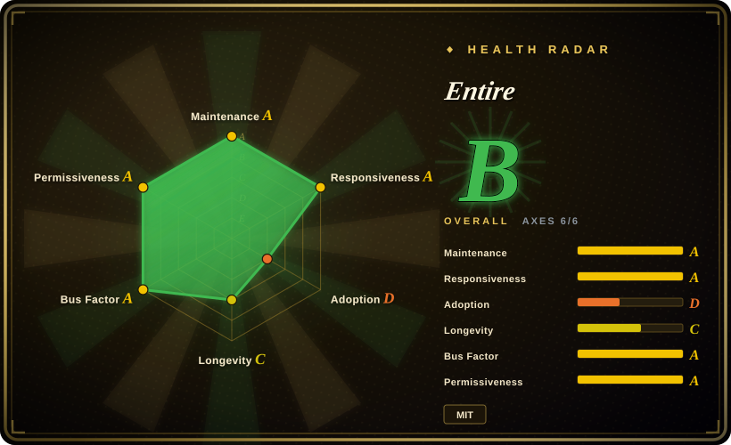
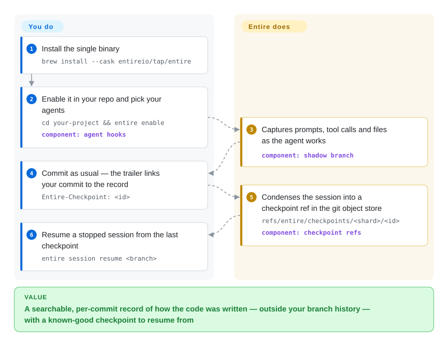

# Entire

Three weeks after an agent rewrote your retry loop, nobody can say *why* — the transcript that explained it is long gone, and when an agent wanders off-course you hand-unwind the working tree. Entire installs Git hooks that capture every agent session (prompts, tool calls, files touched) into per-checkpoint git refs linked to your commits by a trailer, so the "how the code was written" record stays searchable and a stopped session can be resumed from the last checkpoint.

## When to use

You're a developer (or a small team) running coding agents — Claude Code one day, Codex or Cursor the next — through real feature work in a Git repo. The code lands fine, but three weeks later in review someone asks "why is the retry loop written this way?" and the answer lived in an agent transcript that compacted into oblivion. Worse, an agent occasionally drives a session into the weeds, mangles a few files, and you'd kill for a clean "get back to before it went sideways" without hand-unwinding a messy working tree. You also don't want any of this AI bookkeeping polluting your actual commit history.

So you `entire enable` in the repo and pick your agents. Now every session is captured through each agent's own hook mechanism: prompts, responses, tool calls, modified files and timestamps are condensed, at each git commit, into a checkpoint — a git ref under `refs/entire/checkpoints/` whose tree holds the session's metadata and transcripts, linked back to your commit by an `Entire-Checkpoint: <id>` trailer. Your branch history stays clean because Entire never commits on it. When a session goes bad, `entire session resume <branch>` checks the branch back out, restores the latest checkpointed session state, and prints the commands to continue; months later, `entire search` finds the transcript that explains a decision by semantic match, and the experimental `entire why <file>:<line>` jumps from one line of code straight back to the prompt that produced it. It works across eight agents (Antigravity, Claude Code, Codex, Copilot CLI, Cursor, Factory Droid, OpenCode, Pi, plus external agents on `$PATH`) and with Git worktrees, so the provenance record is uniform no matter which tool wrote the code.

## How it works

Entire rides on the hook surfaces your agents already expose — a JSON hooks file for Claude Code / Codex / Cursor / Copilot CLI, a TypeScript plugin for OpenCode and Pi — so `entire enable` installs those hooks and capture starts automatically; nothing changes about how you work with the agent. As a session runs, its in-progress records accumulate on a short-lived shadow branch; when you (or the agent) make a git commit, that work is condensed into a permanent checkpoint: each checkpoint gets its own git ref (`refs/entire/checkpoints/<shard>/<26-char ULID>`), pointing at a commit whose tree *is* the session's metadata, transcripts, and subagent task records, and your code commit carries an `Entire-Checkpoint: <id>` trailer back to it. Because checkpoints are independent refs rather than one shared branch, they push and fetch separately — a checkpoint written on another machine is fetched on demand the first time you read it — and `--checkpoint-remote` can redirect them to a separate repo (e.g. a private one for a public project). On top of the same record you get recovery (`entire session resume <branch>`), semantic search (`entire search`), and line-level archaeology via the experimental `entire blame` / `entire why`. What stays yours: where the refs get pushed (by default they ride your repo's elected remote and are visible to anyone who can read it), trusting the best-effort secret redaction over what gets written, and never pushing the temporary shadow branches manually. [推断：核心本地捕获无需登录账号，README 未逐字声明]

<!-- flow-steps:begin (generated from flows/entire-cli.json by tools/flow_card.py — do not edit) -->

Text version of the flow

1. **You**: Install the single binary — `brew install --cask entireio/tap/entire`
2. **You**: Enable it in your repo and pick your agents — `cd your-project && entire enable` — component: `agent hooks`
3. **Entire**: Captures prompts, tool calls and files as the agent works — component: `shadow branch`
4. **You**: Commit as usual — the trailer links your commit to the record — `Entire-Checkpoint: <id>`
5. **Entire**: Condenses the session into a checkpoint ref in the git object store — `refs/entire/checkpoints/<shard>/<id>` — component: `checkpoint refs`
6. **You**: Resume a stopped session from the last checkpoint — `entire session resume <branch>`

**Value**: A searchable, per-commit record of how the code was written — outside your branch history — with a known-good checkpoint to resume from

<!-- flow-steps:end -->

## When NOT to use

- **Public repos with sensitive prompts** — transcripts live *in your git repository*, inside the checkpoint refs; if the repo is public, that data is visible to anyone. Secret redaction is the project's own "best-effort" only, and the temporary shadow branches hold **raw, unredacted working-tree blobs** and must never be pushed. Mitigation exists — `entire enable --checkpoint-remote github:org/checkpoints-private` routes checkpoint data to a separate (private) repo — but the exposure surface is real; treat policy as part of the install, not set-and-forget.
- **Pre-1.0 churn, in the storage layer itself** — latest stable is v0.11.3 (2026-09); between v0.7 (2026-06) and v0.11 the checkpoint storage was re-architected from a single `entire/checkpoints/v1` branch to per-checkpoint refs, IDs moved from 12-char hex to ULIDs (legacy IDs still readable), and the old `entire checkpoint rewind` command left the reference entirely. Not the choice when you need stable, frozen interfaces or formal compatibility guarantees.
- **Rewind/continue parity on every agent/IDE** — coverage is broad (Antigravity, Claude Code, Codex, Copilot CLI, Cursor, Factory Droid, OpenCode, Pi) but uneven at the edges: Pi is Preview with no subagent capture, Copilot is CLI-only (not VS Code or github.com), and Factory Droid cannot generate summaries. Cursor IDE/CLI support is now stated as equivalent for commands, but verify your specific agent/version before relying on the recovery story.
- **Task/dependency tracking** — Entire is a *capture & provenance* layer, not a task graph. It records what agents did; it does not model which work blocks which or surface "ready" tasks — that's a different tool ([beads](../work-state/beads.md)).
- **Org-wide audit dashboards** — capture and the record are per-repo and CLI-driven. A hosted control plane now exists (`entire org/project/repo/cluster`, `git clone entire://…`, device-code and CI-token login), but no web dashboard or team analytics view over the transcript record is documented in the README. [未验证：控制面产品形态仅见于 CLI 命令]
- **Non-Git or non-agent workflows** — the entire mechanism is Git hooks + checkpoint refs + commit trailers; without Git, and without a supported agent emitting sessions, there's nothing to capture.

## Comparison

| Alternative | In index | Our verdict | Tradeoff |
|---|---|---|---|
| [beads](../work-state/beads.md) | ✅ | Choose beads when you need the adjacent task-graph/structured-memory layer. | Solves the adjacent problem: a dependency-aware *task graph* / structured agent memory (what to do next, what's blocked), backed by versioned SQL. Entire captures *what already happened* (transcripts/checkpoints) for provenance & resume — complementary, not substitutes. |
| [CCPM](../work-state/ccpm.md) | ✅ | Choose CCPM when you need a Claude-Code project-management workflow over specs/issues/parallel agents. | A Claude-Code project-management workflow (specs/issues/parallel agents via GitHub Issues). Process/coordination layer, not a session-transcript capture-and-resume layer. |
| Plain Git + agent's own session logs | 未收录 | Choose plain Git and native logs when zero extra tooling matters more than unified provenance. | Zero extra tooling, but agent logs are scattered per-tool, not linked to commits, not uniformly resumable, and clutter or never reach the repo. Entire is the unifying capture/index layer. |
| Specstory / agent transcript exporters | 未收录 | Choose transcript exporters when exported chat logs are enough. | Other tools also persist agent chat transcripts, but typically as exported files/markdown rather than Git-checkpoint provenance tied to commits with a resume mechanism. Verify feature parity before substituting. |
| Reflog / `git stash` + manual snapshots | 未收录 | Choose reflog, git stash, or manual snapshots when native tree-state recovery is enough. | Native recovery primitives you already have, but they capture tree state only — no prompts/responses/tool-call context, no per-session indexing, no agent-aware redaction. |

## Tech stack

- Go (~98% of the code per GitHub languages, 2026-09) — distributed as a single binary `entire` (plus a `git-remote-entire` helper that resolves `entire://` clone URLs).
- Per-agent hook config as the capture mechanism: JSON hooks for Claude Code (`.claude/settings.json`), Codex (`.codex/hooks.json`), Cursor, Copilot CLI, Antigravity, Factory Droid; TypeScript plugins for OpenCode and Pi.
- Checkpoint storage as per-checkpoint git refs (`refs/entire/checkpoints/<shard>/<id>`) in the repo's object store, with 26-character ULID IDs and an `Entire-Checkpoint` commit trailer; checkpoint commits are signed by default.
- Two release channels (stable / nightly); distribution via Homebrew cask (`brew install --cask entireio/tap/entire`), `install.sh` / `install.ps1`, Scoop (`entire/entire`, renamed from `cli`), and `go install` (needs Go 1.27.1+).
- kubectl-style plugin system: any `entire-<name>` executable on `$PATH` becomes a subcommand; a git-synced plugin index for discovery.
- Telemetry: anonymous usage stats to Posthog, opt-out via `--telemetry=false`.

## Dependencies

- **Git** — mandatory; the whole capture model is Git hooks + checkpoint refs + commit trailers.
- **A supported agent** — Antigravity, Claude Code, Codex, Copilot CLI, Cursor, Factory Droid, OpenCode, or Pi (external agents on `$PATH` also work). Codex needs codex-cli 0.124.0+ (hooks enabled by default, `.codex/hooks.json`; no `config.toml` step anymore).
- **Optional, for summaries** — auto-summarization calls an installed agent CLI at commit time; default provider is Claude Code (`claude` on `$PATH`, model sonnet), switchable to antigravity/codex/copilot-cli/cursor/opencode/pi via `entire configure --summarize-provider …`. Factory Droid cannot summarize.
- **Optional, for cloud features** — `entire login` (browser or `--device` flow; OS keyring, `ENTIRE_TOKEN_STORE=file` on headless machines, `ENTIRE_TOKEN` injection for CI) gates the hosted control plane (orgs/projects/repos/clusters). Core local capture needs no account. [推断：README 未逐字声明核心功能不要求登录]
- No database or server to run yourself; the control plane is the vendor's hosted service.

## Ops difficulty

**Low.** Install the single binary, run `entire enable`, and capture happens via the agents' hooks with no service to operate — `entire status` / `entire doctor` cover health, `entire disable` / `entire clean` back it out. The real operational burden isn't infrastructure, it's *governance*: checkpoint refs default to riding your repo's elected push remote (exactly one remote is chosen when you have several), so you must decide visibility policy — or set up a private `--checkpoint-remote` — trust best-effort redaction, and keep the raw-blob shadow branches from being pushed. The checkpoint-remote election behavior is worth reading once, because pushing to multiple remotes silently means checkpoints only go to one of them.

## Health & viability

- **Maintenance (2026-09).** Very active — latest stable v0.11.3 (2026-09-25), nightlies shipping near-daily, last push 2026-09-27, ~209 GitHub releases since the 2026-01 start. But the pace includes architecture-level churn (branch→refs storage, hex→ULID IDs, commands removed), so "active" here also means "interfaces still moving."
- **Governance / bus factor (2026-09).** Owned by the `entireio` GitHub organization, with 65 active maintainers over the last 12 months (top-1 share 0.227, top-3 share 0.458, scorer 2026-09-28) — better than a personal repo, but vendor-led: there's an `entire.io` install host and a commercial control plane (orgs/projects/clusters, `entire repo clone`), so the roadmap is the company's. No foundation. [推断：商业方主导路线图，依 CLI 控制面命令与安装站推断]
- **Backing & age / Lindy (2026-09).** Created 2026-01-02, so under a year old: too young for any Lindy verdict. The vendor backing (hosted control plane, dual release channels) argues it won't be left unmaintained quickly — but that's present investment, not track record.
- **Adoption (2026-09).** ~5.1k stars (GitHub API, 2026-09-28, up from ~4.5k in June) and the radar's release-download tier — early-adopter momentum, not yet a default choice. Star growth here mostly reflects the agent-session-capture category heating up. [推断]
- **Risk flags.** MIT license, no relicense history. The standout risk is **data exposure, not licensing**: transcripts sit in your repo's refs, shadow branches hold raw working-tree blobs, and redaction is self-declared best-effort. Secondary: pre-1.0 storage-format churn, and a growing dependence on the vendor's hosted control plane for team features.

## Caveats (unverified)

- [未验证] Star count ~5,125 (GitHub API, 2026-09-28) — date-sensitive and not proof of quality.
- [未验证] "Core local capture needs no account" and the exact boundary of what `entire login` gates are inferred from the README's auth section, not stated verbatim.
- [未验证] Per-agent capability gaps (Pi Preview / no subagent capture, Copilot CLI-only, Factory Droid no summaries) are the project's own README claims; behavior may change across releases — verify against your agent/version.
- [未验证] Secret redaction is the project's own "best-effort" claim; coverage and failure modes are not independently audited. Do not treat it as a guarantee for public repos.
- [推断] Entire and a task-graph tool like beads address different layers (provenance/resume vs task state); the "complementary, not substitutes" framing is reasoning, not a tested integration.
- [未验证] Comparison rows for non-indexed alternatives (Specstory-style exporters, generic transcript tools) are described from general category knowledge, not a feature-by-feature audit of each.
- [未验证] The hosted control plane's dashboard/analytics surface is known only from CLI commands (`entire org/project/repo/cluster`, `entire api`); no web UI was examined.
