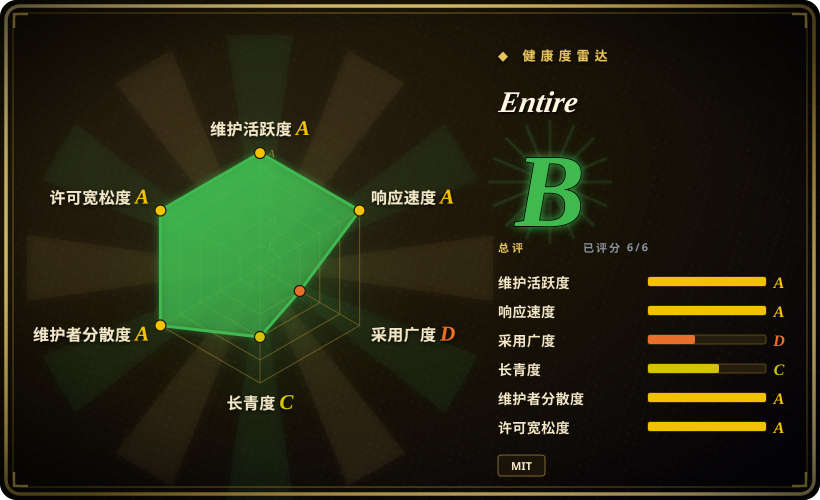
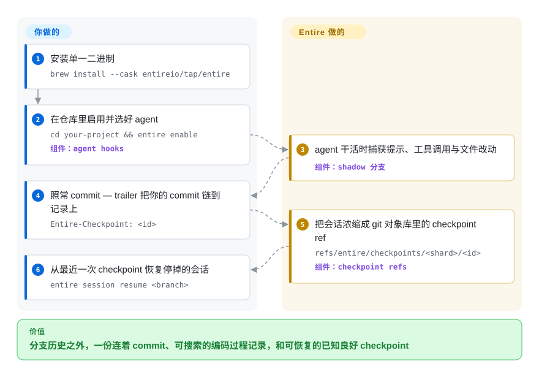

# Entire

agent 三周前把重试循环改了，现在没人说得出*为什么*——解释它的 transcript 早被压缩没了；会话跑偏时，还得你手动去拆乱掉的工作树。Entire 装上 Git hooks，把每次 agent 会话（提示、工具调用、改动文件）捕获成一条条与你的 commit 通过 trailer 互相关联的 checkpoint（独立的 git ref），于是「代码是怎么写出来的」这份记录可以搜索，停掉的会话也能从最近一次 checkpoint 恢复继续。

## 何时使用

你是一名开发者（或小团队），在一个 Git 仓库里用各种编码 agent 干真实的功能活——今天 Claude Code，明天 Codex 或 Cursor。代码本身落地没问题，但三周后 review 时有人问「这个重试循环为什么这么写」，答案当初就藏在某段 agent transcript 里，早被压缩掉、灰飞烟灭了。更糟的是，agent 偶尔会把一段会话开到沟里，把几个文件搅乱，这时你巴不得能「回到它跑偏之前」，而不必手动去理一棵乱掉的工作树。与此同时，你也不希望这些 AI 记账信息污染你真正的 commit 历史。

于是你在仓库里 `entire enable`，选好你的 agent。现在每次会话都经由各 agent 自己的 hook 机制自动捕获：提示、回复、工具调用、改动文件和时间戳，会在每次 git commit 时被浓缩成一个 checkpoint——`refs/entire/checkpoints/` 下的一条 git ref，其树对象里装着这轮会话的元数据与 transcript，而你的代码 commit 带上 `Entire-Checkpoint: <id>` trailer 指回它。你的分支历史保持干净，Entire 绝不在上面提交。会话跑坏时用 `entire session resume <branch>` 检回分支、恢复最近一次 checkpoint 的会话状态并打印继续命令；几个月后，`entire search` 能按语义找到解释某个决策的那段 transcript，实验性的 `entire why <file>:<line>` 更直接从一行代码跳回产生它的 prompt。它覆盖八种 agent（Antigravity、Claude Code、Codex、Copilot CLI、Cursor、Factory Droid、OpenCode、Pi，外加 `$PATH` 上的外部 agent）、兼容 Git worktree，所以不管哪个工具写的代码，溯源记录都是统一的。

## 怎么用起来

Entire 借用的是各 agent 本来就有的 hook 表面——Claude Code / Codex / Cursor / Copilot CLI 用 JSON hook 配置，OpenCode 和 Pi 用 TypeScript 插件——`entire enable` 装好这些 hook 后捕获自动开始，你和 agent 的工作方式没有任何改变。会话进行中，记录先累积在一条短命的 shadow 分支上；当你（或 agent）做出 git commit，这段在制品被浓缩成一个永久 checkpoint：每个 checkpoint 各占一条 git ref（`refs/entire/checkpoints/<shard>/<26 位 ULID>`），指向一个树对象就是这轮会话元数据、transcript 和 subagent 任务记录的 commit，你的代码 commit 再用 `Entire-Checkpoint: <id>` trailer 链回它。因为 checkpoint 是各自独立的 ref 而不是一条共享分支，它们的 push/fetch 互不牵扯——另一台机器写的 checkpoint 会在你第一次读取时按需拉取——而且 `--checkpoint-remote` 可以把它们改道到另一个（比如私有）仓库。同一份记录往上还长出了恢复（`entire session resume <branch>`）、语义搜索（`entire search`）和行级考古（实验性的 `entire blame` / `entire why`）。仍然归你管的：这些 ref 被推到哪（默认跟着你仓库选定的 push remote 走，仓库对谁可见它们就对谁可见）、信任那套自称 best-effort 的密钥脱敏、以及绝不要手动 push 那些临时 shadow 分支。[推断：核心本地捕获无需登录账号，README 未逐字声明]

<!-- flow-steps:begin (generated from flows/entire-cli.json by tools/flow_card.py — do not edit) -->

流程文字版

1. **你**：安装单一二进制 — `brew install --cask entireio/tap/entire`
2. **你**：在仓库里启用并选好 agent — `cd your-project && entire enable` — 组件：`agent hooks`
3. **Entire**：agent 干活时捕获提示、工具调用与文件改动 — 组件：`shadow 分支`
4. **你**：照常 commit — trailer 把你的 commit 链到记录上 — `Entire-Checkpoint: <id>`
5. **Entire**：把会话浓缩成 git 对象库里的 checkpoint ref — `refs/entire/checkpoints/<shard>/<id>` — 组件：`checkpoint refs`
6. **你**：从最近一次 checkpoint 恢复停掉的会话 — `entire session resume <branch>`

**价值**：分支历史之外，一份连着 commit、可搜索的编码过程记录，和可恢复的已知良好 checkpoint

<!-- flow-steps:end -->

## 何时不用

- **会带敏感提示的公开仓库** —— transcript 是存在*你的 git 仓库里*的 checkpoint ref 中的；仓库一旦公开，这些数据任何人都能看到。密钥脱敏只是项目自称的「尽力而为（best-effort）」，而且会话中途的临时 shadow 分支存的是**未经脱敏的工作树原始 blob**，绝不能被 push。缓解措施是有的——`entire enable --checkpoint-remote github:org/checkpoints-private` 可把 checkpoint 数据改道到单独的私有仓库——但暴露面真实存在，推送策略要当作安装的一部分来对待，而不是装好就不管。
- **pre-1.0 的变动，而且变动在存储层本身** —— 最新 stable 是 v0.11.3（2026-09）；从 v0.7（2026-06）到 v0.11，checkpoint 存储从单一的 `entire/checkpoints/v1` 分支重构为逐条独立 ref，ID 从 12 位 hex 换成 ULID（旧 ID 仍可读），而旧的 `entire checkpoint rewind` 命令整体退出了命令参考。当你需要稳定冻结的接口或正式兼容性保证时，它不是合适选择。
- **指望每个 agent/IDE 都有同等的恢复能力** —— 覆盖面很广（Antigravity、Claude Code、Codex、Copilot CLI、Cursor、Factory Droid、OpenCode、Pi）但边角参差：Pi 处于 Preview 且不支持 subagent 捕获，Copilot 只支持 CLI（不含 VS Code 和 github.com），Factory Droid 不能生成摘要。Cursor IDE/CLI 的命令支持如今声明为与其他 agent 一致，但依赖恢复能力前，先核对你具体用的那个 agent/版本。
- **任务 / 依赖跟踪** —— Entire 是一个*捕获与溯源*层，不是任务图。它记录 agent 做了什么，但不建模哪些工作阻塞哪些、也不给出「就绪」任务——那是另一类工具（[beads](../work-state/beads.zh.md)）。
- **全组织审计看板** —— 捕获与记录都是按仓库、CLI 驱动的。托管控制面如今存在（`entire org/project/repo/cluster`、`git clone entire://…`、设备码与 CI token 登录），但 README 没有描述任何面向 transcript 记录的 Web 看板或团队分析视图。[未验证：控制面产品形态仅见于 CLI 命令]
- **非 Git 或非 agent 工作流** —— 整套机制就是 Git hooks + checkpoint refs + commit trailer；没有 Git、也没有受支持的 agent 产出会话，就根本没东西可捕获。

## 横向对比

| 替代品 | 是否收录 | 我们的评价 | 取舍 |
|---|---|---|---|
| [beads](../work-state/beads.zh.md) | ✅ | 需要相邻的任务图/结构化记忆层时，选 beads。 | 解决的是相邻问题：依赖感知的*任务图* / 结构化 agent 记忆（接下来做什么、什么被阻塞），由版本化 SQL 支撑。Entire 捕获的是*已经发生了什么*（transcript/checkpoint）用于溯源与恢复——互补，而非替代。 |
| [CCPM](../work-state/ccpm.zh.md) | ✅ | 需要基于 spec/issue/多 agent 并行的 Claude-Code 项目管理流程时，选 CCPM。 | 一套 Claude-Code 项目管理工作流（基于 GitHub Issues 的 spec/issue/多 agent 并行）。属于流程/协调层，不是会话 transcript 的捕获与恢复层。 |
| 裸 Git + agent 自带的会话日志 | 未收录 | 零额外工具比统一溯源更重要时，选裸 Git 加 agent 自带日志。 | 零额外工具，但 agent 日志按工具各自分散、不与 commit 索引、不可统一恢复，要么乱要么根本进不了仓库。Entire 就是那个统一的捕获/索引层。 |
| Specstory / agent transcript 导出工具 | 未收录 | 导出的聊天记录已经够用时，选 Specstory 或其他 transcript 导出工具。 | 其它工具也能持久化 agent 聊天 transcript，但通常是导出成文件/markdown，而非绑定到 commit 的 Git-checkpoint 溯源、且带恢复机制。替换前先核对功能对齐度。 |
| Reflog / `git stash` + 手动快照 | 未收录 | 原生工作树状态恢复已经够用时，选 reflog、git stash 或手动快照。 | 你本来就有的原生恢复原语，但它们只捕获工作树状态——没有提示/回复/工具调用上下文、没有按会话索引、没有 agent 感知的脱敏。 |

## 技术栈

- Go（按 GitHub 语言统计约 98%，2026-09）—— 以单一二进制 `entire` 分发，外加一个解析 `entire://` 克隆 URL 的 `git-remote-entire` 助手。
- 以各 agent 的 hook 配置作为捕获机制：Claude Code（`.claude/settings.json`）、Codex（`.codex/hooks.json`）、Cursor、Copilot CLI、Antigravity、Factory Droid 用 JSON hooks；OpenCode 与 Pi 用 TypeScript 插件。
- checkpoint 以逐条独立 git ref（`refs/entire/checkpoints/<shard>/<id>`）存进仓库的对象库，ID 为 26 位 ULID，代码 commit 带 `Entire-Checkpoint` trailer；checkpoint commit 默认签名。
- 双发布通道（stable / nightly）；分发方式：Homebrew cask（`brew install --cask entireio/tap/entire`）、`install.sh` / `install.ps1`、Scoop（`entire/entire`，已从 `cli` 更名）、`go install`（需 Go 1.27.1+）。
- kubectl 风格的插件系统：`$PATH` 上任何名为 `entire-<name>` 的可执行文件都成为子命令；配一个 git 同步的插件索引做发现。
- 遥测：匿名使用统计发往 Posthog，可用 `--telemetry=false` 关闭。

## 依赖

- **Git** —— 必需；整套捕获模型就是 Git hooks + checkpoint refs + commit trailer。
- **一个受支持的 agent** —— Antigravity、Claude Code、Codex、Copilot CLI、Cursor、Factory Droid、OpenCode 或 Pi（`$PATH` 上的外部 agent 也能用）。Codex 需要 codex-cli 0.124.0+（hooks 默认启用、写 `.codex/hooks.json`，不再需要 `config.toml` 那一步）。
- **可选，用于摘要** —— 自动摘要在 commit 时调用一个已安装的 agent CLI；默认提供方是 Claude Code（`PATH` 上的 `claude`，模型 sonnet），可用 `entire configure --summarize-provider …` 换成 antigravity/codex/copilot-cli/cursor/opencode/pi。Factory Droid 不能生成摘要。
- **可选，用于云功能** —— `entire login`（浏览器或 `--device` 设备码流；OS keyring、无头机器用 `ENTIRE_TOKEN_STORE=file`、CI 注入 `ENTIRE_TOKEN`）解锁的是托管控制面（org/project/repo/cluster）。核心本地捕获不需要账号。[推断：README 未逐字声明核心功能不要求登录]
- 你自己不需要跑数据库或服务器；控制面是厂商的托管服务。

## 运维难度

**低。** 装好单一二进制、跑 `entire enable`，捕获就经由各 agent 的 hook 发生，没有要运维的服务——`entire status` / `entire doctor` 管健康，`entire disable` / `entire clean` 退出。真正的运维负担不是基础设施，而是*治理*：checkpoint ref 默认跟着你仓库「选定」的那个 push remote 走（有多个 remote 时只会选中一个），所以你必须决定可见性策略——或者配好私有 `--checkpoint-remote`——信任 best-effort 脱敏、并防止原始 blob 的 shadow 分支被 push。checkpoint-remote 的选举行为值得先读一遍文档，因为向多个 remote 推送时，checkpoint 只会默默进其中一条。

## 健康度与可持续性

- **维护（2026-09）。** 非常活跃——最新 stable v0.11.3（2026-09-25），nightly 近乎每日发版，最后 push 2026-09-27，自 2026-01 起约 209 个 GitHub release。但这种节奏包含架构级变动（分支→ref 存储、hex→ULID ID、命令退出参考），所以「活跃」在这里也意味着「接口还在动」。
- **治理 / 巴士因子（2026-09）。** 由 `entireio` GitHub 组织持有，12 个月内 65 位活跃维护者（top-1 占比 0.227、top-3 占比 0.458，评分器 2026-09-28）——比个人仓库好，但仍是厂商主导：有 `entire.io` 安装站和一套商业控制面（org/project/cluster、`entire repo clone`），路线图属于这家公司。没有基金会。[推断：商业方主导路线图，依 CLI 控制面命令与安装站推断]
- **背景与年龄 / Lindy（2026-09）。** 创建于 2026-01-02，不足一年：太年轻，给不出任何 Lindy 裁决。厂商背景（托管控制面、双发布通道）说明它短期内不太可能被弃置——但那是当下的投入，不是履历。
- **采用度（2026-09）。** 约 5.1k star（GitHub API，2026-09-28，较 6 月的约 4.5k 有增长）加上雷达里的 release 下载档位——早期尝鲜者的势能，还不是默认选择。star 增长多半反映的是「agent 会话捕获」这个品类在升温。[推断]
- **风险旗标。** MIT 授权，无重新授权历史。最突出的风险是**数据暴露而非授权**：transcript 存在你仓库的 ref 里、shadow 分支存原始工作树 blob、脱敏只是自称的 best-effort。次要的：pre-1.0 的存储格式变动，以及团队功能对厂商托管控制面的依赖在加深。

## 存疑（未验证）

- [未验证] star 数约 5,125（GitHub API，2026-09-28）——对日期敏感，且不是质量证明。
- [未验证] 「核心本地捕获不需要账号」以及 `entire login` 到底解锁哪些功能，是从 README 认证章节推断的，README 未逐字声明。
- [未验证] 各 agent 的能力缺口（Pi Preview / 无 subagent 捕获、Copilot 仅 CLI、Factory Droid 不能摘要）是项目自己的 README 声明；行为可能随版本变化——请对照你的 agent/版本核实。
- [未验证] 密钥脱敏是项目自称的「best-effort」；覆盖范围与失效模式未经独立审计。公开仓库下不要当作保证。
- [推断] Entire 与 beads 这类任务图工具解决的是不同层（溯源/恢复 vs 任务状态）；「互补而非替代」是推理，不是经过验证的集成。
- [未验证] 未收录替代项的对比行（Specstory 式导出工具、通用 transcript 工具）基于品类常识描述，未做逐功能审计。
- [未验证] 托管控制面的看板/分析界面只从 CLI 命令（`entire org/project/repo/cluster`、`entire api`）得知，没有核查过任何 Web UI。
