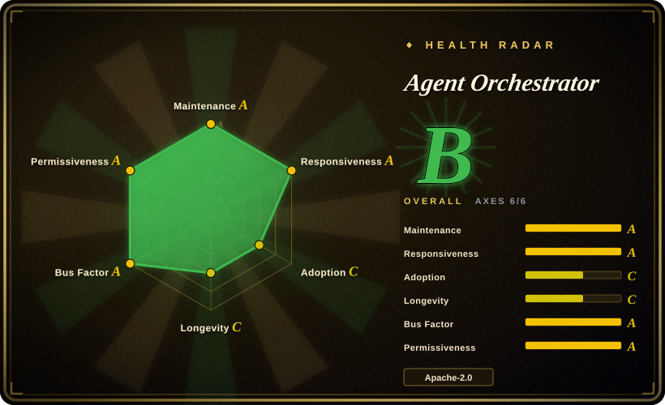
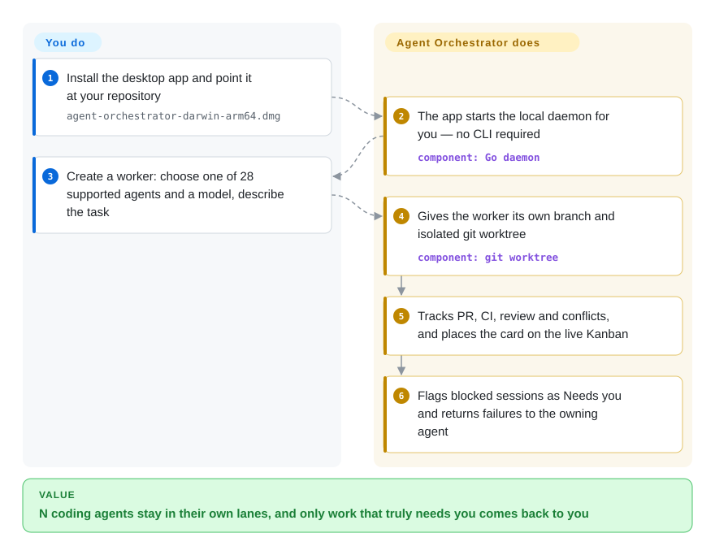

# Agent Orchestrator

You run several coding agents at once and you've become the message bus — copying CI failures and review comments back into the right terminal, holding four branches and worktrees apart in your head. Agent Orchestrator is a local desktop workspace that gives every task its own agent, branch and git worktree, follows PR/CI/review state for you, and routes whatever is blocked back to the worker that owns it.

## When to use

You're a senior engineer running several coding agents at once — Claude Code on a feature, Codex on a refactor, another on a bug — and you've outgrown the "many terminal tabs" stage. The agents collide on the same checkout, you lose track of which one is mid-task, and when CI fails or a reviewer comments on the PR, you're the one copy-pasting that signal back into the right agent's prompt. You want a control plane that keeps each agent in its own lane and closes those loops without you babysitting.

So you install Agent Orchestrator (AO) as a desktop app. Its local Go daemon gives every task — a "worker": one agent, one task, one isolated workspace — its own branch and git worktree, and hosts the session in tmux (macOS/Linux) or conpty (Windows), so parallel work never collides on one checkout. AO follows each worker's pull request, CI, review comments and merge conflicts and derives the card position on a live Kanban (Working / Needs you / In review / Ready to merge) from those facts; when work is blocked, the failure or review note goes back to the agent that owns the branch. Because it speaks to 28 coding-agent CLIs through adapters, you mix vendors instead of betting the workflow on one. Higher layers are optional: a project-orchestrator agent plans at repo level and spawns/redirects workers for you; each worker gets an isolated in-app browser; and a mobile app can watch the same sessions over an opt-in LAN listener. You reach for it when supervising N parallel agents on real branches — not running one agent in one repo.

## How it works

Agent Orchestrator separates supervision from execution. The desktop app starts a local Go daemon for you, and that daemon owns the state — worker sessions, branches, pull requests, CI results — in SQLite, broadcasting changes to the UI over a change-data-capture stream (CDC pushed via SSE, i.e. the database's diffs replayed to the screen live). Each agent session runs in a terminal (tmux on macOS/Linux, conpty on Windows) inside its own git worktree, so parallel tasks never share a checkout. Your side: add a repo, open a worker with **New task** (pick one of the 28 supported CLI agents and a model, in structured Chat or the agent's native terminal UI), then review and merge when the work is ready. Its side: per-task isolation, following PR/CI/review/merge-conflict facts, placing each card on the Kanban, and returning actionable failures to the agent that owns the branch — the copy-paste loop that used to be you. Optional layers: a project-orchestrator agent that plans repo-wide work and spawns workers, a per-worker isolated browser preview, and an opt-in LAN listener that lets a mobile app render the same sessions. AO never writes your code — agent quality and your merge decisions stay yours.

<!-- flow-steps:begin (generated from flows/agent-orchestrator.json by tools/flow_card.py — do not edit) -->

Text version of the flow

1. **You**: Install the desktop app and point it at your repository — `agent-orchestrator-darwin-arm64.dmg`
2. **Agent Orchestrator**: The app starts the local daemon for you — no CLI required — component: `Go daemon`
3. **You**: Create a worker: choose one of 28 supported agents and a model, describe the task
4. **Agent Orchestrator**: Gives the worker its own branch and isolated git worktree — component: `git worktree`
5. **Agent Orchestrator**: Tracks PR, CI, review and conflicts, and places the card on the live Kanban
6. **Agent Orchestrator**: Flags blocked sessions as Needs you and returns failures to the owning agent

**Value**: N coding agents stay in their own lanes, and only work that truly needs you comes back to you

<!-- flow-steps:end -->

## When NOT to use

- **Too young for a verdict.** Created 2026-02-13 — roughly 7.5 months old (as of 2026-09). Lindy gives it no credit yet; ~12.5k stars on a months-old repo are an attention signal, not a track record. Don't bet a critical workflow on its stability. [推断]
- **Pre-1.0 churn / nightly cadence.** It still ships nightly prereleases several times a day around a tagged stable (v0.13.1 on 2026-09-26) — APIs, schema and the desktop UI can shift release-to-release. Pin a version if you need stability.
- **Owned by one young vendor.** The repo moved from a personal account (`AgentWrapper`) to the `Untrivial-ai` GitHub **Organization** — institutional-shaped now, but with no public track record, funding model, or governance doc; roadmap and continuity still rest on one small team. [推断]
- **You want a headless / CI-first tool.** This is a GUI desktop workspace whose daemon the app starts for you — built to sit on a developer's machine, not to run unattended in a pipeline or on a server. There is a CLI mapped to daemon routes (docs/cli) and a thin mobile renderer, but no documented headless/server deployment story. If you want a scriptable, pipeline-first orchestrator, this isn't it.
- **The daemon's security posture is a dealbreaker.** The primary listener binds `127.0.0.1:3001` **with no authentication** — any local process can drive it; do not run it on a shared/multi-user host. The mobile pairing feature adds an opt-in LAN listener (`0.0.0.0:3011`) with bearer-password auth but **deliberately plaintext HTTP on the local network**, per docs/architecture.md and its ADR — read that threat model before enabling it outside a trusted network.
- **Worktree-hostile repos.** Parallel isolation leans on git worktrees; repos with heavy submodules, large generated artifacts, or per-checkout env that doesn't survive a worktree will fight the model. (Non-Git "branchless" workspaces exist, but they give up the PR/CI feedback loop that is the point.)
- **Telemetry-sensitive environments.** Remote telemetry is **enabled by default in production desktop and mobile releases** (docs/telemetry.md): events include the GitHub owner segment of a project's remote and your GitHub username on session start, plus PostHog IP-derived coarse geography. There is a global off-switch, but the handle has no separate control — check your policy before deploying.
- **You only run one agent.** A single agent in a single repo gets nothing from a parallel-supervision control plane; the daemon + desktop app is pure overhead at N=1.

## Comparison

| Alternative | In index | Our verdict | Tradeoff |
|---|---|---|---|
| [CCPM](../work-state/ccpm.md) | ✅ | Choose CCPM when you need a spec-driven PRD → GitHub Issues → parallel-worktree workflow inside your existing harness. | Spec-driven: PRD → GitHub Issues → parallel git-worktree agents, driven from your existing harness as a skill-pack. CCPM is process + GitHub-native with no GUI; Agent Orchestrator is a desktop app + daemon that supervises live agents and auto-routes CI/review/conflict feedback. Different layers — you could plan with CCPM and run with this. |
| [OpenSandbox](../../sandboxing/opensandbox.md) | ✅ | Choose OpenSandbox when you need the sandbox runtime for safely executing untrusted agent code at K8s scale. | A sandbox *runtime* for safely executing untrusted agent code at K8s scale (isolation, egress, vault). Orthogonal: OpenSandbox isolates *execution*; Agent Orchestrator orchestrates *agents* across worktrees. You might run agents under a sandbox and supervise them here. |
| [Planning with Files](../work-state/planning-with-files.md) | ✅ | Choose Planning with Files when a lightweight markdown planning convention is enough. | Lightweight file-based planning pattern (plans live as markdown the agent reads/writes); no parallel supervision, no GUI, no feedback-loop routing. The minimal baseline this replaces for state-keeping. |
| Conductor / Crystal / Claude Squad | 未收录 | Choose Conductor, Crystal, or Claude Squad when you need other worktree-parallel Claude Code tools. | Other "run parallel Claude Code agents in git worktrees" tools (desktop or TUI). Directly comparable on the core idea; differ in agent breadth (Agent Orchestrator lists 28 adapters), feedback-loop automation, and maturity — shortlist and compare if you've narrowed to this niche. |
| Vibe Kanban | 未收录 | Choose Vibe Kanban when you want a lighter board-first runner over several coding agents without AO's daemon-and-state layer. | Both supervise many agents through a board view; AO adds a local daemon that derives Kanban status from real PR/CI/review facts, a repo-level planning orchestrator, and 28 adapters — depth you trade for a heavier always-on workspace. Vibe Kanban's current feature state was not re-verified this pass. |
| Plain tmux + `git worktree` scripts | 未收录 | Choose plain tmux plus git worktree scripts when zero dependencies and full scriptability matter most. | Zero-dependency and fully scriptable, but you hand-roll the worktree lifecycle, agent adapters, live state UI, and CI/review/conflict routing — exactly the glue Agent Orchestrator packages. |

## Tech stack

- **Backend:** a long-running Go HTTP daemon that the desktop app starts for you; two listeners — loopback `127.0.0.1:3001` (unauthenticated, primary control surface) and an opt-in LAN listener `0.0.0.0:3011` (bearer-password auth, plaintext HTTP) for mobile clients — per docs/architecture.md.
- **Frontend:** an Electron + React desktop app (TanStack Router/Query, shadcn/ui per the earlier README; frontend stack not re-inspected in source this pass), plus a mobile app that renders the same sessions.
- **Terminal runtimes:** tmux on Darwin/Linux, conpty on Windows, hosting each agent's session inside its own git worktree; branchless AO-managed directories for non-Git work.
- **Storage / streaming:** SQLite with change-data-capture (CDC) broadcast to the UI over SSE; Kanban columns (Working / Needs you / In review / Ready to merge) are derived from session, PR, CI and review facts.
- **Agent surface:** adapters for **28 CLI coding agents** (Claude Code, Codex, Cursor, opencode, Aider, GitHub Copilot, Grok, Kimi, Pi, Amp, Auggie, Droid, Crush, Cline, Goose, Qwen, Continue, Devin, Kiro, Kilo Code, Vibe, Muse, Agy, Autohand, Kimchi, Prime Agent, OMP, Unreal Agent); docs (MDX) and a browser preview per worker round out the surface.

## Dependencies

- **The desktop app + daemon themselves** — installed from packaged builds (macOS DMG for Apple silicon/Intel, Windows `Setup.exe`, Linux AppImage/deb/rpm) with automatic update checks; the Go daemon is started by the app, no CLI required.
- **Build-from-source toolchain:** Go 1.27.1+, Node.js 20.19.0+, npm 10 (docs/development.md); optional Nix dev shell.
- **git** (worktree creation and agent integration) plus **tmux** on Darwin/Linux (conpty is built in on Windows) to back the terminal sessions.
- **The coding agents you orchestrate** — you supply and authenticate each CLI agent (Claude Code, Codex, etc.) yourself; AO drives them, it doesn't bundle them.
- **A GitHub account/token signed into AO's integration** for the PR/CI/review feedback loop (the README's dev docs no longer list the `gh` CLI as a prerequisite).

## Ops difficulty

**Low-to-medium for an individual; not built for fleet ops.** As a desktop app it installs from a packaged binary with auto-updates and the daemon starts for you — that path is easy. The complexity is operational rather than deploy-time: you're running a local daemon that spawns multiple agent processes across git worktrees, so disk and process pressure scale with parallelism, and a worktree-hostile repo (submodules, generated artifacts) makes setup fiddly. The loopback-no-auth daemon is fine on a trusted single-user machine but is **not** something to run on a shared/multi-user host; pairing the mobile app opts into a plaintext-HTTP LAN listener, so read the ADR before doing that on an untrusted network. There is no documented multi-user/server deployment story — this is a personal control plane, not infrastructure you operate for a team. [推断]

## Health & viability

- **Responsiveness**: Grade A — median first-response time 16.9 hours across 23 qualifying issues/PRs.
- **Maintenance (2026-09).** Pushed on 2026-09-28 with nightly prereleases running ~2/day; stable v0.13.1 tagged 2026-09-26 — **very active** development, ~3 months after the previous check. Not archived. The flip side: ~656 open issues and ~1.7k forks signal a fast-moving, still-stabilizing project. [推断]
- **Governance / bus factor.** The repo now belongs to the **`Untrivial-ai` Organization** (it sat under the personal account `AgentWrapper` as of the 2026-06 check — the old URL redirects). That is institutional-shaped ownership, but the org's size, funding and governance remain undocumented here; contribution and roadmap still concentrate in a small core group with a Discord community. Real bus-factor risk remains, now more "young startup" than "solo maintainer". [推断]
- **Age × Lindy (2026-09).** Created 2026-02-13 — about 7.5 months old. This is still a **very young project**; Lindy gives it no credit. Treat API/schema/UI stability as unproven and the longevity unknown.
- **Adoption & ecosystem.** ~12.5k stars and ~1.7k forks in ~7.5 months (GitHub API, 2026-09), plus six-figure release downloads — growth is real at the numbers level, but for a repo this young it remains attention, not a track record. The 28-agent adapter surface is the strongest ecosystem signal. [推断]
- **Risk flags.** Youth + pre-1.0 churn (nightly cadence), one young vendor org behind it, the loopback-no-auth daemon plus plaintext-HTTP LAN listener, desktop-only (not headless), and **remote telemetry on by default** in production releases (with a global off-switch). Apache-2.0 with no relicense history found.

## Caveats (unverified)

- [未验证] ~12.5k stars, ~1.7k forks, ~656 open issues, latest stable v0.13.1, last push 2026-09-28 — all point-in-time from the GitHub API on 2026-09-28; with a nightly cadence these are stale the day you read them.
- [推断] "~7.5 months of age + rapid star growth = attention, not track record" is the deliberate Lindy discount per the repo rules; it is **not** an assertion the numbers are manipulated.
- [未验证] The two-listener daemon model (loopback `:3001` no auth; opt-in LAN `:3011` bearer-password plaintext HTTP), telemetry contents (repo-owner segment, GitHub handle on session start, PostHog coarse geography), and the mobile renderer are taken from docs/architecture.md, docs/telemetry.md and the README — not inspected in application source.
- [推断] Classified as `type: app` (over `tool`) because the primary artifact is a packaged Electron **desktop application** backed by a local daemon, not a headless CLI/library — the GUI is the product surface.
- [未验证] The automatic feedback-loop routing (CI failures, PR review comments, merge conflicts back to the owning agent) and the Kanban status derivation are the project's headline claims; actual reliability across the 28 agents was not verified, and LLM/agent behavior is never guaranteed.
- [推断] "Untrivial-ai is a young vendor org" is inferred from the org name, the redirect from a personal account, and the docs' company-style voice; no funding, headcount or governance document was confirmed.
- [未验证] Comparisons to Conductor / Crystal / Claude Squad / Vibe Kanban reflect general positioning in the same niche, not a measured feature-by-feature benchmark; Vibe Kanban's current feature set was not re-read this pass.
- [未验证] The frontend stack claim (Electron + React, TanStack Router/Query, shadcn/ui) carried over from the previous check; the current README no longer states it and it was not re-inspected in source.
