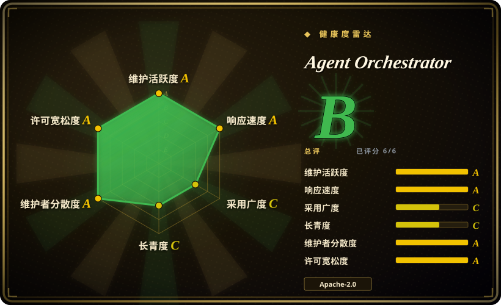
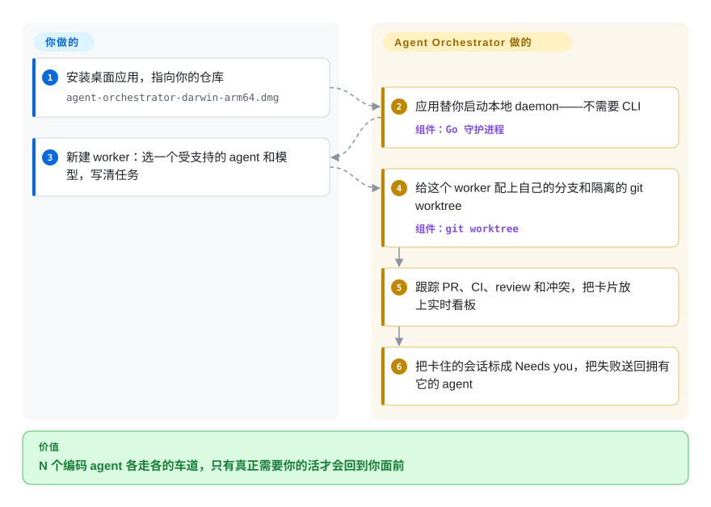

# Agent Orchestrator

你同时跑好几个编码 agent，自己成了消息总线——把 CI 失败和 review 评论复制粘贴回对应的终端，全凭脑子把几条分支和 worktree 互相隔开。Agent Orchestrator 是一个本地桌面工作台：给每个任务配上自己的 agent、分支和 git worktree，替你盯着 PR/CI/review 状态，再把卡住的活路由回拥有它的 worker。

## 何时使用

你是一名资深工程师，同时跑着好几个编码 agent——Claude Code 做一个功能、Codex 做重构、另一个修 bug——已经过了“开一堆终端标签页”的阶段。这些 agent 在同一个工作树上彼此踩脚，你弄不清哪个正干到一半；而当 CI 失败、reviewer 在 PR 上留了评论时，又是你手动把失败信息复制粘贴回对应 agent 的 prompt。你想要一个控制面，让每个 agent 各走各的车道，并替你把这些环路闭合，不用你盯着喂。

于是你把 Agent Orchestrator（AO）装成桌面应用。它的本地 Go daemon 给每个任务——一个“worker”：一个 agent、一个任务、一个隔离工作区——配上自己的分支和 git worktree，会话跑在 tmux（macOS/Linux）或 conpty（Windows）里，并行工作永远不在同一份 checkout 上撞车。AO 跟踪每个 worker 的 PR、CI、review 评论和合并冲突，用这些事实决定卡片在实时看板上的位置（Working / Needs you / In review / Ready to merge）；活一卡住，失败信息或评论就被送回拥有该分支的 agent。因为它通过适配器对接 28 种 CLI 编码 agent，你可以混用多家厂商，而不用把整套工作流押在一家身上。更高层可选：项目级 orchestrator agent 在仓库层面规划并替你派发 worker；每个 worker 自带隔离的应用内浏览器；手机端 app 可经一个 opt-in 的局域网监听查看同样的会话。当你要监管 N 个跑在真实分支上的并行 agent 时——而非在单仓库里跑单个 agent——才轮到它。

## 怎么用起来

Agent Orchestrator 把监管和执行分开。桌面应用替你启动一个本地 Go daemon，状态由 daemon 管——worker 会话、分支、PR、CI 结果——存在 SQLite 里，再通过变更数据捕获（CDC）经 SSE 把数据库的增量实时推给界面。每个 agent 会话跑在自己的 git worktree 里的终端（macOS/Linux 用 tmux，Windows 用 conpty），并行任务不共享一份 checkout。归你的部分：添加仓库，用 **New task** 开一个 worker（从 28 个受支持的 CLI agent 里挑一个、选模型，走结构化 Chat 或 agent 原生的终端界面），活儿好了再 review、合并。归它的部分：按任务隔离、跟住 PR/CI/review/冲突事实、把每张卡片放到看板该在的位置、把可执行的失败送回拥有该分支的 agent——那个原本靠你复制粘贴的反馈环。可选层：项目级 orchestrator agent 负责全仓库规划并派生 worker，每个 worker 带隔离的浏览器预览，手机端经 opt-in 局域网监听渲染同样的会话。AO 从不写你的代码——agent 的质量和合并的决定权始终在你手里。

<!-- flow-steps:begin (generated from flows/agent-orchestrator.json by tools/flow_card.py — do not edit) -->

流程文字版

1. **你**：安装桌面应用，指向你的仓库 — `agent-orchestrator-darwin-arm64.dmg`
2. **Agent Orchestrator**：应用替你启动本地 daemon——不需要 CLI — 组件：`Go 守护进程`
3. **你**：新建 worker：选一个受支持的 agent 和模型，写清任务
4. **Agent Orchestrator**：给这个 worker 配上自己的分支和隔离的 git worktree — 组件：`git worktree`
5. **Agent Orchestrator**：跟踪 PR、CI、review 和冲突，把卡片放上实时看板
6. **Agent Orchestrator**：把卡住的会话标成 Needs you，把失败送回拥有它的 agent

**价值**：N 个编码 agent 各走各的车道，只有真正需要你的活才会回到你面前

<!-- flow-steps:end -->

## 何时不用

- **太年轻，下不了定论。** 2026-02-13 创建——约 7.5 个月大（截至 2026-09）。Lindy 还不给它加分；几个月大的仓库约 12.5k star 是注意力信号，不是履历。别把关键工作流押在它的稳定性上。[推断]
- **pre-1.0 变动 / nightly 节奏。** 它仍以每天约两个 nightly 预发布版推进，稳定版 v0.13.1 才在 2026-09-26 打 tag——API、schema 和桌面 UI 都可能随版本变动。需要稳定就钉死版本。
- **背后是一家年轻的厂商。** 仓库从个人账户（`AgentWrapper`）迁到了 **`Untrivial-ai` Organization**（旧地址重定向）——形态上机构化了，但这个组织的规模、资金和治理查不到公开记录；路线图与延续性仍系于一个小团队。bus-factor 风险还在，只是从「孤身维护者」变成了「初创公司」。[推断]
- **你想要无头 / CI 优先的工具。** 这是一个 GUI 桌面工作台，daemon 由应用替你拉起——它是为坐在开发者机器上而造，不是为在流水线或服务器上无人值守运行。它有映射到 daemon 路由的 CLI（docs/cli）和一个轻的移动端渲染层，但没有无头/服务器部署方案。要可脚本化、流水线优先的 orchestrator，这个不合适。
- **daemon 的安全姿态是硬伤。** 主监听器绑在 `127.0.0.1:3001` 且**没有鉴权**——任何本地进程都能驱动它；别在共享/多用户主机上跑。手机配对功能会加一个 opt-in 的局域网监听器（`0.0.0.0:3011`），带 bearer-password 鉴权但**刻意走明文 HTTP**（见 docs/architecture.md 及其 ADR）——不在可信网络上先别开。
- **对 worktree 不友好的仓库。** 并行隔离依赖 git worktree；带重 submodule、大量生成产物、或 checkout 级环境无法在 worktree 中存续的仓库，会与该模型相抵。（非 Git 的「branchless」工作区是有的，但那等于放弃了作为卖点的 PR/CI 反馈环。）
- **对遥测敏感的环境。** 生产的桌面版和移动端**默认开启远程遥测**（docs/telemetry.md）：事件包含项目 remote 的 GitHub 属主段、会话开始时你的 GitHub 用户名，以及 PostHog 按 IP 推的粗粒度地域。有一个总开关可以全关，但用户名没有单独的控制——部署前先过你的合规策略。
- **你只跑一个 agent。** 单仓库里的单个 agent 从并行监管控制面里得不到任何东西；在 N=1 时，daemon 加桌面应用纯属额外开销。

## 横向对比

| 替代品 | 是否收录 | 我们的评价 | 取舍 |
|---|---|---|---|
| [CCPM](../work-state/ccpm.zh.md) | ✅ | 需要现有 harness 内的 PRD→GitHub Issues→并行 worktree 流程时，选 CCPM。 | 规格驱动：PRD → GitHub Issues → git worktree 并行 agent，作为 skill-pack 从你现有 harness 里驱动。CCPM 是流程 + GitHub 原生、无 GUI；Agent Orchestrator 是桌面应用 + daemon，监管活的 agent 并自动路由 CI/review/冲突反馈。处于不同层——你大可用 CCPM 规划、用它来跑。 |
| [OpenSandbox](../../sandboxing/opensandbox.zh.md) | ✅ | 需要在 K8s 规模安全执行不可信 agent 代码的沙箱运行时时，选 OpenSandbox。 | 一个沙箱*运行时*，用于在 K8s 规模上安全执行不可信的 agent 代码（隔离、出口、保险库）。正交：OpenSandbox 隔离的是*执行*；Agent Orchestrator 编排的是跨 worktree 的*agent*。你可以把 agent 跑在沙箱下、再在这里监管它们。 |
| [Planning with Files](../work-state/planning-with-files.zh.md) | ✅ | 轻量 markdown 规划约定已经够用时，选 Planning with Files。 | 轻量的基于文件的规划范式（计划以 agent 读写的 markdown 形式存在）；没有并行监管、没有 GUI、没有反馈环路由。它是这套东西在状态保持上所替代的最小基线。 |
| Conductor / Crystal / Claude Squad | 未收录 | 需要其他 worktree 并行 Claude Code 工具时，选 Conductor、Crystal 或 Claude Squad。 | 其他“在 git worktree 里并行跑 Claude Code agent”的工具（桌面或 TUI）。在核心思路上可直接对比；差异在 agent 广度（Agent Orchestrator 列了 28 个适配器）、反馈环自动化和成熟度——若你已收窄到这个细分，列入候选直接比。 |
| Vibe Kanban | 未收录 | 想要更轻的看板式多 agent 运行器、不想要 AO 的 daemon/状态层时，选 Vibe Kanban。 | 两者都用看板监管多个 agent；AO 多了从真实 PR/CI/review 事实推导看板状态的本地 daemon、仓库级规划 orchestrator 和 28 个适配器——用更重的常驻工作台换更深的集成。Vibe Kanban 当前功能状态本次未重读。 |
| 纯 tmux + `git worktree` 脚本 | 未收录 | 零依赖和完全可脚本化最重要时，选纯 tmux 加 git worktree 脚本。 | 零依赖、完全可脚本化，但 worktree 生命周期、agent 适配器、实时状态 UI、CI/review/冲突路由都得你自己手搓——这正是 Agent Orchestrator 打包好的胶水。 |

## 技术栈

- **后端：** 常驻的 Go HTTP daemon，由桌面应用替你启动；两个监听器——loopback `127.0.0.1:3001`（无鉴权，主控制面）与供手机使用的 opt-in 局域网监听器 `0.0.0.0:3011`（bearer-password 鉴权、明文 HTTP）——见 docs/architecture.md。
- **前端：** Electron + React 桌面应用（TanStack Router/Query、shadcn/ui，沿用上次阅读，本轮未再核源码），外加渲染同一批会话的移动端 app。
- **终端运行时：** Darwin/Linux 用 tmux、Windows 用 conpty，每个 agent 会话承载在自己的 git worktree 里；非 Git 工作走 AO 管理的 branchless 目录。
- **存储 / 流式：** 带变更数据捕获（CDC）的 SQLite，经 SSE 广播给 UI；看板列（Working / Needs you / In review / Ready to merge）由会话、PR、CI 与 review 事实推导。
- **agent 接口面：** **28** 种 CLI 编码 agent 的适配器（Claude Code、Codex、Cursor、opencode、Aider、GitHub Copilot、Grok、Kimi、Pi、Amp、Auggie、Droid、Crush、Cline、Goose、Qwen、Continue、Devin、Kiro、Kilo Code、Vibe、Muse、Agy、Autohand、Kimchi、Prime Agent、OMP、Unreal Agent）；每个 worker 还带隔离的应用内浏览器。

## 依赖

- **桌面应用 + daemon 本身**——以打包件安装（macOS Apple silicon/Intel DMG、Windows `Setup.exe`、Linux AppImage/deb/rpm），自动检查更新；Go daemon 由应用代启，不需要 CLI。
- **从源码构建的工具链：** Go 1.27.1+、Node.js 20.19.0+、npm 10（docs/development.md）；可选 Nix 开发壳。
- **git**（建 worktree 与 agent 集成）加上 **tmux**（Darwin/Linux；Windows 内置 conpty）来支撑终端会话。
- **你要编排的那些编码 agent**——每个 CLI agent（Claude Code、Codex 等）由你自己提供并鉴权；AO 驱动它们，不打包它们。
- **登录了 AO GitHub 集成的 GitHub 账号/token**，用于 PR/CI/review 反馈环（dev 文档已不再把 `gh` CLI 列为前置）。

## 运维难度

**对个人是低到中；不是为机群运维而造。** 作为桌面应用，它从打包好的二进制安装、自动更新、daemon 由应用代启——这条路很轻松。复杂度在于运行期而非部署期：你跑着一个本地 daemon，它跨 git worktree 生成多个 agent 进程，磁盘与进程压力随并行度上升，对 worktree 不友好的仓库（submodule、生成产物）会让设置变得别扭。loopback 无鉴权的 daemon 在可信单用户机器上没问题，但**不**适合在共享/多用户主机上跑；手机配对会开启一个明文 HTTP 的局域网监听，不在可信网络先读那份 ADR。没有文档化的多用户/服务器部署方案——这是个人控制面，不是你为团队运维的基础设施。[推断]

## 健康度与可持续性

- **响应速度**：Grade A——中位首次响应时间 16.9 小时，基于 23 个 qualifying issues/PRs。
- **维护（2026-09）。** 2026-09-28 仍在推送，nightly 预发布约每天两个；稳定版 v0.13.1 于 2026-09-26 打 tag——**非常活跃**，距上次核查已过约 3 个月。未归档。另一面：约 656 个未关 issue、约 1.7k fork，说明是个快速演进、仍在稳定中的项目。[推断]
- **治理 / bus factor。** 仓库现属 **`Untrivial-ai` Organization**（2026-06 核查时还挂在个人账户 `AgentWrapper` 下，旧 URL 重定向）。机构形态有了，但该组织的规模、资金与治理查不到公开记录；贡献与路线图仍集中在小核心圈，社区靠 Discord。bus-factor 风险仍在，只是从「孤身维护者」变成「年轻初创」。[推断]
- **年龄 × Lindy（2026-09）。** 2026-02-13 创建——约 7.5 个月大。仍是**非常年轻的项目**；Lindy 不给它加分。把 API/schema/UI 稳定性当成未经验证，寿命未知。
- **采用度与生态。** 约 7.5 个月里 ~12.5k star、~1.7k fork（GitHub API，2026-09），release 下载量六位数——数字层面的增长是真的，但对一个这么新的仓库而言仍是注意力，不是履历。28 个 agent 适配器是最强的生态信号。[推断]
- **风险标记。** 年轻 + pre-1.0 变动（nightly 节奏）、背后一家年轻厂商、loopback 无鉴权 daemon 加明文 HTTP 局域网监听、仅桌面（非无头）、以及生产版**默认开启**的远程遥测（有总开关）。Apache-2.0，未发现 relicense 历史。

## 存疑（未验证）

- [未验证] 约 12.5k star、约 1.7k fork、约 656 个未关 issue、最新稳定版 v0.13.1、最后推送 2026-09-28——均为 2026-09-28 从 GitHub API 取的时间点数据；在 nightly 节奏下，这些数字你读到即过期。
- [推断] 「约 7.5 个月大 + star 快速增长 = 注意力而非履历」是按索引规则刻意给的 Lindy 折扣，**不是**断言数字被灌水。
- [未验证] 双监听器模型（loopback `:3001` 无鉴权；opt-in 局域网 `:3011` bearer-password 明文 HTTP）、遥测内容（仓库属主段、会话开始时的 GitHub 用户名、PostHog 粗粒度地域）以及移动端渲染层，取自 docs/architecture.md、docs/telemetry.md 与 README，未在应用源码中独立核实。
- [推断] 归类为 `type: app`（而非 `tool`），因为主要交付物是一个打包的 Electron **桌面应用**加本地 daemon，而非无头 CLI/库——GUI 才是产品面。
- [未验证] 自动反馈环路由（把 CI 失败、PR review 评论、合并冲突送回拥有该分支的 agent）与看板状态推导是项目的招牌声称；其在 28 种 agent 上的实际可靠性未经验证，且 LLM/agent 行为从不被保证。
- [推断] 「Untrivial-ai 是一家年轻厂商」是从组织名、从个人账户迁移重定向、以及文档的公司口吻推断的；未确认其融资、人数或治理文件。
- [未验证] 与 Conductor / Crystal / Claude Squad / Vibe Kanban 的对比反映同细分内的总体定位，而非逐项实测基准；Vibe Kanban 的当前功能本轮没有重读。
- [未验证] 前端栈声称（Electron + React、TanStack Router/Query、shadcn/ui）沿用上次核查；当前 README 已不再写明，本轮也未在源码复核。
