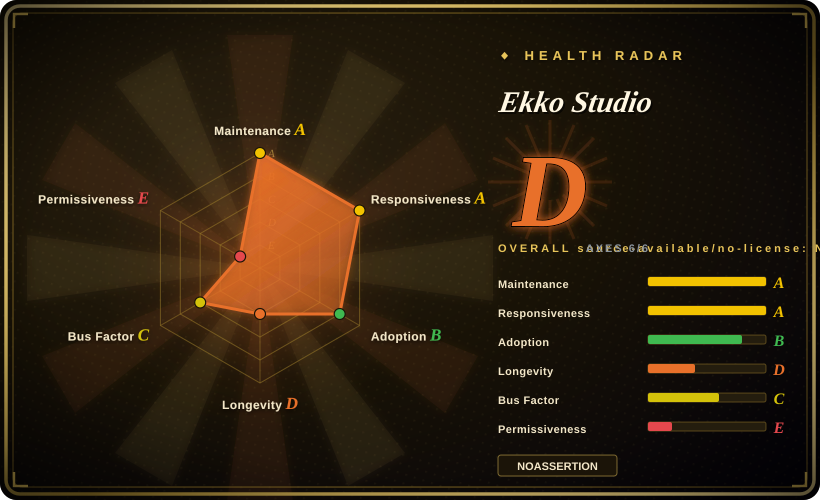
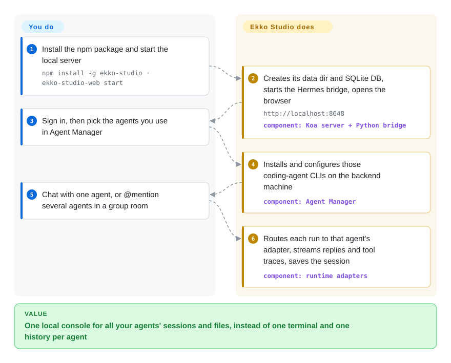

# Ekko Studio

Running Hermes Agent, Claude Code, Codex and one or two more agents means one terminal tab and one separate history per agent, and nothing that lets them work on the same task. Ekko Studio is a local server (plus desktop app) that installs and launches all of them behind one UI for chats, multi-agent group rooms and drag-and-drop workflows. It is source-available for non-commercial use only.

## When to use

You run Nous's Hermes Agent on your own machine and also keep Claude Code, Codex or OpenCode installed. Each has its own terminal session and its own history, and when you want Codex to write something and Claude Code to review it, you copy-paste between two windows. You reach for Ekko Studio because it runs all of them behind one local server. You open `http://localhost:8648`, pick the agent per chat, @mention several agents in one group room, or wire them into a canvas workflow with an approval gate. Sessions, uploads and generated files (HTML, PDF, PPTX previews) stay in one local SQLite-backed history. For Hermes specifically, it also manages the profiles, providers, skills, memory, cron jobs and the Telegram/Feishu/WeChat channel config that otherwise live in `~/.hermes` files.

The deciding tradeoff against its closest peers is **breadth vs licence**. [Hermes Workspace](hermes-workspace.md) and `nesquena/hermes-webui` are MIT consoles for Hermes alone. [CloudCLI](claudecodeui.md) is an AGPL cockpit for the Claude Code/Codex/Cursor family. Ekko Studio is the one that puts both families, group chat and visual workflows in one install, and the price is a Business Source License that forbids commercial use until 2029-05-10. Pick it for a personal, research or teaching setup where "one console for every agent I run" beats licence freedom.

## How it works

Ekko Studio is a Koa web server with a Vue front end, and it can be installed three ways: as an npm CLI, a Docker image built on the official `nousresearch/hermes-agent` image, or an Electron desktop app that bundles its own Python and Hermes runtime. It does not reimplement the agents. It *drives* them: for Hermes it starts a Python "bridge" process, a small helper that holds the agent in memory and takes run requests over a local socket; for Claude Code, Codex, Pi, Grok, OpenCode and DeepSeek Harness it installs the vendor CLI and runs it as a child process through a per-agent adapter. Its own in-house Ekko Agent runs inside the server. What Studio owns is everything *between* the agents: the chat and group-room UI, the workflow canvas (agent steps connected by edges, conditions, loops, and human approval gates), sessions in a local SQLite file, a file browser, a web terminal, voice, and an MCP server that lets agents drive a desktop browser tab. What you own is the agents' credentials and choosing which agent handles which step. Think of it as a switchboard, not a new phone: every call still goes through the agent you already trust, but you dial them all from one desk.

<!-- flow-steps:begin (generated from flows/ekko-studio.json by tools/flow_card.py — do not edit) -->

Text version of the flow

1. **You**: Install the npm package and start the local server — `npm install -g ekko-studio · ekko-studio-web start`
2. **Ekko Studio**: Creates its data dir and SQLite DB, starts the Hermes bridge, opens the browser — `http://localhost:8648` — component: `Koa server + Python bridge`
3. **You**: Sign in, then pick the agents you use in Agent Manager
4. **Ekko Studio**: Installs and configures those coding-agent CLIs on the backend machine — component: `Agent Manager`
5. **You**: Chat with one agent, or @mention several agents in a group room
6. **Ekko Studio**: Routes each run to that agent's adapter, streams replies and tool traces, saves the session — component: `runtime adapters`

**Value**: One local console for all your agents' sessions and files, instead of one terminal and one history per agent

<!-- flow-steps:end -->

## When NOT to use

- **Any commercial use.** The LICENSE is BSL 1.1 with an Additional Use Grant for *non-commercial* use only; selling it, hosting it as SaaS or embedding it in a commercial product needs a separate licence from EKKOLearnAI until the Change Date (2029-05-10, then Apache-2.0). Whether day-to-day internal use at a company counts as "commercial advantage" is not spelled out [推断]. For a work setup use [Hermes Workspace](hermes-workspace.md) (MIT) for Hermes, [CloudCLI](claudecodeui.md) (AGPL) for Claude Code/Codex, or `iOfficeAI/AionUi` (Apache-2.0, not indexed) for a multi-agent desktop app.
- **You were counting on the licence it started with.** The repo shipped under MIT (LICENSE added 2026-04-18) and switched to BSL-1.1 on 2026-05-10 (commit #605), one month after creation. Code from before that commit stays MIT, but updates do not. If licence stability decides your pick, choose a project without a relicense on record, such as [Open WebUI](../../llm-chat-ui/open-webui.md) for chat or [Hermes Workspace](hermes-workspace.md) for Hermes.
- **You only want to chat with models.** If agent sessions, terminals and workflows are not the point, [Open WebUI](../../llm-chat-ui/open-webui.md) or [LibreChat](../../llm-chat-ui/librechat.md) are more mature multi-user chat platforms with RAG. Ekko Studio's model list is discovered through Hermes profiles, so it is agent-first by design.
- **You run exactly one agent and want a thin cockpit.** For Claude Code/Codex/Cursor alone, [CloudCLI](claudecodeui.md) is smaller. For pi alone, [Pi Web](pi-web.md) reads pi's own session files. Ekko Studio's surface (channels, Kanban, voice, devices, ESP32 firmware, App relay) is overhead when you need none of it.
- **You need each agent isolated on its own branch with CI feedback.** Ekko Studio shares one workspace and one file browser across agents. [Agent Orchestrator](agent-orchestrator.md) gives each coding agent a git worktree and routes CI/review/conflict feedback back to it.
- **Do not expose it to a network casually.** The server binds `0.0.0.0` by default (`BIND_HOST`), the bootstrap login is `admin` / `123456` (the UI asks you to change it after login), and one authenticated session reaches a PTY terminal, a file browser with edit/delete, and agent installs. Keep it on loopback or behind a VPN, change the default login first, and set `AUTH_TOKEN`/`CORS_ORIGINS` deliberately.
- **You need slow, predictable upgrades.** It shipped 138 tags in ~5.5 months (npm v0.7.x every few days, plus separate Android v1.0.x and bundled Hermes-runtime tags), and it tracks upstream Hermes closely: issue #3213 (2026-09-28) reports breakage after upgrading Hermes Agent to v0.21.5. Pin the npm version and the Hermes version together, or pick a thinner UI whose blast radius is smaller.
- **Your server runs Node 22 LTS.** `package.json` requires `node >=23.0.0`, and the server's database layer imports the built-in `node:sqlite` module. On a pinned-LTS fleet use the Docker image or the desktop app, which bring their own runtime.

## Comparison

| Alternative | In index | Our verdict | Tradeoff |
|---|---|---|---|
| [Hermes Workspace](hermes-workspace.md) | ✅ | If Hermes is the only agent you run, or the setup is for work, pick Hermes Workspace. Pick Ekko Studio when Claude Code/Codex/OpenCode must share the same console, group rooms and workflows, and non-commercial use is fine. | Hermes Workspace: MIT, zero-fork front end over Hermes's own gateway/dashboard APIs, tmux Swarm workers. Ekko Studio: many runtimes, workflow canvas and desktop app, but BSL and a Python bridge it launches itself. |
| [CloudCLI (Claude Code UI)](claudecodeui.md) | ✅ | Pick CloudCLI for a browser/mobile cockpit over Claude Code, Codex or Cursor CLI sessions. Pick Ekko Studio when Hermes and multi-agent group chat or workflows are part of the job. | CloudCLI: AGPL-3.0-or-later (commercial use allowed under copyleft terms), focused on reading and resuming each CLI's own sessions. Ekko Studio: broader runtime set and orchestration, non-commercial licence. |
| `iOfficeAI/AionUi` | not indexed | Pick AionUi when you want a multi-agent desktop "cowork" app over Claude Code, Codex, OpenCode, Hermes and more under a permissive licence. Pick Ekko Studio when you need its Hermes control plane (profiles, channels, jobs) and the workflow canvas. | Apache-2.0, ~33.2k stars, last push 2026-09-09 (GitHub API, 2026-09-28); feature parity with Ekko Studio not checked. Not added in this tab-intake batch. |
| `nesquena/hermes-webui` | not indexed | Pick hermes-webui for a lighter MIT web/phone UI over Hermes Agent alone. Pick Ekko Studio when you also want coding agents, group rooms and workflows in the same place. | MIT, ~18.6k stars, pushed 2026-09-28 (GitHub API). A single-runtime UI keeps the surface small; Ekko Studio's size is the cost of its breadth. Not added in this tab-intake batch. |
| [Open WebUI](../../llm-chat-ui/open-webui.md) | ✅ | Pick Open WebUI when the job is chatting with models, including RAG, local models and many users. Pick Ekko Studio when the job is running and coordinating *agents* with terminals and files. | Open WebUI: years old, very wide adoption, model-chat platform with no agent-session or workflow-canvas surface. Ekko Studio: agent workspace, younger, BSL. |

## Tech stack

- **Front end:** Vue 3 + TypeScript + Vite, Naive UI, Pinia, Vue Router, vue-i18n, SCSS, markdown-it + highlight.js + KaTeX; Vue Flow for the workflow canvas; xterm for the web terminal (README "Tech Stack" + `package.json`).
- **Server:** Koa 2 + Socket.IO (chat runs on the `/chat-run` namespace), node-pty for terminals, SQLite through Node's built-in `node:sqlite` (`packages/server/.../database/index.ts`), the MCP client SDK, `agent-browser` for the desktop browser tools, `sherpa-onnx-node` and `node-edge-tts` for voice.
- **Monorepo packages:** `client`, `server`, `ekko-agent` (the in-house agent runtime, TypeScript), `desktop` (Electron shell + updater + bundled Python/Hermes runtime), `skills`, and `esp32-c3` (PlatformIO firmware for a small hardware device).
- **Agent side:** a Python bridge process that loads Hermes Agent (`run_agent.py` source checkout or a `pip install hermes-agent` environment); vendor CLIs for the coding agents, installed through Agent Manager.
- **Distribution:** npm packages `ekko-studio` and the legacy `hermes-web-ui` (same releases), Docker image `ekkoye8888/hermes-web-ui` built `FROM nousresearch/hermes-agent`, and desktop installers for Windows/macOS/Linux on GitHub Releases.

## Dependencies

- **Node.js ≥ 23** for the npm install (`engines` in `package.json`); the desktop app and Docker image bring their own runtime.
- **Hermes Agent + Python** for the Hermes features: Studio looks for a source checkout (`~/.hermes/hermes-agent`), then the Python behind the `hermes` command, then system Python. `uv` is used when present.
- **Each coding agent's CLI and credentials** (Claude Code, Codex, OpenCode…), installed on the machine that runs the Studio backend; DeepSeek Harness plugin installs also need `pnpm` on `PATH`.
- **Model provider keys or OAuth logins**, managed through Hermes profiles (`~/.hermes/auth.json`, `~/.hermes/.env`).
- **Optional hosted services:** the mobile App's cloud relay goes through `api.ekkostudio.xyz` / `cn.ekkostudio.xyz` and requires a cloud-signed entitlement (LAN pairing works without it); desktop auto-update reads `download.ekkolearnai.com` first, then GitHub Releases.
- **State:** Studio data in `~/.hermes-web-ui` (auth token, SQLite DB, uploads, logs); Hermes data stays in `~/.hermes`.

## Ops difficulty

**Low to start, medium to run well.** `npm install -g ekko-studio && ekko-studio-web start`, the desktop installer, or one `docker compose up -d` gets you a working UI. The standing costs come after that. There are two state trees to back up (`~/.hermes-web-ui` and `~/.hermes`). A Python bridge process has to stay healthy; restart and update stop it by default, and about 30 `HERMES_AGENT_BRIDGE_*`/gateway env vars tune it. Every coding-agent CLI needs its own login. The frequent release train and the tight coupling to Hermes Agent versions mean an upgrade is a two-component change you should test before rolling. Securing a non-loopback deployment (change the default admin login, set the token and CORS allowlist, keep the terminal and file browser off the open internet) is on you.

## Health & viability

- **Maintenance (2026-09).** Created 2026-04-11; ~1,550 commits and a push on 2026-09-28. npm has 133 published versions of `hermes-web-ui` since 2026-04-11, and the latest tag is v0.7.24 (2026-09-22). Very active, with the churn that comes with it.
- **Governance / bus factor.** Owned by a personal GitHub account (`EKKOLearnAI`, type User, created 2023-11). That account authored 1,128 of the ~1,445 commits among the top 15 listed contributors. No foundation or company is visible, and the licensor keeps unrestricted commercial rights under the BSL. The roadmap is effectively one owner's call [推断].
- **Age × Lindy.** ~5.5 months old, with 11.2k stars and 1.4k forks. There is plenty of attention but no Lindy credit yet, and it has already been renamed twice (Hermes Web UI → Hermes Studio → Ekko Studio), with legacy command and package names kept alive.
- **Adoption.** npm downloads for 2026-08-28..09-26 were 24,321 for the legacy `hermes-web-ui` and 765 for the new `ekko-studio` package, so most installs still come through the old name. 1,303 issues filed, 323 open, and 106 open PRs at check time. That is real use, and also a large backlog for a mostly single-author project.
- **Risk flags.** MIT → BSL-1.1 relicense one month in (2026-05-10), and the licence is non-commercial until 2029-05-10. The mobile App and its cloud relay are hosted by the vendor, and the relay's entitlement hooks are documented as ready for future "subscription or plan limits". A default `0.0.0.0` bind plus a well-known bootstrap login ship by default. Its viability is partly a derivative bet on Hermes Agent's API staying stable.

## Caveats (unverified)

- [推断] Whether internal use inside a company counts as "commercial" under the Additional Use Grant is a legal reading the LICENSE does not settle; ask the licensor before deploying at work.
- [未验证] Feature claims (tool-trace streaming, inline PPTX/XLSX previews, evidence playback on workflow runs, 10-platform channel config, voice adapters) come from the README; none were exercised here.
- [推断] That `node >=23` is required because of the built-in `node:sqlite` module is an inference from the import in `packages/server/src/modules/studio/infrastructure/database/index.ts` plus the `engines` field; the maintainers do not state the reason.
- [未验证] The mobile App (Android APKs attached to v1.0.x releases, iOS push support) appears to be distributed as binaries; its source was not found among the repo's `packages/`, so the App side may be closed.
- [推断] "Future subscription or plan limits" on the App relay is read from `docs/app-relay.md` ("entitlement hooks … currently return unlimited values; subscription or plan limits can later be added"); no paid plan was observed.
- [推断] Bus-factor reading uses the contributors API's top-15 page (2026-09-28); squash merges and bot/agent co-authoring can skew per-account counts.
- [未验证] Feature parity between Ekko Studio and AionUi / nesquena/hermes-webui was not tested; only their licence, star count and push date were read from the GitHub API.
- [推断] Hermes-version coupling as an ongoing upgrade risk is extrapolated from issue #3213 and the separate `hermes-*-runtime` release tags, not from a reproduced failure.
