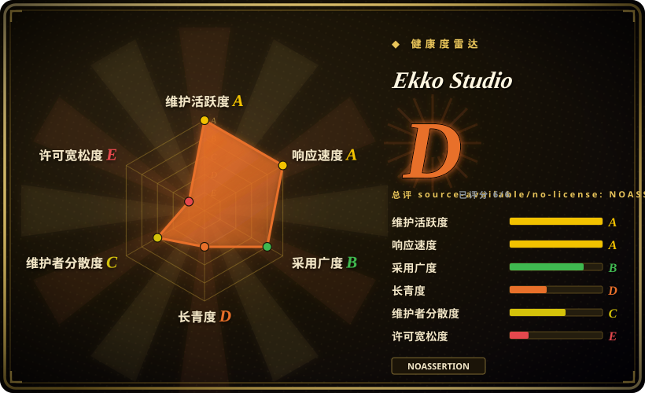
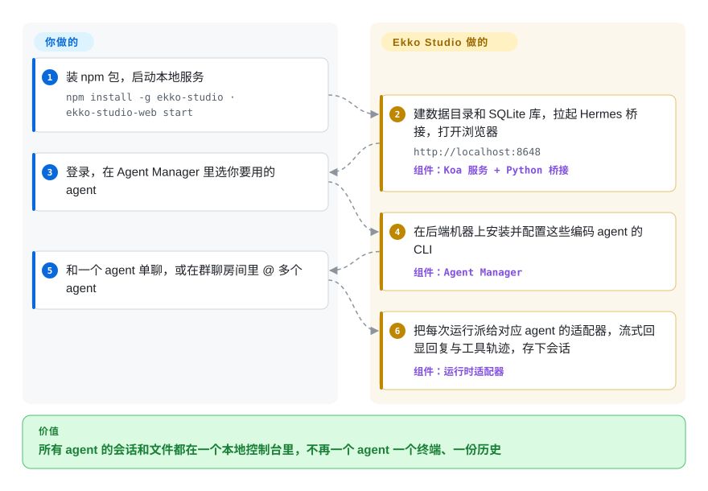

# Ekko Studio

同时用 Hermes Agent、Claude Code、Codex 再加一两个 agent，就是每个 agent 一个终端窗口、一份各自的历史，想让它们接力干同一件事只能手动复制粘贴。Ekko Studio 是一个本地服务（也有桌面版），替你安装并拉起这些 agent，把单聊、多 agent 群聊和拖拽式工作流放进同一个界面；代价是它只许非商业使用。

## 何时使用

你在自己机器上跑 Nous 的 Hermes Agent，同时还装着 Claude Code、Codex 或 OpenCode。它们各开一个终端、各记一份历史；想让 Codex 写、Claude Code 审，你就在两个窗口之间来回粘贴。这时你会想到 Ekko Studio：它用一个本地服务把这些 agent 全部接进来。打开 `http://localhost:8648`，每个会话挑一个 agent；或者在群聊房间里 @ 好几个 agent；或者在画布上把它们连成带人工审批关口的工作流。会话、上传文件和 agent 生成的文件（HTML、PDF、PPTX 可直接预览）都落在同一份本地 SQLite 历史里。对 Hermes 本身，它还接管了原本散落在 `~/.hermes` 文件里的 profile、模型供应商、技能、记忆、定时任务和 Telegram／飞书／微信等渠道配置。

和最接近的几个替代品相比，决定性的取舍是**广度换许可证**。[Hermes Workspace](hermes-workspace.zh.md) 和 `nesquena/hermes-webui` 是只服务 Hermes 的 MIT 控制台；[CloudCLI](claudecodeui.zh.md) 是面向 Claude Code／Codex／Cursor 这一族的 AGPL 驾驶舱。Ekko Studio 是唯一把两族 agent、群聊和可视化工作流装进同一个安装包的，代价是 Business Source License：2029-05-10 之前禁止商业使用。个人、科研或教学场景下，如果“一个控制台管我所有的 agent”比许可证自由更重要，就选它。

## 怎么用起来

Ekko Studio 是一个 Koa 后端加 Vue 前端的 Web 服务，有三种装法：npm 命令行包、基于官方 `nousresearch/hermes-agent` 镜像构建的 Docker 镜像，或者自带 Python 与 Hermes 运行时的 Electron 桌面应用。它不重写任何 agent，而是**驱动**它们：对 Hermes，它启动一个 Python “桥接”进程——一个把 agent 常驻在内存里、通过本地 socket 接收运行请求的小助手；对 Claude Code、Codex、Pi、Grok、OpenCode 和 DeepSeek Harness，它替你安装厂商 CLI，再通过每种 agent 各自的适配器把 CLI 当子进程来跑；自研的 Ekko Agent 则直接跑在服务进程里。Studio 自己负责的是 agent **之间**的一切：单聊和群聊界面、工作流画布（agent 步骤用连线、条件、循环和人工审批关口串起来）、存在本地 SQLite 文件里的会话、文件浏览器、网页终端、语音，以及一个让 agent 能操控桌面浏览器标签页的 MCP 服务。你负责的是各 agent 的登录凭据，以及决定哪一步交给哪个 agent。可以把它想成总机而不是新手机：每通电话仍然打给你原本信任的那个 agent，只是你坐在同一张桌子前拨号。

<!-- flow-steps:begin (generated from flows/ekko-studio.json by tools/flow_card.py — do not edit) -->

流程文字版

1. **你**：装 npm 包，启动本地服务 — `npm install -g ekko-studio · ekko-studio-web start`
2. **Ekko Studio**：建数据目录和 SQLite 库，拉起 Hermes 桥接，打开浏览器 — `http://localhost:8648` — 组件：`Koa 服务 + Python 桥接`
3. **你**：登录，在 Agent Manager 里选你要用的 agent
4. **Ekko Studio**：在后端机器上安装并配置这些编码 agent 的 CLI — 组件：`Agent Manager`
5. **你**：和一个 agent 单聊，或在群聊房间里 @ 多个 agent
6. **Ekko Studio**：把每次运行派给对应 agent 的适配器，流式回显回复与工具轨迹，存下会话 — 组件：`运行时适配器`

**价值**：所有 agent 的会话和文件都在一个本地控制台里，不再一个 agent 一个终端、一份历史

<!-- flow-steps:end -->

## 何时不用

- **任何商业用途。** LICENSE 是 BSL 1.1，附加使用授权只放行**非商业**用途；售卖、做成 SaaS 托管或嵌入商业产品，在变更日（2029-05-10，之后转为 Apache-2.0）之前都要向 EKKOLearnAI 另购授权。公司内部日常使用算不算“商业利益”，许可证没有写清 [推断]。工作场景下，只用 Hermes 选 [Hermes Workspace](hermes-workspace.zh.md)（MIT），用 Claude Code／Codex 选 [CloudCLI](claudecodeui.zh.md)（AGPL），要多 agent 桌面应用选 `iOfficeAI/AionUi`（Apache-2.0，未收录）。
- **你看中的是它最初的许可证。** 仓库最初以 MIT 发布（2026-04-18 加入 LICENSE），2026-05-10 通过 #605 改成 BSL-1.1，距建仓仅一个月。那次提交之前的代码仍是 MIT，但之后的更新不是。如果许可证稳定性是决定因素，选没有改许可证记录的项目：聊天选 [Open WebUI](../../llm-chat-ui/open-webui.zh.md)，Hermes 控制台选 [Hermes Workspace](hermes-workspace.zh.md)。
- **你只想和模型聊天。** 如果 agent 会话、终端和工作流都不是重点，[Open WebUI](../../llm-chat-ui/open-webui.zh.md) 或 [LibreChat](../../llm-chat-ui/librechat.zh.md) 是更成熟的多用户聊天平台，还带 RAG。Ekko Studio 的模型列表要经 Hermes profile 发现，天生以 agent 为中心。
- **你只跑一个 agent，只要一个轻量驾驶舱。** 只用 Claude Code／Codex／Cursor，[CloudCLI](claudecodeui.zh.md) 更小；只用 pi，[Pi Web](pi-web.zh.md) 直接读 pi 自己的会话文件。你用不上渠道、看板、语音、设备、ESP32 固件和 App 中继时，Ekko Studio 的这些面都是负担。
- **你要每个 agent 隔离在自己的分支上、并自动收到 CI 反馈。** Ekko Studio 让多个 agent 共用一个工作区和一个文件浏览器。[Agent Orchestrator](agent-orchestrator.zh.md) 给每个编码 agent 一个 git worktree，并把 CI／评审／冲突反馈路由回去。
- **别随手暴露到网络上。** 服务默认监听 `0.0.0.0`（`BIND_HOST`），初始账号是 `admin` / `123456`（登录后界面会提示改掉），而一个已登录会话就能碰到 PTY 终端、可编辑删除的文件浏览器和 agent 安装入口。放在回环地址或 VPN 后面，先改默认账号，并有意识地设置 `AUTH_TOKEN` 和 `CORS_ORIGINS`。
- **你要慢而可预期的升级节奏。** 约 5.5 个月打了 138 个 tag（npm v0.7.x 隔几天一版，另有 Android v1.0.x 和捆绑 Hermes 运行时的 tag），而且紧跟上游 Hermes：#3213（2026-09-28）报告升级到 Hermes Agent v0.21.5 后出了问题。要把 npm 版本和 Hermes 版本一起锁定，或者换一个影响面更小的轻量界面。
- **你的服务器锁在 Node 22 LTS。** `package.json` 要求 `node >=23.0.0`，服务端数据库层导入的是 Node 内置的 `node:sqlite` 模块。机器统一锁 LTS 的话，用 Docker 镜像或桌面应用，它们自带运行时。

## 横向对比

| 替代品 | 是否收录 | 我们的评价 | 取舍 |
|---|---|---|---|
| [Hermes Workspace](hermes-workspace.zh.md) | ✅ | 只跑 Hermes，或者是工作用途，选 Hermes Workspace；Claude Code／Codex／OpenCode 也要进同一个控制台、群聊和工作流，且非商业使用可以接受时，选 Ekko Studio。 | Hermes Workspace：MIT，不 fork，直接前置在 Hermes 自己的 gateway／dashboard API 上，带 tmux Swarm worker。Ekko Studio：多运行时、工作流画布和桌面应用，但用 BSL，且 Python 桥接进程要它自己拉起。 |
| [CloudCLI (Claude Code UI)](claudecodeui.zh.md) | ✅ | 要一个浏览器／手机驾驶舱来操作 Claude Code、Codex 或 Cursor CLI 会话，选 CloudCLI；工作里还有 Hermes 和多 agent 群聊或工作流时，选 Ekko Studio。 | CloudCLI：AGPL-3.0-or-later（按 copyleft 条款允许商用），专注读取和续接各 CLI 自己的会话。Ekko Studio：运行时更多、有编排，但许可证是非商业。 |
| `iOfficeAI/AionUi` | 未收录 | 想要一个许可证宽松、覆盖 Claude Code、Codex、OpenCode、Hermes 等的多 agent 桌面“协作”应用，选 AionUi；需要 Hermes 控制面（profile、渠道、定时任务）和工作流画布时，选 Ekko Studio。 | Apache-2.0，约 33.2k star，最近推送 2026-09-09（GitHub API，2026-09-28 查询）；与 Ekko Studio 的功能对等性未核对。本批次 tab 收录未加入。 |
| `nesquena/hermes-webui` | 未收录 | 只要一个更轻的、MIT 许可的 Hermes Agent Web／手机界面，选 hermes-webui；还想把编码 agent、群聊和工作流放在一起时，选 Ekko Studio。 | MIT，约 18.6k star，2026-09-28 有推送（GitHub API）。单运行时界面面小；Ekko Studio 的体积就是它广度的代价。本批次 tab 收录未加入。 |
| [Open WebUI](../../llm-chat-ui/open-webui.zh.md) | ✅ | 任务是和模型聊天（含 RAG、本地模型、多用户），选 Open WebUI；任务是运行和协调带终端、文件的 **agent**，选 Ekko Studio。 | Open WebUI：多年历史、采用面极广，是模型聊天平台，没有 agent 会话或工作流画布。Ekko Studio：agent 工作台，更年轻，BSL。 |

## 技术栈

- **前端：** Vue 3 + TypeScript + Vite、Naive UI、Pinia、Vue Router、vue-i18n、SCSS、markdown-it + highlight.js + KaTeX；工作流画布用 Vue Flow；网页终端用 xterm（README “Tech Stack” 与 `package.json`）。
- **服务端：** Koa 2 + Socket.IO（聊天运行走 `/chat-run` 命名空间）、node-pty 提供终端、SQLite 经 Node 内置的 `node:sqlite`（`packages/server/.../database/index.ts`）、MCP 客户端 SDK、桌面浏览器工具用 `agent-browser`、语音用 `sherpa-onnx-node` 和 `node-edge-tts`。
- **monorepo 包：** `client`、`server`、`ekko-agent`（自研 agent 运行时，TypeScript）、`desktop`（Electron 壳 + 更新器 + 捆绑的 Python／Hermes 运行时）、`skills`，以及 `esp32-c3`（给一个小硬件设备用的 PlatformIO 固件）。
- **agent 侧：** 一个加载 Hermes Agent 的 Python 桥接进程（`run_agent.py` 源码目录或 `pip install hermes-agent` 环境）；编码 agent 用厂商 CLI，经 Agent Manager 安装。
- **分发：** npm 包 `ekko-studio` 与旧名 `hermes-web-ui`（同步发版），Docker 镜像 `ekkoye8888/hermes-web-ui`（`FROM nousresearch/hermes-agent`），以及 GitHub Releases 上的 Windows／macOS／Linux 桌面安装包。

## 依赖

- **Node.js ≥ 23**（npm 安装方式，见 `package.json` 的 `engines`）；桌面应用和 Docker 镜像自带运行时。
- **Hermes Agent + Python**（Hermes 相关功能）：Studio 先找源码目录（`~/.hermes/hermes-agent`），再找 `hermes` 命令背后的 Python，最后用系统 Python；有 `uv` 时会用 `uv`。
- **每个编码 agent 的 CLI 与凭据**（Claude Code、Codex、OpenCode……），装在运行 Studio 后端的那台机器上；DeepSeek Harness 装插件还需要 `PATH` 里有 `pnpm`。
- **模型供应商密钥或 OAuth 登录**，经 Hermes profile 管理（`~/.hermes/auth.json`、`~/.hermes/.env`）。
- **可选的托管服务：** 手机 App 的云中继走 `api.ekkostudio.xyz`／`cn.ekkostudio.xyz`，需要云端签发的授权凭证（局域网配对不需要）；桌面自动更新先读 `download.ekkolearnai.com`，失败再回退到 GitHub Releases。
- **状态目录：** Studio 数据在 `~/.hermes-web-ui`（认证 token、SQLite 数据库、上传、日志）；Hermes 数据仍在 `~/.hermes`。

## 运维难度

**起步低，要用好是中等。** `npm install -g ekko-studio && ekko-studio-web start`、桌面安装包或一条 `docker compose up -d` 都能直接拿到可用界面。持续成本在后面。有两棵状态目录要备份（`~/.hermes-web-ui` 和 `~/.hermes`）。Python 桥接进程要保持健康：restart／update 默认会停掉它，而调它的 `HERMES_AGENT_BRIDGE_*`／gateway 环境变量有 30 个左右。每个编码 agent 的 CLI 都要单独登录。发版频繁，又和 Hermes Agent 版本紧耦合，所以每次升级其实是两个组件一起动，上线前要先测。非回环部署的安全加固（改默认管理员账号、设 token 和 CORS 白名单、别把终端和文件浏览器放到公网）全靠你自己。

## 健康度与可持续性

- **维护（2026-09）。** 建于 2026-04-11；约 1,550 次提交，2026-09-28 仍有推送。npm 上 `hermes-web-ui` 自 2026-04-11 起发了 133 个版本，最新 tag 是 v0.7.24（2026-09-22）。非常活跃，也伴随相应的变动。
- **治理／巴士因子。** 归属一个个人 GitHub 账号（`EKKOLearnAI`，类型 User，建于 2023-11）。在贡献者列表前 15 名的约 1,445 次提交里，这个账号占了 1,128 次。看不到基金会或公司背书，而且 BSL 下授权方保留不受限的商业权利。路线图实际上由一人决定 [推断]。
- **年龄 × Lindy。** 约 5.5 个月，11.2k star、1.4k fork。关注度很高，但还没有 Lindy 加分；而且已经改过两次名（Hermes Web UI → Hermes Studio → Ekko Studio），旧命令和旧包名仍在维持。
- **采用情况。** 2026-08-28 至 09-26 的 npm 下载量：旧包 `hermes-web-ui` 24,321 次，新包 `ekko-studio` 765 次，大部分安装仍走旧名。累计 1,303 个 issue，查询时 323 个未关、106 个 PR 未关。说明有真实使用，但对一个基本由一人编写的项目来说积压也不小。
- **风险信号。** 建仓一个月就从 MIT 改为 BSL-1.1（2026-05-10），2029-05-10 之前都是非商业许可。手机 App 和它的云中继由厂商托管，文档写明中继的授权钩子留好了以后加“订阅或套餐限制”的位置。默认就是 `0.0.0.0` 监听加一个人尽皆知的初始账号。它的存续有一部分押在 Hermes Agent 的 API 保持稳定上。

## 存疑（未验证）

- [推断] 公司内部使用是否算附加使用授权里的“商业”用途，是许可证本身没说清的法律解读；在工作中部署前应先问授权方。
- [未验证] 功能描述（工具调用轨迹流式展示、PPTX／XLSX 内联预览、工作流运行的证据回放、10 个平台的渠道配置、语音适配器）来自 README，本文没有实际跑过。
- [推断] “要求 `node >=23` 是因为用了内置 `node:sqlite` 模块”是根据 `packages/server/src/modules/studio/infrastructure/database/index.ts` 里的导入加上 `engines` 字段推出的；维护者没有写明原因。
- [未验证] 手机 App（v1.0.x release 附带 Android APK，另有 iOS 推送支持）看起来只以二进制分发；在仓库的 `packages/` 里没找到它的源码，App 端可能是闭源的。
- [推断] App 中继将来可能加“订阅或套餐限制”，依据是 `docs/app-relay.md` 的原话（授权钩子“目前返回不限量，以后可以加订阅或套餐限制”）；目前没有看到付费方案。
- [推断] 巴士因子的判断用的是 contributors API 前 15 名（2026-09-28）；squash 合并和 bot／agent 共同署名都会扭曲按账号统计的提交数。
- [未验证] Ekko Studio 与 AionUi、nesquena/hermes-webui 的功能对等性没有实测；只从 GitHub API 读了它们的许可证、star 数和推送日期。
- [推断] 把 Hermes 版本耦合视为持续的升级风险，是从 #3213 和单独的 `hermes-*-runtime` release tag 外推出来的，并未复现故障。
