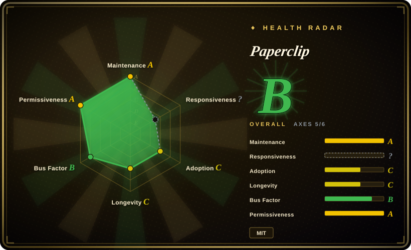
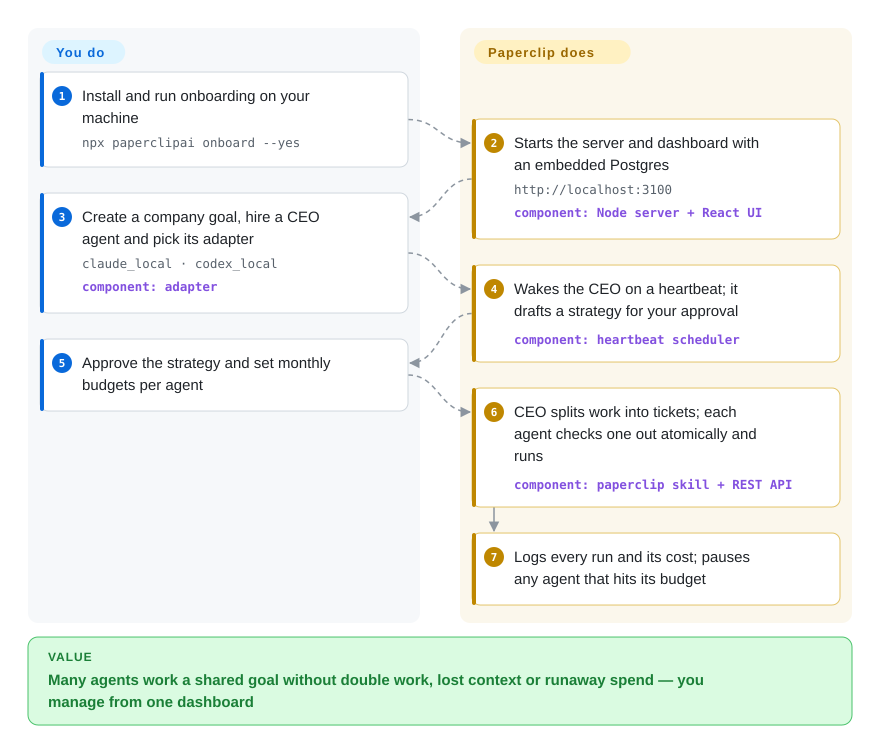

# Paperclip

You have a dozen Claude Code and Codex sessions open, nobody remembers which tab owns which task, two of them just fixed the same bug, and one retry loop quietly burned your monthly token budget overnight. Paperclip puts those agents behind one self-hosted task board: each one wakes on a schedule, claims a single ticket, reports back, and is stopped automatically when its budget runs out.

## When to use

You run a small operation — a solo founder or a two-person team — where most of the day-to-day work is already done by coding and ops agents: one Claude Code instance on the product, a Codex instance on the marketing site, an OpenClaw bot answering support, a shell script that posts the weekly report. Coordinating them is now the job. You copy context between terminals by hand, you can't tell on Monday what ran over the weekend, and the evidence of a runaway is an invoice line like "35,603,866 tokens" rather than an alert.

You reach for Paperclip when the missing layer is the *organization* around agents you already have, not a better agent. It gives every agent a role, a manager, a monthly budget and a place in one ticket system; it wakes them on timers or on assignment, hands each run its task and the goal it serves, refuses to let two agents check out the same ticket, and pauses any agent that hits its spend cap. You pick it over Agent Orchestrator or Vibe Kanban when the unit you manage is a standing team working toward business goals (support, content, reports, code) rather than a batch of parallel code branches you want to review — and over a hosted board like Linear or Jira when you want the checkout locks, budgets and run logs to be enforced by the same system that launches the agents, MIT-licensed and on your own machine.

## How it works

Paperclip is a Node.js server with a React dashboard and a PostgreSQL database (an embedded one is created for you on first run). It does not contain an agent: an *adapter* launches something you already installed and logged into — your local `claude` or `codex` CLI, OpenCode, Cursor, Pi, a generic shell command, or an HTTP endpoint such as an OpenClaw gateway. Agents never run continuously; they run in *heartbeats* — short execution windows, like a shift worker clocking in, triggered by a timer, a new assignment or a manual ping. On each heartbeat Paperclip queues the wake-up, checks the budget, prepares the working directory (optionally an isolated git worktree), injects a short-lived API token plus its own "paperclip" skill (the instructions that teach the agent how to read and update tickets), and starts the CLI; the agent then checks out a ticket through Paperclip's REST API, works, comments and exits, while Paperclip records the logs, token cost and session ID so the next heartbeat resumes the same conversation. What you do is the management layer: define the company goal, hire the agents and pick their adapters, set budgets, and approve strategy, hires or finished work in the dashboard.

<!-- flow-steps:begin (generated from flows/paperclip.json by tools/flow_card.py — do not edit) -->

Text version of the flow

1. **You**: Install and run onboarding on your machine — `npx paperclipai onboard --yes`
2. **Paperclip**: Starts the server and dashboard with an embedded Postgres — `http://localhost:3100` — component: `Node server + React UI`
3. **You**: Create a company goal, hire a CEO agent and pick its adapter — `claude_local · codex_local` — component: `adapter`
4. **Paperclip**: Wakes the CEO on a heartbeat; it drafts a strategy for your approval — component: `heartbeat scheduler`
5. **You**: Approve the strategy and set monthly budgets per agent
6. **Paperclip**: CEO splits work into tickets; each agent checks one out atomically and runs — component: `paperclip skill + REST API`
7. **Paperclip**: Logs every run and its cost; pauses any agent that hits its budget

**Value**: Many agents work a shared goal without double work, lost context or runaway spend — you manage from one dashboard

<!-- flow-steps:end -->

## When NOT to use

- **You run one agent, or one agent per repo.** Paperclip's own README says a single-agent user "probably" doesn't need it; the server, database, org chart and heartbeat scheduler are overhead for that case. Drive Claude Code or Codex directly, and if you only want to reach those sessions from a browser or phone, use [CloudCLI (Claude Code UI)](claudecodeui.md) instead.
- **Your real job is reviewing parallel code branches.** The project describes itself as "not a code review tool" — there is no diff-review loop that feeds CI failures and PR comments back to the owning agent. For many coding agents on worktree branches with review/CI routing, use [Agent Orchestrator](agent-orchestrator.md).
- **You want to program the agents' reasoning.** Paperclip is "not an agent framework": it schedules and governs external agent processes, it does not define tools, roles-as-code or multi-step reasoning inside one program. To build that logic in Python, use [CrewAI](../../agent-frameworks/agent-runtimes/agent-sdks/crewai.md).
- **You would expose it beyond a trusted network without a security review.** Twelve GitHub security advisories were published for this repo by 2026-09-28 — five rated critical, including unauthenticated RCE through the import path, cross-tenant agent-key minting, and (2026-07-22) a drive-by DNS-rebinding RCE against *local* instances. They are published as fixed advisories, but the density says the authenticated/public mode is young. Keep it on loopback or a tailnet; if external teammates must reach a board, a hosted tracker (Linear, Jira) that your agents write to through their own integrations is the lower-risk substitute. [推断]
- **You need the budget to be the only thing between you and a surprise bill.** Budgets are enforced per heartbeat from the cost the adapter reports; issue #9539 describes an upgrade that broke an adapter's auth and let retries consume ~35.6M tokens before it was noticed. Put a hard spend limit at the provider or at a gateway such as [LiteLLM](../../api-gateway/litellm.md) as well, rather than trusting Paperclip's cap alone.
- **Your hosts are Windows.** Issue #10012 (open since 2026-07-22) reports every local-CLI agent run failing on Windows because the runner generates bash-only wrappers. Run the server on macOS or Linux; for a Windows-native multi-agent desktop, Agent Orchestrator ships a Windows installer.
- **You need a slow, stable upgrade path.** Releases are calendar-versioned roughly weekly (v2026.817 → v2026.916 in a month), and open bug reports cite config-save failures and secret bindings reset after upgrades. Pin a version with the installer's pinned-version option and read release notes before upgrading, or stay on a plain issue tracker until the schema settles.

## Comparison

| Alternative | In index | Our verdict | Tradeoff |
|---|---|---|---|
| [Agent Orchestrator](agent-orchestrator.md) | ✅ | For many coding agents on real branches where the bottleneck is CI failures and review comments, pick Agent Orchestrator; pick Paperclip when the agents are a standing team with budgets, roles and recurring non-code work. | You gain the worktree-per-task desktop loop with automatic CI/PR feedback routing, but lose org charts, per-agent spend caps, routines and a multi-company server. |
| Multica (multica-ai/multica) | not indexed | Closest head-on rival — a self-hostable board where coding agents pick up issues and report blockers; choose it if its board UX fits better, but only after reading its licence, because Paperclip's MIT is the looser bet. | Not added in this tab-intake batch. Its "Multica License" is Apache-2.0 plus conditions that forbid offering it as a hosted service to third parties or removing its branding without a commercial licence; internal use is allowed. |
| Vibe Kanban (BloopAI/vibe-kanban) | not indexed | Treat it as a pattern source only: its README announces the project is sunsetting, so do not start a new deployment on it; Paperclip is the maintained choice for a board that dispatches agents. | Not added in this tab-intake batch. It focused on per-issue coding workspaces with inline diff comments and PR creation — closer to code review than to Paperclip's org and budget model. |
| [CrewAI](../../agent-frameworks/agent-runtimes/agent-sdks/crewai.md) | ✅ | When the agents are yours to write — roles, tools and task flow defined in Python — pick CrewAI; pick Paperclip when the agents already exist as CLIs or services and you need to schedule, budget and supervise them. | You gain code-level control over each agent's reasoning, but you build scheduling, cost caps, a dashboard and approvals yourself. |
| Linear / Jira + agent integrations | not a repo | Hosted trackers, not repositories. Pick them when humans outnumber agents and you need mature permissions and outside access; pick Paperclip when the tracker itself must launch agents and enforce single-owner checkout and budgets. | You gain a hardened multi-user SaaS, but checkout locks, heartbeat scheduling and spend caps are not part of the tracker. Paperclip lists bring-your-own-ticket-system as a roadmap item. |

## Tech stack

- **Language / layout:** a TypeScript pnpm monorepo — `server/` (Express, Drizzle ORM, better-auth, pino, `ws`), `ui/` (React dashboard), `cli/` (the `paperclipai` npm CLI), `packages/` (database schema, shared types, plugin SDK, MCP server, one package per adapter).
- **Storage:** PostgreSQL through Drizzle; `embedded-postgres` starts a bundled instance for local use. Attachments on local disk or S3-compatible storage (`@aws-sdk/client-s3`).
- **Agent adapters (built in):** Claude Code, Codex, OpenCode, Cursor (local and cloud), Gemini, Grok, Kimi, Pi, Hermes (local CLI and gateway), OpenClaw gateway, generic `process` and `http`; external adapters install as plugins.
- **Extension points:** an instance-wide plugin system with out-of-process workers, an MCP tool gateway, org-wide skills, chat adapters (Slack, Discord, Teams, Telegram, GitHub).
- **Observability:** opt-in OpenTelemetry traces and Sentry via optional peer dependencies; anonymous product telemetry on by default.
- **Tests:** Vitest by default, Playwright for browser suites.

## Dependencies

- **Node.js ≥ 24.11** (the npm package's `engines` field) — the installer tries to provision it; pnpm 9.15+ when building from source.
- **PostgreSQL** — embedded automatically for local use; point it at your own Postgres for production.
- **The agents themselves** — each local-CLI adapter assumes that CLI (`claude`, `codex`, `opencode`, …) is already installed and authenticated on the host, which means you also bring the model subscriptions or API keys they bill against.
- **Optional:** S3-compatible object storage, a Tailscale/VPN or reverse proxy for remote access, cloud sandbox providers (e2b, Cloudflare, Daytona, Modal, Kubernetes) for isolated runs, OTLP collector / Sentry.

## Ops difficulty

**Low to try, medium-to-high to run for real.** `npx paperclipai onboard --yes` gives you a working loopback instance with an embedded database in minutes. The burden arrives afterwards: every host that runs agents needs each CLI installed and logged in, secrets and adapter configs must survive weekly upgrades, the embedded Postgres is refused by the documented public-authenticated mode (issue #10552) so a shared deployment means operating your own database, reverse proxy and auth mode, and the advisory history means you should track security releases rather than upgrade occasionally. The cost side is operational too — you are running autonomous processes on a timer, so someone has to watch spend and stuck runs. [推断]

## Health & viability

- **Maintenance (2026-09-28): very active.** Pushed the same day; 100–215 commits a week over the last eight weeks; roughly weekly calendar-versioned releases; the npm CLI drew ~113k downloads in the month to 2026-09-26.
- **Governance / backing.** Org-owned (Paperclip Labs, Inc. per the README; the LICENSE reads "Paperclip AI"), with a hosted version behind a waitlist on the website. Commits are concentrated: the top contributor has ~2.85k commits against ~560 for the next — the roadmap sits with one company and one lead developer.
- **Age × Lindy.** Created 2026-03-02 — about seven months old. Lindy gives it almost no credit; the pace is an activity signal, not a durability record.
- **Adoption.** ~91k stars and ~15.8k forks in seven months, plus ~2.5k open issues and ~3.4k open PRs: huge attention, and a triage queue that outruns closures (~900 closed issues). Read the star count as reach, not as proof of production use. [推断]
- **Risk flags.** Twelve published security advisories (five critical); product telemetry on by default (`PAPERCLIP_TELEMETRY_DISABLED=1` or `DO_NOT_TRACK=1` turns it off); a commercial hosted offering from the same vendor, so watch for features landing only there. MIT licence, no relicensing seen.

## Caveats (unverified)

- [未验证] Star, fork, issue, PR and download counts are GitHub/npm snapshots from 2026-09-28 and move daily.
- [推断] That the advisory density means the authenticated/public deployment mode is immature — inferred from twelve advisories within seven months, not from auditing the current code.
- [未验证] Whether budget enforcement would have stopped the ~35.6M-token incident in issue #9539 on current versions; the reporter's account was not reproduced and the issue was still open.
- [未验证] Windows failure in issue #10012 was reported against a 2026-07 release; it may be fixed on master without the issue being closed. Not reproduced (no Windows host).
- [推断] The Ops difficulty verdict (medium-to-high for shared use) is judged from the docs, issue reports and dependency list, not from running a production deployment.
- [未验证] The hosted/cloud offering's pricing and feature split versus the self-hosted build could not be checked — the site shows only a waitlist.
- [未验证] Multica's and Vibe Kanban's current feature sets are taken from their READMEs and licence files, not from running them.
- [未验证] Health radar: responsiveness is `?` (the scorer's sampled window found no qualifying issue/PR response despite heavy traffic), and adoption was graded from the npm package `@paperclipai/shared` rather than the `paperclipai` CLI — both are scorer limits, not measurements of this project.
