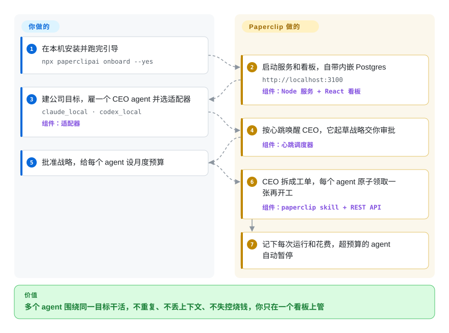

# Paperclip

你同时开着十几个 Claude Code 和 Codex 会话，谁也记不清哪个标签页在干哪件事，两个会话刚修了同一个 bug，还有一个重试循环一夜之间悄悄烧光了本月的 token 预算。Paperclip 把这些 agent 收进一个自托管的任务看板：每个 agent 按时醒来、只领一张工单、干完回报，预算用完就被自动叫停。

## 何时使用

你经营的是一个小摊子——独立创业者，或两三个人的团队——日常活大多已经交给编码和运维 agent：一个 Claude Code 管产品代码，一个 Codex 管营销站，一个 OpenClaw 机器人回客服，一段 shell 脚本每周发报表。现在“协调它们”本身成了一份工作：你在终端之间手动搬上下文，周一早上说不清周末跑了什么，失控的第一个信号是账单上的一行“35,603,866 tokens”，而不是一条告警。

当你缺的是这些现成 agent 外面那层“组织”，而不是一个更聪明的 agent 时，就想到 Paperclip。它给每个 agent 一个角色、一个上级、一份月度预算，并把它们放进同一套工单系统；按定时或被分配任务时唤醒它们，每次运行都附上任务本身和它服务的目标，不许两个 agent 领同一张工单，谁花到上限就把谁暂停。和 Agent Orchestrator、Vibe Kanban 相比，你管理的单位是一支朝业务目标（客服、内容、报表、代码）长期干活的团队，而不是一批等你评审的并行代码分支；和 Linear、Jira 这类托管看板相比，你要的是领取锁、预算和运行日志由启动 agent 的同一个系统来强制执行，MIT 许可，跑在你自己的机器上。

## 怎么用起来

Paperclip 是一个 Node.js 服务，外加 React 看板和一个 PostgreSQL 数据库（首次运行会自动建一个内嵌库）。它本身不含 agent：由“适配器”去启动你已经装好并登录过的东西——本机的 `claude` 或 `codex` 命令行、OpenCode、Cursor、Pi、一条普通 shell 命令，或 OpenClaw 网关这类 HTTP 端点。agent 不常驻运行，而是按“心跳”干活——一段短暂的执行窗口，像轮班工人打卡上岗，由定时器、新分配的任务或手动点一下触发。每次心跳，Paperclip 先把唤醒请求排进队列、查预算、准备工作目录（可选隔离的 git worktree）、注入一个短时效的 API 令牌和它自带的“paperclip”技能（教 agent 怎么读写工单的说明书），再启动命令行；agent 随后通过 Paperclip 的 REST API 领取一张工单、干活、留评论、退出，Paperclip 记下日志、token 花费和会话 ID，下次心跳接着同一段对话继续。你做的是管理层的事：定公司目标、雇 agent 并选适配器、设预算，在看板上批准战略、招聘或交付的成果。

<!-- flow-steps:begin (generated from flows/paperclip.json by tools/flow_card.py — do not edit) -->

流程文字版

1. **你**：在本机安装并跑完引导 — `npx paperclipai onboard --yes`
2. **Paperclip**：启动服务和看板，自带内嵌 Postgres — `http://localhost:3100` — 组件：`Node 服务 + React 看板`
3. **你**：建公司目标，雇一个 CEO agent 并选适配器 — `claude_local · codex_local` — 组件：`适配器`
4. **Paperclip**：按心跳唤醒 CEO，它起草战略交你审批 — 组件：`心跳调度器`
5. **你**：批准战略，给每个 agent 设月度预算
6. **Paperclip**：CEO 拆成工单，每个 agent 原子领取一张再开工 — 组件：`paperclip skill + REST API`
7. **Paperclip**：记下每次运行和花费，超预算的 agent 自动暂停

**价值**：多个 agent 围绕同一目标干活，不重复、不丢上下文、不失控烧钱，你只在一个看板上管

<!-- flow-steps:end -->

## 何时不用

- **你只跑一个 agent，或者一个仓库一个 agent。** Paperclip 自己的 README 就说单 agent 用户“大概”用不着它；服务、数据库、组织架构和心跳调度器对这种场景纯属负担。直接用 Claude Code 或 Codex；如果只是想从浏览器或手机够到这些会话，改用 [CloudCLI (Claude Code UI)](claudecodeui.zh.md)。
- **你真正的工作是评审并行的代码分支。** 项目自称“不是代码评审工具”——没有把 CI 失败和 PR 评论回灌给对应 agent 的 diff 评审闭环。要让多个编码 agent 各占一个 worktree 分支、并自动路由评审和 CI 反馈，改用 [Agent Orchestrator](agent-orchestrator.zh.md)。
- **你想用代码编排 agent 的推理过程。** Paperclip “不是 agent 框架”：它调度和管理外部 agent 进程，不在一个程序里定义工具、代码化角色或多步推理。想用 Python 写这套逻辑，改用 [CrewAI](../../agent-frameworks/agent-runtimes/agent-sdks/crewai.zh.md)。
- **你打算不做安全评审就把它暴露到可信网络之外。** 截至 2026-09-28，本仓库已公开 12 条 GitHub 安全公告——5 条严重级，包括经导入路径的未鉴权远程代码执行、跨租户铸造 agent 密钥，以及（2026-07-22）针对“本地”实例的 DNS 重绑定路过式 RCE。它们都以已修复公告的形式发布，但这个密度说明鉴权/公网模式还很年轻。把它留在本机回环地址或 tailnet 里；如果必须让外部同事看到看板，改用托管工单系统（Linear、Jira），让 agent 通过各自的集成去写，风险更低。[推断]
- **你指望预算是挡在你和意外账单之间的唯一防线。** 预算按每次心跳、依据适配器上报的花费来执行；issue #9539 描述了一次升级把某个适配器的鉴权弄坏，重试在被发现前烧掉约 3560 万 token。在模型供应商那边，或在 [LiteLLM](../../api-gateway/litellm.zh.md) 这类网关上再设一道硬性花费上限，不要只信 Paperclip 的限额。
- **你的主机是 Windows。** issue #10012（2026-07-22 提出，至今未关）报告 Windows 上所有本地命令行 agent 运行都失败，因为运行器只生成 bash 包装脚本。把服务端放在 macOS 或 Linux 上；要 Windows 原生的多 agent 桌面，Agent Orchestrator 提供 Windows 安装包。
- **你需要慢而稳的升级节奏。** 版本按日历号大约每周一发（一个月内从 v2026.817 到 v2026.916），未关的 bug 报告里有升级后配置保存失败、密钥绑定被重置。用安装器的固定版本选项锁版本、升级前读发布说明；或者在数据结构稳定之前先用普通工单系统。

## 横向对比

| 替代品 | 是否收录 | 我们的评价 | 取舍 |
|---|---|---|---|
| [Agent Orchestrator](agent-orchestrator.zh.md) | ✅ | 多个编码 agent 跑在真实分支上、瓶颈是 CI 失败和评审意见时，选 Agent Orchestrator；agent 是一支有预算、有角色、还干非代码日常活的常驻团队时，选 Paperclip。 | 得到“一任务一 worktree”的桌面闭环和自动 CI／PR 反馈路由，失去组织架构、按 agent 的花费上限、例行任务和多公司服务端。 |
| Multica（multica-ai/multica） | 未收录 | 最正面的竞品——可自托管的看板，编码 agent 从上面领 issue、报阻塞；看板体验更合你意可以选它，但先读许可证，Paperclip 的 MIT 更宽松。 | 本次标签页批量收录未添加。它的“Multica License”是 Apache-2.0 加附加条件：没有商业许可不得把它作为托管服务提供给第三方，也不得去掉品牌标识；组织内部使用允许。 |
| Vibe Kanban（BloopAI/vibe-kanban） | 未收录 | 只当设计参考：它的 README 已宣布项目正在关停，不要新部署；要一个能派发 agent 的看板，Paperclip 是仍在维护的选择。 | 本次标签页批量收录未添加。它专注按 issue 开编码工作区、行内 diff 评论和建 PR——更接近代码评审，而不是 Paperclip 的组织与预算模型。 |
| [CrewAI](../../agent-frameworks/agent-runtimes/agent-sdks/crewai.zh.md) | ✅ | agent 要你自己写——角色、工具和任务流都用 Python 定义——选 CrewAI；agent 已经以命令行或服务的形式存在、你要的是调度、预算和监管，选 Paperclip。 | 得到对每个 agent 推理过程的代码级控制，但调度、花费上限、看板和审批都要自己搭。 |
| Linear／Jira + agent 集成 | 非仓库 | 托管工单系统，不是仓库。人比 agent 多、需要成熟权限和对外访问时选它们；工单系统本身必须能启动 agent、强制单人领取和预算时选 Paperclip。 | 得到久经打磨的多用户 SaaS，但领取锁、心跳调度和花费上限都不是工单系统的一部分。Paperclip 把“自带工单系统”列在路线图上。 |

## 技术栈

- **语言／结构：** TypeScript 的 pnpm monorepo——`server/`（Express、Drizzle ORM、better-auth、pino、`ws`）、`ui/`（React 看板）、`cli/`（npm 上的 `paperclipai` 命令行）、`packages/`（数据库 schema、共享类型、插件 SDK、MCP 服务，以及每个适配器一个包）。
- **存储：** 经 Drizzle 使用 PostgreSQL；本地用 `embedded-postgres` 启动内置实例。附件存本地磁盘或 S3 兼容存储（`@aws-sdk/client-s3`）。
- **内置 agent 适配器：** Claude Code、Codex、OpenCode、Cursor（本地和云端）、Gemini、Grok、Kimi、Pi、Hermes（本地命令行和网关）、OpenClaw 网关，以及通用的 `process` 和 `http`；外部适配器以插件形式安装。
- **扩展点：** 实例级插件系统（进程外 worker）、MCP 工具网关、全组织共享的 skills、聊天适配器（Slack、Discord、Teams、Telegram、GitHub）。
- **可观测性：** OpenTelemetry 链路追踪和 Sentry 都是可选的对等依赖、按需开启；匿名产品遥测默认开启。
- **测试：** 默认 Vitest，浏览器套件用 Playwright。

## 依赖

- **Node.js ≥ 24.11**（npm 包的 `engines` 字段）——安装器会尝试帮你装；从源码构建还要 pnpm 9.15+。
- **PostgreSQL**——本地自动内嵌；生产环境指向你自己的 Postgres。
- **agent 本身**——每个本地命令行适配器都假定对应命令行（`claude`、`codex`、`opencode` 等）已在主机上装好并登录，也就是说你还得自带它们计费所用的模型订阅或 API key。
- **可选：** S3 兼容对象存储、用于远程访问的 Tailscale／VPN 或反向代理、隔离运行用的云沙箱（e2b、Cloudflare、Daytona、Modal、Kubernetes）、OTLP 采集器／Sentry。

## 运维难度

**试用很轻，真用起来中到高。** `npx paperclipai onboard --yes` 几分钟就给你一个带内嵌数据库、只监听本机的可用实例。负担在后面：每台跑 agent 的主机都要装好并登录各个命令行；密钥和适配器配置要熬过每周的升级；文档里的公网鉴权模式会拒绝内嵌 Postgres（issue #10552），所以共享部署意味着你要自己运维数据库、反向代理和鉴权模式；安全公告的历史也意味着要紧跟安全版本，而不是偶尔才升级。成本侧同样是运维问题——你在按定时器跑自主进程，总得有人盯花费和卡死的运行。[推断]

## 健康度与可持续性

- **维护（2026-09-28）：非常活跃。** 当天仍有推送；最近八周每周 100–215 次提交；大约每周一个日历号版本；npm 上的命令行在截至 2026-09-26 的一个月里下载约 11.3 万次。
- **治理／背后支持。** 组织所有（README 写的是 Paperclip Labs, Inc.，LICENSE 里写 “Paperclip AI”），官网上还有一个排队等候中的托管版。提交高度集中：头号贡献者约 2850 次提交，第二名约 560 次——路线图握在一家公司、一位主力开发者手里。
- **年龄 × Lindy。** 2026-03-02 建仓，约七个月。Lindy 几乎不给分；开发节奏说明它活跃，不说明它耐久。
- **采用度。** 七个月约 9.1 万星、1.58 万 fork，同时约 2500 个未关 issue、约 3400 个未关 PR：关注度极高，而分诊队列的增长快过关闭（已关 issue 约 900 个）。把星数当作传播面，别当成生产使用的证明。[推断]
- **风险信号。** 已公开 12 条安全公告（5 条严重级）；产品遥测默认开启（设 `PAPERCLIP_TELEMETRY_DISABLED=1` 或 `DO_NOT_TRACK=1` 关闭）；同一厂商有商业托管版，留意功能只落在托管版里。MIT 许可，未见改许可历史。

## 存疑（未验证）

- [未验证] 星数、fork、issue、PR 和下载量都是 2026-09-28 的 GitHub／npm 快照，每天都在变。
- [推断] “安全公告密度说明鉴权／公网部署模式不成熟”——依据是七个月内 12 条公告，没有审计当前代码。
- [未验证] 在当前版本上，预算机制能否拦下 issue #9539 里约 3560 万 token 的事故；报告者的说法未复现，该 issue 仍未关闭。
- [未验证] issue #10012 的 Windows 失败针对的是 2026-07 的版本，可能已在 master 修复但 issue 没关。未复现（没有 Windows 主机）。
- [推断] 运维难度“共享使用为中到高”依据文档、issue 报告和依赖清单判断，没有实际跑过生产部署。
- [未验证] 托管版的定价以及它与自托管版的功能划分无法核实——官网只有候补名单。
- [未验证] Multica 和 Vibe Kanban 的现有功能取自它们的 README 和许可证文件，没有实际运行。
- [未验证] 健康度雷达：响应度为 `?`（评分器抽样窗口里虽然流量很大，却没找到合格的 issue／PR 响应），采用度是按 npm 包 `@paperclipai/shared` 而非 `paperclipai` 命令行打的分——两者都是评分器的局限，不是对本项目的测量。
