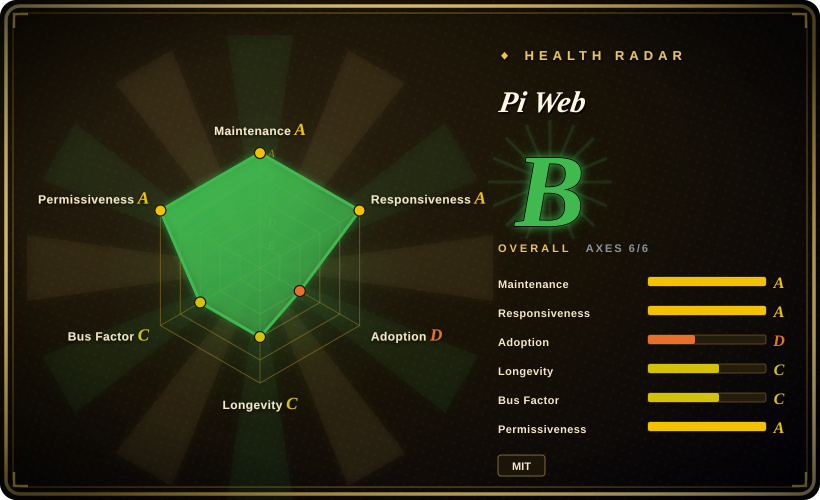
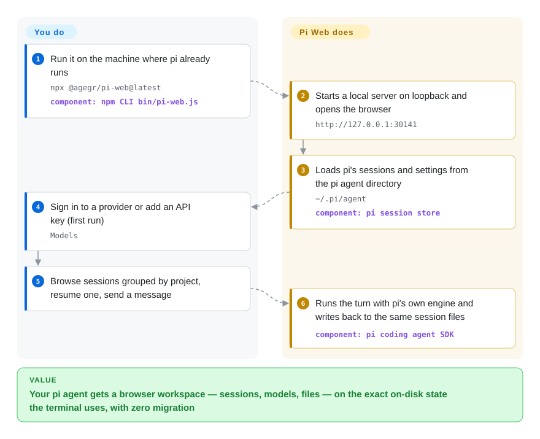

# Pi Web

Your [pi](../../agent-frameworks/coding-agents/terminal-agents/pi.md) coding agent piles its sessions up as opaque JSONL files under `~/.pi/agent`, and every "which session set up that migration?" moment turns into terminal archaeology. Pi Web turns that directory into a browser workspace — it runs the same sessions, shares the same model logins and settings as the terminal pi, and adds point-and-click browsing, branching, file/diff inspection and model configuration.

## When to use

You run pi as your coding agent, your project sessions live under `~/.pi/agent/sessions/<encoded-cwd>/<timestamp>_<uuid>.jsonl`, and you keep losing the overview: which session is still running, which one burned the context window, which one you meant to resume after lunch. Reach for Pi Web when you want that state as a browser workspace — sessions grouped by project with running state, context usage and cost; branching from an earlier message ("Edit from here") or forking an independent session; provider logins, API keys, model tests, plugin packages and skills configured in a Models panel; project files, git diffs and worktree switching without leaving the tab.

The deciding tradeoff against its substitutes: Pi Web does not re-implement pi — it reads and writes pi's own on-disk state with pi's own engine, so browser and terminal stay two views of one desk (zero migration, zero re-login). Against [CloudCLI (Claude Code UI)](claudecodeui.md) the choice is simply which brain you run — CloudCLI fronts the Claude Code/Codex/Cursor CLI family, Pi Web fronts pi only; against [Hermes Workspace](hermes-workspace.md), whose enhanced panes are keyed to the Hermes gateway APIs, the same logic applies; against plain [pi](../../agent-frameworks/coding-agents/terminal-agents/pi.md) in the terminal, you are paying one extra local server process for the browser surface, and MIT licensing keeps it embeddable where CloudCLI's AGPL cannot go.

## How it works

One command — `npx @agegr/pi-web@latest` — starts a local Next.js server bound to `127.0.0.1:30141` and opens the browser. Pi Web does not re-implement the agent: it embeds the same engine packages the `pi` CLI is built from (`@earendil-works/pi-coding-agent`, exact-pinned in its manifest) and reads/writes pi's data directory `~/.pi/agent` — session JSONL files plus the model, settings and credential storage — so a session you resume in the browser is the same file the terminal shows, and a provider key added in the Models panel is immediately usable by both. The boundary: you run the command and sign in once; it does session discovery and grouping, runs agent turns through the embedded engine, carries real terminals into the page (xterm.js over node-pty), previews source/Markdown/images/PDF/DOCX, tracks git diffs, and switches worktrees from the sidebar. Think of it as a second window onto the same desk, not a copy of the desk. Loopback is the default; anything wider is opt-in and password-gated.

<!-- flow-steps:begin (generated from flows/pi-web.json by tools/flow_card.py — do not edit) -->

Text version of the flow

1. **You**: Run it on the machine where pi already runs — `npx @agegr/pi-web@latest` — component: `npm CLI bin/pi-web.js`
2. **Pi Web**: Starts a local server on loopback and opens the browser — `http://127.0.0.1:30141`
3. **Pi Web**: Loads pi's sessions and settings from the pi agent directory — `~/.pi/agent` — component: `pi session store`
4. **You**: Sign in to a provider or add an API key (first run) — `Models`
5. **You**: Browse sessions grouped by project, resume one, send a message
6. **Pi Web**: Runs the turn with pi's own engine and writes back to the same session files — component: `pi coding agent SDK`

**Value**: Your pi agent gets a browser workspace — sessions, models, files — on the exact on-disk state the terminal uses, with zero migration

<!-- flow-steps:end -->

## When NOT to use

- **Your coding agent is not pi.** Pi Web reads pi's session/config directory and embeds the pi engine; it cannot front Claude Code, Codex, Cursor CLI or hermes-agent. Use [CloudCLI (Claude Code UI)](claudecodeui.md) for the Claude-family CLIs, or [Hermes Workspace](hermes-workspace.md) for hermes-agent.
- **The terminal is already enough.** pi's own TUI reads and writes the same sessions with no extra server process to run, update, or secure; if you never browse history or tweak models from a browser, [pi itself](../../agent-frameworks/coding-agents/terminal-agents/pi.md) is the lower-moving-parts answer.
- **You want to put it on the internet.** The README's own warning: binding a non-loopback address "exposes an agent that can execute high-privilege actions", and its password auth does not encrypt the connection — plain-HTTP exposure is off the table. Keep it on `127.0.0.1`, a trusted LAN, or behind a VPN/HTTPS reverse proxy.
- **You need a multi-user or team surface.** Auth is a single shared password (`PI_WEB_PASSWORD`; API clients use Basic Auth with username `pi`) — single-operator by design. For team chat platforms use [LibreChat](../../llm-chat-ui/librechat.md) or [Open WebUI](../../llm-chat-ui/open-webui.md); for supervising many agents in parallel, [Agent Orchestrator](agent-orchestrator.md).
- **Engine parity with the newest pi matters to you.** Pi Web pins `@earendil-works/pi-coding-agent` at one exact version (0.87.1 in v0.9.3) while pi itself releases continuously — between Pi Web releases, the browser's embedded engine can lag the pi CLI on the same machine. If parity matters more than the UI, use pi's TUI. [推断]
- **You want a Lindy-backed dependency.** ~6 months old, pre-1.0, single-maintainer (agegr holds the large majority of commits), with 6.9k stars accumulated that fast — under this index's age × still-active prior that is a risk flag, not proof of durability. pi's own TUI, or the older [CloudCLI (Claude Code UI)](claudecodeui.md), is the lower-risk shape. [推断]

## Comparison

| Alternative | In index | Our verdict | Tradeoff |
|---|---|---|---|
| [Pi](../../agent-frameworks/coding-agents/terminal-agents/pi.md) | ✅ | If the terminal already does everything you need, stay with pi's own TUI; reach for Pi Web when browsing/resuming many sessions, file previews or web-based model config are worth one extra local server process. | Pi Web layers a UI over pi's own on-disk state (nothing re-implemented), at the cost of an exact-pinned engine version and a process to run and update. |
| [CloudCLI (Claude Code UI)](claudecodeui.md) | ✅ | When your agent brain is Claude Code / Codex / Cursor CLI, pick CloudCLI; when it's pi, pick Pi Web — each cockpit fronts one family's on-disk state and neither can read the other's sessions. | Same product shape (browser cockpit over a local coding agent). CloudCLI: AGPL, plugin ecosystem, vendor cloud, multi-CLI; Pi Web: MIT, single-agent, shares pi's exact session/config store. |
| [Hermes Workspace](hermes-workspace.md) | ✅ | Choose Hermes Workspace only when the brain is Nous's hermes-agent — its enhanced panes are keyed to the Hermes gateway/dashboard APIs; Pi Web is keyed to pi's data directory instead. | Both are single-agent web consoles; Pi Web's substrate (pi) is younger but has far larger measured adoption, while Hermes Workspace adds tmux swarm dispatch. |
| [Open WebUI](../../llm-chat-ui/open-webui.md) | ✅ | Choose Open WebUI when you want a model-chat platform (users, RAG, presets) and no coding-agent surface; choose Pi Web when the unit of work is a coding agent's session — files, diffs, worktrees — not a chat thread. | Open WebUI renders conversations with models; Pi Web renders an agent's workspace. The overlap is only the browser tab. |
| [Agent Orchestrator](agent-orchestrator.md) | ✅ | Pick Agent Orchestrator when the job is supervising several parallel agents in isolated worktrees with CI/review feedback routing; pick Pi Web when it's one agent's sessions you want to browse, branch and steer. | Desktop multi-agent control plane vs a single-agent browser workspace; Pi Web adds session branching and model config, not parallelism. |

## Tech stack

- **TypeScript throughout** (2.1 MB TS + 1.0 MB JS per the GitHub languages API, 2026-09-28): Next.js 16 (`app/` UI and API routes), React 19, xterm.js 6 with `node-pty` for real terminals, `undici` for proxy-aware server-side HTTP, `web-push` for notifications.
- **The pi engine as libraries:** `@earendil-works/pi-agent-core`, `pi-ai`, `pi-coding-agent`, `pi-tui`, all exact-pinned at 0.87.1 — the same npm packages the `pi` CLI is built from.
- **Distribution:** npm `@agegr/pi-web` (v0.9.3, 2026-09-23), `npx`-first with an optional global `pi-web` command, plus a static in-browser demo on GitHub Pages (pre-written replies, no model called).

## Dependencies

- **Node.js ≥ 22.19.0** (declared `engines`); the `node-pty` native module (1.2.0-beta.15) implies a working build toolchain or prebuilt binary on your platform.
- **A pi agent data directory** — normally `~/.pi/agent`, i.e. you actually use pi; `PI_CODING_AGENT_DIR` relocates it. Pi Web must run in the same filesystem environment as pi to see existing sessions.
- **Model access** via a provider login or API key configured through the Models panel — shared with the pi CLI, no separate key store.
- **Nothing else mandatory** — no external database, queue or gateway; sessions and config live on disk, and the server opens a browser for you.

## Ops difficulty

**Low on loopback; medium the moment you bind wider.** `npx @agegr/pi-web@latest` is the whole install, updates re-run the install command, idle sessions auto-evict after 10 minutes (`PI_WEB_IDLE_TIMEOUT_MS`), and the server honors `HTTP(S)_PROXY` for model traffic. The load-bearing ops question is network exposure: default `127.0.0.1` is safe by construction, while remote use pulls in `PI_WEB_PASSWORD`, an HTTPS reverse proxy with `PI_WEB_ALLOWED_HOSTS`, or a trusted VPN — the README documents all three and warns against plain-HTTP internet exposure. The near-weekly release train means you will update often.

## Health & viability

- **Maintenance — very active (2026-09-28).** Created 2026-03-22; v0.9.3 released 2026-09-23 (v0.9.2 the day before, v0.9.1 on 09-11); ~30 tags since v0.7.0 (2026-06-26); issues triaged daily (a fix closed and its follow-up reopened within a day, #979→#980, 2026-09-27).
- **Governance / bus factor — single maintainer.** `owner.type` is User (agegr / Alex Yang, personal account since 2015); in the top-10 contributors window agegr shows 536 commits against ≤11 for everyone else — a long tail of small contributors, no foundation, no CODEOWNERS surfaced. [推断]
- **Backing — independent companion, no upstream endorsement found.** Not an earendil-works project; pi's README (read 2026-09-28) does not mention it, so adoption is organic: 6,882 stars / 985 forks / 114 open issues, 22,236 npm downloads in the last month (2026-08-28→09-26), README translated into zh-CN/ja/ru, and issues filed in Chinese — a genuinely international pull for a six-month-old tool.
- **Age × Lindy — young and hyped.** ~6 months old; under this index's prior, 6.9k stars that fast is a risk flag rather than proof of durability. Counterweights: the measured npm pull and the release cadence are real, but a single person's roadmap is the dependency you are actually betting on. [推断]
- **Risk flags.** MIT (permissive; no relicense history seen); exact-pin coupling to the pi SDK means pi's own fast release train can leave Pi Web's embedded engine behind the CLI you also run; remote-exposure footguns are documented in the README (password auth does not encrypt). No CVE scan was performed. [未验证]

## Caveats (unverified)

- [未验证] Feature surface (session workspace with running state/context/cost, branching, file previews incl. PDF/DOCX, git worktrees, Models panel, plugin/skill management) is taken from the README and screenshots, not exercised.
- [未验证] The security model beyond README statements (`PI_WEB_PASSWORD`, Basic Auth user `pi`, idle timeout, `PI_WEB_ALLOWED_HOSTS` allow-list) was not audited from source.
- [未验证] "No upstream endorsement" is based on grepping pi's README only (2026-09-28); pi's docs site and RFCs were not searched for a mention of Pi Web.
- [推断] Single-maintainer concentration (536 vs ≤11 commits in the top-10 window) is from the contributors API and GitHub's stats endpoint may undercount; no CODEOWNERS/GOVERNANCE was found in the repo layout.
- [推断] `node-pty` 1.2.0-beta.15 implies a native build/toolchain requirement (and carries a beta version tag) — read from the manifest, not exercised across platforms.
- [推断] Engine-drift risk (pinned `@earendil-works/pi-coding-agent` 0.87.1 vs continuously released pi) is inferred from manifests and release lists; no concrete breakage was documented.
- [推断] 6,882 stars in ~6 months may overstate durable usage relative to pi-ecosystem hype; the 22k/month npm figure is the harder signal but includes one-off `npx` trials.
- [未验证] Star/fork/issue/download counts and release dates are API snapshots of 2026-09-28 and will drift.
